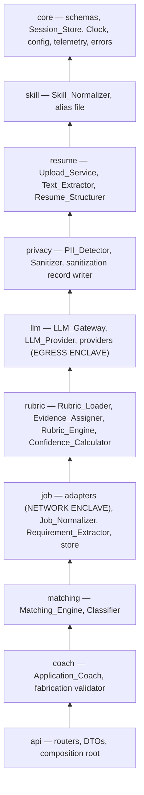
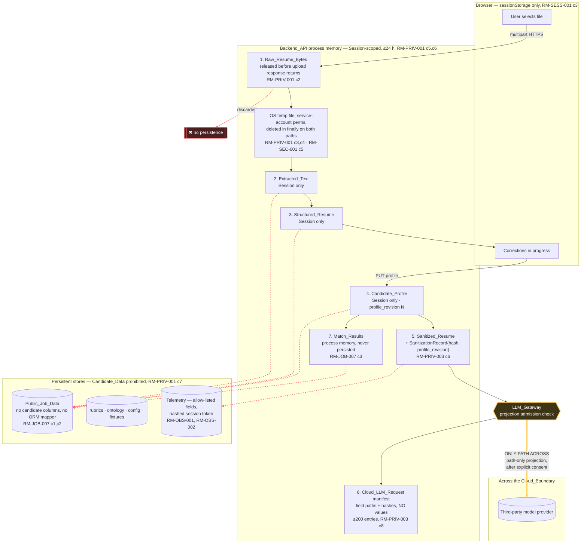
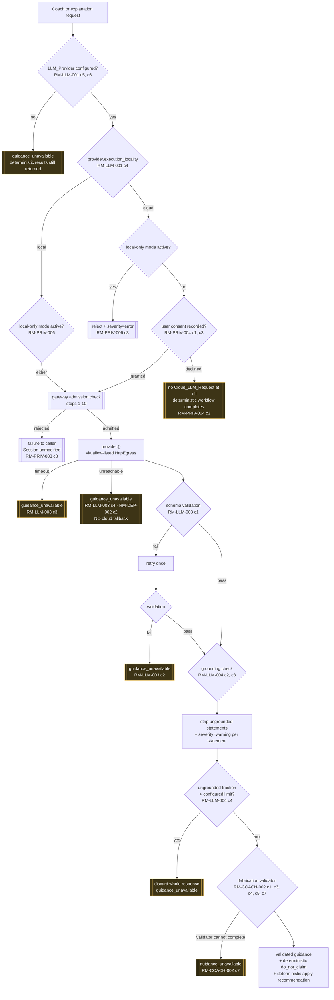
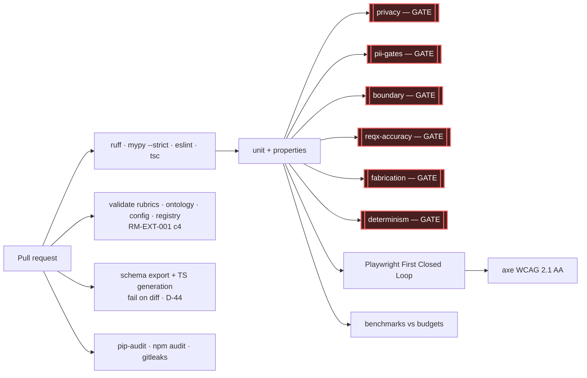

# Design Document

## Reading this document

This is the design baseline for ResumeMatch. It is written for a downstream implementing agent (Codex) working task by task, so it aims to leave no architectural question open at implementation time. It does not contain implementation code; interface signatures, schemas, configuration file contents, and pseudocode are given as specifications to be implemented, not as finished modules.

Every non-obvious decision carries a status label:

| Status | Meaning |
|---|---|
| **Locked** | Follows from an approved requirement or a hard constraint. Changing it requires amending `requirements.md` first. |
| **Provisional** | A reasonable choice that survives being wrong. Each states the trigger that reverses it. |
| **Deferred** | Not decided here. Each names the Open Decision ID and the milestone that needs it. |

Requirement IDs are cited in the form `RM-XXX-NNN c<n>` for criterion *n*. Where this document reads a criterion in a particular way because the criterion as written is ambiguous or self-contradictory, that reading is called out in [Requirements That Cannot Be Designed As Written](#requirements-that-cannot-be-designed-as-written) rather than applied silently.

---

## Overview

ResumeMatch is a single deployable FastAPI service plus a Next.js client (RM-API-001 c7, AS-01, AS-02). Everything the product promises rests on four architectural commitments, and the rest of the design is subordinate to them:

1. **One choke point for egress.** The LLM_Gateway is the only component that can put candidate-derived bytes across the Cloud_Boundary, and that is enforced by the import graph, by constructor-injected capabilities, by a runtime host allow-list, and by a build-failing CI check — not by convention (RM-PRIV-003 c1, c11).
2. **One scoring code path.** Five reference rubrics validate five domains, with optional additional schema-conforming rubrics and zero domain-specific branches. The difference between scoring a Financial Analyst and an Embedded Firmware Engineer lives entirely in YAML (RM-RUB-001 c5, RM-RUB-003 c7–c10).
3. **Determinism as a mechanical property, not an aspiration.** Injected clock, sorted iteration, `Decimal` arithmetic, pinned config versions echoed in every response, and AST-level CI checks that fail the build when a scoring module reaches for `time`, `random`, or an unordered collection (RM-SCORE-003, RM-MATCH-005).
4. **No candidate data at rest, ever.** Candidate_Data exists only in a process-memory Session. The persistent store has no table, no ORM mapper, and no column that could hold it — so persisting a Candidate_Profile is not forbidden by policy, it is unimplementable without adding a mapper that a CI schema-diff check would reject (RM-PRIV-001 c7, RM-JOB-007 c1–c3).

Shape of the system in one paragraph: the browser uploads a file; the backend extracts text, structures it, and hands a draft profile back for correction; the corrected Candidate_Profile is scored against a YAML rubric by a deterministic engine; job postings arrive from a Job_Source_Adapter, are normalized once at ingestion time and have their requirements extracted and cached at ingestion time; the Matching_Engine scores the cached postings against the profile in process memory and the Classifier bands them; optionally, and only after explicit consent, the LLM_Gateway sends a path-only projection of the Sanitized_Resume to one model provider to obtain prose that a deterministic validator then strips of anything ungrounded.

**The First Closed Loop needs no database, no network, and no model key.** It runs on the Fixture Job_Source_Adapter reading version-controlled files. A relational store appears only when the first live adapter ships (M6, P1), and the trigger is named in [Persistence](#persistence-and-the-public_job_data-store).

---

## Decision Register

Consolidated view of every non-obvious decision made in this document. Detail follows in the named section.

| # | Decision | Status | Requirement IDs | Rationale | Reversal trigger |
|---:|---|---|---|---|---|
| D-01 | Single Python package `resumematch` with six concern subpackages; **not** a monorepo of per-concern distributions | **Locked** (OD-17 resolved) | RM-API-001 c6, c7; C-3 | Satisfies separately-importable-units and acyclicity with an `import-linter` layered contract; per-concern distributions add 7 build manifests and a lock-resolution problem for zero consumers | Requires amendment; would need an external consumer of one concern as a library |
| D-02 | Import-graph contract (`import-linter`/grimp) as the primary cloud-boundary build gate, failing closed | **Locked** | RM-PRIV-003 c1, c11; RM-TEST-001 c8, c11 | The only candidate mechanism that inspects source structure rather than trusting naming, and that covers new modules by default | Requires amendment |
| D-03 | Egress capability injected by the composition root; no module-level provider singleton, no service locator | **Locked** | RM-PRIV-003 c1 | Removes the ambient authority that makes an import check bypassable at runtime | Requires amendment |
| D-04 | Per-enclave runtime host allow-list on every outbound transport | **Locked** | RM-PRIV-003 c1, c4; RM-PRIV-006 c1, c3 | Closes the residual hole where `job.adapters` (legitimately holding an HTTP client) targets a model endpoint | Requires amendment |
| D-05 | AST check `tools/check_egress.py` forbidding dynamic import, `subprocess`, `eval`/`exec`, and URL literals outside two enclaves | **Locked** | RM-PRIV-003 c11 | Static import analysis cannot see `importlib.import_module("httpx")` | Requires amendment |
| D-06 | LLM_Gateway requests carry **field paths only**, never candidate values; the gateway resolves values itself | **Locked** | RM-PRIV-003 c2, c3, c9 | Makes "is this a projection?" true by construction rather than by a comparison the caller could game | Requires amendment |
| D-07 | JSON Pointer (RFC 6901) as the field-path representation, over canonical-JSON serialization | **Provisional** | RM-PRIV-003 c2, c8; RM-LLM-003 c6; RM-PRIV-004 c7 | Standard, unambiguous, array-index-addressable, one string per path | Reverse if array-index paths prove unstable across profile edits; alternative is stable per-item UUID paths |
| D-08 | `SanitizationRecord` keyed by SHA-256 of canonical JSON, plus a monotonic `profile_revision` integer | **Locked** | RM-PRIV-003 c6, c9, c10 | c10 requires detecting post-sanitization profile edits without wall-clock | Requires amendment |
| D-09 | Write-token capability so only `privacy.sanitizer` can write the sanitization record | **Locked** | RM-PRIV-003 c6 | c6 says "only component permitted to write"; enforced by the private capability and dedicated static boundary checker | Requires amendment |
| D-10 | Synchronous request/response pipeline; **no task queue, no polling** | **Locked** | RM-PERF-001 c1–c3; Non-Goal 13 | Every budget is well inside an HTTP timeout; a queue is explicitly a non-goal | Requires amendment; would need p95 extraction > 15 s on `perf-ref-1` |
| D-11 | Pipeline split across separate endpoints per stage so the client can name the running stage | **Locked** | RM-PERF-001 c4 | A single synchronous call cannot report intermediate stages without SSE | Requires amendment |
| D-12 | Requirement extraction happens **at ingestion time** and is cached on the Job_Posting | **Locked** | RM-PERF-001 c3; RM-REQX-001 c1 | 200 postings × up to 200 units cannot be extracted inside a 3 s match budget | Requires amendment |
| D-13 | No database for the First Closed Loop; fixture files on disk are the Public_Job_Data store | **Locked** | RM-JOB-007 c1; RM-JOB-002 c3; RM-DEP-001 c2 | The filesystem is a persistent store containing no Candidate_Data, which is what c1 requires | Live adapter ships (M6, P1) → see D-14 |
| D-14 | SQLite (self-host/dev) and PostgreSQL 16 (hosted) behind one SQLAlchemy Core schema, introduced at the first live adapter | **Provisional** (OD-09) | RM-JOB-007 c1, c4; RM-JOB-005 | Relational store is OD-09's proposal; two backends, one schema, zero ORM for candidate types | Reverse to Postgres-only if ingestion writer and API readers end up on a shared network filesystem |
| D-15 | Candidate types have **no ORM mapper at all**; CI asserts the persisted column-name set against a checked-in allow-list | **Locked** | RM-PRIV-001 c7; RM-JOB-007 c1–c3 | Structural rather than intentional separation | Requires amendment |
| D-16 | Session_Store is an in-process TTL+LRU map; **v1 is single-worker** and the service refuses to start with more than one worker | **Locked** | RM-SESS-001 c2, c5; RM-PRIV-001 c6 | c5 excludes Redis absent a recorded decision; a silent multi-worker deployment would produce phantom session expiry | Recorded decision admitting a shared session store, per RM-SESS-001 c5 |
| D-17 | Evidence_Level multipliers `{0: 0.00, 1: 0.40, 2: 0.70, 3: 1.00}`, version `evidence_multipliers@1` | **Provisional** (AS-06, AS-16) | RM-SCORE-001 c4; RM-MATCH-001 c3 | Satisfies the ordering and range constraints; the gap 1→2 is wider than 2→3 because "applied" is the meaningful step up from "listed" | Human-label agreement study under AS-06/AS-16 |
| D-18 | `Decimal` with pinned context and `ROUND_HALF_UP`, summed over sorted signal identifiers | **Locked** | RM-SCORE-001 c9; RM-EVID-001 c6; RM-MATCH-005 c1, c2 | Python's `round()` is banker's rounding and float addition is order-dependent; the permutation determinism properties would only approximately hold with floats | Requires amendment; perf headroom is ample at this scale |
| D-19 | Signal resolvers keyed by **signal type**, registered in one table; CI check forbids domain/role identifiers appearing in the engine source | **Locked** | RM-RUB-001 c5; RM-RUB-003 c7 | The only enforceable reading of "no domain-specific or role-specific scoring branch" | Requires amendment |
| D-20 | Injected `Clock` protocol; `time`/`random`/`secrets` forbidden in scoring modules by import contract, `datetime.now` by AST check | **Locked** | RM-SCORE-003 c2; RM-MATCH-005 c3 | Names the concrete mechanism behind the determinism criteria | Requires amendment |
| D-21 | Category-labelled placeholder tokens of the form `[[CATEGORY]]`, carrying no length or content information | **Locked** (OD-24 adopted) | RM-PRIV-002 c9, c2 | OD-24's proposal; category label improves explanation quality, absence of length prevents inference | Requires amendment |
| D-22 | Confidence weights: readiness `0.30 / 0.25 / 0.45`; match `0.25 / 0.20 / 0.35 / 0.20` | **Provisional** | RM-CONF-001 c1 | `signal_coverage` carries the most information about whether the result is trustworthy | Any calibration study against user-reported trust, or a term that saturates at 1.0 across the fixture corpus |
| D-23 | `profile_completeness` denominator = six sections, excluding `summary` and `unclassified` | **Provisional** | RM-CONF-001 c9 | Counting `unclassified` would reward a bad parse; `summary` is not load-bearing | Reverse if a fixture profile scores full completeness while missing a scored section |
| D-24 | `Total_Relevant_Experience` relevance rule = all dated experience (`relevance_rule@all_dated_v1`) | **Locked** (OD-22 adopted) | RM-MATCH-002 c8; OD-22 | A narrower rule increases false `skip`, the costliest error class | Requires amendment |
| D-25 | Reason codes carry a fixed integer rank; attachment is sorted by rank and capped at five by dropping the highest ranks | **Locked** | RM-MATCH-003 c9, c10 | c9 requires a deterministic order and c10 a closed set of seven against a cap of five | Requires amendment |
| D-26 | Role-family equivalence is an ordered-pair table over six families; absent pair scores 0 | **Provisional** (OD-23, AS-15) | RM-MATCH-001 c10 | c10 mandates absent-pair 0; AS-15 records the downward bias | Measured unmapped-pair rate at M6 (AS-15) |
| D-27 | Company-to-domain mapping is an explicit company list plus a role-family fallback; absent pair scores 0 | **Provisional** (OD-23, AS-15) | RM-MATCH-001 c11 | Same as D-26; the role-family fallback keeps the unmapped rate low without inventing data | Same as D-26 |
| D-28 | Character budget, not token budget, for LLM request sizing | **Provisional** | RM-LLM-003 c6 | Avoids a tokenizer dependency and a provider-specific determinism hazard | Provider rejects a request that fits the character budget |
| D-29 | Omission priority order is a version-controlled ordered pattern list; ineligibility is declared by the operation's response schema | **Locked** | RM-LLM-003 c6; RM-PRIV-003 c12 | c6 requires a documented deterministic order read from configuration | Requires amendment |
| D-30 | Five named provider methods returning raw text; the gateway owns all schema validation | **Locked** | RM-LLM-001 c1; RM-LLM-003 c1, c7 | c1 requires named operations; keeping validation in the gateway keeps a provider from being its own validator | Requires amendment |
| D-31 | LLM response schemas contain **no numeric fields** and forbid extra keys | **Locked** | RM-LLM-002 c1–c3 | Makes "the model never owns a number" a schema property rather than a filter | Requires amendment |
| D-32 | `do_not_claim` and the apply recommendation are computed deterministically and absent from every model-facing schema | **Locked** | RM-COACH-001 c4, c5; RM-COACH-002 c2 | The model cannot omit or override what it is never asked for | Requires amendment |
| D-33 | Hypothesis for property-based testing; pytest, Playwright, `import-linter`, `ruff`, `mypy` | **Provisional** | RM-TEST-001 c1, c3, c5; AS-02 | Standard Python PBT library with shrinking and a stateful mode | Reverse only on a Hypothesis incompatibility with the pinned Python |
| D-34 | Reference hardware `perf-ref-1` (4 vCPU / 8 GB / no GPU) for published budgets; CI gate measured on the pinned runner with the c5 tolerance | **Provisional** | RM-PERF-001 c5; AS-09 | CI runners are not the reference profile, and pretending otherwise makes the gate meaningless | Reverse if the CI runner's variance exceeds the 50 % tolerance band |
| D-35 | Six-family role taxonomy and one `unknown` family; five named reference roles are the architecture-validation set, not a closed catalogue | **Locked** (OD-01 resolved; OD-15, OD-16) | RM-RUB-003 c1–c10 | Product owner confirmed Backend Engineer — Intern / New Grad and Performance Marketing Analyst — Entry; configuration-only additions remain generic | Requires requirement amendment |
| D-36 | Extraction: `pdfplumber` for PDF, `python-docx` for DOCX, with a `PageTextLayer` probe for scanned detection | **Provisional** | RM-PARSE-001, RM-PARSE-002 | Pure-Python, offset-preserving, no native OCR pull-in | Fixture-corpus extraction quality below the RM-PARSE-001 c3 bar → spike alternatives (see Risks) |
| D-37 | PII detection = deterministic regex/gazetteer rules + Presidio (spaCy NER) as the second independent mechanism | **Provisional** | RM-PRIV-002 c4, c6 | c4 requires two independent mechanisms, one of which is a NER/PII library | Per-category recall below 0.95 on the labeled corpus → swap or augment the NER mechanism |
| D-38 | Fixture job set format = `manifest.yaml` (ordered file list) + one JSON per posting | **Locked** | RM-JOB-002 c3; RM-MATCH-005 c2 | Directory listing order is not deterministic across filesystems; the manifest is | Requires amendment |
| D-39 | Skill matching by longest-match-first trie over folded aliases | **Locked** | RM-SKILL-001 c1, c4, c5, c6 | c5 requires punctuation/case insensitivity, c4 idempotence; longest-match-first with a lexicographic tiebreak is deterministic | Requires amendment |
| D-40 | Live ingestion is a CLI entrypoint run by the deployment's scheduler, not an in-process background task | **Provisional** | RM-JOB-003, RM-JOB-004; Non-Goal 13 | Keeps the API process single-purpose and keeps ingestion out of the request path | Reverse if self-host users cannot run a scheduler; fallback is an in-process `asyncio` timer, still no queue |
| D-41 | Rubric status at M4 is `draft`; the Web_Client shows the unvalidated notice | **Locked** | RM-RUB-003 c8, c10; RM-EXT-002 c3 | Stated directly by c8/c10 | Requires amendment |
| D-42 | No embeddings, no vector store, no semantic similarity anywhere | **Locked** (OD-12) | AS-12; Non-Goal 5 | Alias file plus equivalence tables replace it in v1 | Measured unmapped-skill rate reopens OD-12 |
| D-43 | Evidence assignment lives in the `rubric` unit; `matching` imports it | **Locked** | RM-EVID-001 c1; RM-API-001 c6 | c1 names the Rubric_Engine as the actor, and matching needs the same levels | Requires amendment |
| D-44 | Frontend consumes generated types only; generation is a CI gate that fails on drift | **Locked** | RM-PARSE-004 c2; RM-API-001 c5 | c2 forbids hand-written duplicates, which only a drift check enforces | Requires amendment |
| D-45 | `PYTHONHASHSEED=0` pinned in CI and container images as belt-and-braces, never as the determinism mechanism | **Provisional** | RM-SCORE-003 c2 | Turns an accidental set-ordering dependency into a reproducible failure rather than a flake | None; harmless |
| D-46 | Live cloud provider selection | **Deferred** (OD-02) | RM-LLM-001 c3 | Needed by M10 | — |
| D-47 | First live job source | **Deferred** (OD-05) | RM-JOB-002 c4 | Needed by M6 | — |
| D-48 | Employer/institution retention opt-out toggle | **Deferred** (OD-04) | RM-PRIV-002 policy table | Needed by M3 | — |
| D-49 | Deployment platform | **Deferred** (OD-11) | RM-DEP-001 | Needed pre-v1 | — |
| D-50 | `import-linter==2.1` compatibility syntax and early empty `job.requirements` boundary | **Locked** | RM-API-001 c6; RM-PRIV-003 c1, c6, c11; RM-JOB-007 c1; RM-SCORE-003 c2; RM-MATCH-005 c3 | Preserves the original deny-by-default contracts using the pinned tool's supported list and external-module forms; prevents a future-only package from making M0 red | Requires amendment |
| D-50 | Rubric promotion beyond `draft` | **Deferred** (OD-13) | RM-RUB-003 c10 | Needed for `reviewed` status, not for M4 | — |

---

## Architecture

### Component diagram

```mermaid
graph TB
    subgraph Browser["Web_Client (Next.js / React / TS)"]
        UI_Upload[Upload screen]
        UI_Review[Profile_Review_UI]
        UI_Ready[Readiness screen]
        UI_Jobs[Job dashboard]
        UI_Priv[Privacy_Inspector]
        SS[(sessionStorage)]
    end

    subgraph API["Backend_API — one FastAPI process, one worker"]
        direction TB
        Router["api/ · routers, DTOs, OpenAPI, composition root"]

        subgraph Resume["resume/"]
            Upload[Upload_Service]
            Extract[Text_Extractor]
            Struct[Resume_Structurer]
        end

        subgraph Privacy["privacy/"]
            PII[PII_Detector]
            San[Sanitizer]
        end

        subgraph Rubric["rubric/"]
            RLoad[Rubric_Loader]
            Evid[Evidence_Assigner]
            REng[Rubric_Engine]
            Conf[Confidence_Calculator]
        end

        subgraph Skill["skill/"]
            SNorm[Skill_Normalizer]
        end

        subgraph Job["job/"]
            Adapters[Job_Source_Adapters]
            JNorm[Job_Normalizer]
            ReqX[Requirement_Extractor]
            JStore[Public_Job_Data store]
        end

        subgraph Match["matching/"]
            MEng[Matching_Engine]
            Cls[Classifier]
        end

        subgraph Coach["coach/"]
            AC[Application_Coach]
            FabVal[Fabrication validator]
        end

        subgraph LLM["llm/ — THE ONLY EGRESS ENCLAVE FOR CANDIDATE DATA"]
            GW[LLM_Gateway]
            Prov[LLM_Provider impls]
        end

        subgraph Core["core/"]
            Sess[Session_Store]
            Sch[Schemas + JSON Schema export]
            Clk[Clock]
            Tel[Telemetry_Logger]
            Cfg[Config loader + versions]
        end
    end

    subgraph Ext["Outside the process"]
        FS[("Version-controlled config<br/>rubrics · ontology · patterns · fixtures")]
        DB[("Public_Job_Data store<br/>SQLite / Postgres — M6 P1 only")]
        Boards[("Job boards / ATS APIs<br/>M6 P1")]
        Model[("Cloud model provider")]
    end

    Browser -->|HTTPS JSON| Router
    Router --> Resume
    Router --> Privacy
    Router --> Rubric
    Router --> Job
    Router --> Match
    Router --> Coach

    Struct --> SNorm
    Evid --> SNorm
    ReqX --> SNorm
    MEng --> Evid
    Cls --> MEng
    AC --> MEng
    AC --> GW
    AC --> FabVal
    GW --> Prov
    San --> PII
    GW -->|reads sanitization record| Sess
    San -->|writes sanitization record| Sess

    RLoad --> FS
    Adapters --> FS
    JStore --> DB
    Adapters -.->|allow-listed hosts only| Boards
    Prov -.->|allow-listed host only| Model

    classDef enclave fill:#4a1f1f,stroke:#ff6b6b,stroke-width:3px,color:#fff
    classDef boundary stroke-dasharray: 6 4
    class LLM enclave
    class Model boundary
```



Two things the diagram is asserting, both load-bearing:

- **Only `llm/` touches `Model`.** No arrow from any other subgraph reaches a third-party model endpoint, and no arrow reaches `Prov` except from `GW`. [Cloud Boundary Enforcement](#the-cloud-boundary-the-hard-problem) specifies the four mechanisms that make this true structurally.
- **Only `Adapters` touches `Boards`.** RM-JOB-002 c6 requires every third-party HTTP client to sit behind a Job_Source_Adapter. That gives the codebase exactly *two* network enclaves, and the enforcement mechanism has to distinguish them rather than ban HTTP outright.

### Module boundaries and layering (resolves OD-17, satisfies RM-API-001 c6)

The layered dependency order, lowest first. An import from a lower layer to a higher layer is a build failure.



The arrows are the *permitted* direction, not the actual set of imports. Actual imports are sparser: `privacy` imports only `core`, `llm` imports `core` and `privacy`, `rubric` imports `core` and `skill`, `job` imports `core` and `skill`, `matching` imports `core`, `job`, and `rubric.evidence`, `coach` imports `core`, `skill`, `matching`, and `llm`. `api` is the composition root and imports everything.

Notes on placement:

- **`skill` and `core` are below the six named units** in RM-API-001 c6. The requirement names resume, privacy, rubric, job, matching, and LLM; it does not forbid shared foundations. `core` holds only schemas and process-level services, and it depends on nothing in the product.
- **Evidence assignment lives in `rubric`, and `matching` imports it (D-43).** RM-EVID-001 c1 names the Rubric_Engine as the component that assigns Evidence_Level over "the skills referenced by the Role_Rubric *or Job_Posting* under evaluation", so matching consumes the same assigner. The alternative — a seventh `evidence` unit below both — would read better on a diagram but would contradict the requirement's named actor. The dependency is one-directional and acyclic either way.
- **`coach` is a distinct unit above `matching` and `llm`.** RM-COACH-002 c7 requires the fabrication validator to run over every Application_Coach response *inside the Backend_API and independently of prompt content*. Putting it in `llm` would make the gateway both the caller and the validator of coaching semantics; putting it in `api` would put product logic in the transport layer.

### Repository layout

```text
resumematch/
├── README.md
├── AGENTS.md                          # instructions for the implementing agent
├── .env.example                       # RM-SEC-002 c4
├── .importlinter                      # cloud-boundary + layering contracts (D-02)
├── docker-compose.yml                 # RM-DEP-001 c2 — fixtures, no DB, no model key
├── docker-compose.selfhost.yml        # RM-DEP-002 c1 — adds local model runtime (M11)
│
├── docs/
│   ├── architecture.md                # generated summary of this design
│   ├── privacy.md                     # RM-PRIV-001 c9 reviewable lifecycle statement
│   ├── scoring.md · matching.md · job-sources.md · rubric-authoring.md
│   ├── perf-reference-hardware.md     # D-34
│   └── decisions/                     # ADRs; OD resolutions land here
│
├── config/                            # version-controlled behaviour, no code
│   ├── evidence_multipliers.yaml      # D-17
│   ├── confidence_weights.yaml        # D-22, D-23
│   ├── match_weights.yaml             # RM-MATCH-001 c2
│   ├── match_penalties.yaml           # RM-MATCH-001 c4
│   ├── match_thresholds.yaml          # RM-MATCH-003 c8
│   ├── disqualification.yaml          # RM-MATCH-002 c3, c4
│   ├── relevance_rule.yaml            # D-24
│   ├── pii_policy.yaml                # RM-PRIV-002 c8
│   ├── pii_placeholders.yaml          # D-21
│   ├── requirement_patterns.yaml      # RM-REQX-001 c2, c3, c4
│   ├── delimitation_rules.yaml        # RM-REQX-001 c9
│   ├── seniority_mapping.yaml         # RM-REQX-002 c3
│   ├── role_family_equivalence.yaml   # D-26
│   ├── company_domain_mapping.yaml    # D-27
│   ├── quantity_units.yaml            # RM-EVID-001 c3
│   ├── proficiency_exclusions.yaml    # RM-EVID-001 c7
│   ├── llm_budget_priority.yaml       # D-29
│   └── source_registry.yaml           # RM-JOB-003 (P1)
│
├── rubrics/                           # RM-RUB-003 — five reference rubrics; optional additional schema-conforming files when tasked
│   ├── software_engineering/backend_engineer.entry.yaml
│   ├── finance/financial_analyst.entry.yaml
│   ├── embedded/embedded_firmware_engineer.intern_entry.yaml
│   ├── marketing/performance_marketing_analyst.entry.yaml
│   └── supply_chain/supply_chain_analyst.entry.yaml
│
├── ontology/
│   └── skills.yaml                    # RM-SKILL-001 c1, c8
│
├── fixtures/                          # RM-TEST-002
│   ├── resumes/                       # c1, c2
│   ├── pii/                           # c3 — labeled corpus
│   ├── jobs/default/manifest.yaml     # c4, D-38
│   ├── profiles/                      # c5
│   ├── postings_labeled/              # AS-05 hand-labeled sample
│   └── baselines/                     # c6 — expected outputs
│
├── backend/
│   ├── pyproject.toml                 # one distribution
│   ├── src/resumematch/
│   │   ├── core/        schemas/ · session.py · clock.py · config.py · errors.py · telemetry.py · canonical_json.py · egress.py
│   │   ├── skill/       normalizer.py · alias_loader.py
│   │   ├── resume/      upload.py · extract/ · structure/
│   │   ├── privacy/     detector.py · sanitizer.py · placeholders.py
│   │   ├── llm/         gateway.py · provider_api.py · projection.py · budget.py · schemas/ · providers/
│   │   ├── rubric/      loader.py · evidence.py · engine.py · confidence.py · resolvers/
│   │   ├── job/         source_api.py · adapters/ · normalizer.py · requirements/ · store/
│   │   ├── matching/    engine.py · classifier.py · dimensions/
│   │   ├── coach/       coach.py · fabrication.py
│   │   └── api/         app.py · deps.py · routers/ · dto/ · composition.py
│   └── tests/
│       ├── unit/ · properties/ · integration/ · privacy/ · fabrication/ · perf/
│       └── conftest.py
│
├── web/                               # Next.js app; generated API types only (D-44)
│   ├── src/app/ · src/components/ · src/lib/api/generated/
│   └── tests/ (vitest) · e2e/ (Playwright)
│
├── tools/
│   ├── check_egress.py                # D-05
│   ├── check_determinism.py           # D-20
│   ├── check_no_domain_branch.py      # D-19
│   ├── check_persisted_columns.py     # D-15
│   ├── check_prohibited_claims.py     # RM-PRIV-005 c6
│   └── export_schemas.py              # JSON Schema + TS type generation
│
└── .github/workflows/ci.yml
```

**Why this and not the alternatives.**

*Rejected: the ideation `apps/` + `packages/` monorepo (§32).* Seven per-concern Python distributions means seven `pyproject.toml` files, seven version numbers, a cross-package lock-resolution problem, and editable-install plumbing that every contributor has to understand before their first change. The benefit of separate distributions is independent versioning and release for external consumers. There are no external consumers — RM-API-001 c7 fixes v1 as a single deployable service and Non-Goal 13 excludes microservice decomposition. The boundary discipline the monorepo is supposed to buy is bought instead by an `import-linter` layered contract, which is a stricter guarantee than package separation because it also forbids cycles *within* a layer and is checked on every pull request rather than at install time.

*Rejected: the handoff `backend/{resume,privacy,rubrics,jobs,matching,llm}` layout as written (§23).* This is very close to what is adopted, and the handoff explicitly invites improvement. Three changes: (a) subpackages live under `backend/src/resumematch/` rather than directly under `backend/`, so the package is importable as one namespace and `import-linter` can address it by a single root module — with flat directories under `backend/` there is no package root to write a contract against; (b) `core`, `skill`, `coach`, and `api` are added, because the handoff layout leaves shared schemas, skill normalization, coaching, and routing with no home; (c) `config/` is separated from `rubrics/` and `ontology/`, because the requirements make roughly eighteen distinct version-controlled configuration artifacts load-bearing and burying them in the rubric tree makes their versions hard to report (RM-EXT-002 c4, RM-REQX-001 c8, RM-MATCH-005 c4).

*Rejected: one flat `resumematch` package with no subpackages.* Fails RM-API-001 c6 outright — the six concerns would not be separately importable units.

### Import contracts (`.importlinter`)

```ini
[importlinter]
root_packages =
    resumematch
include_external_packages = True

[importlinter:contract:layers]
name = Concern layering, no cycles
type = layers
layers =
    resumematch.api
    resumematch.coach
    resumematch.matching
    resumematch.job
    resumematch.rubric
    resumematch.llm
    resumematch.privacy
    resumematch.resume
    resumematch.skill
    resumematch.core

[importlinter:contract:egress]
name = Cloud boundary choke point (RM-PRIV-003 c1, c11)
type = forbidden
source_modules = resumematch
forbidden_modules =
    httpx
    requests
    aiohttp
    urllib
    http
    socket
    ssl
    openai
    anthropic
    google
    ollama
allow_indirect_imports = False
ignore_imports =
    resumematch.llm.providers.* -> *
    resumematch.job.adapters.* -> *
    resumematch.core.egress -> httpx
    resumematch.core.egress -> socket
unmatched_ignore_imports_alerting = none

[importlinter:contract:provider_api]
name = Only the gateway may see the LLM_Provider interface (RM-PRIV-003 c1)
type = forbidden
source_modules = resumematch
forbidden_modules = resumematch.llm.provider_api
ignore_imports =
    resumematch.llm.gateway -> resumematch.llm.provider_api
    resumematch.llm.providers.* -> resumematch.llm.provider_api
    resumematch.api.composition -> resumematch.llm.provider_api
unmatched_ignore_imports_alerting = none

[importlinter:contract:persistence]
name = Only the job store may touch the database (RM-JOB-007 c1)
type = forbidden
source_modules = resumematch
forbidden_modules =
    sqlalchemy
    sqlite3
    psycopg
    asyncpg
ignore_imports = resumematch.job.store.* -> *
unmatched_ignore_imports_alerting = none

[importlinter:contract:scoring_determinism]
name = Scoring modules exclude clock and randomness (RM-SCORE-003 c2, RM-MATCH-005 c3)
type = forbidden
source_modules =
    resumematch.rubric
    resumematch.matching
    resumematch.job.requirements
forbidden_modules =
    random
    secrets
    time
    uuid
    os
```

`import-linter==2.1` parses INI lists only in multiline form, so the single root and
all multi-module fields use that form. It accepts external forbidden targets only at a
top-level package or module, so `urllib`, `http`, and `google` intentionally cover and
therefore strengthen the originally named `urllib.request`, `http.client`, and
`google.generativeai` targets. The early contracts also name enclave and composition
modules before their implementation tasks; `unmatched_ignore_imports_alerting = none`
permits only those absent future exceptions. It does not suppress an actual matching
forbidden import, which continues to fail the contract. `job.requirements` is an
intentionally empty architectural package from M0 so scoring determinism remains
scoped to requirement extraction rather than being broadened to all of `job`.

Two properties of these contracts matter more than their contents:

1. **They fail closed.** Each `forbidden` contract sets `source_modules = resumematch` — the whole package — and then names exceptions. A newly added module `resumematch.reporting` is covered on the day it is created; nobody has to remember to add it to an allow-list. A contract written the other way round (enumerate the modules that must not import `httpx`) would silently exempt every future module, and would be a convention wearing a checker's clothes.
2. **`allow_indirect_imports = False` closes the re-export hole.** Without it, `resumematch.matching` could import `resumematch.job.adapters.greenhouse` and reach `httpx` transitively. With it, grimp follows the chain.

---

## Major Data Flows

### The First Closed Loop

```mermaid
sequenceDiagram
    autonumber
    participant C as Web_Client
    participant A as api
    participant R as resume
    participant P as privacy
    participant RB as rubric
    participant J as job
    participant M as matching
    participant S as Session_Store

    C->>A: POST /sessions
    A->>S: create Session (token, session_start_date, profile_revision=0)
    A-->>C: session_token, expires_at

    C->>A: POST /sessions/{t}/resume  (multipart)
    A->>R: validate → extract
    R->>R: magic bytes, size, page count, timeout guard
    R-->>A: Extracted_Text + layout metadata
    A->>S: store Extracted_Text; release Raw_Resume_Bytes
    A-->>C: extraction_ok, page_count, warnings

    C->>A: POST /sessions/{t}/profile/draft
    A->>R: structure(Extracted_Text)
    R-->>A: Structured_Resume (provenance + extraction_confidence per item)
    A->>S: store Structured_Resume
    A-->>C: Structured_Resume (+ per-item source_text)

    C->>A: PUT /sessions/{t}/profile  (corrections)
    A->>S: store Candidate_Profile; profile_revision += 1
    A-->>C: Candidate_Profile

    C->>A: POST /sessions/{t}/profile/confirm  (+ target constraints)
    A->>S: mark confirmed
    C->>A: POST /sessions/{t}/readiness  {domain, role, seniority}
    A->>RB: assign evidence → score → confidence
    RB-->>A: ReadinessResult + factor decomposition + versions
    A-->>C: ReadinessResult

    C->>A: POST /sessions/{t}/matches  {job_set_id, filters}
    A->>J: load Job_Postings (already normalized + requirement-extracted)
    J-->>A: tuple[Job_Posting]
    A->>M: for each posting: score → classify
    M-->>A: MatchResultSet (in process memory only)
    A->>S: cache MatchResultSet under Session
    A-->>C: ranked, classified, explained results
```

No arrow in this diagram leaves the process except the client's own HTTPS requests. Sanitization, the LLM_Gateway, and the Application_Coach are absent from the loop by design: RM-LLM-001 c6 requires the complete deterministic workflow through classification with no provider configured, and the Fixture path (RM-JOB-002 c3) supplies the postings.

### Resume lifecycle with the privacy boundary



Red dashed arrows are the transitions the architecture forbids, each asserted by a test named in [Testing Strategy](#testing-strategy). The single amber arrow is the Cloud_Boundary. Everything about the privacy design is arranged so that this diagram has exactly one amber arrow and that the arrow originates inside `llm/`.

### Job ingestion to classification pipeline

```mermaid
flowchart LR
    subgraph Ingest["Ingestion — offline, at ingestion time (D-12)"]
        direction TB
        FIX[("Fixture_Job_Set<br/>manifest.yaml + N JSON")]
        REG[("Source_Registry<br/>M6 P1")]
        AD1[Fixture adapter]
        AD2["Live adapter<br/>M6 P1"]
        FETCH["fetch() → RawPosting envelopes"]
        MAPOP["map() → JobPostingDraft"]
        VAL{"Job_Posting<br/>schema validation"}
        DROP[["discard + record<br/>RM-JOB-004 c3"]]
        DEDUP["Duplicate detection<br/>RM-JOB-005"]
        DELIM["Delimit requirement units<br/>list item · sentence · 400-char clause split<br/>RM-REQX-001 c9"]
        CLS{"Classify each unit<br/>precedence: contextual → preferred → required<br/>RM-REQX-001 c10"}
        NORMSK["Skill_Normalizer<br/>RM-REQX-001 c6"]
        NUM["Experience / seniority / education extraction<br/>RM-REQX-002"]
        STORE[("Job_Posting + cached requirement set<br/>+ pattern_set_version + delimitation_version")]
    end

    subgraph MatchTime["Match time — per Session, in process memory"]
        direction TB
        PROF["Candidate_Profile<br/>+ Evidence_Levels"]
        ENABLE{"Which dimensions are enabled?<br/>RM-MATCH-001 c9"}
        REDIST["Redistribute excluded weight<br/>RM-REQX-003 c2"]
        DIMS["7 dimension scorers<br/>skills · experience · role_similarity ·<br/>seniority · education · location · domain"]
        HARD["Hard_Requirement evaluation<br/>RM-MATCH-002"]
        OVERALL["Weighted overall score<br/>Decimal, sorted, ROUND_HALF_UP"]
        CLASSIFY{"Classifier precedence<br/>1 disqualify → 2 insufficient_data<br/>→ 3 unmet hard req → 4 thresholds"}
        OUT["Match_Result + Match_Class<br/>+ ranked reason codes + decomposition"]
    end

    FIX --> AD1
    REG --> AD2
    AD1 --> FETCH
    AD2 --> FETCH
    FETCH --> MAPOP --> VAL
    VAL -->|invalid| DROP
    VAL -->|valid| DEDUP --> DELIM --> CLS
    CLS --> NORMSK --> STORE
    DELIM --> NUM --> STORE

    STORE --> ENABLE
    PROF --> ENABLE
    ENABLE --> REDIST --> DIMS --> OVERALL
    ENABLE --> HARD
    HARD --> CLASSIFY
    OVERALL --> CLASSIFY
    CLASSIFY --> OUT
```



The vertical split is the architecturally significant part. RM-REQX-001 c1 admits descriptions of 50,000 characters yielding 200 requirement units, and RM-PERF-001 c3 gives the Matching_Engine 3 seconds for 200 postings. Doing requirement extraction at match time would mean up to 40,000 unit classifications inside that budget, against a target of 15 ms per posting for *everything*. So extraction runs once per posting at ingestion and its output — including the pattern-set and delimitation-rule-set version identifiers required by RM-REQX-001 c8 — is stored with the posting. Match time reads structured fields only, which is also exactly what RM-MATCH-001 c7 demands (dimension scores computed from the extracted requirement set and structured fields, never from raw description text).

---

## The Cloud Boundary: The Hard Problem

RM-PRIV-003 c1 requires that no component other than the LLM_Gateway have access to the LLM_Provider interface *or to any outbound transmission capability that crosses the Cloud_Boundary*, and c11 requires a build-failing check that proves it. A code-review convention cannot satisfy c11, because c11 asks for a mechanised check. This section specifies the mechanism.

### Options considered

| Option | What it actually guarantees | Verdict |
|---|---|---|
| **A. Naming/review convention** ("only `llm/` calls providers") | Nothing mechanised. A new contributor adding `httpx.post` to `coach/` passes CI. | **Rejected.** Fails c11 by definition. |
| **B. Capability object only** — an `EgressChannel` that only the gateway holds | Removes *ambient* authority, which is real value. But Python has no private constructors: `coach/` can `from resumematch.core.egress import HttpEgress; HttpEgress(...)`. | **Adopted as one layer, insufficient alone.** |
| **C. Import-graph contract** (`import-linter` over grimp) | Statically proves that no module outside a named enclave imports the provider interface or any HTTP/socket library, transitively, and fails the build. Covers modules that do not exist yet if written as deny-by-default. | **Adopted as the primary gate.** |
| **D. AST check for dynamic escapes** | Catches `importlib.import_module("httpx")`, `__import__`, `eval`, `exec`, `subprocess` — the things C is blind to. | **Adopted as a complement.** |
| **E. Runtime host allow-list per enclave** | Catches the case C cannot even in principle see: `job/adapters/` legitimately holds an HTTP client, and C cannot tell whether its target URL is a job board or `api.openai.com`. | **Adopted as a complement.** |
| **F. Process isolation** — gateway in a separate process, others `NET_ADMIN`-denied | The strongest guarantee available: kernel-enforced rather than language-enforced. | **Rejected for v1.** Requires either a microservice split (RM-API-001 c7, Non-Goal 13) or per-thread network namespaces, which CPython cannot express. Recorded as the escalation path if a real leak is ever found. |
| **G. Network egress isolation at the container level** — deny-all egress except an allow-listed proxy | Genuinely enforceable at deployment, and it is adopted *as a deployment control* (see below), but it is a property of the runtime environment, not of the repository, so it cannot be the c11 build gate. | **Adopted as a deployment control, not as the build gate.** |

### The adopted mechanism: four layers

**Layer 1 — Import-graph contract, deny-by-default (the c11 build gate).** The `[importlinter:contract:egress]` and `[importlinter:contract:provider_api]` contracts in [Import contracts](#import-contracts-importlinter). `source_modules = resumematch` covers the whole package; `ignore_imports` names exactly two enclaves (`resumematch.llm.providers.*`, `resumematch.job.adapters.*`) plus the single transport module. `allow_indirect_imports = False` means a module cannot reach `httpx` by importing something that imports it.

*Why this is genuinely enforceable and not conventional:* the check derives its verdict from the actual import graph of the actual source, computed by grimp, not from a directory name or a docstring. A contributor cannot satisfy it by claiming compliance; they either import a forbidden module or they do not. Crucially the polarity is deny-by-default, so the failure mode of forgetting to update a config file is a *build failure*, not a silent exemption. That is the property that separates a check from a convention.

**Layer 2 — Injected capability, no ambient authority.** The provider is constructed exactly once, in `api/composition.py`, and handed to the gateway constructor. There is no module-level provider instance, no `get_provider()` accessor, no registry lookup by string, and no FastAPI dependency that yields a provider to anything but the gateway. A component that wants to reach a model has to construct a provider itself, which means importing the provider module, which Layer 1 forbids.

```python
# core/egress.py  — the ONLY module permitted to construct a transport
class EgressGrant:
    """Unforgeable-by-convention capability. Construction is import-restricted."""
    def __init__(self, *, enclave: Literal["llm_provider", "job_source"],
                 allowed_hosts: frozenset[str], timeout_s: float,
                 _issuer: object) -> None: ...

class HttpEgress(Protocol):
    def send(self, request: OutboundRequest) -> OutboundResponse: ...
    # raises EgressHostNotAllowed when request.host not in grant.allowed_hosts

def issue_grant(settings: Settings, enclave: str) -> EgressGrant: ...   # called only from api/composition.py
```

**Layer 3 — AST check `tools/check_egress.py`.** Over every file under `src/resumematch/`, excluding the two enclaves, the check fails the build on:

| Finding | Why |
|---|---|
| `import importlib` / `importlib.import_module(...)` / `__import__(...)` | Defeats static import analysis |
| `eval(...)` / `exec(...)` / `compile(...)` | Same |
| `import subprocess` / `os.system` / `os.popen` / `os.exec*` | Shelling out to `curl` is egress the import graph never sees |
| A string literal matching `^(https?|ftp|ws|wss)://` | A URL constant outside an adapter or provider has no legitimate purpose. Documentation URLs live in `config/`; the two enclave directories are exempt. |
| `setattr` on any module object | Monkey-patching a lower layer to smuggle in a transport |

The check is a plain `ast.NodeVisitor` walk, ~150 lines, no new dependency, run in the same CI job as `import-linter`.

**Layer 4 — Runtime host allow-list.** Every `HttpEgress` carries an `allowed_hosts` frozenset from its grant. The `job_source` enclave's set is derived from the Source_Registry plus each adapter's declared `documentation_url` host (RM-JOB-008 c4); the `llm_provider` enclave's set is the single configured provider host. A request to any other host raises `EgressHostNotAllowed`, emits a `severity=error` telemetry event, and never opens a connection. In local-only mode (RM-PRIV-006 c1, c3) the `llm_provider` set is restricted to loopback and the configured local runtime host, so a misconfigured cloud provider is rejected at the transport rather than at the provider.

Deployment adds Option G on top: the container network policy denies all egress except the allow-listed hosts. That is a second, independent enforcement point, and it is what makes RM-PRIV-006 c5's "run the full pipeline with outbound network blocked" test meaningful.

### What the CI check inspects, and how it fails

One CI job, `boundary`, marked required with no override path (RM-TEST-001 c8):

```yaml
- name: Cloud boundary choke point (RM-PRIV-003 c11)
  run: |
    lint-imports --config .importlinter              # Layer 1
    python tools/check_egress.py backend/src         # Layer 3
    pytest backend/tests/privacy -m boundary -q      # Layers 2 and 4 at runtime
```

Failure output names the offending module, the offending import chain, and the criterion:

```text
FAILED contract: Cloud boundary choke point (RM-PRIV-003 c1, c11)
  resumematch.coach.coach -> httpx
    resumematch.coach.coach -> resumematch.coach.http_helper (l.14)
    resumematch.coach.http_helper -> httpx (l.3)
  Remedy: route the call through resumematch.llm.gateway. No exemption is available.
```

The runtime half of the job contains three tests:

| Test | Asserts |
|---|---|
| `test_no_socket_during_deterministic_pipeline` | A `conftest` fixture replaces `socket.socket.connect` with a raiser, then runs upload → readiness → matching on fixtures. Any connection attempt fails the test. Covers RM-LLM-001 c6 and RM-PRIV-006 c5. |
| `test_stub_provider_zero_invocations_on_rejection` | A counting stub provider is injected; for each rejection path of RM-PRIV-003 c3, c5, c10 the counter must read 0. Directly RM-PRIV-003 c11. |
| `test_egress_host_allowlist_rejects_model_host_from_job_enclave` | A fixture adapter attempts `https://api.openai.com/v1/...` through its own grant; must raise `EgressHostNotAllowed` and emit one `severity=error` event. Closes the Layer 1 blind spot. |

### Residual holes, stated honestly

| Hole | Caught by | Honest status |
|---|---|---|
| A component uses `httpx` directly to a model endpoint | **Layer 1.** `httpx` is forbidden package-wide; only the two enclaves are exempt. | **Closed.** |
| `job/adapters/` uses its (legitimate) `httpx` client to reach a model endpoint | Not Layer 1 — the import is legal there. **Layer 4** rejects the host; `test_egress_host_allowlist_...` asserts it. | **Closed at runtime, not statically.** A malicious adapter that also adds its own host to the registry would pass; that requires a reviewed config change, which is the mitigation. |
| `job/adapters/` sends Candidate_Data to a *legitimate* job-board host | Not caught by hosts. Mitigated structurally: the `Job_Source` interface has no parameter of any candidate type, and Layer 1's layering contract forbids `job` from importing `core.session`. Plus `test_no_candidate_markers_in_outbound_bodies` runs a marker-string profile and asserts no marker appears in any captured outbound body. | **Closed by types + one test.** |
| Dynamic import (`importlib`, `__import__`) | **Layer 3.** | **Closed.** |
| Shelling out (`subprocess`, `os.system`) | **Layer 3.** | **Closed.** |
| A C extension or a third-party dependency phoning home | Nothing in this design. | **Open.** Mitigation is dependency pinning and vulnerability scanning (RM-SEC-003 c1, c2) plus deployment-level egress denial. An import check cannot see inside a compiled wheel, and it would be dishonest to claim otherwise. |
| DNS-channel exfiltration | Nothing in this design. | **Open.** Deployment-level DNS policy only. Out of proportion to the threat model for an open-source tool with no attacker incentive. |
| A contributor edits `.importlinter` to add an exemption | Nothing automated. | **Open by design.** Mitigation: `.importlinter`, `tools/check_egress.py`, and `.github/workflows/ci.yml` are listed in `CODEOWNERS` so a change requires maintainer review, and the diff is small and obvious. Making the checker un-editable is not achievable in a repository the contributor can also edit. |
| Provider host itself is compromised or logs prompts | Nothing in this design. | **Open and disclosed.** RM-PRIV-005 c2 already requires describing PII removal as risk reduction rather than a guarantee; the Privacy_Inspector names the provider (RM-PRIV-004 c4). |

The honest summary: the mechanism closes every hole reachable from application code written in the repository, and it does not close holes below the language runtime. That is the correct scope for a build-time check, and it is what RM-PRIV-003 c11 asks for.

### PII overlap resolution (RM-PRIV-002 c1)

Only removal-subject detections enter this resolver after Retain-default precedence has been applied. Sort detections by `(start_offset, end_offset, category)` and form connected groups: a detection joins a group whenever its start is before the group's current maximum end; updating that maximum end makes transitive overlap part of the same group. For each group, emit exactly one resolved span `[minimum start, maximum end)`. Select its category from the contributing detections by descending confidence, then lexicographically ascending category identifier, then lower start offset, then greater end offset. Retain the selected confidence on the resolved span. The output is sorted by start offset and pairwise non-overlapping.

This union-first rule ensures that the Sanitizer replaces every detected removal character, including a tail belonging only to a lower-confidence partial overlap. It intentionally accepts bounded over-redaction instead of allowing a detected PII character to survive. `docs/decisions/0003-pii-overlap-rule.md` records the approved decision and tests cover direct and transitive groups, equal-confidence ties, and the no-tail-loss invariant.

### The projection mechanism

Three requirements interlock here: RM-PRIV-003 c2 admits candidate-derived content only as an *exact* field-path projection of the Session's current Sanitized_Resume; RM-LLM-003 c6 reduces oversized requests by omitting whole field paths; RM-PRIV-004 c2 and c7 must show the *pending projection* distinctly from the full Sanitized_Resume, including which paths were omitted and why. Conflict C-6 already settled that exactness wins.

**The design decision that makes the admission check trustworthy (D-06): callers submit paths, never values.**

```python
# llm/projection.py
FieldPath = NewType("FieldPath", str)      # RFC 6901 JSON Pointer over canonical Sanitized_Resume

class ProjectionRequest(BaseModel):
    """The ONLY candidate-derived channel into the gateway. Note: no value fields."""
    model_config = ConfigDict(frozen=True, extra="forbid")
    operation: LLMOperation
    sanitization_content_hash: str          # must equal the Session's record
    paths: tuple[FieldPath, ...]            # requested field paths, any order
    evidence_item_ids: tuple[str, ...]      # RM-LLM-004 c1 permitted set
    permitted_skill_ids: tuple[str, ...]    # RM-LLM-004 c1 permitted set
    non_candidate_context: JobContext | None # posting fields, requirement offsets — public data
```

There is no field on `ProjectionRequest` that can carry a candidate-derived *value*. A caller cannot supply a truncated, concatenated, paraphrased, or invented value because the type has nowhere to put one. The gateway resolves every path against the Session's Sanitized_Resume itself. RM-PRIV-003 c2's projection check is therefore satisfied *by construction*, and the explicit check below is defence in depth against a future schema change.

**Operation payload path root.** Paths declared by an `LLMOperationSpec` are relative to
`SanitizedResume.resume`, not the outer `SanitizedResume` wrapper. The wrapper remains trusted
internal metadata for revision and hash checks and is never an implicit LLM payload source.

**Admission algorithm (RM-PRIV-003 c2, c3, c5, c9, c10):**

```text
admit(session, req) -> AdmittedPayload | Rejection:
  1. record := session.sanitization_record            # written only by Sanitizer (D-09)
     if record is None:                    reject SANITIZATION_INCOMPLETE       # c5
  2. if record.profile_revision != session.profile_revision:
                                           reject SANITIZATION_STALE            # c10
  3. if req.sanitization_content_hash != record.content_hash:
                                           reject SANITIZATION_HASH_MISMATCH    # c3
  4. sanitized := session.sanitized_resume
     if canonical_sha256(sanitized) != record.content_hash:
                                           reject SANITIZATION_HASH_MISMATCH    # c9 — trust the record, verify the payload
  5. unknown := [p for p in req.paths if not resolves(sanitized, p)]
     if unknown:                           reject PROJECTION_PATH_UNKNOWN(unknown)   # c3, names paths only
  6. required := response_schema(req.operation).required_candidate_paths
     paths := sorted(set(req.paths) | required, key=jsonpointer_sort_key)
  7. paths, omissions := reduce_to_budget(paths, required, budget)              # RM-LLM-003 c6
     if paths is None:                     return GuidanceUnavailable(BUDGET_EXHAUSTED)   # c12
  8. payload := {p: resolve(sanitized, p) for p in paths}    # values come from US, never from the caller
  9. manifest.append(ManifestEntry(paths=paths, omitted=omissions,
                     payload_hash=canonical_sha256(payload),
                     transmitted_at=clock.now()))                              # c8
 10. return AdmittedPayload(payload, paths, omissions)
```

Step 4 deserves a note: RM-PRIV-003 c9 says the gateway determines sanitized status *solely* from the Sanitizer's record and ignores any marker supplied by a caller. Step 4 re-hashes the Session's stored Sanitized_Resume and compares it against the record. This is not trusting the caller — it detects the case where some other code path mutated `session.sanitized_resume` in place without going through the Sanitizer. Cheap, and it converts a class of future bug into a hard rejection.

**Rejection telemetry** carries offending field-path *names* only, never values (RM-PRIV-003 c3, RM-OBS-002 c1).

**Canonical serialization** (`core/canonical_json.py`) — the hash is only stable if the bytes are:

| Rule | Value |
|---|---|
| Key order | Lexicographic by Unicode code point, recursively |
| Separators | `,` and `:` with no whitespace |
| Encoding | UTF-8, no BOM, `ensure_ascii=False` |
| Unicode normalization | NFC applied to every string before hashing |
| Numbers | Integers only; the Sanitized_Resume contains no floats (confidences are serialized as fixed 2-decimal strings) |
| Absent vs null | Absent fields are omitted; `null` is only emitted where the schema declares it nullable |
| Hash | `sha256`, lowercase hex, prefixed `sha256:` |

**Sanitization record and the write capability (D-08, D-09):**

```python
# core/session.py
class SanitizationRecord(BaseModel):
    model_config = ConfigDict(frozen=True, extra="forbid")
    content_hash: str                 # sha256: of canonical JSON of the Sanitized_Resume
    profile_revision: int             # the Candidate_Profile revision it was produced from
    produced_at: datetime             # injected clock
    pii_policy_version: str
    detector_versions: tuple[str, ...]
    placeholder_set_version: str
    removed_categories: tuple[str, ...]        # for RM-PRIV-004 c1
    fail_safe_redaction_count: int             # for RM-PRIV-004 c5

# core/session_write.py  — private mutation capability (D-09)
def write_sanitization_record(session: Session, resume: SanitizedResume,
                              record: SanitizationRecord) -> None: ...
```

`Session.sanitization_record` and `Session.sanitized_resume` are read-only properties on the Session object. The only mutator lives in `core/session_write.py`. The dedicated AST/static checker at `tools/check_session_write_boundary.py` permits imports or literal dynamic imports of that module only from `resumematch.privacy.sanitizer`; Task 3.8 adds the runtime/unit test that only the Sanitizer uses the capability. This invariant is not enforced by import-linter because import-linter 2.1 cannot express the sibling-safe rule from the `resumematch` source root. RM-PRIV-003 c10 is satisfied by the `profile_revision` comparison: every mutation of the Candidate_Profile increments the counter, so any request built after an edit fails step 2 without consulting a clock.

**Privacy_Inspector data (RM-PRIV-004 c2, c6, c7).** The gateway holds the pending admitted payload before consent and exposes three distinct views:

| View | Endpoint | Content |
|---|---|---|
| Pending request projection (primary "what will be sent") | `GET /sessions/{t}/llm-requests/pending` | `paths`, the resolved values for exactly those paths, `payload_hash`, provider identity and locality, `omissions` |
| Full Session Sanitized_Resume (labelled as sanitization result, *not* as transmitted payload) | `GET /sessions/{t}/sanitized-resume` | Complete Sanitized_Resume, `removed_categories`, `fail_safe_redaction_count` |
| Omission diff | included in the pending view | Every path present in the Sanitized_Resume and absent from the projection, each labelled `not_required_by_operation` or `omitted_for_budget` |

Two separate endpoints rather than one payload with a flag, so the client cannot accidentally render the wrong artifact as "what will be sent". The pending view's response model has no field named for the full Sanitized_Resume at all.

### Budget-driven omission (RM-LLM-003 c6, RM-PRIV-003 c12) — resolves the design-phase item

**Ineligible paths** are declared by the operation's response schema rather than listed separately, so the two cannot drift:

```python
class LLMOperationSpec(BaseModel):
    operation: LLMOperation
    response_model: type[BaseModel]
    required_candidate_paths: tuple[PathPattern, ...]   # ineligible for omission
```

| Operation | `required_candidate_paths` (ineligible for omission) |
|---|---|
| `explain_readiness` | `/target/role_id`, `/target/domain_id`, `/skills/*/canonical_id`, `/skills/*/evidence_level` |
| `explain_match` | `/target/role_id`, `/skills/*/canonical_id`, `/skills/*/evidence_level`, `/experience/*/item_id` |
| `generate_application_guidance` | `/skills/*/canonical_id`, `/skills/*/evidence_level`, `/experience/*/item_id`, `/experience/*/title` |
| `summarize_skill_gaps` | `/skills/*/canonical_id`, `/skills/*/evidence_level` |
| `bounded_extract` | the single `/unclassified/{i}/text` path under extraction |

Everything else candidate-derived is eligible. **Omission priority order** (`config/llm_budget_priority.yaml`, version `budget_priority@1`) — first entry omitted first:

| Rank | Path pattern | Index direction | Rationale |
|---:|---|---|---|
| 1 | `/achievements/*` | descending index | Least load-bearing for any operation |
| 2 | `/education/*/coursework/*` | descending index | Detail beneath the degree itself |
| 3 | `/certifications/*/issuer` | descending index | The certification name carries the signal |
| 4 | `/projects/*/description` | descending index | Longest values; the project title survives |
| 5 | `/summary` | — | Duplicates content present elsewhere |
| 6 | `/experience/*/description` | descending index | Oldest-listed roles first, so recency survives |
| 7 | `/projects/*` (whole item) | descending index | Whole-item omission once descriptions are gone |
| 8 | `/education/*` (whole item) | descending index | — |
| 9 | `/certifications/*` (whole item) | descending index | — |
| 10 | `/experience/*` (whole item) | descending index | Last resort; recency survives longest |

"Descending index" means the highest array index is omitted first, which is deterministic given a fixed profile and preserves the leading (most recent, by the Structurer's ordering) entries.

```text
reduce_to_budget(payload, required_paths, budget) -> ReducedPayload | BudgetExceeded
  # payload is a value-bearing mapping of already-sanitized, operation-approved paths.
  # Its size is len(canonical_json(included_payload)), never a path-count or token estimate.
  # Required paths are non-droppable; BudgetExceeded is returned if they alone do not fit.
  omissions := []
  for optional path in operation_spec.optional_path_priority:
      include it only when canonical_json(included_payload + path) fits budget
      otherwise omissions.append((path, "omitted_for_budget"))
  return included_payload, omissions
```

`measure` is `len(canonical_json(included_payload))`, the character length of the canonical rendered request payload (D-28). `PayloadPath`, `PayloadValue`, `PayloadBudget`, and `ReducedPayload` are typed gateway contracts; values are already sanitized and operation-approved. Determinism holds because optional priority is a total order and canonical JSON sorts keys. Every included path's value is still `resolve(sanitized, p)`, untouched, so the reduced request remains admissible under RM-PRIV-003 c2, satisfying c12.

### Local versus cloud model flow



Note the absence of any edge from a local-provider failure to a cloud provider. RM-DEP-002 c2 forbids that fallback, and the shape of the graph is the enforcement: `select_provider()` reads exactly one provider from configuration and there is no second candidate to fall back to.

---

## Components and Interfaces

### `resume` — upload, extraction, structuring

**Upload_Service** (RM-ING-001, RM-SEC-001, RM-PRIV-001 c2–c4). Validation order matters, because each step must reject before the next spends resources:

```text
1. Content-Length header > 10 MB          → 413 FILE_TOO_LARGE, connection closed
                                            without draining the body (c4)
2. Stream to OS temp file with a byte counter; abort at 10 MB      → 413 FILE_TOO_LARGE
3. Zero bytes                                                      → 400 EMPTY_FILE (c8)
4. Magic bytes: %PDF- | PK\x03\x04 + [Content_Types].xml           → 415 UNSUPPORTED_FORMAT (c2, c3)
5. Decompressed-size probe (DOCX zip entries, PDF stream lengths)   → 413 FILE_TOO_LARGE
                                                       RM-SEC-001 c4
6. PDF page count > 15                                             → 400 TOO_MANY_PAGES (c5)
7. Extraction under a wall-clock watchdog                          → 504 EXTRACTION_TIMEOUT
                                                       RM-SEC-001 c3
```

Streaming to a temp file rather than into memory is what makes step 1 honest about "without reading the remainder of the request body into memory". The temp file path is `{tmpdir}/{uuid4().hex}` with mode `0o600` — a generated identifier, never the client filename (RM-ING-001 c6, RM-SEC-001 c5) — and lives inside a `try/finally` whose `finally` unlinks on every path (RM-PRIV-001 c4). The client filename is dropped at the router boundary: the DTO simply has no `filename` field, so it cannot reach a log or a response.

**Text_Extractor** (RM-PARSE-001, RM-PARSE-002, D-36).

```python
class ExtractedBlock(BaseModel):
    block_id: str                  # deterministic: f"{page}:{ordinal}"
    section_id: str                # heading-derived or "preamble"/"unclassified"
    page: int
    start_offset: int              # into ExtractedText.text
    end_offset: int                # exclusive
    text: str
    layout_kind: Literal["paragraph", "list_item", "table_cell", "text_box", "heading"]
    column_index: int | None

class ExtractedText(BaseModel):
    text: str                      # normalized canonical form (c7)
    blocks: tuple[ExtractedBlock, ...]
    page_count: int
    pages_with_text_layer: tuple[int, ...]
    extractor_version: str

class Text_Extractor(Protocol):
    def extract(self, path: Path, content_type: ContentType) -> ExtractedText: ...
```

Reading order for multi-column PDFs (RM-PARSE-001 c3): `pdfplumber` word boxes are clustered into columns by x-midpoint using a fixed gap threshold expressed as a fraction of page width, then read column-by-column, top-to-bottom within each column. Fixed thresholds, no heuristic tuning per document, so RM-PARSE-001 c6 (byte-identical repeat extraction) holds trivially.

Canonical normalization form (RM-PARSE-001 c7), applied in this fixed order and documented in `docs/scoring.md`: NFKC → ligature expansion from a fixed table (`fi→fi`, `fl→fl`, `ff→ff`, `ffi→ffi`, `ffl→ffl`, `ſt→ft`, `st→st`) → `\u00a0\u2007\u202f\u2009\u200a` → `U+0020` → `\u2010`-`\u2015` → `-` → `\u2018\u2019` → `'` → `\u201c\u201d` → `"` → CRLF/CR → LF → collapse runs of ≥2 spaces to one → strip trailing spaces per line → collapse runs of ≥3 newlines to two.

Scanned-PDF detection (RM-PARSE-002 c1, c2): a page has a text layer when `pdfplumber` yields ≥ 10 non-whitespace characters for it. Zero such pages → `SCANNED_PDF_UNSUPPORTED`. Fewer than half → `SCANNED_PDF_PARTIAL` with the affected page list. Both stop the pipeline before the Structurer (c3) — implemented as an early `return` in the router, not as a flag the Structurer is trusted to honour.

**Resume_Structurer** (RM-PARSE-003, RM-PARSE-005). Fully deterministic, no LLM (c6). Section assignment is a heading-gazetteer match over `ExtractedBlock`s with `layout_kind == "heading"`; unmatched content between headings falls to `unclassified` (c4), never discarded.

`Extraction_Confidence` (RM-PARSE-005 c2, c3) is a sum of documented contributions, clamped to `[0.0, 1.0]`, with the contributing input names recorded on the item:

| Contribution | Δ | Condition |
|---|---:|---|
| base | 0.50 | every item |
| `heading_matched` | +0.20 | item sits under a recognized heading |
| `layout_clean` | +0.10 | single-column block, no table-cell splicing |
| `pattern_complete` | +0.15 | experience: employer + title + parseable date range; education: institution + degree; skill: matched a known alias |
| `date_parsed` | +0.05 | date range parsed without ambiguity |
| `unclassified_section` | −0.25 | item came from the `unclassified` bucket |
| `encoding_anomaly` | −0.15 | replacement chars or mojibake markers in the source span |
| `table_spliced` | −0.10 | item assembled from ≥2 table cells |
| `user_provided` | set to 1.00 | overrides all of the above (RM-REV-001 c4) |

No LLM output can enter this value (RM-PARSE-005 c6) because the Structurer has no provider dependency — enforced by the layering contract, since `resume` sits below `llm`.

### `skill` — Skill_Normalizer (RM-SKILL-001)

`ontology/skills.yaml`:

```yaml
version: skills@1
skills:
  - id: python
    display: Python
    categories: [language, backend]
    aliases: ["python", "python3", "py"]
  - id: cpp
    display: C++
    categories: [language, embedded]
    aliases: ["c++", "cpp", "c plus plus"]
```

Folding function (RM-SKILL-001 c5), deterministic and idempotent:

```text
fold(s):
  s := NFKC(s).casefold()
  s := re.sub(r"[^0-9a-z+#.]+", " ", s)
  s := collapse_spaces(s).strip()
  s := s.replace(" + ", "+").replace(" +", "+").replace("+ ", "+")
  s := s.replace(" #", "#").replace("# ", "#")
  s := s.rstrip(".")
  return s
```

`"C++"`, `"c++"`, `"C ++"`, `"C  +  +"` all fold to `"c++"`. Loader rejects a duplicate folded alias mapped to two ids, reporting both entries (c7). Free-text matching uses a trie over folded aliases, longest-match-first, with ties broken by lexicographically lowest canonical id — so the result is order-independent (c6, confluence) and idempotent (c4). Unmatched surface strings become `Canonical_Skill(id="unmapped:<fold(s)>", display=s)` and are appended to a review list (c3). The initial alias file covers the skills referenced by the five reference rubrics plus aliases; additional explicitly tasked rubric configurations extend it through the same declarative mechanism (c8).

### `rubric` — evidence, loading, scoring, confidence

#### Evidence_Assigner (RM-EVID-001)

```python
class EvidenceAssignment(BaseModel):
    canonical_skill_id: str
    level: Literal[0, 1, 2, 3]
    quantified_impact: bool
    supporting_items: tuple[SupportingItem, ...]     # c4
    determining_item_id: str | None                  # c4
    quantity_match: QuantityMatch | None             # c4
    demotion_reason: str | None                      # c9, c10
    unmet_level3_condition: str | None               # c9

class Evidence_Assigner(Protocol):
    def assign(self, profile: CandidateProfile, required_skill_ids: frozenset[str],
               session_start_date: date) -> tuple[EvidenceAssignment, ...]: ...
```

Per-item level, evaluated once per supporting item, highest wins (c2):

```text
level_for_item(item):
  if item.section == "experience":
      if employer has >= 2 non-whitespace chars
         and start_date resolves and end_date resolves ("present" -> session_start_date)
         and span >= 1 calendar month
         and mention is in item.title or item.description
         and count(distinct canonical skills in item) <= 20:          return 3
      else: record unmet condition (or demotion_reason if the >20 rule fired); return 2
  if item.section in {"projects", "certifications", "education", "coursework"}:  return 2
  if item.section in {"skills", "summary"}:                                      return 1
  return 1                                          # c1: unnamed section -> Level 1
```

Employer, institution, and certification-issuer fields are excluded from skill matching (c8), so an employer literally named "Oracle" does not credit the Oracle database skill.

`quantified_impact` (c3): a numeral separated by at most one space from a percent token, currency symbol, or a unit from `config/quantity_units.yaml`. Exclusions applied first — four-digit values 1900–2100, any value inside the item's date fields, and dotted version patterns (`\d+\.\d+(\.\d+)*`). The flag never changes the level.

`config/quantity_units.yaml` (version `units@1`):

```yaml
version: units@1
percent_tokens: ["%", "pct", "percent", "percentage", "pp", "bps"]
currency_symbols: ["$", "€", "£", "¥", "₹", "R$", "C$", "A$"]
currency_codes: [USD, EUR, GBP, INR, JPY, CAD, AUD, BRL, CNY, CHF, SEK, SGD]
magnitude: [k, K, M, MM, B, bn, mn]
time: [ms, s, sec, secs, min, mins, hr, hrs, h, day, days, week, weeks,
       month, months, yr, yrs, year, years, quarter, quarters]
throughput: [QPS, RPS, TPS, "req/s", "reqs/s", "ops/s", IOPS, MIPS]
data: [B, KB, MB, GB, TB, PB, LOC, SLOC, bps, kbps, Mbps, Gbps]
electrical: [W, mW, kW, kWh, mA, A, mV, V, MHz, GHz, kHz, Hz, dB, dBm, nm, um, mm]
count: [units, SKUs, orders, shipments, tickets, defects, bugs, users, customers,
        clients, students, leads, impressions, clicks, sessions, calls, articles,
        campaigns, accounts, invoices, transactions, PRs, commits, tests, endpoints,
        stores, suppliers, vendors, pallets, lines, records, rows, models, features]
```

`config/proficiency_exclusions.yaml` (version `proficiency_exclusions@1`) — stripped before evidence and quantity determination, so deleting one of these words never changes an assigned level (c7):

```yaml
version: proficiency_exclusions@1
words: [expert, expertise, advanced, intermediate, beginner, novice, proficient,
        proficiency, skilled, strong, solid, deep, extensive, broad, thorough,
        comprehensive, familiar, familiarity, experienced, seasoned, basic,
        fundamental, fluent, mastery, master, guru, ninja, rockstar, wizard,
        "power user", "working knowledge", "hands-on", "hands on", "exposure to",
        "well-versed", "in-depth", "highly", "very", "excellent", "outstanding",
        "exceptional", "world-class", "best-in-class"]
```

#### Rubric_Loader and the Role_Rubric schema (RM-RUB-001, RM-RUB-002, RM-EXT-002)

```yaml
# rubrics/finance/financial_analyst.entry.yaml
schema_version: role_rubric/1
rubric_id: finance.financial_analyst.entry
role_id: financial_analyst
role_family: finance
domain_id: finance
seniority_id: entry
rubric_version: 0.1.0
status: draft                       # RM-EXT-002 c1, RM-RUB-003 c8
weight_basis: expert_judgement      # RM-EXT-002 c5
weight_basis_note: "Authored from JD survey; not frequency-validated. OD-13 pending."

experience_bands:                   # RM-RUB-001 c2
  - { band_id: none,   min_years: 0.0, max_years: 0.5, score: 40 }
  - { band_id: intern, min_years: 0.5, max_years: 1.5, score: 70 }
  - { band_id: entry,  min_years: 1.5, max_years: 3.0, score: 100 }
  - { band_id: over,   min_years: 3.0, max_years: null, score: 90 }

education_expectations:
  min_degree_level: bachelors        # none|associate|bachelors|masters|doctorate
  preferred_fields: [finance, accounting, economics, business, statistics]
  required: false

certification_expectations:
  - { certification_id: cfa_level_1, required: false, weight: 4 }

categories:
  - category_id: core_analysis
    display: Core financial analysis
    weight: 35                       # all category weights sum to 100 (c3)
    signals:
      - signal_id: excel_modeling
        type: skill                  # skill|experience_band|education|certification|flag
        target: { target_type: canonical_skill, target_id: excel }
        weight: 10
        min_evidence_level: 2
        required: true               # RM-SCORE-001 c7
        penalty_points: 8
      - signal_id: financial_statements
        type: skill
        target: { target_type: canonical_skill, target_id: financial_statement_analysis }
        weight: 8
        min_evidence_level: 1
        required: false
    alternative_groups:              # RM-SCORE-001 c5, c6
      - group_id: bi_tool
        display: A BI or visualization tool
        weight: 6
        min_evidence_level: 1
        members: [tableau, power_bi, looker]
  - category_id: quantitative_tools
    weight: 25
    signals: [...]
  - category_id: domain_context
    weight: 20
    signals: [...]
  - category_id: communication_evidence
    weight: 12
    signals: [...]
  - category_id: credentials
    weight: 8
    signals: [...]

penalties:                           # rubric-level penalties, applied to a named category
  - penalty_id: no_dated_experience
    applies_to_category: domain_context
    points: 10
    condition: { kind: no_item_in_section, section: experience }
```

The `condition.kind` vocabulary is a **closed enumeration** interpreted by the engine: `no_item_in_section`, `signal_below_level`, `all_signals_absent_in_category`, `total_experience_below`. A rubric cannot express arbitrary logic, which is what keeps RM-EXT-001 c5 (no community executable code) true and keeps the engine free of rubric-specific branches.

**Typed signal targets and resolver evidence policy (Task 26.2).** Every signal carries
`SignalTargetRef(target_type, target_id)`, where the closed target types are
`canonical_skill`, `experience_band`, `education_requirement`, `certification`, and
`closed_flag`. The target type must match the signal type; v1's closed flag vocabulary is
only `quantified_impact`. `config/signal_resolvers.yaml`, version `signal_resolvers@1`,
defines the permitted experience bands, education and certification targets, and the
`resolver_evidence_level@1` table. Resolvers receive only a frozen `ScoringContext` of
approved target/config metadata and structured item identifiers, confidence, normalized
identifiers, durations, degree levels, and explicit flag values—never raw resume text or
an arbitrary mapping. A matching skill, exact experience band, exact certification, and
explicit `quantified_impact` use their configured levels; education uses its configured
exact-field, related-field, or degree-only level. An unknown target or absent required
parsed field is indeterminate; parsed absent evidence is determinable at level 0. No
resolver performs free-text, fuzzy, provider, web, or LLM inference.

**Penalty applicability (Task 26.4).** `PenaltyApplicabilityContext` is frozen and
raw-text-free. It carries exactly one non-negative structured count for each closed
candidate section and an optional total relevant experience month count. A
`no_item_in_section` penalty applies only to a declared closed section with count zero.
A `total_experience_below` penalty applies only when a configured non-negative month
threshold exceeds a present total; an unknown total never triggers it. No penalty
applicability logic reads resume text or derives facts from titles, employers, or prose.
`PenaltyCondition.threshold_months` is a strict non-negative integer required only for
`total_experience_below`; `section` is required only for `no_item_in_section`.

JSON Schema is generated from the Pydantic model by `tools/export_schemas.py` into `docs/schemas/role_rubric.schema.json` (RM-RUB-001 c7). Loader validations: weights sum to 100 (c3); every `type: skill` signal resolves in the alias file (c4); duplicate `(role_id, domain_id, seniority_id)` across files fails the load and reports both paths (RM-RUB-002 c5); startup validates all files and continues serving the valid ones (RM-RUB-002 c1, c2); files are read-only at runtime with an explicit reload endpoint (RM-RUB-002 c4).

#### Rubric_Engine — the single scoring code path (RM-SCORE-001, RM-RUB-001 c5)

**How five domains flow through identical code (D-19).** The engine's inner loop dispatches on `signal.type`, never on `domain_id` or `role_id`:

```python
# rubric/resolvers/__init__.py
class SignalResolver(Protocol):
    signal_type: ClassVar[SignalType]
    def resolve(self, signal: Signal, ctx: ScoringContext) -> ResolvedSignal: ...
        # ResolvedSignal = (evidence_level, determinability, supporting_item_ids)

RESOLVERS: Mapping[SignalType, SignalResolver] = {
    "skill":           SkillSignalResolver(),
    "experience_band": ExperienceBandResolver(),
    "education":       EducationResolver(),
    "certification":   CertificationResolver(),
    "flag":            FlagResolver(),
}
```

```text
score(profile, rubric, cfg) -> ReadinessResult:
  evidence := evidence_assigner.assign(profile, rubric.referenced_skill_ids, session_start)
  ctx := ScoringContext(approved_structured_evidence, rubric_targets, config_versions)
  reported := {}
  for category in sorted(rubric.categories, key=lambda c: c.category_id):
      earned := Decimal(0); attainable := Decimal(0)
      max_mult := max(cfg.multipliers.values())                       # c1
      for signal in sorted(category.signals, key=lambda s: s.signal_id):
          r := RESOLVERS[signal.type].resolve(signal, ctx)
          attainable += Decimal(signal.weight) * max_mult
          if r.level >= signal.min_evidence_level:
              earned += Decimal(signal.weight) * cfg.multipliers[r.level]
          elif signal.required:
              record_missing_required(signal, signal.penalty_points)  # c7
      for group in sorted(category.alternative_groups, key=lambda g: g.group_id):
          attainable += Decimal(group.weight) * max_mult               # counted ONCE (c5, c6)
          qualifying := [m for m in sorted(group.members)
                         if evidence[m].level >= group.min_evidence_level]
          if qualifying:
              best := max(qualifying, key=lambda m: (evidence[m].level, ))   # ties -> lowest id
              earned += Decimal(group.weight) * cfg.multipliers[evidence[best].level]
              record_group_credit(group, best)                         # c5
          else:
              record_missing_group(group)                              # c6
      raw := Decimal(0) if attainable == 0 else Decimal(100) * earned / attainable   # c1
      penalties := sum(applicable_penalties(category, ctx))            # c2, c7
      reported[category] := clamp(raw - penalties, 0, 100)             # c2
  overall := clamp(sum(reported[c] * Decimal(c.weight) / 100
                       for c in sorted(rubric.categories)), 0, 100)    # c3
  return ReadinessResult(
      readiness_score = quantize_half_up(overall),                     # c9
      categories       = [... quantize_half_up(reported[c]) ...],
      reason           = no_evidence_reason(ctx),                      # c10, c11
      versions         = cfg.version_stamp())                          # RM-SCORE-003 c3
```

The proof that the path is shared is a test that scores one fixture profile against all five reference rubrics and asserts identical resolver-invocation *shapes* (RM-RUB-003 c7), plus `tools/check_no_domain_branch.py`, which fails the build when the source of `rubric/engine.py`, `rubric/evidence.py`, `matching/engine.py`, or `matching/classifier.py` contains a configured `domain_id`, `role_id`, or `rubric_id`. This check reads every loaded rubric configuration, so additional explicitly tasked rubrics receive the same protection. A domain-specific branch cannot be written without naming the domain somewhere, and naming it in those four files fails CI.

`no_evidence_reason` distinguishes RM-SCORE-001 c10 from c11: `no_evidence` when the count of signals matched at level ≥ 1 is zero; `below_reportable_or_penalized` when the count is > 0 and the rounded overall is 0.

#### Evidence_Level multiplier mapping (D-17) — resolves the design-phase item

`config/evidence_multipliers.yaml`:

```yaml
version: evidence_multipliers@1
multipliers:
  0: "0.00"     # RM-SCORE-001 c4 requires exactly 0.0 at level 0
  1: "0.40"
  2: "0.70"
  3: "1.00"
```

Values are quoted strings parsed into `Decimal`, never floats, so the config round-trips exactly (D-18). Loader validates: exactly one entry per level defined in RM-EVID-001; all in `[0.0, 1.0]`; level 0 == 0.0; non-decreasing (RM-SCORE-001 c4, RM-MATCH-001 c3). The same file is read by the Matching_Engine, which is why RM-SCORE-001 c4 and RM-MATCH-001 c3 cannot drift apart.

Shape rationale: the 0.40 step from *not present* to *declared* is deliberately less than half, so a skills-section keyword dump cannot approach the score of demonstrated work; the 1→2 gap (0.30) exceeds the 2→3 gap (0.30 vs 0.30 — equal by construction) because AS-06 says the intern/professional distinction is the least reliably inferable one, so the design refuses to make it the largest lever.

#### Confidence_Calculator (RM-CONF-001) — resolves the design-phase items

`config/confidence_weights.yaml`:

```yaml
version: confidence_weights@1
term_order:                       # RM-CONF-001 c6 tie-break order
  - mean_extraction_confidence
  - profile_completeness
  - signal_coverage
  - job_description_completeness
readiness_weights:                # must sum to 1.0 ± 0.001 (c1)
  mean_extraction_confidence: "0.30"
  profile_completeness: "0.25"
  signal_coverage: "0.45"
match_weights:
  mean_extraction_confidence: "0.25"
  profile_completeness: "0.20"
  signal_coverage: "0.35"
  job_description_completeness: "0.20"
bands:                            # c2
  low_medium: "0.50"
  medium_high: "0.75"
profile_sections:                 # c9 denominator for profile_completeness (D-23)
  - skills
  - experience
  - education
  - projects
  - certifications
  - achievements
dimension_field_mapping:          # c9 denominator for job_description_completeness
  skills:            [required_skills, preferred_skills]
  experience:        [min_experience_years]
  role_similarity:   [role_family, normalized_title]
  seniority:         [seniority]
  education:         [education_requirements]
  location_workmode: [normalized_location, work_mode]
  domain_signals:    [company, role_family]
```

`signal_coverage` gets the largest weight in both sets because it is the only term that measures whether the *rubric's questions* could be answered from this profile; the other terms measure input quality in ways that are already visible to the user elsewhere. `profile_sections` excludes `summary` (not a scored input) and `unclassified` (a non-empty `unclassified` bucket is evidence of a *worse* parse, so counting it toward completeness would invert the signal).

`determinability` (c8) is recorded by the resolvers, not by the calculator: each `ResolvedSignal` carries `determinability ∈ {determinable, indeterminate}` and the resolver sets `indeterminate` only under the three enumerated conditions. Zero-denominator handling per c10 sets the term to 0.0, attaches a reason code, and caps the band at `medium` — implemented as a post-band clamp so it cannot be forgotten in one of the two term sets.

### `job` — sources, normalization, requirement extraction

#### Job_Source interface (RM-JOB-002) — resolves the design-phase item

```python
# job/source_api.py
class SourceCapabilities(BaseModel):
    model_config = ConfigDict(frozen=True, extra="forbid")
    source_id: str
    universal_search: bool          # RM-JOB-003 c3
    requires_registry_entry: bool   # RM-JOB-003 c2
    supports_incremental: bool
    is_network_source: bool         # False for Fixture
    documentation_url: str          # RM-JOB-008 c4
    rate_limit_note: str | None

class FetchRequest(BaseModel):
    model_config = ConfigDict(frozen=True, extra="forbid")
    registry_entry: SourceRegistryEntry | None   # None only for universal_search
    query: str | None
    role_family_filters: tuple[str, ...]
    page_cursor: str | None
    max_postings: int
    timeout_s: float                             # RM-JOB-004 c6

class RawPosting(BaseModel):
    model_config = ConfigDict(frozen=True, extra="forbid")
    source_id: str
    source_external_id: str
    payload: Mapping[str, Any]                   # source-shaped, opaque to everything else
    retrieved_at: datetime

class SourceFailure(BaseModel):
    source_id: str
    kind: Literal["timeout", "http_error", "rate_limited", "malformed_response", "auth_error"]
    http_status: int | None
    attempt_count: int
    detail: str                                  # never candidate-derived

class FetchResult(BaseModel):
    postings: tuple[RawPosting, ...]
    next_cursor: str | None
    failures: tuple[SourceFailure, ...]          # RM-JOB-004 c1, c4
    fetched_count: int

class Job_Source(Protocol):
    source_id: ClassVar[str]
    def capabilities(self) -> SourceCapabilities: ...
    def fetch(self, request: FetchRequest) -> FetchResult: ...
    def map(self, raw: RawPosting) -> JobPostingDraft: ...
```

`map` returns a *draft*, deliberately unvalidated, so that RM-JOB-004 c3 (discard the individual posting, record the failure, continue) is a decision the Job_Normalizer makes rather than an exception an adapter can throw through the whole run. No parameter or return type anywhere in this interface is candidate-derived, which is the type-level half of RM-JOB-007 c2 and of the "adapters cannot leak candidate data" residual-hole mitigation. RM-JOB-002 c5 and c7 hold because `matching` imports `job` only for `JobPosting`, never for an adapter module — checked by the layering contract.

#### Fixture adapter on-disk format (RM-JOB-002 c3, D-38)

```text
fixtures/jobs/default/
├── manifest.yaml
└── postings/
    ├── gh-0001-complete-swe.json
    ├── gh-0002-no-requirement-language.json
    ├── gh-0003-conflicting-experience.json
    ├── gh-0004-duplicate-of-0001.json
    ├── gh-0005-missing-fields.json
    └── gh-0006-malformed-source-response.json
```

```yaml
# fixtures/jobs/default/manifest.yaml
set_id: default
set_version: fixture_jobs@1
description: First Closed Loop job set. RM-TEST-002 c4.
postings:                       # explicit ORDER; never a directory listing
  - file: postings/gh-0001-complete-swe.json
  - file: postings/gh-0002-no-requirement-language.json
  - file: postings/gh-0003-conflicting-experience.json
  - file: postings/gh-0004-duplicate-of-0001.json
    note: "RM-JOB-005 c2 suspected-duplicate pair with gh-0001"
  - file: postings/gh-0005-missing-fields.json
  - file: postings/gh-0006-malformed-source-response.json
    note: "RM-JOB-004 c3 — must be discarded, run must continue"
```

```json
{
  "source_id": "fixture",
  "source_external_id": "gh-0001",
  "retrieved_at": "2025-01-15T00:00:00Z",
  "payload": {
    "company": "Northwind Systems",
    "title": "Backend Engineer, New Grad",
    "location": "Austin, TX",
    "remote": "hybrid",
    "employment_type": "full_time",
    "apply_url": "https://example.invalid/jobs/gh-0001",
    "posted_at": "2025-01-10T00:00:00Z",
    "description": "## Minimum Qualifications\n- Bachelor's degree in Computer Science...\n"
  }
}
```

`retrieved_at` and `posted_at` are literals in the file, never `clock.now()`, so fixture-driven results are reproducible forever. The adapter iterates `manifest.postings` in file order; it never calls `os.listdir`, whose order is filesystem-dependent and would break RM-MATCH-005 c2. RM-JOB-007 c4 explicitly exempts Fixture postings from the maximum-age filter, so the 2025 timestamps never age out.

#### Job_Normalizer (RM-JOB-001, RM-JOB-004 c3, RM-JOB-005)

Normalization steps, all deterministic: company name fold (casefold, strip legal suffixes `inc|llc|ltd|plc|gmbh|corp|co|sa|bv|ag|pty|limited`, collapse punctuation); title fold (same folding plus removal of seniority tokens into a separate field); location fold (`city, region, country` triple with a fixed alias table for the top-50 metros in the fixture and seed corpora, plus `remote` handling). Duplicate detection is exactly the two rules in RM-JOB-005 c1 and c2 — same `(source_id, source_external_id)` keeps the later `ingested_at`; same `(company_fold, title_fold, location_fold)` across sources marks a suspected-duplicate group with the lowest `internal_id` as primary. No fuzzy or embedding similarity (c4, AS-12).

#### Requirement_Extractor (RM-REQX-001, RM-REQX-002, RM-REQX-003) — resolves the design-phase items

`config/delimitation_rules.yaml` (version `delimitation@1`, RM-REQX-001 c9, AS-13):

```yaml
version: delimitation@1
bullet_markers: ["-", "*", "•", "·", "▪", "◦", "‣", "–", "—", "+", "→"]
ordered_markers: ['^\d+[.)]\s', '^[a-z][.)]\s', '^[ivxlIVXL]+[.)]\s']
heading_detection:
  max_length: 80
  no_terminal_punctuation: true
  any_of: [all_caps, title_case, ends_with_colon, markdown_hash]
heading_levels:
  markdown_hash: use_hash_count
  all_caps: 1
  title_case: 2
  ends_with_colon: 3
sentence_split:
  terminators: [".", "!", "?"]
  require_following: '\s+[A-Z0-9(]'
  abbreviation_exceptions: ["e.g.", "i.e.", "etc.", "vs.", "approx.", "est.",
    "Inc.", "Ltd.", "Co.", "Corp.", "LLC.", "Sr.", "Jr.", "Dr.", "Mr.", "Ms.",
    "Mrs.", "Prof.", "Ph.D.", "B.S.", "M.S.", "B.A.", "M.A.", "MBA.", "U.S.",
    "U.K.", "St.", "No.", "Fig.", "Ref.", "Sec."]
max_unit_chars: 400
clause_boundaries_in_priority_order: ["; ", ", and ", ", or ", ", but ", ") ", " and ", " or ", ", "]
hard_split_at: 400
```

Splitting a unit at a clause boundary flags it low-confidence (c9). Each unit yields at most one requirement per distinct Canonical_Skill (c9).

`config/requirement_patterns.yaml` (version `req_patterns@1`, RM-REQX-001 c2, c3, c4). Matching is case-insensitive at whole-word boundaries; each entry is a phrase, not a free regex, so contributors cannot inject arbitrary patterns:

```yaml
version: req_patterns@1
match: whole_word_case_insensitive
required:
  - "must have"
  - "must be"
  - "must possess"
  - "must demonstrate"
  - "required"
  - "requires"
  - "require"
  - "requirement"
  - "requirements"
  - "minimum qualification"
  - "minimum qualifications"
  - "minimum requirements"
  - "basic qualification"
  - "basic qualifications"
  - "you will need"
  - "you need"
  - "we require"
  - "candidates must"
  - "essential"
  - "essential skills"
  - "mandatory"
  - "non-negotiable"
  - "at least"
  - "no less than"
  - "proven"
  - "demonstrated"
  - "qualifications"
  - "what you bring"
  - "who you are"
preferred:
  - "preferred"
  - "preferred qualifications"
  - "additional qualifications"
  - "nice to have"
  - "nice-to-have"
  - "good to have"
  - "a plus"
  - "is a plus"
  - "plus"
  - "bonus"
  - "bonus points"
  - "desirable"
  - "desired"
  - "ideally"
  - "ideal candidate"
  - "advantageous"
  - "an advantage"
  - "optional"
  - "not required"
  - "would be great"
  - "we'd love"
  - "familiarity with"
  - "exposure to"
  - "helpful"
  - "beneficial"
  - "appreciated"
contextual:
  - "team player"
  - "collaborative"
  - "collaboration"
  - "communicate"
  - "communication skills"
  - "culture"
  - "our values"
  - "mission"
  - "passionate"
  - "passion for"
  - "self-starter"
  - "self starter"
  - "fast-paced"
  - "fast paced"
  - "growth mindset"
  - "attention to detail"
  - "work ethic"
  - "entrepreneurial"
  - "ownership mentality"
  - "positive attitude"
  - "eager to learn"
  - "thrive"
  - "wear many hats"
  - "cross-functional"
  - "equal opportunity"
  - "we are committed to"
  - "benefits include"
```

Note the deliberate overlaps. `"qualifications"` is in `required` and `"preferred qualifications"` is in `preferred`; a heading `Preferred Qualifications` therefore matches both, and RM-REQX-001 c10's fixed precedence (`contextual` → `preferred` → `required`) resolves it to `preferred` — which is the safe direction, because misclassifying a preference as a requirement is what produces a false `skip`. `"at least"` and `"plus"` are the two riskiest entries (they appear in `at least 3 years` and in `Python plus SQL`); they stay in, and RM-REQX-001 c11's 0.90 precision gate on the `required` class is what validates or removes them.

Classification (c2, c3, c10):

```text
classify(unit, headings):
  signals := patterns_matched(unit.text) | patterns_matched(enclosing_heading_chain(unit))
  skills  := skill_normalizer.extract(unit.text)
  if "contextual" in signals and not skills:        return contextual        # c4, c10
  if "preferred" in signals:                        return preferred        # c10
  if "required"  in signals:                        return required         # c10
  return preferred, low_confidence=True                                     # c5
```

Unmatched units are `preferred`, never `required` (c5), which again biases away from false `skip`. `contextual` requirements are excluded from match scoring and Hard_Requirement evaluation (c4). Requirements whose skill resolves to `unmapped` are excluded from Hard_Requirement evaluation but retained for display (c6). Every requirement records exact `[start, end)` offsets into the raw description such that slicing reproduces the phrase (c7), and carries `pattern_set_version` and `delimitation_version` (c8).

RM-REQX-002: experience ranges via a fixed pattern set (`(\d+)\s*[-–to]+\s*(\d+)\+?\s*(years|yrs)`, `(\d+)\+\s*(years|yrs)`, `at least (\d+)`, `minimum of (\d+)`); conflicting figures keep the lowest minimum and set a `conflicting` flag (c5). Seniority derives deterministically from the versioned `config/seniority_mapping.yaml`: strong explicit title tokens take precedence, then configured stated-experience thresholds, then `unknown` (c3, c6). The config records title-token mappings, minimum- and maximum-only experience thresholds, and its mapping version. No LLM participates; unresolved values remain `unknown` rather than guessed.

### `matching` — Matching_Engine and Classifier

#### Dimension scorers (RM-MATCH-001)

Seven scorers registered by dimension id, structurally parallel to the rubric's signal resolvers, so no dimension can be special-cased by domain:

```python
class DimensionScorer(Protocol):
    dimension_id: ClassVar[DimensionId]
    def is_enabled(self, profile: CandidateProfile, posting: JobPosting) -> EnablementVerdict: ...
    def score(self, profile: CandidateProfile, posting: JobPosting,
              evidence: EvidenceIndex, cfg: MatchConfig) -> DimensionScore: ...
```

`config/matching_contract.yaml` at version `matching_contract@1` defines the
closed, generic v1 `DimensionId` set: `skills`, `experience`, `role_similarity`,
`seniority`, `education`, `location_workmode`, and `domain_signals`. The loader
rejects an unknown, omitted, or extra dimension. `EnablementVerdict` is frozen and
contains the dimension, an enabled flag, and a closed reason; `DimensionScore` is
frozen, forbids extra fields, and records only Decimal normalized score, weight,
and weighted score values. Disabled dimensions carry null scores. These contracts
and their enablement reasons are deterministic, generic, and never provider- or
domain-branch-derived. `matching_contract_version` is recorded in `VersionStamp`
on responses containing matching scores.

`DimensionScore.score` and `DimensionScore.weighted_score` are internal normalized
`Decimal` values in `[0, 1]`; an internal scorer never returns a `0–100` value.
At the reporting, API, or presentation boundary, an enabled score is rendered as
`quantize_half_up(score * Decimal("100"))`; a disabled score remains null. This
preserves RM-MATCH-001's externally reported integral `0–100` convention without
introducing floats or a competing internal score scale.

`EvidenceIndex` is a frozen structured-reference index: it maps generic dimensions
and requirement IDs to sorted `EvidenceRef` values containing only an item ID, item
type, evidence level, and dimension ID. It never receives raw resume text or computes
evidence. `MatchConfig` is a frozen loaded configuration comprising the matching
contract version, the validated Decimal dimension weights, enabled generic dimensions,
and an enablement-rules version. Both are matching-layer contracts, deterministic, and
provider-free.

`config/match_weights.yaml` (version `match_weights@1`) carries the AS-07 defaults 30/20/15/10/10/10/5. Loader rejects a set that does not sum to 100 ± 0.01, contains a weight outside `[0, 100]`, or omits/duplicates a dimension (RM-MATCH-001 c2).

Enablement (c9) is per-dimension and data-driven:

| Dimension | Enabled only when |
|---|---|
| `skills` | extracted requirement set non-empty |
| `experience` | posting `min_experience_years` populated **and** `Total_Relevant_Experience` derivable |
| `seniority` | posting `seniority != unknown` |
| `education` | posting `education_requirements` populated |
| `location_workmode` | user constraint set **and** posting location or work-mode populated |
| `role_similarity` | posting `role_family` or `normalized_title` populated |
| `domain_signals` | posting domain derivable under c11 |

Weight redistribution when a dimension is excluded (RM-REQX-003 c2): remaining weights are scaled by `100 / sum(remaining)` using `Decimal`, and the effective weights recorded in the Match_Result sum to 100 ± 0.1 (RM-MATCH-001 c8). When no dimension is enabled the overall score is `None`, not 0.

`config/dimension_match_scoring.yaml` at version `dimension_match_scoring@1`
defines the normalized Decimal semantics for seniority, education, and
location/work-mode. Seniority uses the configured seniority order and configured
absolute-distance values. Education combines configured degree and field scores
with validated Decimal weights; related fields are exact configured folded entries
only. Location/work-mode combines configured structured work-mode compatibility and
city/region/country components parsed from normalized structured locations. Unknown,
absent, or unresolved inputs score `0`; no scorer performs free-text inference,
geocoding, web lookup, or provider call.
The dimension-match-scoring version is recorded in `VersionStamp` on scored responses.

`config/role_family_equivalence.yaml` (D-26, RM-MATCH-001 c10) — ordered pairs `(candidate_family, posting_family)`, absent pair scores 0:

```yaml
version: role_family_equivalence@1
families: [software_engineering, finance, embedded_firmware, marketing, supply_chain_ops, unknown]
pairs:
  software_engineering: { software_engineering: 100, embedded_firmware: 65, finance: 20, marketing: 10, supply_chain_ops: 15, unknown: 0 }
  embedded_firmware:    { embedded_firmware: 100, software_engineering: 70, supply_chain_ops: 15, finance: 5,  marketing: 0,  unknown: 0 }
  finance:              { finance: 100, supply_chain_ops: 45, marketing: 25, software_engineering: 15, embedded_firmware: 5, unknown: 0 }
  marketing:            { marketing: 100, finance: 25, supply_chain_ops: 20, software_engineering: 10, embedded_firmware: 0, unknown: 0 }
  supply_chain_ops:     { supply_chain_ops: 100, finance: 45, marketing: 20, software_engineering: 20, embedded_firmware: 15, unknown: 0 }
  unknown:              { software_engineering: 0, finance: 0, embedded_firmware: 0, marketing: 0, supply_chain_ops: 0, unknown: 0 }
```

Asymmetry is intentional and expressible: an embedded candidate reads as a plausible general software applicant (70) more than a general software candidate reads as a plausible firmware applicant (65). AS-15 records that absent pairs scoring 0 biases match scores downward; OD-23 owns the revisit.

`config/company_domain_mapping.yaml` (D-27, RM-MATCH-001 c11):

```yaml
version: company_domain_mapping@1
domains: [software_saas, financial_services, semiconductor_hardware, consumer_retail,
          industrial_logistics, healthcare, public_sector, unknown]
by_company_fold:            # explicit list, folded company names
  northwind systems: software_saas
  meridian capital: financial_services
  helios semiconductor: semiconductor_hardware
  # ... seed list maintained alongside the fixture and seed corpora
by_role_family_fallback:    # used only when the company is unlisted
  software_engineering: software_saas
  finance: financial_services
  embedded_firmware: semiconductor_hardware
  marketing: consumer_retail
  supply_chain_ops: industrial_logistics
  unknown: unknown
pair_scores:                # (candidate_domain, posting_domain) -> 0..100; absent -> 0
  software_saas:           { software_saas: 100, semiconductor_hardware: 55, financial_services: 30, consumer_retail: 30, industrial_logistics: 25, healthcare: 25, public_sector: 20, unknown: 0 }
  financial_services:      { financial_services: 100, public_sector: 40, software_saas: 30, industrial_logistics: 30, consumer_retail: 25, healthcare: 20, semiconductor_hardware: 10, unknown: 0 }
  semiconductor_hardware:  { semiconductor_hardware: 100, industrial_logistics: 45, software_saas: 55, healthcare: 20, consumer_retail: 15, financial_services: 10, public_sector: 15, unknown: 0 }
  consumer_retail:         { consumer_retail: 100, industrial_logistics: 45, software_saas: 30, financial_services: 25, healthcare: 15, semiconductor_hardware: 15, public_sector: 10, unknown: 0 }
  industrial_logistics:    { industrial_logistics: 100, consumer_retail: 45, semiconductor_hardware: 45, financial_services: 30, software_saas: 25, public_sector: 25, healthcare: 20, unknown: 0 }
  healthcare:              { healthcare: 100, public_sector: 35, financial_services: 20, software_saas: 25, industrial_logistics: 20, consumer_retail: 15, semiconductor_hardware: 20, unknown: 0 }
  public_sector:           { public_sector: 100, healthcare: 35, financial_services: 40, industrial_logistics: 25, software_saas: 20, consumer_retail: 10, semiconductor_hardware: 15, unknown: 0 }
  unknown:                 { unknown: 0 }
```

The `by_role_family_fallback` layer is the design's answer to AS-15's unmapped-pair concern: an unlisted company still derives a domain from its role family, so the absent-pair-scores-0 rule bites only when the role family is also `unknown`. This lowers the unmapped rate without inventing company knowledge.

`config/candidate_context_resolver.yaml` at version
`candidate_context_resolver@1` is the only source for candidate-side matching
context. It maps target role IDs to configured role-family identifiers, folded
prior-role-title phrases to those families, target-domain IDs to configured
scoring-domain identifiers, and folded employer tokens to scoring domains. Prior
titles and posting normalized titles resolve only on an exact configured folded
phrase. Employer tokens resolve only as configured contiguous folded token phrases;
there is no fuzzy matching, external enrichment, web lookup, or provider call. The
Role Similarity and Domain Signals scorers take the highest configured pair score
among resolved target and prior facts; any absent or unknown mapping contributes `0`.
The resolver version is recorded in `VersionStamp`.

#### Total_Relevant_Experience (RM-MATCH-002 c8, D-24) — resolves the design-phase item

`config/relevance_rule.yaml`:

```yaml
version: relevance_rule@all_dated_v1
rule: all_dated
min_span_months: 1
present_resolves_to: session_start_date
```

```text
total_relevant_experience(profile, session_start) -> (years: Decimal, contributing_ids):
  admitted := [e for e in profile.experience
               if e.start_date and (e.end_date or e.is_present)
               and span_months(e) >= 1]
  intervals := sorted((start_month_index(e), end_month_index(e)) for e in admitted)
  merged := merge_overlapping(intervals)              # overlap counted once (c8)
  months := sum(hi - lo for lo, hi in merged)
  years  := (Decimal(months) / 12).quantize(Decimal("0.1"), rounding=ROUND_DOWN)
  return years, tuple(sorted(e.item_id for e in admitted))
```

OD-22 is adopted as written: all dated experience, because a role-family or domain filter increases false `skip` under RM-MATCH-002 c4 and a false `skip` is the costliest error class. Month-index arithmetic (rather than day arithmetic) makes the interval union exact and clock-free.

#### Hard requirements and disqualification (RM-MATCH-002)

`config/disqualification.yaml`:

```yaml
version: disqualification@1
unmet_required_threshold: 2        # integer 1..10 (c3), AS-14
seniority_tolerance_years: 2       # integer 0..10 (c4), AS-14
excluded_requirement_categories:   # c6 — informational only, never scored
  - work_authorization
  - visa_status
  - sponsorship
  - security_clearance_citizenship
```

Each disqualification check is written as a data-availability-guarded three-valued function returning `applies | does_not_apply | cannot_evaluate`, and `cannot_evaluate` maps to RM-MATCH-002 c9: no `skip`, exclude the dimension, record `insufficient_job_data`. Writing them as two-valued predicates is exactly how a false `skip` gets shipped, so the three-valued return is mandatory in the signature:

```python
class DisqualificationCheck(Protocol):
    reason_code: ClassVar[ReasonCode]
    def evaluate(self, profile, posting, evidence, cfg) -> Literal["applies", "does_not_apply", "cannot_evaluate"]: ...
```

The hard-requirement penalty applies exactly once per unmet requirement and affects only the overall score, never a dimension score (c2) — implemented by applying penalties after the weighted sum, in a separate step that has no access to the per-dimension values.

#### Classifier (RM-MATCH-003) — resolves the reason-code design-phase item

```python
class ReasonCode(str, Enum):
    HARD_REQUIREMENT_FAILURE          = "hard_requirement_failure"
    SENIORITY_MISMATCH                = "seniority_mismatch"
    LOCATION_INCOMPATIBLE             = "location_incompatible"
    INSUFFICIENT_JOB_DATA             = "insufficient_job_data"
    UNMET_HARD_REQUIREMENT            = "unmet_hard_requirement"
    SCORE_BELOW_STRONG_APPLY_THRESHOLD = "score_below_strong_apply_threshold"
    SCORE_BELOW_STRETCH_THRESHOLD      = "score_below_stretch_threshold"

REASON_RANK: Mapping[ReasonCode, int] = {   # D-25: total order, most decisive first
    ReasonCode.HARD_REQUIREMENT_FAILURE: 1,
    ReasonCode.SENIORITY_MISMATCH: 2,
    ReasonCode.LOCATION_INCOMPATIBLE: 3,
    ReasonCode.INSUFFICIENT_JOB_DATA: 4,
    ReasonCode.UNMET_HARD_REQUIREMENT: 5,
    ReasonCode.SCORE_BELOW_STRONG_APPLY_THRESHOLD: 6,
    ReasonCode.SCORE_BELOW_STRETCH_THRESHOLD: 7,
}
```

The order is decisiveness, not alphabetical: a code that *caused* the classification outranks a code that merely describes the score. Attachment is `tuple(sorted(applicable, key=REASON_RANK.__getitem__))[:5]` — deterministic across runs (c9), drawn from the closed set (c10), capped at five by dropping the highest ranks (least decisive), and never empty because every `skip`/`stretch` path attaches at least one score-threshold or unmet-requirement code.

`config/match_thresholds.yaml`: `strong_apply: 75`, `stretch: 55` (AS-08). Loader validates presence, integer range `[0, 100]`, and `stretch < strong_apply` (c8). Ties resolve upward (c7). The precedence ladder of c2 is implemented as an explicit ordered list of rule objects evaluated with `next(r for r in RULES if r.applies(...))`, so the precedence is data rather than nested `if` statements, and a new rule cannot accidentally be inserted at the wrong depth. There is no configuration key anywhere that could enable a fourth band (c11).

### `coach` — Application_Coach and the fabrication validator

The deterministic parts are computed first and never delegated: `do_not_claim` (RM-COACH-001 c4, RM-COACH-002 c2) is derived from the posting's requirement skills at Evidence_Level 0; the apply recommendation is derived from the Match_Class (RM-COACH-001 c5). Neither appears in any model-facing schema (D-32), so the model has no opportunity to omit or override them.

`Permitted_Claim_Set` (RM-COACH-002 c1) is built from cited items only:

```python
class PermittedClaimSet(BaseModel):
    skill_ids: frozenset[str]        # via Skill_Normalizer over cited items' source text
    organizations: frozenset[str]    # employer names, verbatim, folded
    role_titles: frozenset[str]
    certifications: frozenset[str]
    numeric_tokens: frozenset[NumericToken]   # normalized value+unit
```

`NumericToken` normalization for c3: strip thousands separators, unify decimal notation, convert spelled-out cardinals (`"three"` → `3`) via a fixed word list, and convert percent/currency notation to `(value, unit)`. Equality is exact numeric-value equality on that pair. Numeric tokens found only in the Job_Posting never satisfy the check (c3, stated explicitly).

The validator runs on the parsed, schema-valid response before it leaves the Backend_API (c7), independently of prompt content. Each of the four checks (c1, c3, c4, c5) is a separate function returning a list of violations; the caller removes the offending statement, records one fabrication-attempt event per violation naming the violated check and the offending item id with no candidate text (c6, RM-OBS-002), and returns the remainder. If the validator itself raises, the response is discarded in favour of `guidance_unavailable` (c7).

### `llm` — provider interface and response schemas (RM-LLM-001, RM-LLM-003) — resolves the design-phase item

```python
# llm/provider_api.py — import-restricted to the gateway, providers, and composition root
class ProviderRawResponse(BaseModel):
    text: str
    finish_reason: Literal["stop", "length", "content_filter", "error"]
    request_chars: int
    response_chars: int
    latency_ms: int
    # NOTE: no numeric product fields. RM-LLM-002 c1.

class LLM_Provider(Protocol):
    provider_id: ClassVar[str]
    execution_locality: ClassVar[Literal["local", "cloud"]]    # RM-LLM-001 c4

    def explain_readiness(self, req: RenderedRequest) -> ProviderRawResponse: ...
    def explain_match(self, req: RenderedRequest) -> ProviderRawResponse: ...
    def generate_application_guidance(self, req: RenderedRequest) -> ProviderRawResponse: ...
    def summarize_skill_gaps(self, req: RenderedRequest) -> ProviderRawResponse: ...
    def bounded_extract(self, req: RenderedRequest) -> ProviderRawResponse: ...
```

Five named operations, per RM-LLM-001 c1. Each returns raw text and never a parsed object, so a provider cannot be its own validator — the gateway alone selects and applies the response schema (RM-LLM-003 c1). `RenderedRequest` is produced by the gateway from an `AdmittedPayload`; a provider never sees a Session, a Candidate_Profile, or a path.

Response schemas, all `extra="forbid"`, all numeric-field-free (D-31):

```python
class GroundedStatement(BaseModel):
    model_config = ConfigDict(extra="forbid")
    text: str
    cited_evidence_ids: list[str] = Field(min_length=1)     # RM-LLM-004 c2
    cited_skill_ids: list[str] = Field(default_factory=list)

class UnknownValue(BaseModel):
    model_config = ConfigDict(extra="forbid")
    unknown: Literal[True]                                   # RM-LLM-004 c5

class ReadinessExplanation(BaseModel):
    model_config = ConfigDict(extra="forbid")
    statements: list[GroundedStatement]
    unresolved: list[str] = Field(default_factory=list)

class DimensionNote(BaseModel):
    model_config = ConfigDict(extra="forbid")
    dimension_id: DimensionId
    note: GroundedStatement | UnknownValue

class MatchExplanation(BaseModel):
    model_config = ConfigDict(extra="forbid")
    statements: list[GroundedStatement]
    dimension_notes: list[DimensionNote]

class Recommendation(BaseModel):
    model_config = ConfigDict(extra="forbid")
    kind: Literal["reorder", "emphasize", "quantify", "reword"]   # RM-COACH-001 c3, c4
    text: str
    cited_item_ids: list[str] = Field(min_length=1)               # RM-COACH-001 c2
    cited_requirement_offsets: list[tuple[int, int]] = Field(default_factory=list)

class ApplicationGuidanceResponse(BaseModel):
    model_config = ConfigDict(extra="forbid")
    recommendations: list[Recommendation]
    deprioritize: list[GroundedStatement] = Field(default_factory=list)  # RM-COACH-001 c6
    # NO do_not_claim, NO apply recommendation, NO scores. D-32, RM-LLM-002 c2.

class GapNote(BaseModel):
    model_config = ConfigDict(extra="forbid")
    canonical_skill_id: str
    learning_note: str                       # forward-looking only, RM-COACH-002 c2

class SkillGapSummary(BaseModel):
    model_config = ConfigDict(extra="forbid")
    gaps: list[GapNote]

class ExtractedField(BaseModel):
    model_config = ConfigDict(extra="forbid")
    field_path: str
    value: str | UnknownValue                # RM-LLM-004 c5 enforced by the type
    source_offsets: tuple[int, int] | None

class BoundedExtraction(BaseModel):
    model_config = ConfigDict(extra="forbid")
    fields: list[ExtractedField]
```

Because no schema declares an integer or float field anywhere, RM-LLM-002 c3 ("discard a numeric value in a field reserved for deterministic scoring") is satisfied structurally: there is no such field to populate. The `severity=warning` event that c3 requires is still emitted, on the path where a numeric appears inside a `text` field and the coach's numeric-token check rejects it.

Gateway behaviour on failure: validate → retry once → `guidance_unavailable` (RM-LLM-003 c2); timeout → `guidance_unavailable` (c3); unreachable → deterministic results plus `guidance_unavailable` (c4); no exact-string equality anywhere in validation (c7).

---

## Data Models

Canonical schemas.

All schemas are Pydantic v2 models in `core/schemas/`, exported to JSON Schema by `tools/export_schemas.py`, and consumed by the frontend as generated TypeScript (RM-PARSE-004 c1, c2; RM-API-001 c1, c5; D-44). Every model sets `extra="forbid"`; every model intended to be hashed or compared sets `frozen=True`.

Version stamping (RM-PARSE-004 c6, RM-SCORE-003 c3, RM-MATCH-005 c4, RM-EXT-002 c2, c4):

```python
class VersionStamp(BaseModel):
    model_config = ConfigDict(frozen=True, extra="forbid")
    schema_version: str            # e.g. "candidate_profile/1"
    engine_version: str            # scoring/matching engine semver
    rubric_id: str | None
    rubric_version: str | None
    rubric_status: Literal["draft", "reviewed", "stable"] | None
    alias_file_version: str        # skills@1
    evidence_multiplier_version: str
    match_weight_version: str | None
    threshold_version: str | None
    confidence_weight_version: str | None
    pattern_set_version: str | None
    delimitation_version: str | None
    relevance_rule_version: str | None
    matching_contract_version: str | None
    candidate_context_resolver_version: str | None
    dimension_match_scoring_version: str | None
```

Every response containing a score carries a `VersionStamp`. This is what makes "reproduce the result I acted on" a real operation rather than a promise.

### Candidate side

```python
class Provenance(BaseModel):                    # RM-PARSE-005 c1
    model_config = ConfigDict(frozen=True, extra="forbid")
    section_id: str
    block_ids: tuple[str, ...]
    start_offset: int
    end_offset: int

class ItemBase(BaseModel):
    model_config = ConfigDict(frozen=True, extra="forbid")
    item_id: str                                # stable within a Session
    origin: Literal["extracted", "user_provided"]           # RM-REV-001 c4
    extraction_confidence: Decimal              # 2dp, [0,1]; 1.00 when user_provided
    confidence_inputs: tuple[str, ...]          # RM-PARSE-005 c3
    provenance: Provenance | None               # None only for user_provided
    source_text: str                            # RM-PARSE-005 c4, RM-REV-001 c5

class SkillItem(ItemBase):
    surface: str
    canonical_skill_id: str                     # may be "unmapped:<fold>"
class ExperienceItem(ItemBase):
    employer: str | None
    title: str | None
    start_date: YearMonth | None
    end_date: YearMonth | None
    is_present: bool
    duration_months: int | None                 # RM-PARSE-003 c3
    description: str | None
    date_conflict: bool
class EducationItem(ItemBase):
    institution: str | None
    degree_level: DegreeLevel | None
    field_of_study: str | None
    start_date: YearMonth | None
    end_date: YearMonth | None
    coursework: tuple[str, ...]
class ProjectItem(ItemBase):
    name: str | None
    description: str | None
class CertificationItem(ItemBase):
    name: str | None
    issuer: str | None
    issued: YearMonth | None
class AchievementItem(ItemBase):
    text: str
class UnclassifiedItem(ItemBase):               # RM-PARSE-003 c4
    text: str

class StructuredResume(BaseModel):              # RM-PARSE-004 c1, c3
    model_config = ConfigDict(frozen=True, extra="forbid")
    schema_version: Literal["structured_resume/1"]
    summary: str | None
    skills: tuple[SkillItem, ...]
    experience: tuple[ExperienceItem, ...]
    education: tuple[EducationItem, ...]
    projects: tuple[ProjectItem, ...]
    certifications: tuple[CertificationItem, ...]
    achievements: tuple[AchievementItem, ...]
    unclassified: tuple[UnclassifiedItem, ...]

class TargetConstraints(BaseModel):
    model_config = ConfigDict(frozen=True, extra="forbid")
    domain_id: str
    role_id: str
    seniority_id: SeniorityId
    locations: tuple[str, ...]                  # user-declared location set
    work_modes: tuple[WorkMode, ...]

class CandidateProfile(BaseModel):              # RM-PARSE-004 c1, c4
    model_config = ConfigDict(frozen=True, extra="forbid")
    schema_version: Literal["candidate_profile/1"]
    profile_revision: int
    session_start_date: date                    # RM-EVID-001 c9 "present" resolution
    resume: StructuredResume
    target: TargetConstraints | None
    confirmed: bool                             # RM-REV-001 c1

class SanitizedResume(BaseModel):               # RM-PRIV-003 c2
    model_config = ConfigDict(frozen=True, extra="forbid")
    schema_version: Literal["sanitized_resume/1"]
    source_profile_revision: int
    resume: StructuredResume                    # same shape; PII replaced by placeholders
    target: TargetConstraints | None
    removed_span_counts: Mapping[str, int]      # category -> count, no values
```

`SanitizedResume` reuses `StructuredResume` deliberately. RM-PRIV-002 c9 requires a removed field to be *retained with the placeholder as its value* rather than deleted, so the shape is identical and every field path that exists in the profile exists in the sanitized form. That is what makes the JSON-Pointer projection meaningful — a path never disappears because of sanitization, only because of omission.

### Job side

```python
class ExtractedRequirement(BaseModel):          # RM-REQX-001
    model_config = ConfigDict(frozen=True, extra="forbid")
    requirement_id: str
    classification: Literal["required", "preferred", "contextual"]
    low_confidence: bool                        # c5, c9
    canonical_skill_id: str | None              # None for non-skill requirements
    unit_text: str
    start_offset: int                           # c7
    end_offset: int
    unit_id: str
    excluded_category: Literal["work_authorization", "visa_status", "sponsorship",
                               "security_clearance_citizenship"] | None   # RM-MATCH-002 c6
    pattern_set_version: str                    # c8
    delimitation_version: str

class JobPosting(BaseModel):                    # RM-JOB-001
    model_config = ConfigDict(frozen=True, extra="forbid")
    schema_version: Literal["job_posting/1"]
    internal_id: str                            # required (c3)
    source_id: str                              # required
    source_external_id: str                     # required
    company: str                                # required
    raw_title: str                              # required
    raw_description: str                        # required, stored separately (c5)
    apply_url: str                              # required
    normalized_title: str | None
    role_family: str | None
    seniority: SeniorityId | None
    normalized_location: str | None
    raw_location: str | None
    work_mode: WorkMode | None
    employment_type: EmploymentType | None
    required_skills: tuple[str, ...]
    preferred_skills: tuple[str, ...]
    min_experience_years: Decimal | None
    max_experience_years: Decimal | None
    experience_conflict: bool                   # RM-REQX-002 c5
    education_requirements: tuple[EducationRequirement, ...]
    certification_requirements: tuple[str, ...]
    requirements: tuple[ExtractedRequirement, ...]        # cached at ingestion (D-12)
    posted_at: datetime | None
    ingested_at: datetime
    duplicate_group_id: str | None
    is_primary_in_group: bool
    # RM-JOB-001 c6: no field on this model is candidate-derived.
```

### Result side

```python
class ReadinessResult(BaseModel):               # RM-SCORE-002
    model_config = ConfigDict(frozen=True, extra="forbid")
    readiness_score: int                        # 0..100, rounded half up
    reason: Literal["scored", "no_evidence", "below_reportable_or_penalized"]
    matched_signal_count: int                   # RM-SCORE-001 c10, c11
    categories: tuple[CategoryResult, ...]      # weight, score, matched, missing, penalties
    missing_required: tuple[MissingRequired, ...]
    factor_decomposition: tuple[FactorContribution, ...]  # c3 invariant, ±1
    confidence: ConfidenceResult | None
    versions: VersionStamp

class CategoryResult(BaseModel):
    category_id: str
    weight: int
    score: int
    matched_signals: tuple[MatchedSignal, ...]  # each with evidence_level + item ids (c2)
    missing_signals: tuple[MissingSignal, ...]  # distinguishes absent vs below-level (c6)
    applied_penalties: tuple[AppliedPenalty, ...]

class MatchResult(BaseModel):                   # RM-MATCH-001 c8, RM-MATCH-004
    model_config = ConfigDict(frozen=True, extra="forbid")
    job_internal_id: str
    overall_score: int | None                   # None when no dimension enabled
    match_class: Literal["strong_apply", "stretch", "skip"]
    reason_codes: tuple[ReasonCode, ...]        # 1..5, rank-ordered
    from_disqualifying_condition: bool          # RM-MATCH-002 c10
    enabled_dimensions: tuple[DimensionId, ...]
    excluded_dimensions: tuple[ExcludedDimension, ...]    # each with exclusion_reason
    effective_weights: Mapping[DimensionId, Decimal]      # sums to 100 ± 0.1
    dimension_scores: Mapping[DimensionId, int]
    matched_requirements: tuple[MatchedRequirement, ...]  # with supporting item ids
    unmet_required: tuple[UnmetRequirement, ...]          # absent vs below-level (c7, c5)
    unmet_preferred: tuple[UnmetRequirement, ...]
    informational_notes: tuple[InformationalNote, ...]    # RM-MATCH-002 c6
    total_relevant_experience_years: Decimal | None
    total_relevant_experience_item_ids: tuple[str, ...]   # RM-MATCH-002 c8
    factor_decomposition: tuple[FactorContribution, ...]  # RM-MATCH-004 c2
    confidence: ConfidenceResult | None
    versions: VersionStamp

class ConfidenceResult(BaseModel):              # RM-CONF-001 c3, c10
    value: Decimal                              # 2dp
    band: Literal["low", "medium", "high"]
    terms: Mapping[str, Decimal]
    weakest_term: str                           # c6
    zero_denominator_reasons: tuple[str, ...]   # c10
    band_capped: bool
```

---

## API Boundaries

Path prefix `/api/v1` (RM-API-001 c4). Every request and response body is a Pydantic model; the OpenAPI document is published at `/api/v1/openapi.json` and the frontend's types are generated from it (RM-API-001 c1, c5).

| Method | Path | Purpose | Requirements |
|---|---|---|---|
| `POST` | `/sessions` | Create Session; returns opaque token, `expires_at`, `session_start_date` | RM-SESS-001 c1 |
| `DELETE` | `/sessions/{token}` | Discard all Session state, return confirmation | RM-PRIV-001 c8 |
| `POST` | `/sessions/{token}/resume` | Multipart upload → validate → extract. Returns page count, warnings; **not** Extracted_Text | RM-ING-001, RM-PARSE-001, RM-PARSE-002 |
| `POST` | `/sessions/{token}/profile/draft` | Structure Extracted_Text → Structured_Resume | RM-PARSE-003, RM-PARSE-005 |
| `GET` | `/sessions/{token}/profile` | Current profile (survives reload) | RM-REV-001 c7 |
| `PUT` | `/sessions/{token}/profile` | Apply corrections; bumps `profile_revision` | RM-REV-001 c2–c4 |
| `POST` | `/sessions/{token}/profile/confirm` | Confirm + set target constraints | RM-REV-001 c1, c6; RM-UI-001 c2, c3 |
| `POST` | `/sessions/{token}/sanitize` | Run Sanitizer; returns record summary, never the payload | RM-PRIV-002, RM-PRIV-003 c6 |
| `GET` | `/sessions/{token}/sanitized-resume` | Full Sanitized_Resume, labelled as sanitization result | RM-PRIV-004 c6 |
| `POST` | `/sessions/{token}/readiness` | Score against a rubric | RM-SCORE-001, RM-SCORE-002, RM-CONF-001 |
| `POST` | `/sessions/{token}/matches` | Match + classify a job set | RM-MATCH-001…005 |
| `GET` | `/sessions/{token}/matches` | Cached result set with filters | RM-UI-002 c2, c5 |
| `GET` | `/sessions/{token}/matches/{job_id}` | Detail view | RM-UI-002 c4 |
| `POST` | `/sessions/{token}/guidance/{job_id}` | Prepare a pending Cloud_LLM_Request (no transmission) | RM-COACH-001, RM-PRIV-004 c1 |
| `GET` | `/sessions/{token}/llm-requests/pending` | Pending projection + omission diff + provider identity | RM-PRIV-004 c1, c2, c4, c5, c7 |
| `POST` | `/sessions/{token}/llm-requests/{id}/consent` | Grant or decline; transmission happens only on grant | RM-PRIV-004 c1, c3 |
| `GET` | `/sessions/{token}/llm-requests` | Manifest: paths + hashes + times, no values | RM-PRIV-003 c8 |
| `GET` | `/meta/rubrics` | Loaded rubrics with version and status | RM-RUB-002 c3, RM-EXT-002 c2 |
| `GET` | `/meta/sources` | Sources queried, org count, data age, doc URLs | RM-JOB-006, RM-JOB-008 c4 |
| `POST` | `/meta/rubrics/reload` | Explicit reload | RM-RUB-002 c4 |
| `GET` | `/health` | Status, loaded rubric count, configured source count | RM-OBS-001 c4 |

**Why the pipeline is split into stages.** RM-PERF-001 c4 requires the client to name the running pipeline stage. With one synchronous call there is nothing to name. Splitting upload/extract from structuring, and readiness from matching, gives the client four nameable stages with no server-side push channel, no polling, and no job state to manage (D-11). Each request stays inside its own budget: `POST /resume` plus `POST /profile/draft` together satisfy the 5-second extraction-and-structuring budget of RM-PERF-001 c1.

### Sync versus async — the decision (D-10)

**Synchronous request/response. No task queue, no job IDs, no polling.**

The budgets settle it. RM-PERF-001 gives 5 s p95 for extraction and structuring, 500 ms p95 for readiness, and 3 s p95 for matching 200 postings. All three sit comfortably inside a default 30-second HTTP client timeout with room for the 50 % CI tolerance of c5. A task queue would add a broker, a worker process, a result store, and a polling protocol on the client — and Non-Goal 13 explicitly excludes message queues, so introducing one would require amending the requirements rather than merely justifying it.

The one place asynchrony genuinely appears is **live job ingestion** (M6, P1), which is not in the request path at all. It runs as `python -m resumematch.job.ingest --source-registry config/source_registry.yaml`, invoked by the deployment's scheduler (D-40). Ingestion writes Public_Job_Data; the API reads it. No queue, no in-process background thread competing with request handling.

Reversal trigger for D-10: measured p95 extraction above 15 seconds on `perf-ref-1`, or a live source moved into the synchronous request path. Neither is planned.

---

## Session and Storage Strategy

### Session_Store (RM-SESS-001, RM-PRIV-001)

```python
class Session(BaseModel):
    token_hash: str                 # telemetry uses this; RM-OBS-001 c2
    created_at: datetime            # injected clock
    last_access_at: datetime
    session_start_date: date        # RM-EVID-001 c9
    profile_revision: int
    extracted_text: ExtractedText | None
    structured_resume: StructuredResume | None
    candidate_profile: CandidateProfile | None
    _sanitized_resume: SanitizedResume | None          # write-restricted (D-09)
    _sanitization_record: SanitizationRecord | None    # write-restricted (D-09)
    llm_manifest: deque[ManifestEntry]                 # maxlen=200 (RM-PRIV-003 c8)
    pending_llm_request: PendingRequest | None
    readiness_result: ReadinessResult | None
    match_result_set: MatchResultSet | None            # process memory only (RM-JOB-007 c3)
    consent: ConsentState
```

**Temporary nominal session references (task-order compatibility):** Until the
owning schema tasks are implemented, Task 3.7 may use one distinct, non-exported
nominal marker type for each future Session-held concept. These markers contain no
product logic or candidate-derived fields, are not FastAPI/OpenAPI contracts, and are
replaced in place without changing the Session field semantics.

| Temporary reference | Replaced by owning task |
|---|---|
| `ExtractedTextRef` | Task 9.1 |
| `StructuredResumeRef` | Task 12.2 |
| `CandidateProfileRef` | Task 12.2 |
| `SanitizedResumeRef` | Task 17.4 |
| `ManifestEntryRef` | Task 18.1 |
| `PendingRequestRef` | Task 18.1 |
| `ReadinessResultRef` | Task 42.1 |
| `MatchResultSetRef` | Task 49.1 |
| `ConsentStateRef` | Task 18.1 |

`SanitizationRecord` is not temporary: Task 3.8 defines its complete concrete frozen
model now. `write_sanitization_record` accepts only `Session`, `SanitizedResumeRef`,
and `SanitizationRecord` and atomically updates the two write-restricted fields.

Implementation: an `OrderedDict[str, Session]` guarded by a lock, with an opportunistic sweep on every access that evicts entries whose `last_access_at` is more than 24 hours behind `clock.now()` (RM-PRIV-001 c6), plus a bounded-capacity LRU eviction so an abandoned-session flood cannot exhaust memory. The token is `secrets.token_urlsafe(32)` — opaque, carrying no Candidate_Data (RM-SESS-001 c1). Only the token *hash* is stored on the Session and used in telemetry.

**v1 is single-worker. Stated plainly (D-16).**

RM-SESS-001 c2 permits process memory; c5 excludes Redis absent a recorded decision. With more than one worker, sessions live in whichever worker handled the creating request, and a subsequent request routed elsewhere sees no Session — the user gets a spurious "session expired" at a random step, which RM-UI-003 c3 would then faithfully render. That is a worse failure than refusing to start.

So: the container command is `uvicorn resumematch.api.app:app --workers 1`, and startup reads `WEB_CONCURRENCY` / `UVICORN_WORKERS` / the Gunicorn worker count and **fails to start** with a named error if any of them exceeds 1, in the same style as RM-SEC-002 c6's missing-config-key failure. A silent misconfiguration becomes a loud one.

Capacity implication, stated rather than hidden: a single Python worker serves the deterministic pipeline for a modest number of concurrent users. The reversal trigger for D-16 is concurrent demand exceeding single-worker capacity, and RM-SESS-001 c5 already names the remedy — a recorded decision admitting a shared session store. That decision is not made here.

Client side (RM-SESS-001 c3, c4; OD-10): `sessionStorage` holds the session token and workflow step state. No `localStorage`, no IndexedDB for Candidate_Data. Copy describes it as session-scoped browser storage and never as "never stored".

### Persistence and the Public_Job_Data store

**First Closed Loop: no database (D-13).**

RM-JOB-007 c1 requires Public_Job_Data in "a persistent store that contains no Candidate_Data". Version-controlled fixture files on the filesystem are a persistent store, and they contain no Candidate_Data. Nothing in M0–M8 requires more: the Fixture adapter reads files, requirement extraction is either precomputed into `fixtures/baselines/` or run at load in well under the budget for six fixtures, and RM-JOB-007 c4 explicitly exempts fixture postings from the maximum-age filter. RM-DEP-001 c2 requires Compose to bring up the whole loop with fixtures and no model key, which a database service would complicate for zero benefit.

**When the database becomes necessary (D-14): the first live Job_Source_Adapter, RM-JOB-002 c4, M6, P1.** Live postings must survive across ingestion runs (RM-JOB-003), carry an `ingested_at` for the maximum-age filter (RM-JOB-007 c4), support duplicate detection across runs and sources (RM-JOB-005), and accumulate per-run counters (RM-JOB-004 c4). None of that is a filesystem job.

Store: SQLAlchemy **Core** (not the ORM) over SQLite for dev and self-host, PostgreSQL 16 for hosted. One schema definition, one migration set (Alembic), two drivers. SQLAlchemy Core rather than the ORM is a deliberate choice for D-15: there is no declarative base, so there is no mapper registry that a Candidate type could accidentally be registered in.

```text
tables (all Public_Job_Data):
  job_posting        (internal_id PK, source_id, source_external_id, company, raw_title,
                      raw_description, apply_url, normalized_title, role_family, seniority,
                      normalized_location, raw_location, work_mode, employment_type,
                      min_experience_years, max_experience_years, experience_conflict,
                      posted_at, ingested_at, duplicate_group_id, is_primary_in_group,
                      pattern_set_version, delimitation_version, company_fold, title_fold,
                      location_fold)
  job_requirement    (requirement_id PK, internal_id FK, classification, low_confidence,
                      canonical_skill_id, unit_text, start_offset, end_offset, unit_id,
                      excluded_category)
  job_skill          (internal_id FK, canonical_skill_id, kind[required|preferred])
  job_education_req  (internal_id FK, degree_level, field_of_study, requirement_kind)
  source_registry_state (source_id, board_id, last_run_at, postings_fetched,
                      postings_normalized, postings_rejected, failure_count)
  UNIQUE (source_id, source_external_id)        -- RM-JOB-005 c1
  INDEX  (company_fold, title_fold, location_fold)  -- RM-JOB-005 c2
```

`company_fold`, `title_fold`, and `location_fold` are deterministic folds of the
public company, title, and location fields. They are Public_Job_Data only, never
candidate-derived, and are stored solely to support duplicate detection and its
index.

**How the separation is enforced rather than intended (D-15):**

1. **No mapper exists for any candidate type.** Persisting a `CandidateProfile` would require writing a table and a mapper. There is no partially-built path to accidentally complete.
2. **`tools/check_persisted_columns.py`** reflects the schema (from the metadata definition, so it runs without a live database) and asserts the set of `(table, column)` pairs equals a checked-in allow-list at `docs/schemas/persisted_columns.txt`. Adding a `session_id` or `candidate_profile_json` column fails the build with the new column named. This is the mechanism that makes RM-JOB-007 c2 a gate rather than a hope.
3. **Import contract.** `sqlalchemy`, `sqlite3`, `psycopg`, `asyncpg` are forbidden outside `resumematch.job.store.*`. A module that wanted to persist a profile could not reach a database driver.
4. **Layering contract.** `job` sits below `matching`, `coach`, and `api`, and cannot import `core.session`. The job module has no syntactic route to a Session.
5. **Test** `test_no_candidate_data_in_persistent_writes`: runs the marker-string fixture profile through the full pipeline against a real SQLite file, then greps every table's every text column for every marker string. Also covers RM-PRIV-001 c9's assertion that no code path writes Raw_Resume_Bytes or Extracted_Text to a persistent store.

---

## Determinism — the concrete engineering practices

RM-SCORE-003 c2 and RM-MATCH-005 c3 forbid wall-clock time, randomness, network responses, and unordered-collection iteration order in score computation. Prohibitions in prose do not hold; these are the mechanisms.

| Hazard | Mechanism | Enforced by |
|---|---|---|
| Wall-clock time | `Clock` protocol injected into every component that needs "now"; `SystemClock` constructed only in `api/composition.py`; scoring receives `session_start_date` as data, never a clock | `scoring_determinism` import contract forbids `time`, and `tools/check_determinism.py` fails on `datetime.now`, `datetime.utcnow`, `datetime.today`, `date.today`, `time.time`, `time.monotonic` in `rubric/`, `matching/`, `job/requirements/` |
| Randomness | No RNG in scoring at all | Same contract forbids `random`, `secrets`, `uuid`, `os` |
| Network | Scoring modules cannot reach a transport | `egress` contract; `matching` and `rubric` are not egress enclaves |
| `set` / `dict` iteration order | Every iteration in a scoring module is over a `tuple`, a `list`, or an explicit `sorted(...)`. `set` is permitted as a membership container, never as an iteration source | `tools/check_determinism.py` AST rule: in the determinism-scoped modules, the iterable of every `For` node and every comprehension must be a `Name`/`Attribute` annotated as sequence, a literal `list`/`tuple`, or a call to `sorted`/`enumerate`/`zip`/`range`/`reversed`. `.keys()`, `.values()`, `.items()` without an enclosing `sorted(...)` fail |
| Float non-associativity under reordering | All score arithmetic in `Decimal` with a pinned context (`prec=28`); sums accumulated over sorted identifiers (D-18) | Same AST check fails on `float(` and on `/` between two non-`Decimal` numerics in the scoped modules |
| Banker's rounding | `quantize_half_up(x) = x.quantize(Decimal(1), rounding=ROUND_HALF_UP)`; Python's builtin `round` is forbidden in scoped modules | AST check (RM-SCORE-001 c9, RM-MATCH-001 c6) |
| Config drift between runs | Every config file carries a `version` and every scored response echoes a `VersionStamp` | Loader requires `version`; response models require `versions` |
| Hash-seed-dependent set ordering leaking through | `PYTHONHASHSEED=0` in CI and container images (D-45) — as a *reproducibility aid*, never as the mechanism. The order-permutation property tests are the mechanism | CI env; `test_evidence_assignment_permutation_invariant` |
| `present` resolving differently across a Session | `session_start_date` is fixed at Session creation and carried on the Candidate_Profile | RM-EVID-001 c9; schema field is required |
| Fixture load order | Manifest-declared order, never `os.listdir` / `glob` | D-38; `tools/check_determinism.py` forbids `listdir`, `iterdir`, `glob`, `scandir` in `job/adapters/fixture.py` |

Practical consequence worth stating for the implementer: `earned += Decimal(signal.weight) * multiplier` inside `for signal in sorted(category.signals, key=lambda s: s.signal_id)` is not a stylistic preference. It is what makes RM-EVID-001 c6's item-order-permutation property and RM-MATCH-005 c2's confluence property *true* rather than *usually true*, and both are property-tested with Hypothesis-generated permutations.

---

## Correctness Properties

*A property is a characteristic or behavior that should hold true across all valid executions of a system — essentially, a formal statement about what the system should do. Properties serve as the bridge between human-readable specifications and machine-verifiable correctness guarantees.*

A large part of this system is amenable to property-based testing: the extractor, the structurer, the normalizer, the sanitizer, the rubric engine, the requirement extractor, the matching engine, and the projection/budget machinery are all deterministic functions over structured inputs with universal invariants. It does not apply to the UI screens, the copy obligations, the CI configuration meta-requirements, or the performance percentiles; those are covered by example tests, component tests, build gates, and benchmarks as recorded in [Testing Strategy](#testing-strategy).

The list below is the post-reflection set. Six separate "repeat produces identical output" criteria are consolidated into Property 1, four round-trip criteria into Property 2, and five "no provider invocation" criteria into Property 3, because in each case one parameterised property subsumes the others without losing coverage.

### Property 1: Repeated computation is identical

*For all* deterministic components in the set {Text_Extractor, Resume_Structurer, Skill_Normalizer, Evidence_Assigner, Rubric_Engine, Confidence_Calculator, Requirement_Extractor, Matching_Engine, Classifier} and *for all* valid inputs to that component, computing twice within one release version produces byte-identical serialized output.

**Validates: Requirements RM-PARSE-001 c6, RM-PARSE-003 c5, RM-SCORE-001 c12, RM-SCORE-003 c1, RM-CONF-001 c5, RM-MATCH-005 c1**

### Property 2: Serialization round-trips

*For all* valid values of Structured_Resume, Candidate_Profile, Job_Posting, and Role_Rubric, deserializing the serialized form produces a value equal to the original.

**Validates: Requirements RM-PARSE-004 c3, RM-PARSE-004 c4, RM-JOB-001 c4, RM-RUB-001 c6**

### Property 3: The deterministic pipeline never invokes a provider

*For all* Candidate_Profile and Role_Rubric inputs and *for all* Job_Posting sets, running extraction, structuring, evidence assignment, readiness scoring, confidence computation, requirement extraction, matching, and classification with a counting stub LLM_Provider records zero invocations.

**Validates: Requirements RM-PARSE-003 c6, RM-EVID-001 c5, RM-SCORE-001 c8, RM-MATCH-001 c5, RM-CONF-001 c4, RM-MATCH-004 c6, RM-LLM-001 c6**

### Property 4: Provenance offsets reproduce their source text

*For all* extracted resume items, slicing Extracted_Text at the item's recorded start and end offsets reproduces the item's recorded source text exactly; and *for all* extracted job requirements, slicing the raw description at the requirement's recorded offsets reproduces its source phrase exactly.

**Validates: Requirements RM-PARSE-001 c2, RM-PARSE-005 c1, RM-PARSE-005 c4, RM-REQX-001 c7**

### Property 5: Text normalization is idempotent and complete

*For all* strings, normalizing twice equals normalizing once, and the normalized output contains no character from the prohibited set (non-breaking spaces, ligatures, CR, runs of two or more spaces).

**Validates: Requirements RM-PARSE-001 c7**

### Property 6: No extracted content is discarded

*For all* documents in the fixture corpus, every content block identifier produced by the Text_Extractor appears in exactly one section of the resulting Structured_Resume, counting the `unclassified` bucket as a section.

**Validates: Requirements RM-PARSE-003 c2, RM-PARSE-003 c4**

### Property 7: Skill normalization is idempotent, fold-invariant, and source-independent

*For all* surface skill strings, normalizing an already-normalized Canonical_Skill returns the same Canonical_Skill; *for all* aliases in the alias file and all case and insignificant-punctuation variants of that alias, normalization returns one identifier; and *for all* surface strings, the identifier returned on the Candidate_Profile path equals the identifier returned on the Job_Posting requirement path.

**Validates: Requirements RM-SKILL-001 c4, RM-SKILL-001 c5, RM-SKILL-001 c6**

### Property 8: Evidence assignment is invariant under item-order permutation

*For all* Candidate_Profile values and *for all* permutations of the item order within each of its sections, the assigned Evidence_Level and `quantified_impact` flag for every Canonical_Skill are identical.

**Validates: Requirements RM-EVID-001 c6**

### Property 9: Evidence assignment is total, in range, and maximal

*For all* Candidate_Profile and Role_Rubric or Job_Posting pairs, exactly one Evidence_Level in {0, 1, 2, 3} is assigned to every skill in the union of profile-resolved and referenced skills; every skill supported by no profile item is assigned 0; and where two or more items support one skill, the assigned level equals the maximum of the per-item levels.

**Validates: Requirements RM-EVID-001 c1, RM-EVID-001 c2**

### Property 10: Proficiency words and quantities do not move an Evidence_Level

*For all* Candidate_Profile items, inserting or deleting any word from the proficiency exclusion list leaves the assigned Evidence_Level unchanged; and *for all* items, inserting or deleting a quantity that sets `quantified_impact` leaves the assigned Evidence_Level unchanged.

**Validates: Requirements RM-EVID-001 c3, RM-EVID-001 c7**

### Property 11: The quantified-impact flag matches its rule and its exclusions

*For all* item source texts, the `quantified_impact` flag is true exactly when a numeral is separated by at most one space from a percent token, a currency symbol, or a listed unit, after excluding four-digit values in 1900–2100, values located in the item's date fields, and dotted version patterns.

**Validates: Requirements RM-EVID-001 c3**

### Property 12: Readiness scores obey their formulas and stay in range

*For all* Candidate_Profile and Role_Rubric pairs, each reported category score equals the penalty-adjusted, clamped result of the RM-SCORE-001 c1 formula; the reported Readiness_Score equals the clamped weighted sum of the reported category scores; every reported value lies in 0 to 100; and a category whose maximum attainable points are zero receives a raw score of zero without a division.

**Validates: Requirements RM-SCORE-001 c1, RM-SCORE-001 c2, RM-SCORE-001 c3**

### Property 13: An alternative signal group is credited exactly once

*For all* Role_Rubric alternative signal groups and *for all* Candidate_Profile values, when at least one member qualifies the group contributes earned points computed from the highest qualifying member's Evidence_Level and no member contributes separate earned points; when no member qualifies the group contributes zero earned points; and in both cases the group counts exactly once toward the category's maximum attainable points.

**Validates: Requirements RM-SCORE-001 c5, RM-SCORE-001 c6**

### Property 14: Factor decompositions sum to their reported score

*For all* readiness results, the weighted category contributions sum to the reported Readiness_Score within 1 point; and *for all* Match_Results with at least one enabled dimension, the weighted dimension contributions sum to the reported overall match score within 1 point.

**Validates: Requirements RM-SCORE-002 c3, RM-MATCH-004 c2**

### Property 15: Reported values are rounded half up, intermediates are not

*For all* score computations whose exact value has a fractional part of exactly one half, the reported integer is the larger of the two adjacent integers; and *for all* computations, the intermediate weighted contributions recorded in the factor decomposition are unrounded.

**Validates: Requirements RM-SCORE-001 c9, RM-MATCH-001 c6**

### Property 16: Confidence is the weighted sum of its declared terms over its declared denominators

*For all* readiness and match inputs, Confidence_Value equals the sum of each declared term multiplied by its configured weight, each term is computed over exactly the configured denominator, the value lies in 0.0 to 1.0, every input term is returned alongside the band, and the reported weakest term is the lowest-valued term with ties broken by the configured term order.

**Validates: Requirements RM-CONF-001 c1, RM-CONF-001 c3, RM-CONF-001 c6, RM-CONF-001 c9**

### Property 17: Signal determinability is recorded under exactly three conditions

*For all* signals declared by a loaded Role_Rubric, the recorded determination is `indeterminate` exactly when one of the three enumerated conditions holds, and `determinable` otherwise — including for a signal the engine determines to be absent on the basis of parsed evidence.

**Validates: Requirements RM-CONF-001 c8**

### Property 18: The Sanitizer removes what it reports and leaves nothing recoverable

*For all* fixtures in the privacy fixture corpus, a re-run of the PII_Detector over the Sanitized_Resume yields zero findings in removal categories; no substring of length three or greater taken from any removed span appears at any field path of the Sanitized_Resume; every field whose entire value was removed is retained with its per-category placeholder token as its value; and for any two distinct values of the same category at the same field path the Sanitized_Resume output is identical.

**Validates: Requirements RM-PRIV-002 c9, RM-PRIV-003 c6**

### Property 19: Sanitization is idempotent

*For all* fixtures in the privacy fixture corpus, applying the Sanitizer to an already-sanitized payload produces an output equal to that input under field-by-field equality of the serialized schema form.

**Validates: Requirements RM-PRIV-003 c7**

### Property 20: Resolved removal spans cover every detected removal character and are singly categorized

*For all* Extracted_Text and Structured_Resume field values, the resolved removal spans are pairwise disjoint; every directly or transitively overlapping removal group is replaced by one span covering the union of the group; every character of every detected removal span is covered by exactly one resolved span; and each resolved span carries exactly one deterministically selected category and a classification confidence in 0.00 to 1.00.

**Validates: Requirements RM-PRIV-002 c1**

### Property 21: Every admitted payload is an exact projection of the current Sanitized_Resume

*For all* Sanitized_Resume values and *for all* subsets of their field paths, the payload admitted by the LLM_Gateway contains exactly the requested and schema-required paths, the value at every included field path equals the value at the same field path of the Session's current Sanitized_Resume, and no field path absent from that Sanitized_Resume is present.

**Validates: Requirements RM-PRIV-003 c2**

### Property 22: Every rejected or unconsented request transmits nothing and mutates nothing

*For all* requests rejected for a stale sanitization record, a hash mismatch, an unknown field path, or an absent Sanitized_Resume, and *for all* requests for which consent was declined, a stub LLM_Provider records zero invocations, the emitted telemetry event contains no candidate-derived value, and the Session state is byte-identical before and after.

**Validates: Requirements RM-PRIV-003 c3, RM-PRIV-003 c5, RM-PRIV-003 c9, RM-PRIV-003 c10, RM-PRIV-004 c3**

### Property 23: Budget reduction omits whole paths, never alters a value, and is deterministic

*For all* projections and *for all* request budgets, the reduced request either fits the budget with the value at every included candidate-derived field path still equal to the value at the same field path of the Sanitized_Resume, or returns `guidance_unavailable`; no field path required by the operation's response schema is ever omitted; the sequence of omissions follows the configured priority order; the omitted paths are recorded in the manifest entry; and identical inputs with an identical budget produce an identical reduced request.

**Validates: Requirements RM-LLM-003 c6, RM-PRIV-003 c12, RM-PRIV-004 c7**

### Property 24: The Cloud_LLM_Request manifest is bounded and value-free

*For all* sequences of Cloud_LLM_Requests within one Session, the manifest holds at most the 200 most recent entries with the oldest discarded first, and no entry contains any candidate-derived value.

**Validates: Requirements RM-PRIV-003 c8**

### Property 25: No candidate-derived marker reaches a log, a metric, a trace, or a persistent store

*For all* Candidate_Profile values containing distinctive marker strings and *for all* pipeline paths including exception paths, no marker string appears in any captured log record, metric label, trace attribute, exception message, session token, or column of the Public_Job_Data store; and no upload's Raw_Resume_Bytes or Extracted_Text is present at any filesystem or database location after the response that produced them returns.

**Validates: Requirements RM-PRIV-001 c2, RM-PRIV-001 c3, RM-PRIV-001 c5, RM-PRIV-001 c7, RM-PRIV-001 c9, RM-JOB-007 c1, RM-JOB-007 c2, RM-JOB-007 c3, RM-OBS-002 c1, RM-OBS-002 c2, RM-OBS-002 c3, RM-OBS-002 c4, RM-OBS-002 c5, RM-OBS-002 c6, RM-SESS-001 c1, RM-SEC-001 c5, RM-ING-001 c6**

### Property 26: An unmatched requirement unit is never classified as required

*For all* Job_Posting descriptions, every extracted requirement carries exactly one classification; no requirement unit that matches no entry in the required-language pattern set at unit or heading scope is classified `required`; a unit matching both required and preferred signals is classified `preferred`; and a unit is classified `contextual` only when a contextual signal is present and the unit yields no Canonical_Skill.

**Validates: Requirements RM-REQX-001 c1, RM-REQX-001 c2, RM-REQX-001 c3, RM-REQX-001 c4, RM-REQX-001 c5, RM-REQX-001 c10**

### Property 27: Match scores depend only on extracted requirements and structured fields

*For all* pairs of Job_Posting records that differ only in raw description wording while yielding identical extracted requirement sets and identical structured fields, the per-dimension scores and the overall match score are identical.

**Validates: Requirements RM-MATCH-001 c7, RM-JOB-001 c5**

### Property 28: Dimension enablement, exclusion, and weight redistribution are consistent

*For all* Candidate_Profile and Job_Posting pairs, a dimension is enabled exactly when the inputs it consumes are present; every excluded dimension is recorded with an exclusion reason; the effective weights after redistribution sum to 100 within 0.1 whenever at least one dimension is enabled; and the overall match score is absent exactly when no dimension is enabled.

**Validates: Requirements RM-MATCH-001 c8, RM-MATCH-001 c9, RM-REQX-003 c1, RM-REQX-003 c2**

### Property 29: Total_Relevant_Experience is the measure of the union of admitted intervals

*For all* sets of Candidate_Profile experience entries, the computed `Total_Relevant_Experience` equals the measure of the union of the intervals admitted by the configured relevance rule, truncated toward zero to one decimal year, so that any calendar period covered by two or more entries is counted once and the identifiers of every contributing entry are recorded; 17 months yields 1.4 and 18 months yields 1.5.

**Validates: Requirements RM-MATCH-002 c8**

### Property 30: An unevaluable disqualifying condition never produces `skip`

*For all* Candidate_Profile and Job_Posting pairs in which the posting's minimum experience years, location fields, and work-mode indicator are unpopulated, or no dated experience entry is available, the Classifier assigns no `skip` on that condition, excludes the corresponding dimension, and records `insufficient_job_data`.

**Validates: Requirements RM-MATCH-002 c9, RM-REQX-003 c4**

### Property 31: Hard requirement treatment and penalties are exact

*For all* Job_Posting requirement sets, exactly the requirements classified `required` and not in an excluded category are treated as Hard_Requirements; the configured hard-requirement penalty is applied exactly once per distinct unmet Hard_Requirement; the penalty changes the overall match score and no per-dimension score; and a work-authorization, visa, sponsorship, or clearance requirement changes neither the score nor the Match_Class.

**Validates: Requirements RM-MATCH-002 c1, RM-MATCH-002 c2, RM-MATCH-002 c6**

### Property 32: Classification is total, single-valued, and follows its precedence ladder

*For all* Match_Results, exactly one Match_Class from the closed set is assigned; the assigned class is the outcome of the first applicable rule in the fixed precedence order; a disqualifying condition yields `skip` even at a score at or above the strong-apply threshold; and a score exactly equal to a configured threshold resolves to the higher of the two bands it bounds.

**Validates: Requirements RM-MATCH-003 c1, RM-MATCH-003 c2, RM-MATCH-003 c3, RM-MATCH-003 c4, RM-MATCH-003 c5, RM-MATCH-003 c6, RM-MATCH-003 c7**

### Property 33: Reason codes are drawn from the closed set, bounded, and deterministically ordered

*For all* Match_Results assigned `skip` or `stretch`, at least one and at most five reason codes are attached, every attached code is a member of the closed enumeration, and the attached sequence is identical across repeated runs of the same inputs.

**Validates: Requirements RM-MATCH-003 c9, RM-MATCH-003 c10**

### Property 34: Matching is independent of posting supply order

*For all* sets of Job_Posting records and *for all* permutations of the order in which they are supplied, the Match_Result and Match_Class produced for each posting are identical.

**Validates: Requirements RM-MATCH-005 c2**

### Property 35: A failing posting is excluded without losing the rest

*For all* Job_Posting sets and *for all* subsets of them for which matching raises, the returned result set contains exactly the results for the non-raising postings and one recorded failure per raising posting.

**Validates: Requirements RM-MATCH-005 c5, RM-JOB-004 c3**

### Property 36: Arbitrary model output cannot change a number or a class

*For all* stub LLM_Provider responses, including responses containing arbitrary numeric content, every Readiness_Score, category score, match score, dimension score, Evidence_Level, Confidence_Value, and Match_Class is identical to the value produced with no provider configured.

**Validates: Requirements RM-LLM-002 c1, RM-LLM-002 c2, RM-LLM-002 c4**

### Property 37: Ungrounded statements are removed and the remainder survives

*For all* model responses containing a mixture of grounded and ungrounded statements below the configured ungrounded fraction, exactly the statements referencing an item outside the permitted evidence and skill sets are removed, one `warning` event is emitted per removal naming the ungrounded item, and every remaining statement is returned unmodified.

**Validates: Requirements RM-LLM-004 c1, RM-LLM-004 c2, RM-LLM-004 c3**

### Property 38: No guidance names a claim outside the permitted-claim set

*For all* cited Candidate_Profile item sets and *for all* model responses, every returned resume-content recommendation names only Canonical_Skills, organizations, credentials, and numeric tokens whose normalized form is present in the Permitted_Claim_Set derived from those cited items; a surface string normalizing to a permitted Canonical_Skill is admitted; a surface string normalizing outside the set is removed; and a numeric token present only in the Job_Posting is removed.

**Validates: Requirements RM-COACH-002 c1, RM-COACH-002 c3, RM-COACH-002 c4**

### Property 39: Level 0 skills appear once in `do_not_claim` and only in forward-looking text

*For all* Job_Posting requirement sets and Candidate_Profiles, every requirement Canonical_Skill assigned Evidence_Level 0 has exactly one `do_not_claim` entry in the same guidance response, and every mention of that skill in that response occurs only within a learning or future-project recommendation.

**Validates: Requirements RM-COACH-002 c2, RM-COACH-001 c4**

### Property 40: No recommendation overstates an Evidence_Level or the apply decision

*For all* guidance responses, no recommendation describes a Canonical_Skill at a strength above its assigned Evidence_Level, no proficiency qualifier absent from a cited item's source text is present, every recommendation carries exactly one of the four permitted types, and the returned apply recommendation is a function of the Match_Class alone.

**Validates: Requirements RM-COACH-001 c3, RM-COACH-001 c5, RM-COACH-002 c5**

### Property 41: Absent facts are returned as an explicit unknown

*For all* model responses in which a requested fact is absent from the permitted evidence set, schema validation rejects the response unless the explicit unknown sentinel is present at that field.

**Validates: Requirements RM-LLM-004 c5**

### Property 42: Adding a rubric or a registry entry requires no source change

*For all* valid Role_Rubric files added to the rubric directory, the role becomes available for readiness scoring with no Python source file modified; and *for all* valid Source_Registry entries referencing an existing source identifier, ingestion proceeds with no Python source file modified.

**Validates: Requirements RM-EXT-001 c1, RM-EXT-001 c2, RM-RUB-003 c7**

### Property 43: Every scored response carries its reproducibility stamp

*For all* readiness responses and *for all* Match_Results, the response carries the rubric identifier, rubric version, rubric status, engine version, alias file version, and the version of every weight, threshold, multiplier, and pattern set that contributed to the reported values.

**Validates: Requirements RM-SCORE-003 c3, RM-MATCH-005 c4, RM-RUB-002 c3, RM-EXT-002 c2, RM-EXT-002 c4, RM-PARSE-004 c6**

### Property 44: A flipped policy default changes the output with no source change

*For all* PII categories, changing that category's default in the policy configuration from Retain to Remove or from Remove to Retain produces a correspondingly changed Sanitized_Resume for a fixture containing that category, with no Python source file modified.

**Validates: Requirements RM-PRIV-002 c8**

### Property 45: Every invalid request body is rejected with a field-level error list

*For all* request bodies that fail schema validation at a module boundary or an HTTP boundary, the response is HTTP 422 with a field-level error list, and every error response carries both a machine-readable code and a human-readable message.

**Validates: Requirements RM-API-001 c2, RM-API-001 c3, RM-PARSE-004 c5**

### Property 46: Scoring is refused until the profile is confirmed

*For all* Candidate_Profile values not confirmed by the user, every readiness and matching request is refused and the Rubric_Engine and Matching_Engine record zero executions.

**Validates: Requirements RM-REV-001 c1**

### Property 47: Editing an item makes it user-provided at full confidence

*For all* profile edit sequences, every edited item carries origin `user_provided` and Extraction_Confidence 1.0 afterwards, and every experience item's reported duration remains consistent with its start and end dates.

**Validates: Requirements RM-REV-001 c3, RM-REV-001 c4, RM-PARSE-003 c3**

### Property 48: Emitted telemetry names are a subset of the allow-list

*For all* pipeline executions, the set of emitted metric names is a subset of the RM-OBS-001 c1 allow-list, the set of emitted log record fields is a subset of the declared field allow-list, and every recorded Session token is a hash.

**Validates: Requirements RM-OBS-001 c1, RM-OBS-001 c2, RM-OBS-001 c3**

### Property 49: A duplicate posting resolves to one primary, independent of order

*For all* Job_Posting sets containing duplicate pairs under either duplicate rule and *for all* permutations of their ingestion order, exactly one record per duplicate group is marked primary and the retained record for an identical source pair is the more recently ingested one.

**Validates: Requirements RM-JOB-005 c1, RM-JOB-005 c2**

### Property 50: Requirement extraction never raises

*For all* Job_Posting descriptions, including empty, malformed, non-prose, and adversarially nested inputs, the Requirement_Extractor completes without raising and returns a requirement set, empty where nothing is extractable.

**Validates: Requirements RM-REQX-003 c1, RM-REQX-003 c5, RM-REQX-001 c1**

---

## Error Handling

### One error taxonomy

Every error response uses one envelope (RM-API-001 c3):

```python
class ErrorDetail(BaseModel):
    field_path: str | None
    message: str

class ErrorResponse(BaseModel):
    model_config = ConfigDict(frozen=True, extra="forbid")
    code: ErrorCode                     # machine-readable, closed enum
    message: str                        # human-readable, never candidate-derived
    stage: PipelineStage                # upload|extract|structure|sanitize|score|ingest|match|guidance
    details: tuple[ErrorDetail, ...]    # field-level list for 422
    retryable: bool
    context: Mapping[str, str | int]    # e.g. {"pages": "3,7"}; never candidate values
```

Consolidated taxonomy. Every code named anywhere in the requirements appears here, plus the codes the design's own failure paths need:

| Code | HTTP | Stage | Retryable | Source | Client behaviour |
|---|---:|---|---|---|---|
| `UNSUPPORTED_FORMAT` | 415 | upload | no | RM-ING-001 c2 | Restate accepted formats |
| `FILE_TOO_LARGE` | 413 | upload | no | RM-ING-001 c4, RM-SEC-001 c4 | Restate the 10 MB limit |
| `TOO_MANY_PAGES` | 400 | upload | no | RM-ING-001 c5 | Restate the 15-page limit |
| `EMPTY_FILE` | 400 | upload | no | RM-ING-001 c8 | Ask for a different file |
| `EXTRACTION_INSUFFICIENT_TEXT` | 422 | extract | no | RM-PARSE-001 c4 | Suggest re-export as a text-based PDF |
| `EXTRACTION_FAILED` | 422 | extract | no | RM-PARSE-001 c5 | Name the file type, suggest re-export |
| `SCANNED_PDF_UNSUPPORTED` | 422 | extract | no | RM-PARSE-002 c1 | Scan/OCR message (RM-PARSE-002 c4) |
| `SCANNED_PDF_PARTIAL` | 422 | extract | no | RM-PARSE-002 c2 | Same message plus affected pages from `context` |
| `EXTRACTION_TIMEOUT` | 504 | extract | yes | RM-SEC-001 c3 | Offer retry once |
| `VALIDATION_FAILED` | 422 | any | no | RM-API-001 c2, RM-PARSE-004 c5 | Render `details` inline against the fields |
| `PROFILE_NOT_CONFIRMED` | 409 | score | no | RM-REV-001 c1 | Return the user to the review step |
| `SANITIZATION_INCOMPLETE` | 409 | guidance | no | RM-PRIV-003 c5 | Prompt to run sanitization |
| `SANITIZATION_STALE` | 409 | guidance | no | RM-PRIV-003 c10 | Prompt to re-sanitize after the edit |
| `SANITIZATION_HASH_MISMATCH` | 409 | guidance | no | RM-PRIV-003 c3, c9 | Internal; prompt to re-sanitize |
| `PROJECTION_PATH_UNKNOWN` | 400 | guidance | no | RM-PRIV-003 c3 | Internal; report as a bug with the path list |
| `PII_DETECTION_UNAVAILABLE` | 503 | sanitize | yes | RM-PRIV-002 c10 | State that sanitization could not complete; offer retry; never proceed |
| `RUBRIC_UNAVAILABLE` | 409 | score | no | RM-RUB-002 c2 | Offer the valid rubrics |
| `SCORING_FAILED` | 500 | score | yes | RM-SCORE-003 c4 | Generic failure; offer retry |
| `MATCHING_FAILED` | 500 | match | yes | design (whole-run failure) | Generic failure; offer retry |
| `SESSION_NOT_FOUND` | 404 | any | no | RM-UI-003 c3 | Expiry message, return to upload |
| `SESSION_EXPIRED` | 410 | any | no | RM-PRIV-001 c6, RM-UI-003 c3 | Same |
| `RATE_LIMITED` | 429 | upload, guidance, ingest | yes | RM-SEC-002 c3 | Show retry-after |
| `CONFIG_INVALID` | — (startup) | boot | no | RM-SEC-002 c6, RM-RUB-002 c1, RM-CONF-001 c1, RM-MATCH-001 c2, RM-MATCH-003 c8 | Service fails to start, naming the key or file |
| `INTERNAL_ERROR` | 500 | any | yes | Approved Task 4.1 amendment | A truly unhandled internal server failure not covered by a more specific closed code; return only a generic safe message |
| `guidance_unavailable` | **200** | guidance | yes | RM-LLM-003 c2–c4, c6; RM-LLM-004 c4; RM-COACH-002 c7; RM-DEP-002 c2 | **Not an error response.** A state on a successful body |

**`guidance_unavailable` is deliberately not in the error envelope.** RM-LLM-003 c4 and c5 require the deterministic results to be returned *with* a statement that written guidance is temporarily unavailable. Modelling it as an HTTP error would force the client to discard a successful payload. It is therefore a field on the guidance response:

```python
class GuidanceResponse(BaseModel):
    state: Literal["available", "guidance_unavailable"]
    unavailable_reason: Literal["no_provider_configured", "schema_validation_failed",
                                "timeout", "unreachable", "budget_exhausted",
                                "ungrounded_fraction_exceeded", "validator_failed"] | None
    deterministic: DeterministicGuidance     # always populated
    narrative: ValidatedNarrative | None     # None when unavailable
    do_not_claim: tuple[DoNotClaimEntry, ...]  # always populated, deterministic
```

### Failure isolation rules

| Failure | Blast radius | Requirement |
|---|---|---|
| One posting fails validation | That posting only; run continues, failure recorded | RM-JOB-004 c3 |
| One posting raises during matching | That posting only; remaining results returned | RM-MATCH-005 c5 |
| One job source fails or rate-limits | That source only; other sources continue; the run completes and the client is told which source was unavailable | RM-JOB-004 c1, c2, c5 |
| One rubric file fails validation | That rubric only; valid rubrics keep serving | RM-RUB-002 c2 |
| Provider unreachable, slow, or malformed | Narrative guidance only; every deterministic result still returned | RM-LLM-003 c2–c5 |
| One statement is ungrounded | That statement only, unless the configured fraction is exceeded, in which case the whole response | RM-LLM-004 c3, c4 |
| PII detection mechanism unavailable | **Fail closed.** No Sanitized_Resume, no record, Session unmodified. Never a partial sanitization | RM-PRIV-002 c10 |
| A required config key or file is invalid | **Fail closed at startup.** The service does not serve | RM-SEC-002 c6 |
| More than one worker configured | **Fail closed at startup**, naming the variable | D-16 |

The pattern is: degrade for anything the user can still get value without, fail closed for anything that touches the privacy boundary or the determinism guarantees. There is no configuration that turns a fail-closed path into a degrade path.

Exception messages that could carry candidate-derived content are rewritten before logging: the telemetry layer wraps every handler and replaces the message with `f"{type(exc).__name__} at {stage} [redacted]"` unless the exception is one of the taxonomy's own types, which carry no candidate content by construction (RM-OBS-002 c4).

---

## Security

| Control | Design | Requirement |
|---|---|---|
| Untrusted upload handling | Every upload treated as hostile; streamed to a temp file; validated by magic bytes; parsed under a wall-clock watchdog | RM-SEC-001 c1, c3 |
| Parser hardening | `pdfplumber`/`pdfminer.six` configured with no external resource resolution; `python-docx` reads the zip without following relationship targets; XML parsed with `defusedxml` (entity expansion, external entities, and DTDs disabled) | RM-SEC-001 c2 |
| Compression bombs | Sum of DOCX zip entry uncompressed sizes and PDF stream lengths probed before extraction against a configured ceiling | RM-SEC-001 c4 |
| Filename handling | Filename absent from the DTO, so it cannot reach a path, a log, or a response; temp paths use `uuid4().hex` | RM-ING-001 c6, RM-SEC-001 c5, RM-OBS-002 c5 |
| CORS | Explicit origin allow-list from configuration; no wildcard, no credentialed wildcard | RM-SEC-002 c1 |
| Secrets | Read from environment only; `.env.example` lists every key with placeholders; `gitleaks` secret scan in CI fails the build on a finding | RM-SEC-002 c2, c4 |
| Rate limiting | Per-client token bucket (in-process, keyed by client IP plus session token hash) on `POST /resume`, `POST /guidance/*`, and any endpoint reaching an adapter. In-process is consistent with the single-worker decision D-16 | RM-SEC-002 c3 |
| Transport | HTTPS in every non-local deployment; HSTS at the edge; `Strict-Transport-Security`, `X-Content-Type-Options`, `Referrer-Policy: no-referrer`, and a restrictive `Content-Security-Policy` on the client | RM-SEC-002 c5 |
| Startup validation | Missing required config key → refuse to start, naming the key | RM-SEC-002 c6 |
| Dependencies | Exact pins in `uv.lock` / `package-lock.json`; `pip-audit` and `npm audit` fail the build on high or critical | RM-SEC-003 c1, c2 |
| Static analysis | `ruff`, `mypy --strict` on the backend; `eslint`, `tsc --noEmit` on the frontend, every pull request | RM-SEC-003 c3 |
| Egress | Per-enclave host allow-list plus container-level egress denial | RM-PRIV-003 c1, RM-PRIV-006 c1 |

**No authentication in v1**, per RM-SESS-001 c6 and Non-Goal 1. The security consequence is stated rather than glossed: a Session token is a bearer credential, so anyone holding it can read that Session's Candidate_Data for up to 24 hours. Mitigations: the token is 256 bits of `secrets` entropy, appears only in `sessionStorage` and request bodies (never in a URL path that could land in a referrer or a proxy log — note that the endpoint table puts the token in the path, so the design **requires** the token to move to an `X-Session-Token` header before M1 ships; the table's `{token}` notation is illustrative of scoping, not of placement), and expires within 24 hours. No cross-session data exists to reach.

---

## Observability

`Telemetry_Logger` is the single emission point and the allow-list is enforced in code, not in a review guideline.

```python
METRIC_ALLOWLIST: frozenset[str] = frozenset({          # RM-OBS-001 c1
    "extraction_success_total", "extraction_failure_total",     # labeled by error_code
    "extraction_duration_seconds", "structuring_duration_seconds",
    "job_source_latency_seconds", "job_source_error_total",
    "postings_fetched_total", "postings_normalized_total", "postings_rejected_total",
    "scoring_duration_seconds", "scoring_exception_total",
    "llm_latency_seconds", "llm_error_total",
    "ungrounded_statement_total", "fabrication_attempt_total",
})

LOG_FIELD_ALLOWLIST: frozenset[str] = frozenset({        # RM-OBS-001 c3
    "timestamp", "level", "event", "stage", "error_code", "session_token_hash",
    "duration_ms", "rubric_id", "rubric_version", "engine_version", "source_id",
    "source_external_id", "job_internal_id", "field_paths", "content_hash",
    "provider_id", "provider_locality", "omitted_field_paths", "check_name",
    "item_id", "requirement_id", "page_numbers", "count", "reason_code",
})
```

`emit_metric` and `emit_log` raise on a name or field outside the allow-list, so a leak attempt fails a test rather than shipping. Prompt bodies and model responses are never logged; a content hash plus a field-name list stands in (RM-OBS-002 c3). Session tokens appear only as `session_token_hash` (RM-OBS-001 c2).

`GET /health` reports service status, loaded rubric count, and configured source count, and nothing else (RM-OBS-001 c4).

Tracked quality metrics beyond the operational set: the fabrication-attempt event rate over a rolling 7-day window with a target of zero, emitting a `warning` when non-zero (RM-COACH-002 c10); the unmapped-skill rate (AS-12, reopens OD-12); and the unmapped role-family/domain-pair rate (AS-15, reopens OD-23). All three are counters over allow-listed metric names, so they need no new telemetry surface.

---

## Testing Strategy

### Layers and libraries

| Layer | Tooling | Scope |
|---|---|---|
| Unit | `pytest` | Specific examples, boundaries, error paths |
| Property-based | `pytest` + **Hypothesis** (D-33) | The 50 properties above, minimum 100 examples each |
| Integration | `pytest` with stub adapters and stub providers | External-dependency and configuration-presence outcomes (RM-TEST-001 c4) |
| Build gates | `import-linter`, `tools/check_*.py`, corpus evaluators | The no-override gates of RM-TEST-001 c8–c12 |
| Frontend unit/component | `vitest` + Testing Library | Copy, controls, live regions |
| End-to-end | `Playwright` | The First Closed Loop (RM-TEST-001 c5) |
| Accessibility | `axe-core` via Playwright | WCAG 2.1 AA automated rules (RM-A11Y-001 c6) |
| Performance | `pytest-benchmark` | RM-PERF-001 c1–c3 against fixtures |

Test directory mirrors the module layout, with `tests/properties/` holding one module per property group so a failure names its property. Every property test carries the required tag comment (RM-TEST-001 c3):

```python
# Feature: resumematch, Property 8: Evidence assignment is invariant under item-order permutation
@settings(max_examples=200, deadline=None, derandomize=True)
@given(profile=candidate_profiles(), seed=st.integers())
def test_evidence_permutation_invariant(profile, seed): ...
```

`derandomize=True` plus a checked-in `.hypothesis/` database keeps property failures reproducible in CI, which matters for a project whose central claim is determinism.

Every LLM_Provider and Job_Source_Adapter is a deterministic stub by default; live-network tests sit behind `@pytest.mark.live` and are excluded from the default run (RM-TEST-001 c6).

### Custom Hypothesis strategies

The properties are only as good as the generators, so these are part of the design rather than left to the implementer:

| Strategy | Generates | Used by |
|---|---|---|
| `structured_resumes()` | Section-complete and section-sparse resumes; items with and without provenance; date ranges including `present`, single-month, and inverted | P1, P2, P8, P9 |
| `candidate_profiles()` | `structured_resumes()` plus target constraints, confirmed and unconfirmed | Most |
| `marker_profiles()` | Profiles seeded with unique, high-entropy marker strings in every text field | P25 |
| `role_rubrics()` | Weights summing to 100 by construction; alternative groups of size 0–4; required signals with penalties; zero-signal categories | P12, P13, P42 |
| `job_postings()` | Field-presence subsets across all seven dimension inputs; conflicting experience figures; empty descriptions | P27, P28, P30, P50 |
| `job_descriptions()` | Heading/list/prose compositions from the three pattern sets; units at 399/400/401 characters; 50,000-character descriptions | P26, P50 |
| `pii_carriers()` | Carrier text with labeled PII instances spliced at known offsets, per category, including international phone formats and near-miss strings | P18, P20 |
| `field_path_subsets()` | Random subsets of a Sanitized_Resume's JSON Pointer paths, plus invalid and stale variants | P21, P22, P23 |
| `stub_llm_responses()` | Schema-valid, schema-invalid, numeric-bearing, and the ten enumerated fabrication forms | P36, P37, P38, P41 |
| `section_permutations()` | Order permutations of each profile section | P8, P34 |

### Build gates — no override path (RM-TEST-001 c8)

Six required CI jobs. Each is independently red-able and none has a skip, `continue-on-error`, or environment-conditional bypass:

| Job | What it runs | Fails the build when | Requirement |
|---|---|---|---|
| `privacy` | `tests/privacy/` | Any sanitization, retention, lifecycle, idempotence, or marker-leak property fails | RM-TEST-001 c7; RM-PRIV-002 c7, RM-PRIV-003 c6, c7, RM-PRIV-005 c6, RM-OBS-002 c6 |
| `pii-gates` | `tools/eval_pii.py` over `fixtures/pii/` | Per-category recall < 0.95; fewer than 20 labeled instances in any category; per-category precision more than 0.05 below `fixtures/pii/previous_release_figures.json` | RM-TEST-001 c9; RM-PRIV-002 c6, c7 |
| `boundary` | `lint-imports`, `tools/check_egress.py`, `tests/privacy -m boundary` | Any forbidden import chain, any dynamic-import or URL-literal finding, any non-zero stub invocation on a rejected request | RM-TEST-001 c11; RM-PRIV-003 c11 |
| `reqx-accuracy` | `tools/eval_reqx.py` over `fixtures/postings_labeled/` | `required`-class precision < 0.90 or three-class agreement < 0.80 | RM-TEST-001 c10; RM-REQX-001 c11 |
| `fabrication` | `tests/fabrication/` | Any of the ≥20 profile-posting pairings admits an out-of-set claim, an unsourced numeric token, a missing or duplicated `do_not_claim` entry, or a non-forward-looking Level 0 mention; or any of the ≥10 stub responses fails to produce exactly one fabrication-attempt event per injected violation | RM-TEST-001 c12; RM-COACH-002 c8, c9 |
| `determinism` | `tools/check_determinism.py`, `tools/check_no_domain_branch.py`, `tests/properties/determinism` | Any clock, RNG, unordered-iteration, float, or `round()` finding in a scoped module; any domain or role identifier in an engine module; any determinism or permutation property failure | RM-SCORE-003 c2, RM-MATCH-005 c3, RM-RUB-001 c5 |

Non-gating but required jobs: `unit`, `properties`, `frontend`, `e2e`, `a11y`, `perf`, `deps`, `schema-drift`.

### The fabrication-pressure suite (RM-COACH-002 c8, c9)

Concrete shape, so the implementer does not have to invent it: five reference roles × four profile fixtures (strong, mismatched, overqualified, empty) = 20 pairings minimum, each paired with a Job_Posting fixture demanding at least three Canonical_Skills at Evidence_Level 0. Ten stub responses, one per enumerated fabrication form:

| # | Fabrication form | Injected content |
|---:|---|---|
| 1 | Add an absent skill | Recommendation naming a skill at Evidence_Level 0 as held |
| 2 | Inflate a years figure | `"5 years"` where cited items support 2 |
| 3 | Invent an employer | An organization absent from every cited item |
| 4 | Invent a certification | A credential absent from every cited item |
| 5 | Invent a quantified achievement | `"reduced latency by 40%"` with no numeric token in any cited item |
| 6 | Upgrade Declared to production | `"used X in production"` for a Level 1 skill |
| 7 | Implied claim as paraphrase | A surface string normalizing to an out-of-set Canonical_Skill |
| 8 | Explicit imperative | `"State that you led the migration"` with no supporting item |
| 9 | Posting-only number | A figure lifted from the Job_Posting rather than the resume |
| 10 | Unsourced proficiency qualifier | `"extensive experience with X"` where the word appears in no cited item |

Each asserts the offending statement is absent from the returned response, exactly one fabrication-attempt event is recorded per injected violation, and the deterministic parts of the response are unaffected.

### Performance measurement and the reference hardware profile (D-34, RM-PERF-001)

Two hardware contexts, documented separately in `docs/perf-reference-hardware.md` because conflating them makes the gate meaningless:

**`perf-ref-1` — the profile the published budgets are stated against (AS-09):**

| Attribute | Value |
|---|---|
| CPU | 4 vCPU, x86-64 with AVX2, ≥ 2.5 GHz sustained |
| Memory | 8 GB, container limit 4 GB |
| Storage | Local SSD-backed ephemeral |
| GPU | None |
| OS / runtime | Linux, CPython 3.12, single uvicorn worker |
| Concurrency during measurement | One request at a time |

**The CI gate context** is the pinned GitHub Actions runner image and size recorded in `ci.yml`. It is not `perf-ref-1` and is not pretended to be. RM-PERF-001 c5's 50 % tolerance is applied against the budget table, and the runner spec is recorded alongside each measurement so a regression can be distinguished from a runner change. Budgets:

| Measurement | Budget (p95) | CI failure threshold | Requirement |
|---|---:|---:|---|
| Extraction + structuring, ≤ 5 MB and ≤ 10 pages | 5.0 s | 7.5 s | RM-PERF-001 c1 |
| Readiness scoring | 500 ms | 750 ms | RM-PERF-001 c2 |
| Matching 200 Job_Postings | 3.0 s | 4.5 s | RM-PERF-001 c3 |

The matching budget is the one that constrains the architecture, and it is why requirement extraction is precomputed (D-12). 3 s / 200 postings = 15 ms per posting for seven dimension scorers, hard-requirement evaluation, and classification — comfortable over cached structured fields, impossible over raw description parsing.

---

## Deployment Architecture

### First Closed Loop (M0–M8): two services, no database, no model key

```yaml
# docker-compose.yml — RM-DEP-001 c2, c3
services:
  api:
    build: ./backend
    command: uvicorn resumematch.api.app:app --host 0.0.0.0 --port 8000 --workers 1
    environment:
      RESUMEMATCH_JOB_SOURCE: fixture          # RM-JOB-002 c3
      RESUMEMATCH_LLM_PROVIDER: ""             # unset → guidance_unavailable, RM-LLM-001 c6
      RESUMEMATCH_CORS_ORIGINS: http://localhost:3000
      RESUMEMATCH_SESSION_TTL_HOURS: "24"
      PYTHONHASHSEED: "0"                      # D-45
    volumes:
      - ./rubrics:/app/rubrics:ro
      - ./ontology:/app/ontology:ro
      - ./config:/app/config:ro
      - ./fixtures:/app/fixtures:ro
    ports: ["8000:8000"]
  web:
    build: ./web
    environment:
      NEXT_PUBLIC_API_BASE: http://localhost:8000/api/v1
    ports: ["3000:3000"]
    depends_on: [api]
```

`docker compose up` from a clean checkout serves the whole loop (RM-DEP-001 c3). Config directories are mounted read-only, which is the deployment-level half of RM-RUB-002 c4.

### v1 hosted (M6 P1 onward): adds the Public_Job_Data store

```yaml
  db:
    image: postgres:16-alpine
    environment: [POSTGRES_DB=resumematch_jobs, ...]
    volumes: [jobdata:/var/lib/postgresql/data]
  ingest:                                  # D-40 — CLI, not a queue worker
    build: ./backend
    command: python -m resumematch.job.ingest --registry config/source_registry.yaml
    restart: "no"                          # invoked by the platform scheduler
```

The database name is `resumematch_jobs` deliberately. There is no `resumematch_candidates`, and the absence is the point.

### Self-host with a local model (M11, RM-DEP-002)

`docker-compose.selfhost.yml` adds a local model runtime configured as the active provider, sets `RESUMEMATCH_LOCAL_ONLY=true`, and restricts the `llm_provider` egress allow-list to the runtime's host. Container network policy denies all other egress, which is what makes RM-PRIV-006 c5's blocked-network integration test meaningful rather than theatrical. No cloud fallback exists to configure (RM-DEP-002 c2).

### CI pipeline shape



---

## Resolved Specification Amendments

The following previously noted ambiguities are now approved requirements and are implemented as written.

**1 · RM-MATCH-002 c8.** `Total_Relevant_Experience` is expressed in years to one decimal place, truncated toward zero / rounded down: `(months / 12).quantize(Decimal("0.1"), ROUND_DOWN)`. This preserves interval-union semantics and makes 17 months 1.4 years and 18 months 1.5 years.

**2 · RM-PRIV-003 c2.** A Cloud_LLM_Request is a subset/projection of current Sanitized_Resume paths. Every transmitted path must exist, and every transmitted value must be byte-for-byte the value resolved at that path; candidate values cannot be constructed, summarized, concatenated, transformed, or truncated. The path-only caller interface and admission algorithm enforce this, and the budget mechanism omits whole paths/items only.

**3 · RM-PRIV-002 c1.** Removal-subject overlapping spans are grouped by transitive overlap and replaced by their complete range union. The resolved category is the highest-confidence contributor's category, with lexicographic category identifier, lower start offset, and greater end offset as deterministic tie-breakers. This deliberately prefers bounded over-redaction to loss of detected PII.

**4 · RM-PERF-001 c5 versus AS-09 — the gate hardware is not the budget hardware.** c5 requires CI to measure c1–c3 and fail beyond a 50 % overage, while AS-09 states the budgets are for "a single-instance deployment on modest hardware" and the requirements defer the reference profile to this design. A CI runner is neither, and its performance varies between runs and between image updates. **Adopted reading:** `perf-ref-1` (D-34) is the profile the published budgets are stated against; the CI gate is measured on the runner spec pinned in `ci.yml`, with that spec recorded alongside every measurement. **Recommended amendment:** none required, but c5 should be read as a *regression* gate rather than a conformance gate, and `docs/perf-reference-hardware.md` should say so.

**5 · The Session token in the URL path (design-introduced, flagged rather than shipped).** The endpoint table places the Session token in the path. Since RM-SESS-001 c6 excludes authentication, that token is a bearer credential, and bearer credentials in URL paths land in referrer headers, proxy logs, and browser history — which is in tension with RM-OBS-002's intent even though no criterion literally forbids it. **Adopted design:** the token travels in an `X-Session-Token` request header; the `{token}` in the endpoint table denotes scoping, not placement. This is a design decision, not a requirements defect, and it is recorded here so the implementer does not build the literal path form.

Two smaller readings, recorded for completeness rather than as defects:

- **RM-JOB-007 c1** requires Public_Job_Data in "a persistent store". D-13 reads version-controlled fixture files on the filesystem as satisfying this for M0–M8, since they are persistent and contain no Candidate_Data. If the intent was specifically a database, c1 would pull a database into the First Closed Loop that RM-DEP-001 c2 and RM-JOB-002 c3 otherwise keep out.
- **RM-EVID-001 c1** names the Rubric_Engine as the component assigning Evidence_Level over skills referenced by "the Role_Rubric *or Job_Posting* under evaluation", which means the matching layer consumes a rubric-layer component. D-43 accepts the directional dependency rather than relocating the assigner, so the named actor stays accurate.

---

## Risks and Prototype-First Recommendations

The three assumptions already flagged to the product owner are the right three. From a design standpoint, one of them is riskier than stated, and there are three more worth spiking.

### Reinforced: pattern-based required-versus-preferred extraction (AS-05, AS-13, gated by RM-REQX-001 c11)

**Confirmed as the highest risk, and the design makes the reason concrete.** The 0.90 precision gate on the `required` class is a hard CI gate with no override (RM-TEST-001 c10), so failing it does not degrade the product — it *blocks the milestone*. Two design details sharpen the concern: `"at least"` and `"plus"` are in the required and preferred pattern sets respectively and both are common in non-requirement contexts (`at least 3 years`, `Python plus SQL`, `a plus for the team`); and the heading-scope rule in c2/c3 means a single misclassified heading mislabels every unit beneath it, so precision errors arrive in clusters rather than singly. Clustered errors are exactly what makes a 0.90 precision figure hard to reach with word-boundary phrase matching.

**Spike before M7 is committed:** hand-label 30 real postings across the five role families, run the proposed pattern sets and the delimitation rule set against them, and report `required`-class precision, three-class agreement, and the AS-13 split/merge rate. Two hours of work that either de-risks M7 or reopens OD-06 six weeks earlier than the CI gate would.

### Reinforced: live ATS coverage breadth (AS-11)

**Confirmed, and the design has already contained it.** Making the First Closed Loop entirely Fixture-driven (D-13, RM-JOB-002 c3) means an AS-11 miss delays a P1 obligation rather than blocking the loop. The residual risk is a *quality* risk rather than a schedule one: per-organization board sources (RM-JOB-003 c2) mean coverage scales linearly with hand-curated registry entries, so 100 relevant postings across five role families may require dozens of organizations, and the postings will skew toward companies that use Greenhouse — a systematic sampling bias in what users are shown, which RM-JOB-006's coverage disclosure discloses but does not remove.

**Spike before M6 is committed:** query five candidate Greenhouse boards and one universal-search source, count postings matching the five reference role families, and record the per-organization yield. If per-organization yield is in single digits, the seed list has to be ten times larger than a "documented seed list" suggests, and OD-05's Adzuna-as-universal-search proposal should be promoted from second to first.

### Reinforced with a correction: PDF extraction quality across awkward layouts

**Confirmed as a top-three risk, with the emphasis shifted.** The framing "extraction quality" understates the coupling. RM-PARSE-001 c2 and RM-PARSE-005 c1 require *character-offset provenance*, and RM-REV-001 c5 surfaces the original source text to the user for every low-confidence item. So a layout the extractor reads in the wrong order does not merely produce a worse score — it produces a *visibly wrong* provenance quote in the review UI, which is the screen where the product's credibility is established. Two-column resumes with a skills sidebar are the single most common awkward layout in early-career resumes, and they are precisely the case where column clustering by x-midpoint is most fragile.

**Spike before M1 is committed:** build the eleven-document fixture corpus of RM-TEST-002 c1 *first*, run `pdfplumber` with the proposed column-clustering rule against all eleven, and manually check reading order and offset fidelity on the two-column and table-based documents. If reading order fails, the alternatives to evaluate are `PyMuPDF` (better layout analysis, AGPL licensing question for an open-source project) and a layout-aware fallback that keys off `pdfplumber`'s word boxes directly. This spike is cheap and it front-loads a decision that M2 and every scoring milestone inherit.

### Added: PII detection recall on the labeled corpus (AS-17, RM-PRIV-002 c6, c7)

Not on the original list, and it belongs there. ≥ 0.95 per-category recall across eleven categories, on a corpus that must hold ≥ 20 labeled instances per category, is a demanding bar — and it is a build gate with no override. Person names are the hard category: a NER model must find names in resume-shaped text while RM-PRIV-002 c3 requires employer and institution names, which are frequently also person names ("Morgan Stanley", "Ernst & Young", "Johns Hopkins"), to survive untouched. The union rule eliminates detected-tail loss; remaining recall risk is detector coverage, not overlap resolution.

**Spike before M3 is committed:** build the labeled corpus for the two hardest categories only (person names, postal addresses) at 20 instances each, and measure recall for the proposed regex-plus-Presidio combination. If person-name recall lands below 0.95, the options are a second NER model, a name gazetteer, or amending the threshold — and it is much better to discover that before the privacy layer is built around it.

### Added: five hand-authored rubrics as the actual M4 critical path

RM-RUB-003 requires five reference rubrics spanning Software Engineering, Finance, Embedded, Marketing, and Supply Chain, each with categories summing to 100, signals resolving to alias-file entries, minimum Evidence_Levels, penalties, experience bands, and education and certification expectations. That is domain-expert content authoring, not engineering. OD-01 now fixes the two previously ambiguous titles; the engine is straightforward, but the reference rubrics remain the schedule risk.

**Recommendation:** author one complete rubric (Backend Engineer — Intern / New Grad) *before* the engine is written, and use it as the schema's acceptance test. If the schema cannot express a real rubric without extension, that is much cheaper to discover with one rubric than with five. Additional rubric configurations are permitted only when explicitly tasked and use this same schema and scoring path.

### Added: `Decimal` arithmetic against the 500 ms readiness budget

D-18 chooses `Decimal` over floats to make the permutation and confluence determinism properties actually hold. `Decimal` is roughly an order of magnitude slower than float arithmetic. At the scale involved — a few hundred signals per rubric, a few thousand arithmetic operations per readiness computation — this is comfortably inside 500 ms, and matching 200 postings across seven dimensions is comfortably inside 3 s. The design is confident, not certain.

**Recommendation:** include a micro-benchmark of the scoring inner loop in the M4 task set rather than waiting for M8's benchmark job. If `Decimal` turns out to be the bottleneck, the fallback is integer arithmetic in basis points (multiply all weights and multipliers by 10,000 and divide once at the end), which preserves exactness and order-independence and is faster than both alternatives. Recording that fallback now means the reversal is a contained change rather than a redesign.

### Not a risk, worth stating

The cloud-boundary mechanism (D-02 through D-06) is the most novel part of this design, and it is *not* on the risk list. `import-linter` and grimp are mature, the AST checks are ~150 lines each, and every piece of it is testable on day one. It should be built in M0, before there is any code for it to constrain, because a deny-by-default contract added to an existing codebase starts red and gets weakened to go green — whereas one added to an empty codebase never has to be weakened.
