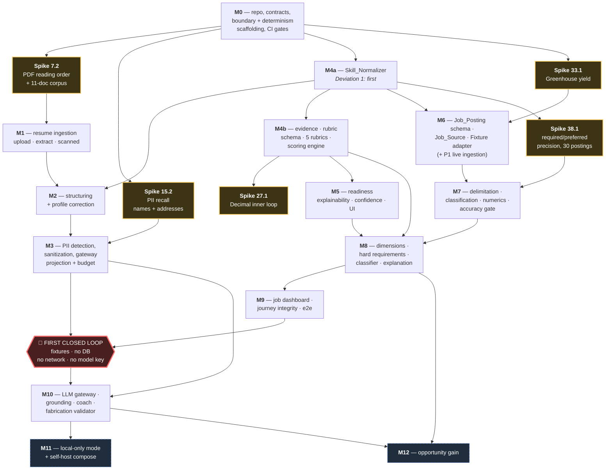

# Implementation Plan: ResumeMatch

## How to use this file

This file is the build order for ResumeMatch. It is written for an implementing agent that receives one task, or a few tightly related tasks, at a time and cannot hold the whole specification in context. Each task therefore states its own files, its own work, its own dependencies, and its own objectively checkable completion criteria.

**Precedence.** `requirements.md` and `design.md` are authoritative. Where a task description drifts from either, the specification wins and the task description is wrong. A task that would change observable behaviour in a way the specification does not describe requires amending `requirements.md` (and `design.md` where it names a mechanism) **before** the code is written, per the Definition of Done item 7 in `requirements.md`.

**Build order.** Tasks are grouped by milestone, and within a milestone the P0 tasks come first, then P1, then P2. The `Depends on:` line is authoritative for ordering and overrides document order — where a later-listed task is a prerequisite of an earlier-listed one, the dependency line says so and must be honoured (this happens exactly once, and is called out in [Deviation 1](#deviation-1--skill-normalization-precedes-the-rubric-engine)).

**Scope discipline.** Implement the task in front of you and nothing adjacent to it. Do not add configurability, abstraction, or defensive paths the criteria do not ask for.

### Legend

| Marker | Meaning |
|---|---|
| `[P0]` | Required for the First Closed Loop, or a non-negotiable safety/correctness constraint gated by its own milestone. |
| `[P1]` | Required for v1 public release. Not part of the First Closed Loop. |
| `[P2]` | Post-v1 or explicitly deferred. |
| `[BLOCKED: OD-xx]` | Cannot start until the named Open Decision is confirmed. The task states what confirmation unblocks it. |
| `[SPIKE]` | Time-boxed investigation. The deliverable is a recorded decision or a measured figure in `docs/decisions/`, not code that is kept. |
| `_Property: N_` | The task must satisfy Correctness Property *N* from `design.md`, tested with Hypothesis. |

`_Requirements:_` cites requirement IDs with criterion numbers as `RM-XXX-NNN c<n>`. `_Design:_` cites a `design.md` section or a decision-register entry `D-nn`.

### Deviations from the requirements' milestone order

Two, both justified by `design.md`, both annotated inline where they occur.

#### Deviation 1 — Skill normalization precedes the rubric engine

`RM-SKILL-001` is mapped to M4 alongside `RM-EVID-001` and `RM-RUB-001`, and the requirements list evidence first. The design makes `Skill_Normalizer` a dependency of evidence assignment, requirement extraction, and matching (component diagram; D-39; `RM-EVID-001 c8`), so it cannot be built after the engine that consumes it. The Skill_Normalizer block is therefore the **first** block of M4.

Consequence the implementer must honour: `Resume_Structurer` (M2) populates `SkillItem.canonical_skill_id` and so also depends on the Skill_Normalizer. Task **12.4** carries a forward `Depends on:` to the M4 normalizer tasks. Build by the dependency lines, not by document order.

#### Deviation 2 — Cloud-boundary enforcement scaffolding is built in M0, not M3

The privacy *logic* (`RM-PRIV-002`, `RM-PRIV-003` detection and sanitization) stays in M3. The *enforcement scaffolding* — the `.importlinter` contracts (D-02), `core/egress.py` (D-03, D-04), and `tools/check_egress.py` (D-05) — is built in M0. The design's Risks section is explicit about why: a deny-by-default import contract added to an existing codebase starts red and gets weakened until it passes, whereas one added to an empty codebase never has to be weakened. Building it first also means every subsequent task inherits the constraint instead of being retrofitted to it.

---

## Overview

This plan builds ResumeMatch from an empty repository to a deterministic, explainable resume-to-job matching product: resume ingestion and structured extraction, user-corrected profiles, PII sanitization, rubric-driven readiness scoring, job ingestion and requirement extraction, deterministic matching and classification, and — behind the cloud boundary — grounded LLM explanation and application coaching.

The work spans thirteen milestones, M0 through M12, as **216 leaf tasks in 60 task groups**. M0 through M9 build the loop; M10 through M12 add the model-backed and deferred surfaces.

The **First Closed Loop boundary** falls after task **53.1**, at the end of M9. Everything up to and including 53.1 is the first demonstrable end-to-end product, running on fixture job data with no database, no network access, and no model API key. Everything after it is P1 or P2 work, plus the three M10 P0 safety gates that are deliberately outside the loop.

## Tasks

### Milestone M0 — Repository, contracts, boundary scaffolding, CI

Nothing in this milestone parses a resume. Its purpose is that every later task lands inside contracts that already hold.

#### 1. Repository skeleton and toolchain

- [ ] 1.1 [P0] Create the single-distribution backend skeleton and pin the toolchain
  - Files: `backend/pyproject.toml`, `backend/uv.lock`, `backend/ruff.toml`, `backend/mypy.ini`, `.python-version`, `README.md`
  - Work: one Python distribution named `resumematch` with `src/` layout. Pin CPython 3.12. Add exact pins for `pydantic>=2`, `fastapi`, `uvicorn`, `pytest`, `hypothesis`, `import-linter`, `ruff`, `mypy`. No monorepo, no per-concern distributions (D-01).
  - Depends on: —
  - _Requirements: RM-SEC-003 c1, c3; RM-API-001 c7_ · _Design: Repository layout; D-01, D-33_
  - Done when: `uv sync --frozen` succeeds from a clean checkout; `ruff check backend/src` and `mypy --strict backend/src` both exit 0; `uv.lock` contains an exact version for every direct dependency; no second `pyproject.toml` exists anywhere in the repository.

- [ ] 1.2 [P0] Create the concern subpackage tree with layer-declaring docstrings
  - Files: `backend/src/resumematch/{core,skill,resume,privacy,llm,rubric,job,matching,coach,api}/__init__.py`
  - Work: create the ten subpackages from the design's repository layout. Each `__init__.py` contains only a module docstring naming the layer, the concerns it owns, and the layers it is permitted to import. No product code.
  - Depends on: 1.1
  - _Requirements: RM-API-001 c6_ · _Design: Module boundaries and layering; D-01_
  - Done when: `python -c "import resumematch.core, resumematch.skill, resumematch.resume, resumematch.privacy, resumematch.llm, resumematch.rubric, resumematch.job, resumematch.matching, resumematch.coach, resumematch.api"` exits 0; each `__init__.py` names its permitted imports.

- [ ] 1.3 [P0] Create the version-controlled configuration and asset directories with README stubs
  - Files: `config/README.md`, `rubrics/README.md`, `ontology/README.md`, `fixtures/README.md`, `docs/decisions/README.md`, `docs/schemas/.gitkeep`
  - Work: create the directory skeleton for the ~18 configuration artifacts the design makes load-bearing. Each README lists the files that will live there and states that every file carries a `version` key echoed in responses.
  - Depends on: 1.1
  - _Requirements: RM-EXT-002 c4; RM-REQX-001 c8; RM-MATCH-005 c4_ · _Design: Repository layout_
  - Done when: all six paths exist and are tracked by git; `config/README.md` lists every config filename from the design's repository layout.

- [ ] 1.4 [P0] Create the frontend skeleton consuming generated types only
  - Files: `web/package.json`, `web/package-lock.json`, `web/tsconfig.json`, `web/.eslintrc.cjs`, `web/src/app/layout.tsx`, `web/src/app/page.tsx`, `web/src/lib/api/generated/.gitkeep`
  - Work: Next.js + React + TypeScript app. Add an eslint rule (`no-restricted-imports` on `../generated` siblings, or an equivalent boundary rule) that forbids hand-written API type declarations outside `src/lib/api/generated/`.
  - Depends on: 1.1
  - _Requirements: RM-API-001 c5; RM-PARSE-004 c2; AS-01, AS-02_ · _Design: D-44_
  - Done when: `npm ci && npm run build` succeeds; `npx tsc --noEmit` exits 0; `npx eslint src` exits 0; `package-lock.json` is committed.

- [ ] 1.5 [P0] Write `AGENTS.md` with the non-negotiable implementation rules
  - Files: `AGENTS.md`
  - Work: record, for the implementing agent, the layering order, the two egress enclaves, the determinism rules (injected `Clock`, `Decimal`, sorted iteration, no `round()`), the fail-closed error paths, and the rule that a behaviour change requires a spec amendment first.
  - Depends on: 1.2
  - _Requirements: RM-EXT-001 c3_ · _Design: Reading this document; Determinism_
  - Done when: `AGENTS.md` names all ten layers in dependency order, both enclaves, and the six CI gate job names.

#### 2. Cloud-boundary and determinism enforcement scaffolding — Deviation 2

Built now, against an empty package, so the contracts never have to be weakened to go green.

- [ ] 2.1 [P0] Write the `import-linter` layering contract
  - Files: `.importlinter`
  - Work: add `[importlinter:contract:layers]` with the ten layers in the design's order, the pinned-tool-compatible multiline `root_packages` list containing only `resumematch`, and `include_external_packages = True`.
  - Depends on: 1.2
  - _Requirements: RM-API-001 c6_ · _Design: Import contracts; D-01_
  - Done when: `lint-imports --config .importlinter` exits 0; adding a temporary `from resumematch.api import app` to `resumematch/core/__init__.py` makes it exit non-zero naming the `layers` contract; the temporary import is removed.

- [ ] 2.2 [P0] Write the deny-by-default egress and provider-interface contracts
  - Files: `.importlinter`
  - Work: add `[importlinter:contract:egress]` and `[importlinter:contract:provider_api]` exactly as specified in the design — `source_modules = resumematch`, v2.1-compatible top-level forbidden transport and SDK modules, `allow_indirect_imports = False`, and `ignore_imports` naming only `resumematch.llm.providers.*`, `resumematch.job.adapters.*`, `resumematch.core.egress`, `resumematch.llm.gateway`, and `resumematch.api.composition`. Set `unmatched_ignore_imports_alerting = none` only to allow these intentionally future-only exceptions before their modules exist; it must not suppress an actual forbidden import.
  - Depends on: 2.1
  - _Requirements: RM-PRIV-003 c1, c11; RM-TEST-001 c8, c11_ · _Design: The adopted mechanism, Layer 1; D-02_
  - Done when: `lint-imports` exits 0 while the future-only ignores are unmatched; a temporary `import httpx` added to `resumematch/coach/__init__.py` fails the build naming the `egress` contract; a temporary indirect chain (`coach` → new helper module → `httpx`) also fails, proving `allow_indirect_imports = False` is effective; both temporaries removed.

- [ ] 2.3 [P0] Write the persistence, sanitization-record, and scoring-determinism boundaries
  - Files: `.importlinter`, `backend/src/resumematch/job/requirements/__init__.py`, `tools/check_session_write_boundary.py`, `backend/tests/tools/test_check_session_write_boundary.py`
  - Work: create `resumematch.job.requirements` as an intentionally empty architectural boundary whose `__init__.py` contains only a module docstring; this is not RM-REQX implementation. Add the remaining valid import-linter contracts: `persistence` (no `sqlalchemy`/`sqlite3`/`psycopg`/`asyncpg` outside `resumematch.job.store.*`) and `scoring_determinism` (no `random`/`secrets`/`time`/`uuid`/`os` in `rubric`, `matching`, `job.requirements`). Do not broaden the latter to all of `resumematch.job`. Add the dedicated AST/static session-write checker: only `resumematch.privacy.sanitizer` may import or literally dynamically import `resumematch.core.session_write`; it reports the file, line, and violated rule. Do not express this sibling-safe boundary as an import-linter contract.
  - Depends on: 2.1
  - _Requirements: RM-PRIV-003 c6; RM-JOB-007 c1; RM-SCORE-003 c2; RM-MATCH-005 c3_ · _Design: Import contracts; D-09, D-15, D-20_
  - Done when: `lint-imports` exits 0 with the remaining valid contracts present; the session-write checker and its tests pass; a permitted Sanitizer import passes; a temporary forbidden import outside `privacy.sanitizer` is rejected by the checker; a temporary `import time` in `resumematch/rubric/__init__.py` fails naming `scoring_determinism`; all probes removed.

- [ ] 2.4 [P0] Implement `tools/check_egress.py` — the AST escape-hatch check
  - Files: `tools/check_egress.py`, `backend/tests/tools/test_check_egress.py`
  - Work: `ast.NodeVisitor` over every file under `backend/src/resumematch/`, excluding `llm/providers/` and `job/adapters/`. Fail on: `importlib` import or `importlib.import_module`/`__import__` call; `eval`/`exec`/`compile`; `subprocess` import or `os.system`/`os.popen`/`os.exec*`; a string literal matching `^(https?|ftp|ws|wss)://`; `setattr` on a module object. Report file, line, and the rule name.
  - Depends on: 1.2
  - _Requirements: RM-PRIV-003 c11_ · _Design: Layer 3; D-05_
  - Done when: `python tools/check_egress.py backend/src` exits 0; the unit test feeds one synthetic source file per rule from a `tmp_path` fixture and asserts each is reported exactly once with its rule name, and that an identical file placed under an exempt enclave path is not reported.

- [ ] 2.5 [P0] Implement `core/egress.py` — the injected transport capability with a host allow-list
  - Files: `backend/src/resumematch/core/egress.py`, `backend/tests/unit/core/test_egress.py`
  - Work: `EgressGrant` (frozen; `enclave` literal `"llm_provider" | "job_source"`, `allowed_hosts: frozenset[str]`, `timeout_s`), `OutboundRequest`/`OutboundResponse`, the `HttpEgress` protocol, an `httpx`-backed implementation that raises `EgressHostNotAllowed` when the request host is outside the grant, and `issue_grant(settings, enclave)`. No module-level transport or provider instance anywhere.
  - Depends on: 2.2
  - _Requirements: RM-PRIV-003 c1, c4; RM-PRIV-006 c1, c3_ · _Design: Layers 2 and 4; D-03, D-04_
  - Done when: `lint-imports` still exits 0 (the `httpx` import is covered by the named exception only); a test asserts a request to an allow-listed host is attempted and a request to any other host raises `EgressHostNotAllowed` before any socket is opened (assert with a patched `socket.socket.connect` raiser); `grep -rn "issue_grant" backend/src` shows call sites only in `api/composition.py` once that file exists.

- [ ] 2.6 [P0] Implement `tools/check_determinism.py`
  - Files: `tools/check_determinism.py`, `backend/tests/tools/test_check_determinism.py`
  - Work: AST check scoped to `rubric/`, `matching/`, `job/requirements/`. Fail on: `datetime.now`/`utcnow`/`today`, `date.today`, `time.time`/`monotonic`; `float(`; builtin `round(`; a `For` node or comprehension whose iterable is a `.keys()`/`.values()`/`.items()` call not wrapped in `sorted(...)`; `listdir`/`iterdir`/`glob`/`scandir` in `job/adapters/fixture.py`.
  - Depends on: 1.2
  - _Requirements: RM-SCORE-003 c2; RM-MATCH-005 c3; RM-SCORE-001 c9; RM-MATCH-001 c6_ · _Design: Determinism table; D-18, D-20, D-38_
  - Done when: `python tools/check_determinism.py backend/src` exits 0; the unit test asserts one report per rule against synthetic sources, and asserts that `for k in sorted(d.keys())` is accepted while `for k in d.keys()` is rejected.

- [ ] 2.7 [P0] Implement `tools/check_no_domain_branch.py`
  - Files: `tools/check_no_domain_branch.py`, `backend/tests/tools/test_check_no_domain_branch.py`
  - Work: read the domain, role, and rubric identifiers from the rubric files present under `rubrics/` and fail the build if any appears as a literal in `rubric/engine.py`, `rubric/evidence.py`, `matching/engine.py`, or `matching/classifier.py`. Report the identifier, the file, and the line.
  - Depends on: 1.2, 1.3
  - _Requirements: RM-RUB-001 c5; RM-RUB-003 c7_ · _Design: How five domains flow through identical code; D-19_
  - Done when: the check exits 0 against the empty engine modules; the unit test asserts that a synthetic engine source containing `if domain_id == "finance"` is reported with the identifier and line number.

#### 3. Core foundations

- [ ] 3.1 [P0] Implement `core/canonical_json.py`
  - Files: `backend/src/resumematch/core/canonical_json.py`, `backend/tests/properties/test_canonical_json.py`
  - Work: canonical serializer applying, in order, recursive lexicographic key ordering by Unicode code point, `,`/`:` separators with no whitespace, UTF-8 without BOM and `ensure_ascii=False`, NFC normalization of every string, integers only, omission of absent fields, and a `canonical_sha256` returning lowercase hex prefixed `sha256:`.
  - Depends on: 1.2
  - _Requirements: RM-PRIV-003 c6, c8_ · _Design: Canonical serialization_
  - Done when: a Hypothesis test asserts that two dicts differing only in key insertion order produce identical bytes, that NFC-equivalent but differently composed strings produce identical bytes, and that `canonical_sha256` output always matches `^sha256:[0-9a-f]{64}$`.

- [ ] 3.2 [P0] Implement `core/clock.py`
  - Files: `backend/src/resumematch/core/clock.py`, `backend/tests/unit/core/test_clock.py`
  - Work: `Clock` protocol with `now() -> datetime` and `today() -> date`; a `SystemClock` implementation; a `FixedClock` test double. `SystemClock` is constructed nowhere in `src/` except `api/composition.py`.
  - Depends on: 1.2
  - _Requirements: RM-SCORE-003 c2; RM-MATCH-005 c3_ · _Design: D-20_
  - Done when: `grep -rn "SystemClock(" backend/src` returns at most the line in `api/composition.py`; the test asserts `FixedClock` returns its configured instant on repeated calls.

- [ ] 3.3 [P0] Implement `core/config.py` — the versioned configuration loader
  - Files: `backend/src/resumematch/core/config.py`, `backend/tests/unit/core/test_config.py`
  - Work: a loader that reads a YAML config file, requires a top-level `version` string, parses declared decimal fields as `Decimal` from quoted strings, and raises `ConfigInvalid` naming the file and the failing key. Also a `Settings` model reading every environment key with no default for required keys.
  - Depends on: 1.2
  - _Requirements: RM-SEC-002 c6; RM-EXT-002 c4_ · _Design: Determinism — config drift; Error Handling `CONFIG_INVALID`_
  - Done when: loading a fixture config without `version` raises `ConfigInvalid` naming the file; loading a fixture with `"0.40"` yields `Decimal("0.40")` and never a float; a missing required environment key raises with the key name in the message.

- [ ] 3.4 [P0] Implement `core/schemas/version_stamp.py`
  - Files: `backend/src/resumematch/core/schemas/version_stamp.py`, `backend/tests/unit/core/test_version_stamp.py`
  - Work: the `VersionStamp` frozen model with every field from the design (schema, engine, rubric id/version/status, alias file, evidence multiplier, match weight, threshold, confidence weight, pattern set, delimitation, relevance rule) and a `version_stamp()` factory that assembles it from loaded config objects.
  - Depends on: 3.3
  - _Requirements: RM-PARSE-004 c6; RM-SCORE-003 c3; RM-MATCH-005 c4; RM-EXT-002 c2, c4; RM-RUB-002 c3_ · _Design: Version stamping_ · _Property: 43_
  - Done when: the model is `frozen=True, extra="forbid"`; a test asserts every field named in the design's `VersionStamp` listing is present and that omitting a non-optional field raises a validation error.

- [x] 3.5 [P0] Implement `core/errors.py` — the single error taxonomy
  - Files: `backend/src/resumematch/core/errors.py`, `backend/tests/unit/core/test_errors.py`
  - Work: `ErrorCode` closed enum containing every code in the design's error table, including `INTERNAL_ERROR` for truly unhandled failures, `PipelineStage` enum, `ErrorDetail`, `ErrorResponse` (frozen, `extra="forbid"`, with `code`, `message`, `stage`, `details`, `retryable`, `context`), and one exception class per fail-closed path carrying its code. `guidance_unavailable` is deliberately **not** an `ErrorCode`.
  - Depends on: 1.2
  - _Requirements: RM-API-001 c3; RM-PARSE-004 c5_ · _Design: One error taxonomy_ · _Property: 45_
  - Done when: a test asserts every code string in the design's error table is a member of `ErrorCode`; asserts `"guidance_unavailable"` is not a member; asserts `context` values are constrained to `str | int` so a candidate-derived object cannot be placed there.

- [x] 3.6 [P0] Implement `core/telemetry.py` with enforced allow-lists
  - Files: `backend/src/resumematch/core/telemetry.py`, `backend/tests/unit/core/test_telemetry.py`
  - Work: `METRIC_ALLOWLIST` and `LOG_FIELD_ALLOWLIST` frozensets exactly as listed in the design. `emit_metric(name, ...)` and `emit_log(**fields)` raise on any name or field outside the allow-list. Structured JSON log records only. An exception wrapper that replaces a message with `f"{type(exc).__name__} at {stage} [redacted]"` unless the exception is one of the taxonomy's own types.
  - Depends on: 3.5
  - _Requirements: RM-OBS-001 c1, c2, c3; RM-OBS-002 c1, c3, c4_ · _Design: Observability_ · _Property: 48_
  - Done when: `emit_metric("resume_text_total")` raises naming the offending metric; `emit_log(candidate_name="x")` raises naming the offending field; a test asserts a wrapped `ValueError("secret text")` logs `ValueError at extract [redacted]` and never the original message.

- [x] 3.7 [P0] Implement `core/session.py` — the Session model and TTL+LRU store
  - Files: `backend/src/resumematch/core/session.py`, `backend/tests/unit/core/test_session.py`
  - Work: the `Session` model with every field from the design; use only the distinct temporary nominal session-reference types in the design's task-order compatibility table for schemas owned by later tasks. They are non-exported markers with no product logic or candidate-derived fields, and their owning task replaces them. `sanitized_resume` and `sanitization_record` are read-only properties with no public setter. `SessionStore` as a locked `OrderedDict` with an opportunistic sweep evicting entries whose `last_access_at` is more than the configured TTL behind `clock.now()`, plus bounded-capacity LRU eviction. Token via `secrets.token_urlsafe(32)`; only `token_hash` is stored on the Session.
  - Depends on: 3.2, 3.4
  - _Requirements: RM-SESS-001 c1, c2; RM-PRIV-001 c5, c6, c8_ · _Design: Session_Store; D-16_
  - Done when: a test with a `FixedClock` advanced past the TTL asserts the session is absent on next access; a test asserts `session.sanitized_resume = x` raises `AttributeError`; a test asserts the token value never appears on the `Session` object, only its hash; a test asserts `delete(token)` leaves no reference reachable from the store.

- [x] 3.8 [P0] Implement `core/session_write.py` — the sanitization-record write capability
  - Files: `backend/src/resumematch/core/session_write.py`, `backend/tests/privacy/test_session_write_restriction.py`
  - Work: the only module able to mutate `Session._sanitized_resume` and `Session._sanitization_record`, exposing `write_sanitization_record(session, resume, record)` typed as `Session`, `SanitizedResumeRef`, and concrete `SanitizationRecord`. Define `SanitizationRecord` (frozen: `content_hash`, `profile_revision`, `produced_at`, `pii_policy_version`, `detector_versions`, `placeholder_set_version`, `removed_categories`, `fail_safe_redaction_count`). The update of both fields is atomic.
  - Depends on: 3.7, 2.3
  - _Requirements: RM-PRIV-003 c6_ · _Design: Sanitization record and the write capability; D-08, D-09_
  - Done when: `lint-imports` exits 0; `tools/check_session_write_boundary.py` exits non-zero for a temporary import of `core.session_write` from `resumematch/coach/__init__.py` and reports the file, line, and `session_write_boundary` rule; the runtime/unit test asserts only the Sanitizer uses the capability and that writing sets both fields atomically.

- [x] 3.9 [P0] Implement the single-worker startup guard
  - Files: `backend/src/resumematch/api/app.py`, `backend/tests/unit/api/test_worker_guard.py`
  - Work: at startup read `WEB_CONCURRENCY`, `UVICORN_WORKERS`, and the Gunicorn worker count; if any exceeds 1, refuse to start with a named error in the style of a missing required configuration key.
  - Depends on: 3.3
  - _Requirements: RM-SESS-001 c2, c5_ · _Design: v1 is single-worker; D-16_
  - Done when: a test setting `WEB_CONCURRENCY=2` asserts startup raises with a message naming `WEB_CONCURRENCY`; a test with the variable unset or `1` asserts startup succeeds.

#### 4. API skeleton and published contracts

- [x] 4.1 [P0] Implement the FastAPI application, versioned prefix, and OpenAPI publication
  - Files: `backend/src/resumematch/api/app.py`, `backend/src/resumematch/api/routers/__init__.py`, `backend/src/resumematch/api/dto/__init__.py`
  - Work: mount all routers under `/api/v1`; publish the OpenAPI document at `/api/v1/openapi.json`; install a global exception handler that renders every failure as `ErrorResponse` and every validation failure as HTTP 422 with a field-level `details` list.
  - Depends on: 3.5, 3.9
  - _Requirements: RM-API-001 c1, c2, c3, c4_ · _Design: API Boundaries_ · _Property: 45_
  - Done when: `GET /api/v1/openapi.json` returns a document whose every path begins `/api/v1`; posting a malformed body to any registered endpoint returns 422 with a non-empty `details` array and both `code` and `message`; a test asserts an unhandled exception renders as `ErrorResponse` and not as a stack trace.

- [x] 4.2 [P0] Implement `api/composition.py` — the composition root
  - Files: `backend/src/resumematch/api/composition.py`, `backend/tests/unit/api/test_composition.py`
  - Work: the single place that constructs `SystemClock`, `SessionStore`, the config objects, and (later) the `EgressGrant`s and the `LLM_Provider`. Expose FastAPI dependencies that hand components their collaborators by constructor injection. No service locator, no `get_provider()` accessor, no string-keyed registry.
  - Depends on: 2.5, 3.2, 3.7
  - _Requirements: RM-PRIV-003 c1_ · _Design: Layer 2 — injected capability; D-03_
  - Done when: `grep -rn "issue_grant\|SystemClock(" backend/src` matches only lines in `api/composition.py`; a test asserts no module-level mutable singleton is exposed (module has no non-callable public attribute holding a constructed collaborator).

- [x] 4.3 [P0] Implement the session lifecycle endpoints and header-based session scoping
  - Files: `backend/src/resumematch/api/routers/sessions.py`, `backend/src/resumematch/api/dto/session.py`, `backend/tests/integration/test_session_endpoints.py`
  - Work: `POST /api/v1/sessions` returning the opaque token, `expires_at`, and `session_start_date`; `DELETE /api/v1/sessions` discarding all Session state and returning confirmation. The token travels in an `X-Session-Token` request header, **not** in the URL path.
  - Depends on: 4.1, 4.2
  - _Requirements: RM-SESS-001 c1; RM-PRIV-001 c8_ · _Design: API Boundaries; Resolved Specification Amendments_
  - Done when: a test asserts the created token decodes to no candidate-derived content and is at least 32 bytes of entropy; a test asserts no registered route pattern contains `{token}`; a test asserts `DELETE` then any subsequent request returns `SESSION_NOT_FOUND`.

- [x] 4.4 [P0] Implement the security baseline: CORS, rate limiting, transport headers, `.env.example`
  - Files: `backend/src/resumematch/api/app.py`, `backend/src/resumematch/api/ratelimit.py`, `.env.example`, `backend/tests/integration/test_security_baseline.py`
  - Work: CORS restricted to an explicit configured origin allow-list with no wildcard. In-process per-client token bucket keyed by client IP plus session token hash, applied to the upload endpoint and every endpoint that will reach an adapter or a provider, returning `RATE_LIMITED` with retry-after. Response headers `Strict-Transport-Security`, `X-Content-Type-Options`, `Referrer-Policy: no-referrer`. `.env.example` listing every required key with placeholder values.
  - Depends on: 4.1, 3.3
  - _Requirements: RM-SEC-002 c1, c3, c4, c5, c6_ · _Design: Security table_
  - Done when: a request from an unlisted origin receives no `Access-Control-Allow-Origin` header; exceeding the configured bucket returns 429 with code `RATE_LIMITED`; a test asserts every key read by `Settings` appears in `.env.example`; a test asserts no `Access-Control-Allow-Origin: *` is ever emitted.

- [x] 4.5 [P0] Implement `GET /api/v1/health`
  - Files: `backend/src/resumematch/api/routers/meta.py`, `backend/tests/integration/test_health.py`
  - Work: report service status, loaded rubric count, and configured source count. Nothing else.
  - Depends on: 4.1
  - _Requirements: RM-OBS-001 c4_ · _Design: Observability_
  - Done when: the response body has exactly three keys; a test asserts the response contains no session, profile, or candidate-derived field.

- [x] 4.6 [P0] Implement `tools/export_schemas.py` and the schema-drift gate
  - Files: `tools/export_schemas.py`, `docs/schemas/.gitkeep`, `web/src/lib/api/generated/`, `.github/workflows/ci.yml`
  - Work: export every Pydantic model marked for publication to JSON Schema under `docs/schemas/`, generate TypeScript types into `web/src/lib/api/generated/` from the published OpenAPI document, and add a CI step that re-runs generation and fails on any diff.
  - Depends on: 4.1, 1.4
  - _Requirements: RM-PARSE-004 c1, c2; RM-API-001 c1, c5_ · _Design: D-44_
  - Done when: `python tools/export_schemas.py && git diff --exit-code docs/schemas web/src/lib/api/generated` exits 0; editing a Pydantic field and re-running CI without regenerating fails the `schema-drift` job naming the changed file.

#### 5. Test infrastructure and CI gates

- [x] 5.1 [P0] Create the test tree, markers, and Hypothesis profile
  - Files: `backend/tests/conftest.py`, `backend/pytest.ini`, `backend/tests/{unit,properties,integration,privacy,fabrication,perf,tools}/.gitkeep`
  - Work: register the `live`, `boundary`, and `perf` markers; exclude `live` from the default run; configure a Hypothesis profile with `derandomize=True`, `max_examples=100` minimum, `deadline=None`, and a committed `.hypothesis/` example database directory. Add the property-tag docstring convention (`# Feature: resumematch, Property N: <title>`).
  - Depends on: 1.1
  - _Requirements: RM-TEST-001 c1, c2, c3, c6_ · _Design: Testing Strategy — Layers and libraries; D-33_
  - Done when: `pytest -q` collects and passes with zero tests failing; `pytest -m live --collect-only` reports zero tests selected in the default configuration; the Hypothesis profile is active (assert `settings().derandomize is True` in a meta-test).

- [x] 5.2 [P0] Implement the network-blocking and counting-stub fixtures
  - Files: `backend/tests/conftest.py`, `backend/tests/privacy/conftest.py`
  - Work: a `no_network` fixture replacing `socket.socket.connect` with a raiser; a `CountingStubProvider` recording every invocation per operation; a `CapturingTelemetry` fixture recording every emitted log record, metric, and trace attribute for later marker assertions.
  - Depends on: 5.1, 3.6
  - _Requirements: RM-TEST-001 c6; RM-PRIV-003 c11; RM-OBS-002 c6_ · _Design: What the CI check inspects_
  - Done when: a smoke test using `no_network` asserts that any outbound connection attempt raises; a smoke test asserts `CountingStubProvider.invocations == 0` after construction and increments on call.

- [x] 5.3 [P0] Wire the CI pipeline with the six no-override gate jobs
  - Files: `.github/workflows/ci.yml`, `CODEOWNERS`
  - Work: jobs `lint`, `config-validate`, `schema-drift`, `unit`, `properties`, `frontend`, plus the six required gates `privacy`, `pii-gates`, `boundary`, `reqx-accuracy`, `fabrication`, `determinism`. No gate carries `continue-on-error`, a `skip` condition, or an environment-conditional bypass. Gates whose corpus does not exist yet run their available half and fail on absence of the corpus rather than passing vacuously. `CODEOWNERS` requires maintainer review for `.importlinter`, `tools/`, and `.github/workflows/`.
  - Depends on: 2.2, 2.4, 2.6, 2.7, 5.1
  - _Requirements: RM-TEST-001 c1, c8; RM-SEC-003 c2, c3_ · _Design: Build gates — no override path; CI pipeline shape_
  - Done when: `grep -c "continue-on-error" .github/workflows/ci.yml` returns 0; each of the six gate jobs is listed under branch-protection required checks in `docs/architecture.md`; the `boundary` job runs `lint-imports`, `tools/check_egress.py`, and `pytest -m boundary`; `CODEOWNERS` covers the three paths.

- [x] 5.4 [P0] Add the dependency and secret scanning job
  - Files: `.github/workflows/ci.yml`, `.gitleaks.toml`
  - Work: `pip-audit` and `npm audit` failing on high or critical severity; `gitleaks` secret scan failing on any finding.
  - Depends on: 5.3
  - _Requirements: RM-SEC-003 c1, c2; RM-SEC-002 c2_ · _Design: Security table_
  - Done when: the `deps` job runs all three tools; a test commit containing a synthetic AWS-shaped key fails the job and is not merged.

- [x] 5.5 [P0] Write `docs/privacy.md` — the reviewable seven-stage lifecycle statement
  - Files: `docs/privacy.md`
  - Work: state each of the seven candidate-data lifecycle stages, where each lives, how long, and which code path owns it, in a form a reviewer can hold beside the source.
  - Depends on: 3.7
  - _Requirements: RM-PRIV-001 c1, c9_ · _Design: Resume lifecycle with the privacy boundary_
  - Done when: the document names all seven stages in order, names the module owning each, and names the test that asserts stage 7 (`test_no_candidate_data_in_persistent_writes`).

#### 6. Containerized development environment

- [ ] 6.1 [P1] Write the backend and frontend Dockerfiles
  - Files: `backend/Dockerfile`, `web/Dockerfile`, `.dockerignore`
  - Work: backend image runs `uvicorn resumematch.api.app:app --workers 1` and sets `PYTHONHASHSEED=0`; frontend image builds and serves the Next.js app.
  - Depends on: 4.1, 1.4
  - _Requirements: RM-DEP-001 c1_ · _Design: Deployment Architecture; D-16, D-45_
  - Done when: both images build; the backend container's process list shows exactly one worker; `docker run` of the backend answers `GET /api/v1/health` with 200.

- [ ] 6.2 [P1] Write `docker-compose.yml` for the fixture-only, no-database, no-model-key loop
  - Files: `docker-compose.yml`
  - Work: `api` and `web` services only. `RESUMEMATCH_JOB_SOURCE=fixture`, `RESUMEMATCH_LLM_PROVIDER=""`, read-only bind mounts for `rubrics/`, `ontology/`, `config/`, `fixtures/`. No database service.
  - Depends on: 6.1
  - _Requirements: RM-DEP-001 c2, c3_ · _Design: First Closed Loop deployment; D-13_
  - Done when: `docker compose up` from a clean checkout serves `GET /api/v1/health` and the web root with no additional manual step; `docker compose config` shows no `db` service and no model API key.

---

### Spike block — before M1 is committed

#### 7. PDF extraction reading order and offset fidelity

- [x] 7.1 [P0] Build the eleven-document resume fixture corpus
  - Files: `fixtures/resumes/` (eleven documents), `fixtures/resumes/MANIFEST.md`
  - Work: author the eleven documents named by the requirements — single-column PDF, two-column PDF, table-based PDF, text-box PDF, multi-page PDF, DOCX, missing sections, duplicate headings, unusual section headings, malformed encoding, image-only PDF. Synthetic content only, no real third-party personal data. `MANIFEST.md` records, per document, what it is testing and its provenance.
  - Depends on: 1.3
  - _Requirements: RM-TEST-002 c1, c2_ · _Design: Repository layout — `fixtures/resumes/`_
  - Done when: eleven documents exist and are tracked; `MANIFEST.md` has one row per document naming the RM-TEST-002 c1 case it covers; a test asserts the corpus contains exactly one image-only PDF and at least one DOCX; a reviewer-facing note in `MANIFEST.md` states that every name, address, and employer is invented.

- [x] 7.2 [P0] [SPIKE] Measure `pdfplumber` reading order and offset fidelity across the corpus — time-box 1 day
  - Files: `docs/decisions/0001-pdf-extraction-library.md` (kept), throwaway script under `spikes/` (deleted at the end)
  - Work: run `pdfplumber` with the design's proposed column-clustering rule (words clustered by x-midpoint using a fixed gap threshold expressed as a fraction of page width, read column-by-column then top-to-bottom) against all eleven fixtures. For the two-column, table-based, and text-box documents, manually check reading order and verify that slicing the extracted text at each recorded block offset reproduces the block's text exactly. If reading order fails, evaluate `PyMuPDF` (recording the AGPL licensing question) and a direct word-box fallback.
  - Depends on: 7.1
  - _Requirements: RM-PARSE-001 c2, c3, c6; RM-PARSE-005 c1_ · _Design: D-36; Risks — PDF extraction quality_
  - Done when: `docs/decisions/0001-pdf-extraction-library.md` records the chosen library, the exact column-gap threshold value, a per-document reading-order verdict for all eleven fixtures, and the measured offset-fidelity result (count of blocks whose slice reproduces its text, out of total). The `spikes/` directory is deleted and absent from the final commit.

---

### Milestone M1 — Resume ingestion

#### 8. Upload validation and hardening

- [ ] 8.1 [P0] Implement streaming upload with the size ceiling enforced before the body is read
  - Files: `backend/src/resumematch/resume/upload.py`, `backend/src/resumematch/api/routers/resume.py`, `backend/src/resumematch/api/dto/resume.py`, `backend/tests/integration/test_upload_size.py`
  - Work: reject on `Content-Length` above 10 MB with 413 `FILE_TOO_LARGE` without draining the body; otherwise stream to an OS temp file at `{tmpdir}/{uuid4().hex}` with mode `0o600`, aborting at 10 MB. The upload DTO has **no** `filename` field. Reject zero bytes with `EMPTY_FILE`.
  - Depends on: 4.1, 4.4, 3.5
  - _Requirements: RM-ING-001 c4, c6, c8; RM-SEC-001 c1, c5; RM-PRIV-001 c4_ · _Design: Upload_Service validation order_
  - Done when: an 11 MB upload returns 413 `FILE_TOO_LARGE` and the test asserts the request body was not fully consumed; a zero-byte upload returns `EMPTY_FILE`; a test asserts the temp file mode is `0o600` and its name matches `^[0-9a-f]{32}$`; a test asserts the DTO model has no field named `filename` and that a client-supplied filename appears in no response body.

- [ ] 8.2 [P0] Implement magic-byte content-type detection and format rejection
  - Files: `backend/src/resumematch/resume/upload.py`, `backend/tests/unit/resume/test_content_type.py`
  - Work: determine the type from magic bytes — `%PDF-` for PDF, `PK\x03\x04` plus a `[Content_Types].xml` zip entry for DOCX — never from the filename extension. Anything else returns 415 `UNSUPPORTED_FORMAT`.
  - Depends on: 8.1
  - _Requirements: RM-ING-001 c1, c2, c3_ · _Design: Upload_Service validation order, step 4_
  - Done when: a PNG renamed to `.pdf` returns 415 `UNSUPPORTED_FORMAT`; a valid PDF named `resume.txt` is accepted; a zip without `[Content_Types].xml` returns 415.

- [ ] 8.3 [P0] Implement the decompression-size probe and the page-count ceiling
  - Files: `backend/src/resumematch/resume/upload.py`, `fixtures/resumes/adversarial/`, `backend/tests/unit/resume/test_bomb_and_pages.py`
  - Work: before extraction, sum DOCX zip entry uncompressed sizes and PDF stream lengths and reject above a configured ceiling with `FILE_TOO_LARGE`. Reject PDFs above 15 pages with `TOO_MANY_PAGES`. Add two adversarial fixtures: a compression bomb and a 16-page PDF.
  - Depends on: 8.2
  - _Requirements: RM-ING-001 c5; RM-SEC-001 c4_ · _Design: Upload_Service validation order, steps 5 and 6; Security table_
  - Done when: the bomb fixture returns `FILE_TOO_LARGE` and the test asserts peak process memory stays under the configured ceiling; the 16-page fixture returns `TOO_MANY_PAGES`; a 15-page fixture is accepted.

- [ ] 8.4 [P0] Implement the extraction watchdog and the guaranteed temp-file cleanup
  - Files: `backend/src/resumematch/resume/upload.py`, `backend/tests/unit/resume/test_watchdog_and_cleanup.py`
  - Work: run extraction under a configured wall-clock limit, returning 504 `EXTRACTION_TIMEOUT` on overrun. Wrap the whole temp-file lifetime in `try/finally` whose `finally` unlinks on success, on error, and on timeout. Release every reference to the uploaded bytes before the response is returned.
  - Depends on: 8.3
  - _Requirements: RM-SEC-001 c3; RM-PRIV-001 c2, c3, c4_ · _Design: Upload_Service validation order, step 7_
  - Done when: a test injecting a sleeping extractor returns `EXTRACTION_TIMEOUT` and asserts the temp path does not exist afterwards; a test injecting a raising extractor asserts the same; a test asserts the temp directory is empty after a successful upload; a test asserts `session.extracted_text` is set while no attribute anywhere on the Session holds raw bytes.

- [ ] 8.5 [P0] Harden the parser configuration against hostile documents
  - Files: `backend/src/resumematch/resume/extract/hardening.py`, `backend/tests/unit/resume/test_parser_hardening.py`
  - Work: configure `pdfplumber`/`pdfminer.six` with no external resource resolution; read DOCX zip entries without following relationship targets; parse all XML through `defusedxml` with DTDs, entity expansion, and external entities disabled.
  - Depends on: 8.2
  - _Requirements: RM-SEC-001 c1, c2_ · _Design: Security table — parser hardening_
  - Done when: an XXE fixture DOCX referencing `file:///etc/passwd` is parsed without the referenced content appearing anywhere in `ExtractedText`, and the test asserts a `defusedxml` entity error is raised and mapped to `EXTRACTION_FAILED`; a test asserts no code path passes a non-defused XML parser.

#### 9. Text extraction

- [ ] 9.1 [P0] Define the `ExtractedText` and `ExtractedBlock` schemas
  - Files: `backend/src/resumematch/core/schemas/extracted_text.py`, `backend/tests/properties/test_extracted_text_schema.py`
  - Work: `ExtractedBlock` (frozen: `block_id` as `f"{page}:{ordinal}"`, `section_id`, `page`, `start_offset`, exclusive `end_offset`, `text`, `layout_kind`, `column_index`) and `ExtractedText` (frozen: `text`, `blocks`, `page_count`, `pages_with_text_layer`, `extractor_version`).
  - Depends on: 3.4
  - _Requirements: RM-PARSE-001 c2_ · _Design: Text_Extractor_ · _Property: 2_
  - Done when: both models are `frozen=True, extra="forbid"`; a Hypothesis round-trip test asserts `ExtractedText.model_validate(json.loads(x.model_dump_json())) == x`; a validator rejects a block whose `end_offset <= start_offset`.

- [ ] 9.2 [P0] Implement the canonical text normalization pipeline
  - Files: `backend/src/resumematch/resume/extract/normalize.py`, `backend/tests/properties/test_normalization.py`, `docs/scoring.md`
  - Work: apply, in the design's fixed order, NFKC, the fixed ligature expansion table, the five space-like code points to `U+0020`, `U+2010`–`U+2015` to `-`, curly quotes to straight, CRLF/CR to LF, collapse runs of two or more spaces to one, strip trailing spaces per line, collapse runs of three or more newlines to two. Document the order in `docs/scoring.md`.
  - Depends on: 1.2
  - _Requirements: RM-PARSE-001 c7_ · _Design: Canonical normalization form_ · _Property: 5_
  - Done when: a Hypothesis test asserts `normalize(normalize(s)) == normalize(s)` for all generated strings; a test asserts the output contains no character from the prohibited set (non-breaking spaces, the six ligatures, `\r`, two consecutive spaces); `docs/scoring.md` lists the steps in the implemented order.

- [ ] 9.3 [P0] Implement PDF extraction with fixed-threshold column clustering
  - Files: `backend/src/resumematch/resume/extract/pdf.py`, `backend/tests/unit/resume/test_pdf_extract.py`, `backend/tests/properties/test_provenance_offsets.py`
  - Work: implement the extractor using the library and the exact column-gap threshold recorded by task 7.2. Cluster word boxes into columns by x-midpoint, read column-by-column then top-to-bottom, emit `ExtractedBlock`s with `layout_kind` and `column_index`, then normalize. Thresholds are constants read from configuration, never tuned per document.
  - Depends on: 7.2, 9.1, 9.2, 8.5
  - _Requirements: RM-PARSE-001 c1, c2, c3, c6_ · _Design: Text_Extractor; D-36_ · _Property: 1, 4_
  - Done when: extraction over all ten text-bearing fixtures produces, for every block, `extracted.text[b.start_offset:b.end_offset] == b.text`; extracting each fixture twice produces byte-identical `model_dump_json()`; the two-column fixture's block order matches the expected order recorded in `fixtures/baselines/reading_order/`.

- [ ] 9.4 [P0] Implement DOCX extraction
  - Files: `backend/src/resumematch/resume/extract/docx.py`, `backend/tests/unit/resume/test_docx_extract.py`
  - Work: extract paragraphs, table cells, and text boxes via `python-docx`, assigning `layout_kind` accordingly, then normalize. Same `ExtractedText` contract as the PDF path.
  - Depends on: 9.1, 9.2, 8.5
  - _Requirements: RM-PARSE-001 c1, c2, c3, c6_ · _Design: Text_Extractor; D-36_ · _Property: 1, 4_
  - Done when: the DOCX fixture yields blocks whose offsets all satisfy the slice-reproduces-text assertion; repeated extraction is byte-identical; table content appears with `layout_kind == "table_cell"`.

- [ ] 9.5 [P0] Implement image-only and partially-image-only PDF detection
  - Files: `backend/src/resumematch/resume/extract/text_layer.py`, `backend/src/resumematch/api/routers/resume.py`, `backend/tests/unit/resume/test_scanned_detection.py`
  - Work: a page has a text layer when the extractor yields at least 10 non-whitespace characters for it. Zero such pages returns `SCANNED_PDF_UNSUPPORTED`; fewer than half returns `SCANNED_PDF_PARTIAL` with the affected page list in `ErrorResponse.context`. Both stop the pipeline with an early `return` in the router, before the Structurer is constructed — not with a flag the Structurer is trusted to honour.
  - Depends on: 9.3
  - _Requirements: RM-PARSE-002 c1, c2, c3, c5_ · _Design: Scanned-PDF detection_
  - Done when: the image-only fixture returns `SCANNED_PDF_UNSUPPORTED`; a mixed fixture returns `SCANNED_PDF_PARTIAL` with the correct page numbers in `context`; a test asserts the Structurer records zero invocations on both paths; a test asserts no `Structured_Resume` field is present in either response.

- [ ] 9.6 [P0] Implement the insufficient-text and unhandled-error extraction failures
  - Files: `backend/src/resumematch/resume/extract/__init__.py`, `backend/tests/unit/resume/test_extraction_failures.py`
  - Work: fewer than 200 characters from a document of one or more pages returns `EXTRACTION_INSUFFICIENT_TEXT`. An unhandled library error returns `EXTRACTION_FAILED` with a user-facing message naming the file type and suggesting re-export as a text-based PDF.
  - Depends on: 9.3, 9.4
  - _Requirements: RM-PARSE-001 c4, c5_ · _Design: Error Handling table_
  - Done when: a 150-character fixture returns `EXTRACTION_INSUFFICIENT_TEXT`; a test injecting a library exception returns `EXTRACTION_FAILED` whose `message` contains the file type token and the re-export suggestion, and contains no candidate-derived text.

- [ ] 9.7 [P0] Implement the extraction endpoint and its stage response
  - Files: `backend/src/resumematch/api/routers/resume.py`, `backend/src/resumematch/api/dto/resume.py`, `backend/tests/integration/test_resume_upload_endpoint.py`
  - Work: `POST /api/v1/sessions/resume` (session in the `X-Session-Token` header) validating, extracting, storing `ExtractedText` in Session state, and returning `extraction_ok`, `page_count`, and warnings. The response never contains `ExtractedText`.
  - Depends on: 8.4, 9.3, 9.4, 9.5, 9.6, 4.3
  - _Requirements: RM-ING-001 c1–c8; RM-PARSE-001; RM-PARSE-002; RM-PRIV-001 c5_ · _Design: API Boundaries; D-11_
  - Done when: an integration test uploads each of the ten text-bearing fixtures and receives 200 with a `page_count`; a test asserts the response body contains no field carrying extracted text; a test asserts `ExtractedText` is retrievable from the Session afterwards.

- [ ] 9.8 [P0] Add the upload-format and size disclosure to the client
  - Files: `web/src/components/UploadPanel.tsx`, `web/tests/UploadPanel.test.tsx`
  - Work: display the two accepted formats and the 10 MB maximum **before** the user selects a file. Render the scan/OCR message for `SCANNED_PDF_UNSUPPORTED` and `SCANNED_PDF_PARTIAL`, stating that the file appears to be a scan or image, that OCR is not supported, and that a text-based PDF or DOCX is required.
  - Depends on: 1.4, 9.7
  - _Requirements: RM-ING-001 c7; RM-PARSE-002 c4_ · _Design: API Boundaries_
  - Done when: a component test asserts both format names and `10 MB` are in the DOM before any file is chosen; a test asserts the scan message renders for both error codes and includes the words `scan`, `OCR`, and `text-based`.

#### 10. Extraction performance

- [ ] 10.1 [P1] Add the extraction-and-structuring performance benchmark and its CI threshold
  - Files: `backend/tests/perf/test_extraction_budget.py`, `docs/perf-reference-hardware.md`, `.github/workflows/ci.yml`
  - Work: `pytest-benchmark` over the ≤5 MB, ≤10 page fixtures measuring p95 for extraction plus structuring. Document `perf-ref-1` (4 vCPU / 8 GB / no GPU / CPython 3.12 / one worker / one request at a time) as the profile the 5 s budget is stated against, and record the pinned CI runner spec separately alongside every measurement. Fail the job above 7.5 s.
  - Depends on: 9.7, 12.6
  - _Requirements: RM-PERF-001 c1, c5; AS-09_ · _Design: Performance measurement; D-34; Resolved Specification Amendments_
  - Done when: the benchmark reports a p95 figure and the runner spec in its output; the job fails when the measured p95 exceeds 7.5 s; `docs/perf-reference-hardware.md` states that the CI gate is a regression gate and not a conformance gate against `perf-ref-1`.

---

### Milestone M2 — Structured extraction and profile correction

> **Ordering note (Deviation 1).** Task 12.4 populates `SkillItem.canonical_skill_id` and therefore depends on the Skill_Normalizer, which is grouped under M4 as task block 22. Build 22.1–22.4 before 12.4. The milestone heading reflects requirement mapping; the `Depends on:` lines are authoritative for build order.

#### 11. Candidate-side schemas

- [ ] 11.1 [P0] Define `Provenance` and `ItemBase`
  - Files: `backend/src/resumematch/core/schemas/candidate.py`, `backend/tests/properties/test_item_base.py`
  - Work: `Provenance` (frozen: `section_id`, `block_ids`, `start_offset`, exclusive `end_offset`). `ItemBase` (frozen: `item_id` stable within a Session, `origin` literal `"extracted" | "user_provided"`, `extraction_confidence` as `Decimal` at two decimal places in `[0, 1]`, `confidence_inputs`, `provenance` nullable only when `user_provided`, `source_text`).
  - Depends on: 9.1
  - _Requirements: RM-PARSE-005 c1, c2, c4; RM-REV-001 c4, c5_ · _Design: Candidate side_ · _Property: 2, 4_
  - Done when: a validator rejects `provenance=None` when `origin == "extracted"`; a validator rejects an `extraction_confidence` outside `[0, 1]` or with more than two decimal places; `extraction_confidence` is typed `Decimal` and a test asserts a `float` input is rejected or exactly quantized, never silently widened.

- [ ] 11.2 [P0] Define the seven item types and the `unclassified` item
  - Files: `backend/src/resumematch/core/schemas/candidate.py`, `backend/tests/properties/test_candidate_items.py`
  - Work: `SkillItem`, `ExperienceItem`, `EducationItem`, `ProjectItem`, `CertificationItem`, `AchievementItem`, `UnclassifiedItem`, with exactly the fields listed in the design. `YearMonth` and the `DegreeLevel`, `WorkMode`, `SeniorityId`, `EmploymentType` enums.
  - Depends on: 11.1
  - _Requirements: RM-PARSE-003 c2, c3, c4; RM-PARSE-004 c1_ · _Design: Candidate side_ · _Property: 2_
  - Done when: every model is `frozen=True, extra="forbid"`; a Hypothesis round-trip test passes for each of the seven types; a test asserts `ExperienceItem` carries both `duration_months` and `date_conflict`.

- [ ] 11.3 [P0] Define `StructuredResume`, `TargetConstraints`, and `CandidateProfile`
  - Files: `backend/src/resumematch/core/schemas/candidate.py`, `backend/tests/properties/test_profile_roundtrip.py`
  - Work: `StructuredResume` with `schema_version: Literal["structured_resume/1"]` and the eight collections (seven sections plus `unclassified`), empty tuples where a section is absent. `TargetConstraints`. `CandidateProfile` with `schema_version`, `profile_revision`, `session_start_date`, `resume`, `target`, `confirmed`. Export both to JSON Schema and regenerate the TypeScript types.
  - Depends on: 11.2, 4.6
  - _Requirements: RM-PARSE-004 c1, c2, c3, c4, c6_ · _Design: Candidate side; D-44_ · _Property: 2_
  - Done when: Hypothesis round-trip tests pass for `StructuredResume` and `CandidateProfile` at 200 examples each; `docs/schemas/structured_resume.schema.json` and `candidate_profile.schema.json` exist; `tsc --noEmit` passes against the regenerated types; the schema-drift job is green.

#### 12. Resume structuring

- [ ] 12.1 [P0] Implement the heading gazetteer and section assignment
  - Files: `backend/src/resumematch/resume/structure/sections.py`, `config/section_headings.yaml`, `backend/tests/unit/resume/test_section_assignment.py`
  - Work: a version-controlled heading gazetteer mapping heading surface forms to the seven section identifiers. Match over `ExtractedBlock`s whose `layout_kind == "heading"`. Handle absent, duplicated, and unrecognized headings by routing the affected content to `unclassified` rather than discarding it.
  - Depends on: 11.2, 9.3
  - _Requirements: RM-PARSE-003 c2, c4_ · _Design: Resume_Structurer_ · _Property: 6_
  - Done when: the missing-sections, duplicate-headings, and unusual-headings fixtures each produce a `StructuredResume` in which every source `block_id` appears in exactly one section counting `unclassified`; a test asserts zero blocks are dropped for all ten text-bearing fixtures.

- [ ] 12.2 [P0] Implement experience date-range parsing and duration computation
  - Files: `backend/src/resumematch/resume/structure/dates.py`, `backend/tests/unit/resume/test_date_parsing.py`
  - Work: parse recognizable ranges into `start_date`, `end_date` or `is_present`, and `duration_months`. Set `date_conflict` where a range is inverted or two ranges in one item disagree. Month-granularity arithmetic only; no wall-clock — `present` resolves against `CandidateProfile.session_start_date` supplied as data.
  - Depends on: 11.2
  - _Requirements: RM-PARSE-003 c3_ · _Design: Determinism — `present` resolution_ · _Property: 47_
  - Done when: a table-driven test covers at least twelve real range formats including `Jan 2023 – Present`, `2021-2022`, `06/2020 to 08/2020`, and one inverted range; the inverted range sets `date_conflict = True` and does not raise; `tools/check_determinism.py` reports no clock use in the module.

- [ ] 12.3 [P0] Implement the deterministic `Extraction_Confidence` calculation
  - Files: `backend/src/resumematch/resume/structure/confidence.py`, `backend/tests/unit/resume/test_extraction_confidence.py`
  - Work: sum the design's documented contributions — base 0.50, `heading_matched` +0.20, `layout_clean` +0.10, `pattern_complete` +0.15, `date_parsed` +0.05, `unclassified_section` −0.25, `encoding_anomaly` −0.15, `table_spliced` −0.10 — clamped to `[0.00, 1.00]` in `Decimal`, recording the contributing input names on the item. No LLM input can reach this value.
  - Depends on: 12.1, 12.2
  - _Requirements: RM-PARSE-005 c2, c3, c6_ · _Design: Extraction_Confidence table_
  - Done when: one unit test per contribution asserts the exact resulting value and the exact `confidence_inputs` tuple; a test asserts an item with all negative contributions clamps at 0.00 and never below; a test asserts the module imports nothing from `resumematch.llm` and `lint-imports` confirms `resume` sits below `llm`.

- [ ] 12.4 [P0] Resolve skill surfaces to canonical identifiers in the Structurer
  - Files: `backend/src/resumematch/resume/structure/skills.py`, `backend/tests/unit/resume/test_structurer_skill_resolution.py`
  - Work: populate `SkillItem.surface` from the source text and `SkillItem.canonical_skill_id` from the injected `Skill_Normalizer`, preserving `source_text` alongside the normalized value.
  - Depends on: 22.1, 22.2, 22.3, 12.1 — **Deviation 1: build task block 22 first**
  - _Requirements: RM-PARSE-003 c1; RM-SKILL-001 c6; RM-PARSE-005 c4_ · _Design: Component diagram (`Struct → SNorm`); D-39_
  - Done when: a test asserts a resume listing `JS`, `JavaScript`, and `Javascript` yields three `SkillItem`s whose `canonical_skill_id` values are all equal and whose `surface` values differ; a test asserts an unrecognized surface yields `unmapped:<fold>` and preserves the original string.

- [ ] 12.5 [P0] Assemble the `Resume_Structurer` and assert it never calls a provider
  - Files: `backend/src/resumematch/resume/structure/__init__.py`, `backend/tests/properties/test_structurer.py`
  - Work: compose section assignment, date parsing, confidence, and skill resolution into `structure(extracted: ExtractedText, session_start_date: date) -> StructuredResume`. Populate all seven sections plus `unclassified`, using empty tuples where absent. Attach `Provenance` to every item.
  - Depends on: 12.1, 12.2, 12.3, 12.4, 5.2
  - _Requirements: RM-PARSE-003 c1, c2, c5, c6; RM-PARSE-005 c1_ · _Design: Resume_Structurer_ · _Property: 1, 3, 4, 6_
  - Done when: structuring each fixture twice produces byte-identical `model_dump_json()`; every item's provenance slice reproduces its `source_text`; a test with `CountingStubProvider` asserts zero invocations across all ten fixtures; every source `block_id` appears in exactly one section.

- [ ] 12.6 [P0] Implement the profile draft endpoint
  - Files: `backend/src/resumematch/api/routers/profile.py`, `backend/src/resumematch/api/dto/profile.py`, `backend/tests/integration/test_profile_draft.py`
  - Work: `POST /api/v1/sessions/profile/draft` structuring the Session's `ExtractedText`, storing the `StructuredResume` in Session state, and returning it with per-item `source_text` and the `schema_version`.
  - Depends on: 12.5, 9.7
  - _Requirements: RM-PARSE-003 c1; RM-PARSE-004 c6; RM-PARSE-005 c5_ · _Design: API Boundaries; D-11_
  - Done when: an integration test uploads then drafts each text-bearing fixture and receives a schema-valid `StructuredResume` carrying `schema_version`; a test asserts calling draft before upload returns `SESSION_NOT_FOUND` or a 409 rather than an empty profile.

#### 13. Profile review and correction

- [ ] 13.1 [P0] Implement the profile read, update, and confirm endpoints
  - Files: `backend/src/resumematch/api/routers/profile.py`, `backend/tests/integration/test_profile_edit.py`
  - Work: `GET /api/v1/sessions/profile` returning the current profile; `PUT /api/v1/sessions/profile` applying add, edit, and remove across every section including `unclassified`, incrementing `profile_revision` on every mutation, setting each edited item's `origin` to `user_provided` and its `extraction_confidence` to `1.00`, and recomputing `duration_months` when a date changes; `POST /api/v1/sessions/profile/confirm` accepting `TargetConstraints` and setting `confirmed`.
  - Depends on: 12.6, 11.3, 12.2
  - _Requirements: RM-REV-001 c1, c2, c3, c4, c7; RM-UI-001 c2, c3_ · _Design: API Boundaries_ · _Property: 47_
  - Done when: a Hypothesis test over edit sequences asserts every edited item ends with `origin == "user_provided"` and `extraction_confidence == Decimal("1.00")`, and every experience item's `duration_months` stays consistent with its dates; a test asserts `profile_revision` strictly increases on every `PUT`; a test asserts `GET` after a simulated reload within the same Session returns the corrections.

- [ ] 13.2 [P0] Gate scoring on a confirmed profile
  - Files: `backend/src/resumematch/api/deps.py`, `backend/tests/properties/test_confirmation_gate.py`
  - Work: a FastAPI dependency that returns `PROFILE_NOT_CONFIRMED` (409) for any readiness or matching request whose Session profile is not confirmed, before the engine is constructed.
  - Depends on: 13.1
  - _Requirements: RM-REV-001 c1_ · _Design: Error Handling — `PROFILE_NOT_CONFIRMED`_ · _Property: 46_
  - Done when: a Hypothesis test over unconfirmed profiles asserts every readiness and matching request returns 409 `PROFILE_NOT_CONFIRMED` and that counting spies on the Rubric_Engine and Matching_Engine record zero executions.

- [ ] 13.3 [P0] Build the Profile_Review_UI editing surface
  - Files: `web/src/app/review/page.tsx`, `web/src/components/ProfileSectionEditor.tsx`, `web/tests/ProfileSectionEditor.test.tsx`
  - Work: add, edit, and remove items in every section including `unclassified`; edit experience titles and dates with the displayed duration recomputed on change; mark every item whose `extraction_confidence` is below 0.60 as needing review and show its original `source_text`; persist corrections across a reload via `sessionStorage`.
  - Depends on: 13.1, 11.3
  - _Requirements: RM-REV-001 c2, c3, c5, c7; RM-PARSE-005 c5; RM-SESS-001 c3, c4_ · _Design: API Boundaries; D-44_
  - Done when: component tests assert an editable control exists for every section including `unclassified`; assert an item at confidence 0.59 renders the needs-review marker and its source text while 0.60 does not; assert changing an end date updates the displayed duration without a server round trip; assert only `sessionStorage` is written (spy on `localStorage.setItem` and assert zero calls); assert the storage copy says "session-scoped browser storage" and never "never stored".

- [ ] 13.4 [P0] Add the empty-profile confirmation warning
  - Files: `web/src/components/ConfirmProfileDialog.tsx`, `web/tests/ConfirmProfileDialog.test.tsx`
  - Work: when both `skills` and `experience` are empty at confirm time, warn that readiness scoring will produce a near-zero result and require an explicit second confirmation before proceeding.
  - Depends on: 13.3
  - _Requirements: RM-REV-001 c6_ · _Design: API Boundaries_
  - Done when: a component test with both collections empty asserts the confirm action is blocked until the explicit acknowledgement is given; a test with one non-empty collection asserts no warning appears.

#### 14. Accessibility

- [ ] 14.1 [P1] Make the review and upload screens keyboard-operable and screen-reader-announced, and add the axe gate
  - Files: `web/src/components/*`, `web/e2e/a11y.spec.ts`, `.github/workflows/ci.yml`, `docs/accessibility.md`
  - Work: every interactive control operable by keyboard alone; an accessible name on every control, button, and link; contrast at least 4.5:1 for normal text and 3:1 for large text; errors announced through a live region. Add `axe-core` via Playwright over the upload and review screens as the `a11y` CI job. Document that automated checks are partial and that full WCAG conformance requires manual assistive-technology testing and expert review.
  - Depends on: 13.3, 9.8
  - _Requirements: RM-A11Y-001 c1, c2, c3, c5, c6, c7_ · _Design: Testing Strategy — Accessibility_
  - Done when: the `a11y` job reports zero WCAG 2.1 AA violations detectable by axe on both screens; a Playwright test completes upload and one profile edit using keyboard input only; a test asserts a triggered validation error is announced in an `aria-live` region; `docs/accessibility.md` contains the partial-coverage statement.

---

### Spike block — before M3 is committed

#### 15. PII person-name and postal-address recall

- [ ] 15.1 [P0] Build the labeled PII corpus for the two hardest categories
  - Files: `fixtures/pii/person_name/`, `fixtures/pii/postal_address/`, `fixtures/pii/LABELS.md`
  - Work: at least 20 labeled instances each for person names and postal addresses, embedded in resume-shaped carrier text with known character offsets. Include the adversarial cases the design names: employer and institution names that are also person names (`Morgan Stanley`, `Ernst & Young`, `Johns Hopkins`), a person name inside a retained project description, and near-miss strings that must not be redacted.
  - Depends on: 1.3
  - _Requirements: RM-TEST-002 c3; RM-PRIV-002 c6_ · _Design: Risks — PII detection recall_
  - Done when: each label file records category, zero-based start offset, exclusive end offset, and the exact substring; a test asserts each labeled substring equals the carrier slice at its offsets; each of the two categories has at least 20 instances; at least three adversarial employer-as-person-name cases are present.

- [ ] 15.2 [P0] [SPIKE] Measure regex-plus-Presidio recall on the two hardest categories — time-box 1 day
  - Files: `docs/decisions/0002-pii-detection-mechanisms.md` (kept), throwaway script under `spikes/` (deleted at the end)
  - Work: run the proposed deterministic regex/gazetteer rules and Presidio (spaCy NER) over the corpus from 15.1 and compute per-category recall and precision using the requirement's definitions — a labeled instance counts as recalled when one reported span covers every character of it and carries a Remove default. If person-name recall lands below 0.95, evaluate a second NER model, a name gazetteer, and the option of amending the threshold, and record which one is chosen.
  - Depends on: 15.1
  - _Requirements: RM-PRIV-002 c4, c6; AS-17_ · _Design: D-37; Risks — PII detection recall_
  - Done when: `docs/decisions/0002-pii-detection-mechanisms.md` records the measured per-category recall and precision figures for both categories, the chosen second mechanism, the chosen minimum classification confidence floor with its measured fail-safe-redaction cost, and an explicit go/no-go for the ≥0.95 gate. The `spikes/` directory is deleted and absent from the final commit.

---

### Milestone M3 — Privacy and PII sanitization

The enforcement scaffolding already exists from M0 (Deviation 2). This milestone builds the detection and sanitization logic inside it.

#### 16. PII detection

- [ ] 16.1 [P0] Complete the labeled PII fixture corpus for all eleven categories
  - Files: `fixtures/pii/`, `fixtures/pii/LABELS.md`, `fixtures/pii/previous_release_figures.json`
  - Work: extend the corpus from 15.1 to every category in `RM-PRIV-002 c2` — person names, emails, telephone numbers (including international formats), postal addresses, personal profile URLs, personal website URLs, social handles, government/national identifiers, student/employee identifiers, dates of birth, and named references with contact details — at at least 20 labeled instances each, plus near-miss strings that must not be redacted. Seed `previous_release_figures.json` with the precision baseline.
  - Depends on: 15.1
  - _Requirements: RM-TEST-002 c3; RM-PRIV-002 c6, c7_ · _Design: `fixtures/pii/`_
  - Done when: a test asserts every category named in `RM-PRIV-002 c2` has at least 20 labeled instances; a test asserts every labeled substring equals its carrier slice; `previous_release_figures.json` contains one precision figure per category.

- [ ] 16.2 [P0] Write `config/pii_policy.yaml` and its loader
  - Files: `config/pii_policy.yaml`, `backend/src/resumematch/privacy/policy.py`, `backend/tests/unit/privacy/test_policy.py`
  - Work: express the v1 policy table as version-controlled configuration — every category with a `Remove` or `Retain` default and the field paths that carry a Retain default (employer names, institution names, certification names and issuers, job titles, skill and technology names, project descriptions, quantified impact statements, employment date ranges, degree fields and levels). Include the minimum classification confidence floor from the 15.2 decision. No inline conditionals anywhere.
  - Depends on: 3.3, 15.2
  - _Requirements: RM-PRIV-002 c3, c5, c8; OD-03_ · _Design: Policy table_ · _Property: 44_
  - Done when: the loader rejects a policy file missing a category named in `RM-PRIV-002 c2`; a test asserts `grep -rn '"person_name"\|"postal_address"' backend/src/resumematch/privacy` finds no default-bearing conditional, only lookups against the loaded policy.

- [ ] 16.3 [P0] Write `config/pii_placeholders.yaml` and the placeholder module
  - Files: `config/pii_placeholders.yaml`, `backend/src/resumematch/privacy/placeholders.py`, `backend/tests/unit/privacy/test_placeholders.py`
  - Work: one category-labelled constant token per category of the form `[[CATEGORY]]`, carrying no length and no content information. Placeholder tokens are themselves excluded from detection.
  - Depends on: 16.2
  - _Requirements: RM-PRIV-002 c2, c9; OD-24_ · _Design: D-21_
  - Done when: a test asserts every category in the policy has exactly one placeholder; a test asserts two values of the same category with different lengths produce the identical token; a test asserts a detection pass over text containing only placeholders reports zero findings.

- [ ] 16.4 [P0] Implement the deterministic pattern-and-gazetteer detection mechanism
  - Files: `backend/src/resumematch/privacy/detectors/rules.py`, `config/pii_rules.yaml`, `backend/tests/unit/privacy/test_rule_detector.py`
  - Work: version-controlled regex and gazetteer rules per category, each reported span carrying a zero-based start offset, an exclusive end offset, exactly one category, and a classification confidence in `[0.00, 1.00]`.
  - Depends on: 16.2, 16.1
  - _Requirements: RM-PRIV-002 c1, c2, c4_ · _Design: D-37_
  - Done when: a test measures per-category recall for the mechanism alone over `fixtures/pii/` and records it; every reported span's slice equals the matched text; a test asserts a confidence outside `[0.00, 1.00]` is rejected at construction.

- [ ] 16.5 [P0] Implement the NER/PII-library detection mechanism and combine the two
  - Files: `backend/src/resumematch/privacy/detectors/ner.py`, `backend/src/resumematch/privacy/detector.py`, `backend/tests/unit/privacy/test_detector_combination.py`
  - Work: wrap the mechanism chosen in 15.2 as the second independent detector. `PII_Detector` runs **every** mechanism over **every** candidate span rather than stopping at the first finding, marks a span for removal when either identifies it, and sets the span's classification confidence to the maximum reported by the identifying mechanisms.
  - Depends on: 16.4, 15.2
  - _Requirements: RM-PRIV-002 c2, c4_ · _Design: D-37_
  - Done when: a test with a span identified by both mechanisms at 0.70 and 0.91 asserts the retained confidence is 0.91; a test with instrumented mechanisms asserts both were invoked for a span the first one already matched; a test asserts the detector reports its `detector_versions` tuple.

- [ ] 16.6 [P0] Implement span overlap resolution
  - Files: `backend/src/resumematch/privacy/spans.py`, `backend/tests/properties/test_span_resolution.py`, `docs/decisions/0003-pii-overlap-rule.md`
  - Work: after Retain-default precedence, group directly or transitively overlapping removal-subject spans; replace each group with one span covering its complete union. Select one category deterministically by highest confidence, then lexicographically ascending category identifier, lower start offset, and greater end offset. Emit pairwise non-overlapping resolved spans and prefer bounded over-redaction to loss of detected PII. Record the approved rule in `docs/decisions/0003-pii-overlap-rule.md`.
  - Depends on: 16.5
  - _Requirements: RM-PRIV-002 c1_ · _Design: PII overlap resolution · _Property: 20_
  - Done when: a Hypothesis test over generated overlapping span sets asserts resolved spans are pairwise disjoint, each carries exactly one category and a confidence in `[0.00, 1.00]`, and every character of every removal-subject input span is covered by exactly one resolved span; tests cover direct and transitive overlaps and equal-confidence ties; the ADR names the approved union rule and `RM-PRIV-002 c1`.

- [ ] 16.7 [P0] Implement the fail-closed detector-unavailable path
  - Files: `backend/src/resumematch/privacy/detector.py`, `backend/tests/privacy/test_detector_unavailable.py`
  - Work: if either mechanism is unavailable or raises, produce no `Sanitized_Resume`, write no sanitization record, return `PII_DETECTION_UNAVAILABLE` (503, retryable) to the caller, and leave Session state unmodified. There is no configuration that turns this into a partial sanitization.
  - Depends on: 16.5, 3.8
  - _Requirements: RM-PRIV-002 c10_ · _Design: Failure isolation rules_ · _Property: 22_
  - Done when: a test injecting a raising NER mechanism asserts the response is `PII_DETECTION_UNAVAILABLE`, that `session.sanitization_record is None`, and that the Session's canonical JSON is byte-identical before and after; a test asserts no configuration key exists that bypasses this path.

#### 17. Sanitization

- [ ] 17.1 [P0] Implement retention precedence for Retain-default fields
  - Files: `backend/src/resumematch/privacy/sanitizer.py`, `backend/tests/unit/privacy/test_retention_precedence.py`
  - Work: retain, without redaction, the values of every Retain-default field, applying that retention in precedence over the detection and confidence-floor rules — so an employer name of the form `Morgan Stanley` survives even when a mechanism reports it as a person name. Where a Remove-default span is detected **inside** a retained project description, replace that span and retain the remainder.
  - Depends on: 16.6, 16.3
  - _Requirements: RM-PRIV-002 c3_ · _Design: Policy table; stated tradeoff_
  - Done when: a test with employer `Morgan Stanley` asserts the value is unchanged in the `Sanitized_Resume`; a test with a person name embedded in a project description asserts the name is replaced by its placeholder and every other character of the description is preserved byte-for-byte.

- [ ] 17.2 [P0] Implement placeholder substitution and whole-value field retention
  - Files: `backend/src/resumematch/privacy/sanitizer.py`, `backend/tests/properties/test_sanitizer_substitution.py`
  - Work: perform every removal as substitution of the per-category constant placeholder. When a field's entire value is removed, retain the field with the placeholder as its value rather than deleting the field — so no field path disappears through sanitization. Exclude the text of every removed span in whole and in part.
  - Depends on: 17.1, 11.3
  - _Requirements: RM-PRIV-002 c9_ · _Design: `SanitizedResume` reuses `StructuredResume`_ · _Property: 18_
  - Done when: a Hypothesis test asserts no substring of length three or greater taken from any removed span appears at any field path of the `Sanitized_Resume`; a test asserts the set of field paths in the `Sanitized_Resume` equals the set in the source `CandidateProfile`; a test asserts two distinct values of the same category at the same field path yield identical output.

- [ ] 17.3 [P0] Implement the fail-safe redaction below the confidence floor
  - Files: `backend/src/resumematch/privacy/sanitizer.py`, `backend/tests/unit/privacy/test_failsafe_redaction.py`
  - Work: where a detected span lies outside a Retain-default field and its classification confidence is below the configured minimum, remove it and record the decision as a fail-safe redaction, counted on the sanitization record.
  - Depends on: 17.2, 16.2
  - _Requirements: RM-PRIV-002 c5_ · _Design: D-37; AS-17_
  - Done when: a test with a span at confidence 0.79 against a floor of 0.80 asserts removal and a `fail_safe_redaction_count` of 1; a test at 0.80 asserts normal-path removal and a count of 0; a test asserts a low-confidence span inside a Retain-default field is **not** removed.

- [ ] 17.4 [P0] Define `SanitizedResume` and produce the sanitization record
  - Files: `backend/src/resumematch/core/schemas/sanitized.py`, `backend/src/resumematch/privacy/sanitizer.py`, `backend/tests/properties/test_sanitization_record.py`
  - Work: `SanitizedResume` (frozen: `schema_version`, `source_profile_revision`, `resume` reusing `StructuredResume`, `target`, `removed_span_counts` as category-to-count with no values). Write the record through `core/session_write.py` only, keyed by the canonical SHA-256 content hash plus the `profile_revision`, and carrying the policy, detector, and placeholder-set versions, the removed categories, and the fail-safe count.
  - Depends on: 17.3, 3.8, 3.1
  - _Requirements: RM-PRIV-003 c6, c10; RM-PRIV-004 c1, c5_ · _Design: D-08, D-09_ · _Property: 18, 19_
  - Done when: a test asserts a re-run of the `PII_Detector` over each sanitized fixture yields zero findings in removal categories; a Hypothesis test asserts `sanitize(sanitize(x)) == sanitize(x)` under field-by-field equality of the serialized form across the whole privacy corpus; a test asserts the record's `content_hash` equals `canonical_sha256(sanitized)`; a test asserts mutating the profile invalidates the record via the `profile_revision` comparison.

- [ ] 17.5 [P0] Implement the sanitize endpoint and the sanitized-resume view endpoint
  - Files: `backend/src/resumematch/api/routers/privacy.py`, `backend/tests/integration/test_sanitize_endpoints.py`
  - Work: `POST /api/v1/sessions/sanitize` running the Sanitizer and returning the record summary only, never the payload. `GET /api/v1/sessions/sanitized-resume` returning the complete `Sanitized_Resume` in a response model explicitly labelled as the sanitization result held in Session state, with `removed_categories` and `fail_safe_redaction_count`.
  - Depends on: 17.4, 4.3
  - _Requirements: RM-PRIV-003 c6; RM-PRIV-004 c5, c6_ · _Design: Privacy_Inspector data_
  - Done when: a test asserts the `POST` response contains no resume field; a test asserts the `GET` response model has no field named or documented as the transmitted payload; a test asserts sanitizing an unconfirmed or absent profile returns 409.

#### 18. Cloud boundary — the gateway admission and budget machinery

- [ ] 18.1 [P0] Implement `llm/projection.py` — JSON Pointer paths and the value-free `ProjectionRequest`
  - Files: `backend/src/resumematch/llm/projection.py`, `backend/tests/unit/llm/test_projection_request.py`
  - Work: `FieldPath` as an RFC 6901 JSON Pointer over the canonical `Sanitized_Resume`; `resolves(sanitized, path)` and `resolve(sanitized, path)`; a `jsonpointer_sort_key`. `ProjectionRequest` frozen with `extra="forbid"` and exactly the design's fields — `operation`, `sanitization_content_hash`, `paths`, `evidence_item_ids`, `permitted_skill_ids`, `non_candidate_context`. **No field may carry a candidate-derived value.**
  - Depends on: 17.4, 3.1
  - _Requirements: RM-PRIV-003 c2, c8; RM-LLM-003 c6_ · _Design: The projection mechanism; D-06, D-07_
  - Done when: a test enumerates every field of `ProjectionRequest` and asserts none has a type that could hold a candidate-derived string value other than an identifier or a pointer; a test asserts an array-index pointer such as `/experience/0/title` resolves; a test asserts an unresolvable pointer returns false rather than raising.

- [ ] 18.2 [P0] Implement the admission algorithm
  - Files: `backend/src/resumematch/llm/gateway.py`, `backend/tests/properties/test_admission.py`
  - Work: the design's ten-step `admit(session, req)` — absent record → `SANITIZATION_INCOMPLETE`; revision mismatch → `SANITIZATION_STALE`; hash mismatch against the request → `SANITIZATION_HASH_MISMATCH`; re-hash of the stored `Sanitized_Resume` mismatching the record → `SANITIZATION_HASH_MISMATCH`; unknown paths → `PROJECTION_PATH_UNKNOWN` naming paths only; union with the operation's schema-required paths; budget reduction; resolve values from the Session, never from the caller; append the manifest entry; return the admitted payload. Sanitized status is read solely from the record and never from a caller-supplied marker, flag, or header.
  - Depends on: 18.1, 3.8, 3.6
  - _Requirements: RM-PRIV-003 c2, c3, c5, c9, c10_ · _Design: Admission algorithm_ · _Property: 21, 22_
  - Done when: a Hypothesis test over path subsets asserts the admitted payload contains exactly the requested plus schema-required paths and that every value equals `resolve(sanitized, p)`; a test asserts a caller-supplied `sanitized: true` marker is ignored; a test asserts each rejection path emits telemetry containing field-path names only and leaves the Session's canonical JSON byte-identical; a test asserts `CountingStubProvider.invocations == 0` on every rejection.

- [ ] 18.3 [P0] Implement the operation specs and the ineligible-path declarations
  - Files: `backend/src/resumematch/llm/schemas/operations.py`, `backend/tests/unit/llm/test_operation_specs.py`
  - Work: `LLMOperationSpec` binding each of the five operations to its response model and its `required_candidate_paths` tuple, populated exactly from the design's table. Ineligibility is derived from the spec, never maintained as a separate list.
  - Depends on: 18.1
  - _Requirements: RM-LLM-003 c6; RM-PRIV-003 c12_ · _Design: Budget-driven omission; D-29_
  - Done when: a test asserts all five operations have a spec; a test asserts each spec's `required_candidate_paths` matches the design's table entry exactly; a test asserts no module holds a second hard-coded ineligibility list.

- [ ] 18.4 [P0] Write `config/llm_budget_priority.yaml` and implement `reduce_to_budget`
  - Files: `config/llm_budget_priority.yaml`, `backend/src/resumematch/llm/budget.py`, `backend/tests/properties/test_budget_reduction.py`
  - Work: the ten-rank ordered pattern list from the design, with descending-index direction where stated, version `budget_priority@1`. `reduce_to_budget(paths, required, budget)` omits whole field paths or whole evidence items in that order until the rendered character length fits, never altering a value at an included path, and returns `None` (mapped to `guidance_unavailable`, reason `budget_exhausted`) when no eligible omission remains.
  - Depends on: 18.3, 3.3
  - _Requirements: RM-LLM-003 c6; RM-PRIV-003 c12; C-6_ · _Design: Budget-driven omission; D-28, D-29_ · _Property: 23_
  - Done when: a Hypothesis test over projections and budgets asserts either the result fits the budget with every included value untouched, or `guidance_unavailable` with reason `budget_exhausted`; asserts no path in `required_candidate_paths` is ever omitted; asserts the omission sequence matches the configured priority order; asserts identical inputs and budget produce an identical reduced request; asserts every omission is recorded with reason `omitted_for_budget`.

- [ ] 18.5 [P0] Implement the bounded, value-free `Cloud_LLM_Request` manifest
  - Files: `backend/src/resumematch/core/session.py`, `backend/src/resumematch/llm/gateway.py`, `backend/tests/properties/test_manifest.py`
  - Work: one manifest entry per request containing the field-path names, the omission record, the transmitted payload's content hash, and the transmission time from the injected clock. `deque(maxlen=200)`, oldest discarded first. Discarded together with the Session's Candidate_Data.
  - Depends on: 18.2, 3.7
  - _Requirements: RM-PRIV-003 c8; RM-PRIV-001 c6_ · _Design: Session_Store_ · _Property: 24_
  - Done when: a Hypothesis test over request sequences longer than 200 asserts exactly the 200 most recent entries survive in order; a test asserts no entry field can hold a candidate-derived value (enumerate the entry model's fields); a test asserts session deletion removes the manifest.

- [ ] 18.6 [P0] Add the runtime boundary tests to the `boundary` gate
  - Files: `backend/tests/privacy/test_boundary_runtime.py`, `.github/workflows/ci.yml`
  - Work: the design's three runtime tests — `test_no_socket_during_deterministic_pipeline` (patched `socket.socket.connect` raiser across upload → readiness → matching on fixtures); `test_stub_provider_zero_invocations_on_rejection` (zero invocations for every rejection path of `RM-PRIV-003` c3, c5, c10); `test_egress_host_allowlist_rejects_model_host_from_job_enclave` (a fixture adapter attempting a model host through its own grant must raise `EgressHostNotAllowed` and emit one `severity=error` event). Plus `test_no_candidate_markers_in_outbound_bodies` over a marker-seeded profile.
  - Depends on: 18.2, 2.5, 5.2
  - _Requirements: RM-PRIV-003 c1, c4, c11; RM-TEST-001 c8, c11_ · _Design: What the CI check inspects_ · _Property: 22, 25_
  - Done when: all four tests pass under `pytest -m boundary`; the `boundary` job runs `lint-imports`, `tools/check_egress.py`, and this marker; a deliberate `httpx.post` added to `coach/` fails the job with output naming the module, the import chain, and `RM-PRIV-003 c1, c11`.

#### 19. Honest privacy claims

- [ ] 19.1 [P0] Write the user-facing privacy copy
  - Files: `web/src/content/privacy-copy.ts`, `web/tests/privacy-copy.test.ts`
  - Work: state the guarantee as exactly "Resume files are not persistently stored by ResumeMatch servers." Describe PII removal as a risk-reduction layer and state that a distinctive career history can remain identifying after direct identifiers are removed. Disclose that employer, institution, and certification names are retained in the `Sanitized_Resume`, with the reason. Exclude any claim that content never leaves the device, and any claim of anonymity, guaranteed de-identification, or that no data touches disk.
  - Depends on: 1.4
  - _Requirements: RM-PRIV-005 c1, c2, c3, c4, c5_ · _Design: C-2 resolution_
  - Done when: a component test asserts the exact guarantee string is rendered; asserts the risk-reduction sentence and the retention disclosure with its reason are rendered; asserts none of the prohibited claim strings appears in the rendered DOM.

- [ ] 19.2 [P0] Implement `tools/check_prohibited_claims.py` and wire it to the `privacy` gate
  - Files: `tools/check_prohibited_claims.py`, `config/prohibited_claims.yaml`, `backend/tests/tools/test_check_prohibited_claims.py`, `.github/workflows/ci.yml`
  - Work: scan every user-facing copy file under `web/src/` for the prohibited claim strings from `RM-PRIV-005` c3 and c4, held in version-controlled configuration, and fail the build on a match naming the file, the line, and the string.
  - Depends on: 19.1
  - _Requirements: RM-PRIV-005 c6; RM-TEST-001 c7_ · _Design: `tools/check_prohibited_claims.py`_
  - Done when: the check exits 0 against the current copy; adding `never leaves your device` to any copy file fails the `privacy` job naming the file, line, and string; the unit test covers each prohibited string once.

#### 20. Privacy build gates

- [ ] 20.1 [P0] Implement `tools/eval_pii.py` and the `pii-gates` CI job
  - Files: `tools/eval_pii.py`, `.github/workflows/ci.yml`
  - Work: evaluate per-category recall and precision over `fixtures/pii/` using the requirement's exact definitions. Fail the build when per-category recall for any category falls below 0.95, when any category has fewer than 20 labeled instances, or when per-category precision falls more than 0.05 below `fixtures/pii/previous_release_figures.json`. Report the affected category and the failing figure.
  - Depends on: 16.1, 16.5, 16.6
  - _Requirements: RM-PRIV-002 c6, c7; RM-TEST-001 c9_ · _Design: Build gates — `pii-gates`_
  - Done when: the job prints one recall and one precision figure per category; deleting one labeled instance from a 20-instance category fails the job naming that category; artificially lowering one category's precision by 0.06 fails the job naming that category and both figures.

- [ ] 20.2 [P0] Implement the candidate-data leak property test and the `privacy` gate
  - Files: `backend/tests/privacy/test_no_candidate_leak.py`, `.github/workflows/ci.yml`
  - Work: a `marker_profiles()` Hypothesis strategy seeding unique high-entropy markers in every text field. Run the whole pipeline, including exception paths, and assert no marker appears in any captured log record, metric label, trace attribute, exception message, session token, or persistent-store location. Assert no upload's raw bytes or `ExtractedText` remains at any filesystem location after the response returns. Assert no path writes candidate data to a persistent store.
  - Depends on: 12.5, 17.4, 3.6, 5.2
  - _Requirements: RM-PRIV-001 c2, c3, c5, c7, c9; RM-OBS-002 c1–c6; RM-SESS-001 c1; RM-SEC-001 c5; RM-ING-001 c6; RM-TEST-001 c7_ · _Design: Failure isolation; Observability_ · _Property: 25_
  - Done when: the test passes at 100 examples; deliberately adding `emit_log(event="x", note=profile.resume.summary)` fails on the allow-list before the marker assertion is even reached; deliberately logging a raw exception message containing a marker fails the marker assertion; the `privacy` job runs this test with no override path.

- [ ] 20.3 [P0] Add the policy-flip property test
  - Files: `backend/tests/properties/test_policy_flip.py`
  - Work: for each PII category, flip its default in `config/pii_policy.yaml` between Retain and Remove and assert the `Sanitized_Resume` for a fixture containing that category changes correspondingly, with no Python source file modified.
  - Depends on: 16.2, 17.2
  - _Requirements: RM-PRIV-002 c8_ · _Design: Policy table_ · _Property: 44_
  - Done when: the test covers every category in the policy table; the test asserts, via a source-tree hash taken before and after, that no file under `backend/src` changed.

#### 21. Privacy_Inspector

- [ ] 21.1 [P1] Implement the pending-request and manifest endpoints
  - Files: `backend/src/resumematch/api/routers/privacy.py`, `backend/src/resumematch/api/dto/privacy.py`, `backend/tests/integration/test_pending_request.py`
  - Work: `GET /api/v1/sessions/llm-requests/pending` returning the `paths`, the resolved values for exactly those paths, the `payload_hash`, the provider identity and locality, and the omission diff labelling each omitted path `not_required_by_operation` or `omitted_for_budget`. `GET /api/v1/sessions/llm-requests` returning the manifest (paths, hashes, times, no values). `POST /api/v1/sessions/llm-requests/{id}/consent` granting or declining, with transmission only on grant.
  - Depends on: 18.4, 18.5, 17.5
  - _Requirements: RM-PRIV-004 c1, c2, c4, c5, c7; RM-PRIV-003 c8_ · _Design: Privacy_Inspector data_ · _Property: 22, 23_
  - Done when: a test asserts the pending response model has **no** field named for or documented as the full `Sanitized_Resume`; a test asserts every path present in the `Sanitized_Resume` and absent from the projection appears in the omission diff with exactly one of the two labels; a test asserts declining consent yields zero stub-provider invocations and a completed deterministic workflow.

- [ ] 21.2 [P1] Build the Privacy_Inspector screens
  - Files: `web/src/app/privacy/page.tsx`, `web/src/components/PendingRequestView.tsx`, `web/src/components/SanitizationResultView.tsx`, `web/tests/privacy-inspector.test.tsx`
  - Work: two distinct views. The primary "what will be sent" view renders the exact pending projection with a control revealing its complete serialized form. A separate view, labelled as the sanitization result held in Session state and **not** as the transmitted payload, renders the full `Sanitized_Resume`. Show the removed-category list, the fail-safe redaction count, the provider identity and whether it executes locally or across the boundary, and the omission diff with its reasons.
  - Depends on: 21.1
  - _Requirements: RM-PRIV-004 c1, c2, c4, c5, c6, c7_ · _Design: Privacy_Inspector data_
  - Done when: component tests assert the two views are separate components fed by separate endpoints; assert the pending view's heading names it as what will be transmitted and the other view's heading names it as the sanitization result; assert both the removed-category list and the fail-safe count render; assert each omitted path renders its reason label.

---

### Milestone M4 — Skill normalization, evidence model, rubrics, scoring engine

> **Deviation 1 applies here.** Task block 22 (Skill_Normalizer) comes first in this milestone, before evidence assignment and before the rubric engine, because the design makes it a dependency of evidence assignment, requirement extraction, and matching (`RM-EVID-001 c8`, D-39). It is also a prerequisite of the M2 structurer task 12.4.

#### 22. Skill normalization — build first

- [ ] 22.1 [P0] Implement the deterministic fold function
  - Files: `backend/src/resumematch/skill/fold.py`, `backend/tests/properties/test_fold.py`
  - Work: the design's exact sequence — NFKC, `casefold`, replace every run of characters outside `[0-9a-z+#.]` with a space, collapse spaces and strip, join `+` and `#` to their neighbours, strip a trailing `.`.
  - Depends on: 1.2
  - _Requirements: RM-SKILL-001 c5_ · _Design: Folding function; D-39_ · _Property: 7_
  - Done when: a Hypothesis test asserts `fold(fold(s)) == fold(s)` for all generated strings; a table test asserts `"C++"`, `"c++"`, `"C ++"`, and `"C  +  +"` all fold to `"c++"`, and `"C#"`, `"c #"` both fold to `"c#"`.

- [ ] 22.2 [P0] Write `ontology/skills.yaml` and implement the alias loader
  - Files: `ontology/skills.yaml`, `backend/src/resumematch/skill/alias_loader.py`, `backend/tests/unit/skill/test_alias_loader.py`
  - Work: version `skills@1`. Each entry has a canonical `id`, a `display` name, at least one `category`, and an `aliases` list. Limited to the skills the five reference rubrics reference, plus their aliases — not a general ontology. The loader folds every alias and fails to load on a duplicate folded alias mapped to two identifiers, reporting both entries.
  - Depends on: 22.1, 3.3
  - _Requirements: RM-SKILL-001 c1, c2, c7, c8_ · _Design: `ontology/skills.yaml`_
  - Done when: the loader rejects a file in which `"py"` maps to both `python` and `pypi`, naming both entries; a test asserts every entry has an id, a display name, at least one category, and at least one alias; a test asserts the loaded version string is `skills@1`.

- [ ] 22.3 [P0] Implement the longest-match-first trie and `Skill_Normalizer`
  - Files: `backend/src/resumematch/skill/normalizer.py`, `backend/tests/properties/test_skill_normalizer.py`
  - Work: a trie over folded aliases, matched longest-first with ties broken by the lexicographically lowest canonical id, giving order-independent and idempotent results. `normalize(surface) -> CanonicalSkill` and `extract(text) -> tuple[CanonicalSkill, ...]`. An unmatched surface yields `CanonicalSkill(id=f"unmapped:{fold(s)}", display=s)` and is appended to a review list. The same alias file serves the profile path and the job-requirement path.
  - Depends on: 22.2
  - _Requirements: RM-SKILL-001 c1, c3, c4, c5, c6_ · _Design: D-39, D-42_ · _Property: 7_
  - Done when: a Hypothesis test asserts `normalize(normalize(s).id) == normalize(s)`; asserts every alias and every case/punctuation variant of it resolves to one identifier; asserts the identifier from the profile path equals the identifier from the requirement path for the same surface; a test asserts an unmapped surface preserves the original string and lands in the review list; a test asserts `extract` over a token sequence containing both `"react"` and `"react native"` returns the longer match.

- [ ] 22.4 [P1] Add the unmapped-skill-rate metric
  - Files: `backend/src/resumematch/skill/normalizer.py`, `backend/src/resumematch/core/telemetry.py`, `backend/tests/unit/skill/test_unmapped_metric.py`
  - Work: emit the unmapped-skill rate as a counter over allow-listed metric names, so AS-12's validation figure is observable and OD-12 can be reopened on evidence.
  - Depends on: 22.3, 3.6
  - _Requirements: AS-12; OD-12_ · _Design: Observability — tracked quality metrics_
  - Done when: the metric name is present in `METRIC_ALLOWLIST`; a test asserts the counter increments exactly once per unmapped surface and carries no candidate-derived label.

#### 23. Evidence model

- [ ] 23.1 [P0] Write `config/quantity_units.yaml` and `config/proficiency_exclusions.yaml`
  - Files: `config/quantity_units.yaml`, `config/proficiency_exclusions.yaml`, `backend/tests/unit/rubric/test_evidence_config.py`
  - Work: transcribe both files exactly as the design specifies — `units@1` with its percent tokens, currency symbols and codes, magnitude, time, throughput, data, electrical, and count lists; `proficiency_exclusions@1` with its word and phrase list.
  - Depends on: 3.3
  - _Requirements: RM-EVID-001 c3, c7_ · _Design: `config/quantity_units.yaml`, `config/proficiency_exclusions.yaml`_
  - Done when: both files load with their version strings; a test asserts each of the eight unit groups in the design's file is present and non-empty; a test asserts `expert`, `advanced`, and `extensive` are all in the exclusion list.

- [ ] 23.2 [P0] Implement the `quantified_impact` detector
  - Files: `backend/src/resumematch/rubric/quantity.py`, `backend/tests/properties/test_quantified_impact.py`
  - Work: true exactly when a numeral is separated by at most one space from a percent token, a currency symbol, or a listed unit — after excluding four-digit values in 1900–2100, any value located in the item's date fields, and dotted version patterns matching `\d+\.\d+(\.\d+)*`. Record the matched quantity's item identifier and character offsets. The flag never changes an Evidence_Level.
  - Depends on: 23.1
  - _Requirements: RM-EVID-001 c3, c4_ · _Design: `quantified_impact`_ · _Property: 11_
  - Done when: a Hypothesis test asserts the flag is true exactly under the rule and its exclusions; unit tests assert `reduced cost by 40%` is true, `Python 3.11` is false, `graduated 2019` is false, `Jan 2020` in a date field is false, and `handled 12 000 orders` is true; a test asserts the flag's value never appears as an input to the level computation.

- [ ] 23.3 [P0] Implement per-item Evidence_Level assignment
  - Files: `backend/src/resumematch/rubric/evidence.py`, `backend/tests/unit/rubric/test_level_for_item.py`
  - Work: the design's `level_for_item` — Level 3 only when the employer has at least two non-whitespace characters, both dates resolve (`present` against `session_start_date`), the span is at least one calendar month, the mention is in the item's title or description, and the item resolves to at most 20 distinct canonical skills; otherwise Level 2 with the unmet condition or demotion reason recorded. Level 2 for `projects`, `certifications`, `education`, `coursework`; Level 1 for `skills`, `summary`, and any unnamed section. Employer, institution, and certification-issuer fields are excluded from skill matching. Proficiency words are stripped before determination.
  - Depends on: 22.3, 23.1, 11.2
  - _Requirements: RM-EVID-001 c1, c7, c8, c9, c10_ · _Design: `level_for_item`_ · _Property: 9, 10_
  - Done when: unit tests cover each of the five Level 3 conditions failing individually and assert Level 2 with the specific `unmet_level3_condition` recorded; a test with 21 distinct skills in one experience item asserts Level 2 for every skill with the demotion reason recorded on each; a test asserts an employer literally named `Oracle` does not credit the `oracle` skill; a test asserts deleting `expert` from an item's text leaves the level unchanged.

- [ ] 23.4 [P0] Implement `Evidence_Assigner` — totality, maximality, and the evidence record
  - Files: `backend/src/resumematch/rubric/evidence.py`, `backend/tests/properties/test_evidence_assigner.py`
  - Work: `assign(profile, required_skill_ids, session_start_date) -> tuple[EvidenceAssignment, ...]`. Assign exactly one level in `{0,1,2,3}` to every skill in the union of profile-resolved and referenced skills; Level 0 where no item supports it; evaluate the table once per supporting item and take the numerically highest. Record `supporting_items`, `determining_item_id`, `quantity_match`, `demotion_reason`, `unmet_level3_condition`. Iterate over sorted item identifiers. No provider call.
  - Depends on: 23.3, 23.2
  - _Requirements: RM-EVID-001 c1, c2, c4, c5, c6_ · _Design: Evidence_Assigner; D-18, D-43_ · _Property: 1, 3, 8, 9_
  - Done when: a Hypothesis test over `section_permutations()` asserts identical levels and `quantified_impact` flags under every within-section item-order permutation; a test asserts every referenced skill unsupported by any item receives Level 0; a test asserts the assigned level equals the maximum per-item level where two or more items support one skill; `CountingStubProvider` records zero invocations; `tools/check_determinism.py` reports no finding in the module.

- [ ] 23.5 [P0] Write `config/evidence_multipliers.yaml` and its validating loader
  - Files: `config/evidence_multipliers.yaml`, `backend/src/resumematch/rubric/multipliers.py`, `backend/tests/unit/rubric/test_multipliers.py`
  - Work: version `evidence_multipliers@1` with `{0: "0.00", 1: "0.40", 2: "0.70", 3: "1.00"}` as quoted strings parsed to `Decimal`. The loader requires exactly one entry per level defined by `RM-EVID-001`, every value in `[0.0, 1.0]`, level 0 exactly `0.0`, and values non-decreasing as level increases. One file, read by both the Rubric_Engine and the Matching_Engine.
  - Depends on: 3.3
  - _Requirements: RM-SCORE-001 c4; RM-MATCH-001 c3_ · _Design: D-17, D-18_
  - Done when: the loader rejects a file omitting level 2, one with level 0 at `0.10`, one with `{1: "0.80", 2: "0.40"}`, and one with a value above 1.0, each with an error naming the violation; a test asserts every loaded value is a `Decimal` and never a `float`; a test asserts both engines read the same loaded object.

#### 24. Rubric schema and loading

- [ ] 24.1 [P0] Define the `Role_Rubric` Pydantic schema
  - Files: `backend/src/resumematch/core/schemas/rubric.py`, `backend/tests/properties/test_rubric_schema.py`
  - Work: transcribe the design's schema — `schema_version: role_rubric/1`, `rubric_id`, `role_id`, `role_family`, `domain_id`, `seniority_id`, `rubric_version`, `status`, `weight_basis`, `weight_basis_note`, `experience_bands`, `education_expectations`, `certification_expectations`, `categories` (each with `weight`, `signals`, `alternative_groups`), and rubric-level `penalties`. `Signal.type` is the closed enum `skill | experience_band | education | certification | flag`. `penalty.condition.kind` is the closed enum `no_item_in_section | signal_below_level | all_signals_absent_in_category | total_experience_below`.
  - Depends on: 3.4
  - _Requirements: RM-RUB-001 c1, c2, c7; RM-EXT-001 c5; RM-EXT-002 c1, c5_ · _Design: Rubric_Loader and the Role_Rubric schema_ · _Property: 2_
  - Done when: a Hypothesis round-trip test asserts load → serialize → load produces an equivalent in-memory rubric; a test asserts a rubric declaring a `condition.kind` outside the enumeration is rejected; a test asserts `status` accepts only `draft`, `reviewed`, `stable`.

- [ ] 24.2 [P0] Implement `Rubric_Loader` validation
  - Files: `backend/src/resumematch/rubric/loader.py`, `backend/tests/unit/rubric/test_rubric_loader.py`
  - Work: reject a rubric whose category weights do not sum to 100; reject a `type: skill` signal that resolves to no canonical skill in the alias file unless declared as a non-skill signal type; fail the whole load and report both paths when two files declare the same `(role_id, domain_id, seniority_id)` triple. Validate every file at startup, reporting each failure with the file path and the failing field, and continue serving the valid rubrics.
  - Depends on: 24.1, 22.2
  - _Requirements: RM-RUB-001 c3, c4; RM-RUB-002 c1, c2, c5_ · _Design: Rubric_Loader validations_
  - Done when: unit tests assert each of the three rejections with the expected error content; a test with one invalid and two valid rubric files asserts startup succeeds, the invalid rubric returns `RUBRIC_UNAVAILABLE` on a readiness request, and the two valid rubrics score normally.

- [ ] 24.3 [P0] Export the rubric JSON Schema and add the config-validation CI job
  - Files: `tools/export_schemas.py`, `docs/schemas/role_rubric.schema.json`, `.github/workflows/ci.yml`
  - Work: generate `role_rubric.schema.json` from the Pydantic model. Add a `config-validate` CI job that validates every rubric file, the alias file, and (later) the source registry, failing on any validation error.
  - Depends on: 24.2, 4.6
  - _Requirements: RM-RUB-001 c7; RM-EXT-001 c4_ · _Design: `tools/export_schemas.py`_
  - Done when: the schema file exists and the schema-drift job is green; the `config-validate` job fails when a rubric's weights are edited to sum to 99, naming the file and the field.

- [ ] 24.4 [P0] Implement the rubric metadata and reload endpoints
  - Files: `backend/src/resumematch/api/routers/meta.py`, `backend/tests/integration/test_rubric_meta.py`
  - Work: `GET /api/v1/meta/rubrics` listing each loaded rubric with its identifier, version, and status. `POST /api/v1/meta/rubrics/reload` for an explicit reload. Rubric files are read-only at runtime.
  - Depends on: 24.2, 4.1
  - _Requirements: RM-RUB-002 c3, c4; RM-EXT-002 c2_ · _Design: API Boundaries_
  - Done when: a test asserts the listing carries identifier, version, and status for each rubric; a test asserts editing a rubric file on disk does not change scoring output until the reload endpoint is called; a test asserts the process never writes to a rubric file.

#### 25. The five reference rubrics

- [ ] 25.1 [P0] Author the Backend Engineer — Intern / New Grad reference rubric first, as the schema's acceptance test
  - Files: `rubrics/software_engineering/backend_engineer.entry.yaml`, `docs/rubric-authoring.md`
  - Work: author one complete rubric before the engine is written, per the design's recommendation, and use it to prove the schema can express a real rubric without extension. Categories summing to 100, signals resolving to alias-file entries, minimum Evidence_Levels, penalties, experience bands, education and certification expectations. `status: draft`, `weight_basis` recorded with its note. Record any schema extension the authoring exposes as a schema change before proceeding.
  - Depends on: 24.2, 22.2
  - _Requirements: RM-RUB-003 c1, c2, c7, c8, c10; RM-EXT-002 c1, c5; OD-01_ · _Design: Risks — five hand-authored rubrics; D-35, D-41_
  - Done when: `docs/decisions/0007-reference-role-catalogue.md` records OD-01; the rubric uses role ID `backend_engineer` and filename `backend_engineer.entry.yaml`, loads without a validation error, has category weights summing to exactly 100, and every `type: skill` signal resolves in `ontology/skills.yaml`; `docs/rubric-authoring.md` documents the schema with this rubric as the worked example.

- [ ] 25.2 [P0] Author the Finance reference rubric
  - Files: `rubrics/finance/financial_analyst.entry.yaml`
  - Work: Financial Analyst at entry seniority, `status: draft`, weight basis recorded. Add any newly referenced skills and their aliases to `ontology/skills.yaml`.
  - Depends on: 25.1
  - _Requirements: RM-RUB-003 c1, c3, c7, c8; RM-SKILL-001 c8; OD-15_ · _Design: `rubrics/finance/...`_
  - Done when: the rubric loads; weights sum to 100; every skill signal resolves; the `config-validate` job is green.

- [ ] 25.3 [P0] Author the Embedded Systems / Hardware reference rubric
  - Files: `rubrics/embedded/embedded_firmware_engineer.intern_entry.yaml`
  - Work: Embedded Software / Firmware Engineer at intern-to-entry seniority, one combined rubric per OD-16, `status: draft`.
  - Depends on: 25.1
  - _Requirements: RM-RUB-003 c1, c4, c7, c8; OD-16_ · _Design: `rubrics/embedded/...`_
  - Done when: the rubric loads; weights sum to 100; every skill signal resolves; the `config-validate` job is green.

- [ ] 25.4 [P0] Author the Performance Marketing Analyst — Entry reference rubric
  - Files: `rubrics/marketing/performance_marketing_analyst.entry.yaml`
  - Work: Performance Marketing Analyst — Entry, `role_id: performance_marketing_analyst`, `status: draft`.
  - Depends on: 25.1
  - _Requirements: RM-RUB-003 c1, c5, c7, c8, c10; OD-01; C-4_ · _Design: `rubrics/marketing/...`_
  - Done when: the rubric filename is `performance_marketing_analyst.entry.yaml`, it loads, weights sum to 100, and every skill signal resolves.

- [ ] 25.5 [P0] Author the Supply Chain / Operations reference rubric
  - Files: `rubrics/supply_chain/supply_chain_analyst.entry.yaml`
  - Work: Supply Chain Analyst at entry seniority, `status: draft`.
  - Depends on: 25.1
  - _Requirements: RM-RUB-003 c1, c6, c7, c8_ · _Design: `rubrics/supply_chain/...`_
  - Done when: the rubric loads; weights sum to 100; every skill signal resolves; the `config-validate` job is green.

- [ ] 25.6 [P0] Add the single-code-path proof test across all five rubrics
  - Files: `backend/tests/properties/test_single_code_path.py`
  - Work: score one fixture profile against all five rubrics through the same entry point and assert identical resolver-invocation shapes — the same resolver set is exercised, dispatch is on `signal.type` only, and no rubric triggers a distinct code path. Assert a `draft` rubric is admitted to readiness scoring.
  - Depends on: 26.4, 25.2, 25.3, 25.4, 25.5
  - _Requirements: RM-RUB-003 c7, c10; RM-RUB-001 c5_ · _Design: D-19_ · _Property: 42_
  - Done when: the test passes for all five rubrics; `tools/check_no_domain_branch.py` exits 0 with all five rubrics present; a deliberate `if domain_id == "finance"` inserted into `rubric/engine.py` fails the `determinism` job naming the identifier and line.

#### 26. Rubric engine

- [ ] 26.1 [P0] Implement the `SignalResolver` protocol and the resolver registry
  - Files: `backend/src/resumematch/rubric/resolvers/__init__.py`, `backend/tests/unit/rubric/test_resolver_registry.py`
  - Work: the `SignalResolver` protocol with a `signal_type` class variable and `resolve(signal, ctx) -> ResolvedSignal`, and a `RESOLVERS` mapping keyed by signal type only. `ResolvedSignal` carries `evidence_level`, `determinability`, and `supporting_item_ids`.
  - Depends on: 24.1, 23.4
  - _Requirements: RM-RUB-001 c5_ · _Design: D-19_
  - Done when: a test asserts `RESOLVERS` keys equal the `SignalType` enum members exactly; a test asserts the registry is keyed by type and by nothing else.

- [ ] 26.2 [P0] Implement the five signal resolvers with determinability recording
  - Files: `backend/src/resumematch/rubric/resolvers/{skill,experience_band,education,certification,flag}.py`, `backend/tests/properties/test_determinability.py`
  - Work: one resolver per signal type. Each records `determinability` as `indeterminate` when and only when one of exactly three conditions holds — a required profile field is absent or failed to parse; the signal's sole supporting item has `extraction_confidence` below 0.60 and the user has not confirmed that item; a skill-type signal resolves to no canonical skill — and `determinable` in every other case, including a signal determined absent on parsed evidence.
  - Depends on: 26.1, 23.4
  - _Requirements: RM-CONF-001 c8_ · _Design: `determinability` is recorded by the resolvers_ · _Property: 17_
  - Done when: a Hypothesis test asserts `indeterminate` is recorded exactly under the three conditions and never otherwise; a test asserts a skill the engine determines to be absent from parsed evidence is recorded `determinable`; a test asserts a user-confirmed low-confidence item yields `determinable`.

- [ ] 26.3 [P0] Implement the `Decimal` arithmetic helpers
  - Files: `backend/src/resumematch/rubric/arithmetic.py`, `backend/tests/properties/test_arithmetic.py`
  - Work: a pinned `Decimal` context (`prec=28`), `quantize_half_up(x)`, `clamp(x, lo, hi)`, and a `sum_sorted(pairs)` that accumulates over sorted identifiers. Builtin `round()` and `float()` are absent from every scoring module.
  - Depends on: 1.2
  - _Requirements: RM-SCORE-001 c9; RM-MATCH-001 c6_ · _Design: D-18_ · _Property: 15_
  - Done when: a test asserts `quantize_half_up(Decimal("2.5")) == 3` and `quantize_half_up(Decimal("3.5")) == 4` (half up, not banker's); a Hypothesis test asserts `sum_sorted` is invariant under input permutation; `tools/check_determinism.py` reports no `float(` or `round(` in `rubric/` or `matching/`.

- [ ] 26.4 [P0] Implement the `Rubric_Engine` scoring loop
  - Files: `backend/src/resumematch/rubric/engine.py`, `backend/tests/properties/test_rubric_engine.py`
  - Work: the design's `score(profile, rubric, cfg)` — per category, iterate signals in sorted `signal_id` order accumulating earned and attainable points with the highest multiplier; award 0 earned points to a signal below its declared minimum level and record the missing-required penalty where the signal is required; credit each alternative group exactly once from the highest qualifying member with a lexicographic tiebreak, counting it once toward attainable and recording the crediting member; raw score 0 without a division where attainable is 0; subtract applicable penalties then clamp to `[0, 100]`; overall as the clamped weighted sum of the reported category scores; round reported values half up and nothing intermediate. No provider call, no clock.
  - Depends on: 26.2, 26.3, 23.5, 24.2
  - _Requirements: RM-SCORE-001 c1–c9, c12; RM-SCORE-003 c1, c2_ · _Design: Rubric_Engine scoring loop_ · _Property: 1, 3, 12, 13, 15_
  - Done when: Hypothesis tests over `role_rubrics()` and `candidate_profiles()` assert each reported category score equals the penalty-adjusted clamped formula result, the overall equals the clamped weighted sum, every reported value lies in `[0, 100]`, a zero-attainable category scores 0 without a division, and a qualifying alternative group contributes exactly once from its highest qualifying member while its non-crediting members contribute nothing; repeated scoring produces identical output; `CountingStubProvider` records zero invocations.

- [ ] 26.5 [P0] Implement the no-evidence and below-reportable reason distinction
  - Files: `backend/src/resumematch/rubric/engine.py`, `backend/tests/unit/rubric/test_no_evidence_reason.py`
  - Work: return `no_evidence` with a matched-signal count of 0 for every category when no declared signal is matched at Level 1 or higher; return `below_reportable_or_penalized` with a matched-signal count greater than 0 when at least one signal is matched and the rounded overall is 0. Never an error in either case.
  - Depends on: 26.4
  - _Requirements: RM-SCORE-001 c10, c11_ · _Design: `no_evidence_reason`_
  - Done when: a test with the empty profile fixture asserts score 0, reason `no_evidence`, and a per-category matched count of 0; a test with one Level 1 match and a penalty large enough to zero the score asserts reason `below_reportable_or_penalized` and a matched count above 0; neither raises.

- [ ] 26.6 [P0] Add the scoring-determinism reproducibility fields and the `determinism` gate content
  - Files: `backend/src/resumematch/rubric/engine.py`, `backend/tests/properties/determinism/test_scoring_determinism.py`, `.github/workflows/ci.yml`
  - Work: return the rubric version and the engine version alongside every score via `VersionStamp`. Map a scoring exception to HTTP 500 `SCORING_FAILED` with a telemetry event carrying no candidate data. Add the `determinism` gate job content: `tools/check_determinism.py`, `tools/check_no_domain_branch.py`, and the determinism and permutation property tests.
  - Depends on: 26.4, 3.4, 2.6, 2.7
  - _Requirements: RM-SCORE-003 c1, c2, c3, c4_ · _Design: Determinism; Build gates — `determinism`_ · _Property: 1, 43_
  - Done when: every readiness response carries a populated `VersionStamp`; a test injecting a raising resolver asserts a 500 with `SCORING_FAILED` and asserts the emitted event contains no marker string; the `determinism` job runs all three components and fails when a temporary `datetime.now()` is added to `rubric/engine.py`.

#### 27. `Decimal` performance spike

- [ ] 27.1 [P0] [SPIKE] Micro-benchmark the scoring inner loop — time-box half a day
  - Files: `docs/decisions/0004-scoring-arithmetic.md` (kept), `backend/tests/perf/test_scoring_inner_loop.py` (kept)
  - Work: benchmark the `Decimal` inner loop at realistic scale — a few hundred signals per rubric across all five rubrics — and record the measured per-computation figure against the 500 ms readiness budget. If `Decimal` is the bottleneck, record the fallback the design names: integer arithmetic in basis points (multiply weights and multipliers by 10 000, divide once at the end), which preserves exactness and order-independence.
  - Depends on: 26.4
  - _Requirements: RM-PERF-001 c2; AS-09_ · _Design: Risks — `Decimal` arithmetic against the 500 ms readiness budget; D-18_
  - Done when: `docs/decisions/0004-scoring-arithmetic.md` records the measured mean and p95 per-readiness-computation figure on the pinned runner, the runner spec, the headroom against 500 ms, and an explicit keep-`Decimal`-or-switch-to-basis-points decision. The benchmark test is retained under `tests/perf/`.

#### 28. Extensibility and versioning

- [ ] 28.1 [P1] Add the contributor documentation with a worked example per extension point
  - Files: `docs/rubric-authoring.md`, `docs/job-sources.md`, `docs/scoring.md`, `ontology/README.md`
  - Work: document the `Role_Rubric` schema, the alias file format, the `Source_Registry` format, and the `Job_Source` interface, each with a worked example. State that community-supplied executable code is excluded from runtime loading and that configuration contributions are declarative data files only.
  - Depends on: 25.1, 24.3
  - _Requirements: RM-EXT-001 c3, c5_ · _Design: Repository layout — `docs/`_
  - Done when: each of the four extension points has a worked example that a test extracts and validates against its JSON Schema; a reviewer can add a sixth rubric following only the document.

- [ ] 28.2 [P1] Add the no-source-change extension property test
  - Files: `backend/tests/properties/test_extension_without_code.py`
  - Work: add a valid sixth `Role_Rubric` file at test time and assert the role becomes available for readiness scoring with no Python source file modified, verified by a source-tree hash taken before and after.
  - Depends on: 24.4, 26.4
  - _Requirements: RM-EXT-001 c1; RM-RUB-003 c7_ · _Design: D-19_ · _Property: 42_
  - Done when: the test scores a profile against the newly added rubric; the source-tree hash is unchanged; the test cleans up the added file.

- [ ] 28.3 [P1] Surface rubric version and status, and the draft notice, in the client
  - Files: `web/src/components/RubricStatusNotice.tsx`, `web/tests/RubricStatusNotice.test.tsx`
  - Work: display the rubric version and status with every readiness result, and a notice that the rubric is unvalidated while its status is `draft`. Report the alias file version alongside readiness and match results.
  - Depends on: 24.4, 1.4
  - _Requirements: RM-EXT-002 c2, c3, c4; RM-RUB-003 c10_ · _Design: D-41_
  - Done when: a component test with `status: "draft"` asserts the unvalidated notice renders; with `status: "stable"` asserts it does not; a test asserts the rubric version and the alias file version both render.

---

### Milestone M5 — Candidate readiness

#### 29. Readiness explainability and endpoint

- [ ] 29.1 [P0] Define the readiness result models
  - Files: `backend/src/resumematch/core/schemas/readiness.py`, `backend/tests/properties/test_readiness_models.py`
  - Work: `ReadinessResult` (frozen: `readiness_score`, `reason`, `matched_signal_count`, `categories`, `missing_required`, `factor_decomposition`, `confidence`, `versions`), `CategoryResult` (`category_id`, `weight`, `score`, `matched_signals`, `missing_signals`, `applied_penalties`), `MatchedSignal` (with `evidence_level` and supporting item identifiers), `MissingSignal` (distinguishing absent entirely from present below the required level), `AppliedPenalty`, `FactorContribution`.
  - Depends on: 26.4, 3.4
  - _Requirements: RM-SCORE-002 c1, c2, c6_ · _Design: Result side_ · _Property: 2_
  - Done when: a round-trip test passes; a test asserts `MissingSignal` carries a discriminator distinguishing `absent` from `below_required_level`; a test asserts `MatchedSignal` carries both the evidence level and at least one supporting item identifier.

- [ ] 29.2 [P0] Populate the factor decomposition and assert the summation invariant
  - Files: `backend/src/resumematch/rubric/engine.py`, `backend/tests/properties/test_factor_decomposition.py`
  - Work: emit one `FactorContribution` per category carrying the unrounded weighted contribution, so the contributions sum to the reported `Readiness_Score` within a rounding tolerance of 1 point.
  - Depends on: 29.1, 26.4
  - _Requirements: RM-SCORE-002 c3_ · _Design: Result side_ · _Property: 14, 15_
  - Done when: a Hypothesis test over rubric and profile pairs asserts `abs(sum(contributions) - readiness_score) <= 1` at 200 examples; a test asserts the recorded contributions are unrounded (at least one has a non-integer value in a case where the reported score is rounded).

- [ ] 29.3 [P0] Implement the readiness endpoint
  - Files: `backend/src/resumematch/api/routers/readiness.py`, `backend/src/resumematch/api/dto/readiness.py`, `backend/tests/integration/test_readiness_endpoint.py`
  - Work: `POST /api/v1/sessions/readiness` taking `{domain, role, seniority}`, gated on a confirmed profile, returning the `ReadinessResult` with its `VersionStamp`, the rubric identifier, version, and status. Returns `RUBRIC_UNAVAILABLE` (409) for a rubric that failed validation.
  - Depends on: 29.2, 13.2, 24.4
  - _Requirements: RM-SCORE-001; RM-SCORE-002 c1, c2, c6; RM-SCORE-003 c3; RM-RUB-002 c2, c3_ · _Design: API Boundaries_ · _Property: 43, 46_
  - Done when: an integration test scores each of the five strong-candidate profile fixtures against its matching rubric and receives a score with a complete category breakdown and `VersionStamp`; a test asserts an unconfirmed profile returns 409; a test asserts requesting an invalid rubric returns `RUBRIC_UNAVAILABLE` while a valid one still scores.

#### 30. Readiness user interface

- [ ] 30.1 [P0] Build the career-target selection screen
  - Files: `web/src/app/target/page.tsx`, `web/src/components/TargetConstraintsForm.tsx`, `web/tests/TargetConstraintsForm.test.tsx`
  - Work: require the user to select a domain and a role before a readiness score can be requested; allow setting experience level, location, and work mode as target constraints.
  - Depends on: 13.3, 29.3
  - _Requirements: RM-UI-001 c1, c2, c3_ · _Design: API Boundaries_
  - Done when: a component test asserts the readiness action is disabled until both a domain and a role are chosen; a test asserts all three constraint controls submit into `TargetConstraints`.

- [ ] 30.2 [P0] Build the readiness screen with its mandatory decomposition
  - Files: `web/src/app/readiness/page.tsx`, `web/src/components/ReadinessBreakdown.tsx`, `web/tests/ReadinessBreakdown.test.tsx`
  - Work: display the overall `Readiness_Score`, the per-category scores, the strengths list, the gaps list, and the missing-required list alongside every score. A readiness figure is never rendered without its factor decomposition. Deliver a usable result with no job source configured.
  - Depends on: 30.1, 29.3
  - _Requirements: RM-UI-001 c1, c4, c5; RM-SCORE-002 c4, c5_ · _Design: API Boundaries_
  - Done when: a component test asserts the score, the category breakdown, the strengths, the gaps, and the missing-required list all render; a test passing a result with an empty `factor_decomposition` asserts the score is **not** rendered; a Playwright test reaches the readiness screen with the fixture job source and no model key configured.

#### 31. Confidence model

- [ ] 31.1 [P1] Write `config/confidence_weights.yaml` and its validating loader
  - Files: `config/confidence_weights.yaml`, `backend/src/resumematch/rubric/confidence_config.py`, `backend/tests/unit/rubric/test_confidence_config.py`
  - Work: transcribe the design's file — `term_order`, `readiness_weights` `0.30 / 0.25 / 0.45`, `match_weights` `0.25 / 0.20 / 0.35 / 0.20`, `bands` `low_medium: 0.50` and `medium_high: 0.75`, the six-section `profile_sections` list excluding `summary` and `unclassified`, and the `dimension_field_mapping`. The loader rejects, without computing any value and with an error naming the offending entries, a weight set that omits or duplicates a term of its term set, contains a weight outside `[0.0, 1.0]`, or whose weights do not sum to 1.0 within 0.001. It rejects a threshold set unless both thresholds are present, in `[0.00, 1.00]` at no more than two decimal places, and `low_medium < medium_high`.
  - Depends on: 3.3
  - _Requirements: RM-CONF-001 c1, c2, c9_ · _Design: Confidence_Calculator; D-22, D-23_
  - Done when: unit tests assert each of the six rejection conditions with the expected error content; a test asserts `profile_sections` has exactly six entries and contains neither `summary` nor `unclassified`; a test asserts every weight loads as a `Decimal`.

- [ ] 31.2 [P1] Implement `Confidence_Calculator`
  - Files: `backend/src/resumematch/rubric/confidence.py`, `backend/tests/properties/test_confidence.py`
  - Work: compute the three readiness terms and the four match terms over exactly the configured denominators — `mean_extraction_confidence` over the items reported as supporting a matched signal or matched requirement, `profile_completeness` over the configured section list, `signal_coverage` over the loaded rubric's declared signals counting `determinable` as covered, `job_description_completeness` over the mapped job fields for the configuration-enabled dimensions evaluated **before** any dimension exclusion. Round half up to two decimal places before banding. Return every term value alongside the band, plus the weakest term resolved by lowest value with ties broken by the configured term order. A zero denominator sets the term to 0.0, attaches a naming reason code, and caps the band at `medium` via a post-band clamp applied to both term sets. No provider output may enter any term.
  - Depends on: 31.1, 26.2, 29.1
  - _Requirements: RM-CONF-001 c1, c2, c3, c4, c5, c9, c10_ · _Design: Confidence_Calculator_ · _Property: 1, 3, 16_
  - Done when: a Hypothesis test asserts `Confidence_Value` equals the weighted sum of the declared terms, lies in `[0.0, 1.0]`, and is identical on repeated computation; asserts each term is computed over exactly its configured denominator; asserts the reported weakest term is the lowest-valued term with the configured tie-break; asserts a zero denominator yields term 0.0, a reason code naming the term, and a band no higher than `medium`; asserts `CountingStubProvider` records zero invocations.

- [ ] 31.3 [P1] Display the confidence band with its mandatory input breakdown
  - Files: `web/src/components/ConfidenceBadge.tsx`, `web/tests/ConfidenceBadge.test.tsx`
  - Work: display the band together with the name and numeric value of the weakest contributing input. A band is never rendered without its input breakdown.
  - Depends on: 31.2, 30.2
  - _Requirements: RM-CONF-001 c6, c7; RM-UI-001 c4_ · _Design: Confidence_Calculator_
  - Done when: a component test asserts the band, the weakest term name, and its numeric value all render; a test passing a band with an empty `terms` map asserts nothing is rendered.

#### 32. Readiness performance

- [ ] 32.1 [P1] Add the readiness performance benchmark and its CI threshold
  - Files: `backend/tests/perf/test_readiness_budget.py`, `.github/workflows/ci.yml`
  - Work: `pytest-benchmark` p95 for `Rubric_Engine` readiness over the profile fixtures against all five rubrics. Fail the job above 750 ms. Record the runner spec alongside the measurement.
  - Depends on: 29.3, 27.1
  - _Requirements: RM-PERF-001 c2, c5_ · _Design: Performance measurement; D-34_
  - Done when: the benchmark reports a p95 figure and the runner spec; the job fails when the measured p95 exceeds 750 ms.

- [ ] 32.2 [P1] Add the pipeline-stage progress indicator
  - Files: `web/src/components/PipelineProgress.tsx`, `web/tests/PipelineProgress.test.tsx`
  - Work: while a long-running operation is in progress, display a progress indicator naming the current pipeline stage. The stage names come from the split endpoints (upload/extract, structure, sanitize, score, match).
  - Depends on: 30.2, 29.3
  - _Requirements: RM-PERF-001 c4_ · _Design: Why the pipeline is split into stages; D-11_
  - Done when: a component test asserts the indicator renders the stage name for each of the five stages; a test asserts the indicator is absent when no operation is in flight.

---

### Spike block — before M6 is committed

#### 33. Greenhouse per-organization posting yield

- [ ] 33.1 [P1] [SPIKE] Measure per-organization yield across candidate job sources — time-box half a day
  - Files: `docs/decisions/0005-first-live-job-source.md` (kept), throwaway script under `spikes/` (deleted at the end)
  - Work: query five candidate Greenhouse public boards and one universal-search source, count the postings matching the five reference role families, and record the per-organization yield. If per-organization yield is in single digits, record that the seed list must be roughly ten times larger than "a documented seed list" implies, and record whether OD-05's Adzuna-as-universal-search proposal should be promoted from second to first. Also record the sampling bias the design names: coverage skews toward companies that use Greenhouse.
  - Depends on: 1.3
  - _Requirements: RM-JOB-003 c6; AS-11; OD-05_ · _Design: Risks — live ATS coverage breadth; D-47_
  - Done when: `docs/decisions/0005-first-live-job-source.md` records the per-organization posting count for each of the six sources queried, the projected registry size needed for 100 relevant postings across five role families, an explicit first-live-source recommendation, and the sampling-bias statement that `RM-JOB-006` will have to disclose. The `spikes/` directory is deleted and absent from the final commit.

---

### Milestone M6 — Job source adapter and the canonical posting

#### 34. Job-side schemas

- [ ] 34.1 [P0] Define the `ExtractedRequirement` schema
  - Files: `backend/src/resumematch/core/schemas/job.py`, `backend/tests/properties/test_extracted_requirement.py`
  - Work: frozen model with `requirement_id`, `classification` literal `required | preferred | contextual`, `low_confidence`, nullable `canonical_skill_id`, `unit_text`, `start_offset`, exclusive `end_offset`, `unit_id`, nullable `excluded_category` from the four-member enumeration, `pattern_set_version`, `delimitation_version`.
  - Depends on: 3.4
  - _Requirements: RM-REQX-001 c7, c8; RM-MATCH-002 c6_ · _Design: Job side_ · _Property: 2_
  - Done when: a round-trip test passes; a validator rejects `end_offset <= start_offset`; a test asserts `excluded_category` accepts only the four named values or null.

- [ ] 34.2 [P0] Define the `Job_Posting` schema
  - Files: `backend/src/resumematch/core/schemas/job.py`, `backend/tests/properties/test_job_posting.py`
  - Work: frozen model with exactly the design's fields. Required: `internal_id`, `source_id`, `source_external_id`, `company`, `raw_title`, `raw_description`, `apply_url`. Everything else optional. `raw_description` stored separately from the derived requirement fields. `requirements` holds the requirement set cached at ingestion. No field is candidate-derived.
  - Depends on: 34.1
  - _Requirements: RM-JOB-001 c1, c2, c3, c5, c6_ · _Design: Job side; D-12_ · _Property: 2_
  - Done when: a Hypothesis round-trip test passes at 200 examples; a test asserts exactly the seven named fields are required and every other field is optional; a test enumerates the model's fields and asserts none is named for or typed as a candidate concept (no session, profile, evidence, or match field); `docs/schemas/job_posting.schema.json` is exported and the schema-drift job is green.

#### 35. Job source interface and the Fixture adapter

- [ ] 35.1 [P0] Define the `Job_Source` interface and its envelope models
  - Files: `backend/src/resumematch/job/source_api.py`, `backend/tests/unit/job/test_source_api.py`
  - Work: `SourceCapabilities` (`source_id`, `universal_search`, `requires_registry_entry`, `supports_incremental`, `is_network_source`, `documentation_url`, `rate_limit_note`), `FetchRequest`, `RawPosting`, `SourceFailure`, `FetchResult`, and the `Job_Source` protocol with `capabilities()`, `fetch()`, and `map() -> JobPostingDraft`. `map` returns an unvalidated draft so that per-posting validation failure is the Job_Normalizer's decision, not an adapter exception.
  - Depends on: 34.2
  - _Requirements: RM-JOB-002 c1, c2, c6; RM-JOB-004 c3, c6; RM-JOB-008 c4_ · _Design: Job_Source interface_
  - Done when: a test enumerates every parameter and return type in the interface and asserts none is a candidate type; a test asserts `SourceCapabilities.documentation_url` is required; a test asserts `map` returns a draft type distinct from `JobPosting`.

- [ ] 35.2 [P0] Author the Fixture job set with its ordered manifest
  - Files: `fixtures/jobs/default/manifest.yaml`, `fixtures/jobs/default/postings/*.json`
  - Work: `manifest.yaml` at `set_version: fixture_jobs@1` listing postings in explicit order. Six postings: a complete posting, one with no requirement language, one with conflicting experience figures, a duplicate of the first, one with missing fields, and a malformed source response. `retrieved_at` and `posted_at` are literals in the files, never a clock value.
  - Depends on: 1.3
  - _Requirements: RM-TEST-002 c4; RM-JOB-002 c3_ · _Design: Fixture adapter on-disk format; D-38_
  - Done when: the manifest lists all six files in a fixed order with notes on the duplicate pair and the malformed posting; a test asserts every posting file's `retrieved_at` and `posted_at` are literal timestamps; a test asserts the malformed posting is present and does not parse as a valid draft.

- [ ] 35.3 [P0] Implement the Fixture `Job_Source_Adapter`
  - Files: `backend/src/resumematch/job/adapters/fixture.py`, `backend/tests/unit/job/test_fixture_adapter.py`
  - Work: read the manifest and iterate `manifest.postings` in file order. Never call `os.listdir`, `glob`, `iterdir`, or `scandir`. `is_network_source = False`; no transport is constructed.
  - Depends on: 35.2, 35.1, 2.6
  - _Requirements: RM-JOB-002 c3_ · _Design: D-38; Determinism — fixture load order_
  - Done when: `tools/check_determinism.py` reports no directory-listing call in the module; a test asserts the returned posting order equals the manifest order and is unchanged when the files are re-created in a different filesystem order; a test with the `no_network` fixture asserts the adapter completes with no connection attempt.

- [ ] 35.4 [P0] Prove downstream source independence
  - Files: `backend/tests/properties/test_source_independence.py`
  - Work: assert `matching` imports `job` only for `JobPosting` and never an adapter module, and that registering a new adapter requires no change to `Job_Normalizer`, `Requirement_Extractor`, `Matching_Engine`, or `Classifier` source.
  - Depends on: 35.3, 2.1
  - _Requirements: RM-JOB-002 c5, c7_ · _Design: Job_Source interface_
  - Done when: `lint-imports` exits 0 and a test asserts `grep -rn "adapters" backend/src/resumematch/matching` returns nothing; a test registers a second in-memory adapter and asserts a source-tree hash over the four named modules is unchanged.

#### 36. Job normalization

- [ ] 36.1 [P0] Implement the deterministic company, title, and location folds
  - Files: `backend/src/resumematch/job/normalizer.py`, `config/location_aliases.yaml`, `backend/tests/unit/job/test_folds.py`
  - Work: company fold — casefold, strip the legal suffixes the design lists, collapse punctuation. Title fold — the same folding plus extraction of seniority tokens into a separate field. Location fold — a `city, region, country` triple against a fixed alias table for the metros present in the fixture and seed corpora, with explicit `remote` handling.
  - Depends on: 34.2, 3.3
  - _Requirements: RM-JOB-001 c2_ · _Design: Job_Normalizer_
  - Done when: table tests assert `Northwind Systems, Inc.` and `northwind systems` fold identically; assert `Senior Backend Engineer` yields title fold `backend engineer` with the seniority token separated; assert `Austin, TX` and `Austin, Texas, US` fold identically.

- [ ] 36.2 [P0] Implement per-posting validation failure isolation
  - Files: `backend/src/resumematch/job/normalizer.py`, `backend/tests/properties/test_posting_validation_isolation.py`
  - Work: when an individual raw posting fails `Job_Posting` validation, discard that posting, record a validation-failure event with the source identifier and external identifier, and continue processing the remainder — including when the posting came from the Fixture adapter.
  - Depends on: 36.1, 35.3, 3.6
  - _Requirements: RM-JOB-004 c3_ · _Design: Failure isolation rules_ · _Property: 35_
  - Done when: normalizing the six-posting fixture set yields five valid postings and one recorded validation failure naming `fixture` and the external identifier; a Hypothesis test over posting sets with an arbitrary invalid subset asserts exactly the valid postings are returned and exactly one failure is recorded per invalid posting; no exception escapes.

- [ ] 36.3 [P0] Enforce the Candidate_Data separation boundary in the job unit
  - Files: `backend/tests/privacy/test_job_candidate_separation.py`
  - Work: assert no `Public_Job_Data` record and no job ingestion log record carries a candidate identifier, a Session identifier, or `Candidate_Profile` content, and that `Match_Result` values are computed in Session-scoped process memory and never written to the job store. Assert the layering contract prevents `job` from importing `core.session`.
  - Depends on: 36.2, 2.1, 2.3
  - _Requirements: RM-JOB-007 c1, c2, c3_ · _Design: How the separation is enforced; D-15_ · _Property: 25_
  - Done when: `lint-imports` exits 0 and a temporary `from resumematch.core.session import Session` in `resumematch/job/normalizer.py` fails the `layers` contract; a marker-profile test asserts no marker appears in any ingestion log record; a test asserts `MatchResultSet` is reachable only from the Session and from no store module.

- [ ] 36.4 [P0] Record the permitted source list and per-adapter documentation URLs
  - Files: `docs/job-sources.md`, `backend/tests/unit/job/test_permitted_sources.py`
  - Work: restrict v1 sources to Greenhouse, Lever, Ashby, Adzuna, USAJobs, plus the Fixture adapter. Exclude LinkedIn and Indeed scraping, and HTML scraping of any site whose terms prohibit automated access. Record the endpoint documentation URL per adapter. Add `GET /api/v1/meta/sources` reporting the sources queried, the organization count, the data age, and the documentation URLs.
  - Depends on: 35.1, 4.5
  - _Requirements: RM-JOB-008 c1, c2, c3, c4_ · _Design: Security; API Boundaries_
  - Done when: a test asserts the permitted-source identifier set equals exactly the six named values; a test asserts every registered adapter's `capabilities().documentation_url` is a non-empty URL recorded in `docs/job-sources.md`; a test asserts no adapter module exists for a prohibited source.

#### 37. Live ingestion, caching, and coverage — P1

- [ ] 37.1 [P1] Write `config/source_registry.yaml`, its schema, and its startup validation
  - Files: `config/source_registry.yaml`, `backend/src/resumematch/job/registry.py`, `docs/schemas/source_registry.schema.json`, `backend/tests/unit/job/test_registry.py`
  - Work: per entry, an organization name, a source identifier, a board or account identifier, an enabled flag, and optional role-family filters. Treat Greenhouse, Lever, and Ashby as per-organization board sources requiring one entry each, with no universal search endpoint assumed. Permit query-based ingestion without registry entries only for an adapter declaring `universal_search`. Reject an entry referencing an unknown source identifier at startup, reporting the entry. Seed the documented list from the 33.1 decision.
  - Depends on: 35.1, 33.1, 24.3
  - _Requirements: RM-JOB-003 c1, c2, c3, c4, c5, c6_ · _Design: Job_Source interface; D-40_
  - Done when: the JSON Schema is exported and the `config-validate` job validates the file; a test asserts an entry naming `indeed` is rejected at startup with the entry in the message; a test asserts a `universal_search` adapter fetches with `registry_entry=None` while a board source without an entry does not.

- [ ] 37.2 [P1] Implement the first live `Job_Source_Adapter` — [BLOCKED: OD-05]
  - Files: `backend/src/resumematch/job/adapters/<source>.py`, `backend/tests/integration/test_live_adapter.py`
  - Work: implement the adapter for the source chosen by OD-05, obtaining its transport exclusively from an injected `EgressGrant` scoped to the `job_source` enclave with the host allow-list derived from the registry plus the adapter's `documentation_url` host.
  - **Blocked by OD-05.** Unblocked by the product owner confirming the first live source — the proposal, informed by the 33.1 spike, is Greenhouse public boards with Adzuna as the first universal-search adapter.
  - Depends on: 37.1, 2.5, 33.1
  - _Requirements: RM-JOB-002 c4; RM-JOB-008 c1, c4; OD-05_ · _Design: Layer 4; D-47_
  - Done when: OD-05's choice is recorded in `docs/decisions/0005-first-live-job-source.md`; a stubbed-transport integration test maps a recorded real response to valid `JobPosting` values; a test asserts a request to any host outside the grant raises `EgressHostNotAllowed`; the live test is marked `@pytest.mark.live` and excluded from the default run.

- [ ] 37.3 [P1] Implement live source failure handling and per-run reporting
  - Files: `backend/src/resumematch/job/ingest.py`, `backend/tests/integration/test_source_failures.py`
  - Work: on a failed, timed-out, or non-success request, record the failure, continue ingesting the remaining sources, and complete the run. On HTTP 429 or a documented rate-limit signal, apply exponential backoff with a configured maximum retry count and stop requesting from that source for the remainder of the run once the maximum is reached. Apply a configured request timeout to every outbound request. Report, per source, postings fetched, normalized, rejected, and the failure count.
  - Depends on: 37.2, 36.2
  - _Requirements: RM-JOB-004 c1, c2, c4, c6_ · _Design: Failure isolation rules; D-40_
  - Done when: a test with two sources, one always failing, asserts the run completes with results from the healthy source and one recorded failure; a test asserting a 429 sequence shows backoff intervals increasing and the source abandoned after the configured maximum; a test asserts the per-source counter report has all four figures.

- [ ] 37.4 [P1] Implement duplicate detection
  - Files: `backend/src/resumematch/job/dedup.py`, `backend/tests/properties/test_dedup.py`
  - Work: two rules and no others. Same `(source_id, source_external_id)` — treat as the same posting and retain the more recently ingested record. Same `(company_fold, title_fold, location_fold)` across different sources — mark as suspected duplicates and present the record with the lowest `internal_id` as primary. No fuzzy description similarity and no embedding-based deduplication.
  - Depends on: 36.1
  - _Requirements: RM-JOB-005 c1, c2, c4; AS-12_ · _Design: Job_Normalizer; D-42_ · _Property: 49_
  - Done when: a Hypothesis test over ingestion-order permutations asserts exactly one record per duplicate group is primary and the primary is order-independent; a test asserts the later-ingested record wins for an identical source pair; a test asserts the module imports no similarity or embedding library.

- [ ] 37.5 [P1] Implement the `Public_Job_Data` store and the persisted-column gate
  - Files: `backend/src/resumematch/job/store/{schema,queries}.py`, `backend/alembic/`, `tools/check_persisted_columns.py`, `docs/schemas/persisted_columns.txt`, `backend/tests/privacy/test_no_candidate_data_in_persistent_writes.py`
  - Work: SQLAlchemy **Core** only — no declarative base, no ORM mapper, so no registry a candidate type could be registered in. The six tables the design lists, with the unique constraint on `(source_id, source_external_id)` and the index on the three folds. Alembic migrations. SQLite for dev and self-host, PostgreSQL 16 for hosted, one schema, two drivers. `tools/check_persisted_columns.py` reflects the metadata definition without a live database and asserts the `(table, column)` set equals `docs/schemas/persisted_columns.txt`.
  - Depends on: 37.4, 2.3
  - _Requirements: RM-JOB-007 c1, c2, c3; RM-PRIV-001 c7, c9; RM-JOB-005_ · _Design: Persistence; D-14, D-15_ · _Property: 25_
  - Done when: `lint-imports` confirms no module outside `job.store.*` imports a database driver; adding a `candidate_profile_json` column fails `check_persisted_columns.py` naming the new column; `test_no_candidate_data_in_persistent_writes` runs the marker profile through the full pipeline against a real SQLite file and asserts no marker appears in any text column of any table, and that no raw bytes or `ExtractedText` is present at any database or filesystem location afterwards; a test asserts no declarative base exists in `job/store/`.

- [ ] 37.6 [P1] Apply the maximum-posting-age filter to live postings only
  - Files: `backend/src/resumematch/job/store/queries.py`, `backend/tests/unit/job/test_max_age.py`
  - Work: exclude live-adapter postings older than the configured maximum age from result sets. Never apply the filter to Fixture-supplied postings, so the First Closed Loop does not depend on fixture timestamps.
  - Depends on: 37.5
  - _Requirements: RM-JOB-007 c4_ · _Design: D-13; Fixture adapter on-disk format_
  - Done when: a test with a live posting aged past the maximum asserts it is excluded; a test with the 2025-dated fixture postings and a clock set years later asserts all six are still returned.

- [ ] 37.7 [P1] Implement the ingestion CLI entry point
  - Files: `backend/src/resumematch/job/ingest.py`, `backend/tests/integration/test_ingest_cli.py`
  - Work: `python -m resumematch.job.ingest --registry config/source_registry.yaml` running fetch → map → validate → dedup → requirement extraction → store. Not an in-process background task and not a queue worker; invoked by the deployment's scheduler.
  - Depends on: 37.3, 37.5, 42.4
  - _Requirements: RM-JOB-003; RM-JOB-004 c4; Non-Goal 13_ · _Design: D-40; Sync versus async_
  - Done when: the CLI runs against a stubbed adapter and writes postings with cached requirement sets; a test asserts the API process starts no ingestion thread or timer (assert the app's startup tasks list contains no ingestion entry).

- [ ] 37.8 [P1] Build the coverage disclosure surface
  - Files: `web/src/components/CoverageDisclosure.tsx`, `web/tests/CoverageDisclosure.test.tsx`
  - Work: with every job result set, display the sources queried, the number of organizations covered, and the age of the job data; state that results represent the configured sources only and do not represent the whole job market; display which sources were unavailable during the producing run. Exclude any claim of complete, comprehensive, or global coverage.
  - Depends on: 36.4, 37.3
  - _Requirements: RM-JOB-006 c1, c2, c3, c4; RM-JOB-004 c5_ · _Design: Observability; Risks — sampling bias_
  - Done when: component tests assert the source list, organization count, and data age all render; assert the partial-coverage sentence renders; assert an unavailable source is named; the prohibited-claims check covers `comprehensive`, `complete coverage`, and `global coverage` for this component.

---

### Spike block — before M7 is committed

#### 38. Required-versus-preferred pattern precision

- [ ] 38.1 [P0] [SPIKE] Hand-label 30 postings and measure classification precision — time-box 1 day
  - Files: `docs/decisions/0006-requirement-extraction-approach.md` (kept), `fixtures/postings_labeled/` (kept, 30 postings), throwaway script under `spikes/` (deleted at the end)
  - Work: hand-label 30 real postings across the five reference role families at requirement-unit granularity. Run the design's proposed `required`, `preferred`, and `contextual` pattern sets plus the delimitation rule set against them, and report `required`-class precision, three-class agreement, and the AS-13 split/merge rate (how often a delimited unit splits or merges what a human read as one requirement). Pay particular attention to the two entries the design flags as riskiest — `"at least"` and `"plus"` — and to clustered errors caused by a misclassified heading mislabelling every unit beneath it.
  - Depends on: 22.3
  - _Requirements: RM-REQX-001 c11; AS-05, AS-13; OD-06_ · _Design: Risks — pattern-based required-versus-preferred extraction_
  - Done when: `docs/decisions/0006-requirement-extraction-approach.md` records the measured `required`-class precision, the three-class agreement, the split/merge rate, a per-entry verdict on `"at least"` and `"plus"` (keep or remove), the count of clustered heading-scope errors, and an explicit go/no-go against the 0.90 and 0.80 gates with a statement of whether OD-06's hybrid path is reopened. The 30 labeled postings are retained under `fixtures/postings_labeled/`. The `spikes/` directory is deleted and absent from the final commit.

---

### Milestone M7 — Job requirement extraction

#### 39. Requirement unit delimitation

- [ ] 39.1 [P0] Write `config/delimitation_rules.yaml`
  - Files: `config/delimitation_rules.yaml`, `backend/tests/unit/job/test_delimitation_config.py`
  - Work: transcribe the design's file at version `delimitation@1` — bullet markers, ordered markers, heading detection rules and levels, sentence terminators with the required-following pattern and the abbreviation exception list, `max_unit_chars: 400`, the clause-boundary priority list, `hard_split_at: 400`. Adjust only where the 38.1 decision directs.
  - Depends on: 3.3, 38.1
  - _Requirements: RM-REQX-001 c9; AS-13_ · _Design: `config/delimitation_rules.yaml`_
  - Done when: the file loads with its version; a test asserts every abbreviation in the design's exception list is present; a test asserts the clause-boundary list is ordered and non-empty.

- [ ] 39.2 [P0] Implement requirement unit delimitation
  - Files: `backend/src/resumematch/job/requirements/delimit.py`, `backend/tests/properties/test_delimitation.py`
  - Work: treat each list item as one unit and each sentence of non-list prose as one unit. Split any unit longer than 400 characters at the nearest clause boundary in the configured priority order, flagging each unit produced by such a split as low-confidence, and hard-split at 400 where no boundary exists. Build the enclosing heading chain per unit using the configured heading levels, where a heading's scope runs to the next heading of the same or higher level or to the end of the description.
  - Depends on: 39.1
  - _Requirements: RM-REQX-001 c1, c9_ · _Design: `config/delimitation_rules.yaml`_ · _Property: 26, 50_
  - Done when: a Hypothesis test over `job_descriptions()` including units at 399, 400, and 401 characters asserts the 401-character unit is split and flagged low-confidence while the 400-character unit is not; a test asserts a 50 000-character description yields at least 200 units without raising; a test asserts `e.g.` and `Ph.D.` do not terminate a sentence; a test asserts a heading's scope ends at the next same-or-higher-level heading.

#### 40. Requirement classification

- [ ] 40.1 [P0] Write `config/requirement_patterns.yaml`
  - Files: `config/requirement_patterns.yaml`, `backend/tests/unit/job/test_requirement_patterns.py`
  - Work: transcribe the design's three pattern sets at version `req_patterns@1` with `match: whole_word_case_insensitive`. Every entry is a phrase, never a free regex, so a contributor cannot inject an arbitrary pattern. Apply the keep-or-remove verdicts on `"at least"` and `"plus"` from the 38.1 decision.
  - Depends on: 3.3, 38.1
  - _Requirements: RM-REQX-001 c2, c3, c4_ · _Design: `config/requirement_patterns.yaml`_
  - Done when: the file loads with its version; a test asserts every entry is a plain phrase containing no regex metacharacter; a test asserts the deliberate overlap of `"qualifications"` in `required` and `"preferred qualifications"` in `preferred` is present; a test asserts the loader rejects an entry containing `(?` or `[`.

- [ ] 40.2 [P0] Implement the classification precedence ladder
  - Files: `backend/src/resumematch/job/requirements/classify.py`, `backend/tests/properties/test_requirement_classification.py`
  - Work: the design's `classify(unit, headings)` — collect pattern signals from the unit's own text and from its enclosing heading chain, and resolve in the fixed order `contextual` (only when a contextual signal is present **and** the unit yields no canonical skill) → `preferred` → `required`. A unit matching neither `required` nor `preferred`, or whose classification is unresolved, is classified `preferred` and flagged low-confidence. `required` is never assigned to an unmatched or unresolved unit.
  - Depends on: 40.1, 39.2, 22.3
  - _Requirements: RM-REQX-001 c1, c2, c3, c4, c5, c10_ · _Design: Classification_ · _Property: 26_
  - Done when: a Hypothesis test asserts every extracted requirement carries exactly one classification; asserts no unit unmatched by the required set at unit or heading scope is `required`; asserts a unit carrying both required and preferred signals is `preferred`; asserts `contextual` is assigned only when a contextual signal is present and no canonical skill resolves; a unit test asserts a `Preferred Qualifications` heading classifies every unit beneath it as `preferred`.

- [ ] 40.3 [P0] Implement skill normalization and the unmapped exclusion in extraction
  - Files: `backend/src/resumematch/job/requirements/skills.py`, `backend/tests/unit/job/test_requirement_skills.py`
  - Work: normalize every extracted skill requirement through the `Skill_Normalizer` before recording its classification. Derive at most one requirement per distinct canonical skill per unit. Exclude a requirement whose canonical skill resolves to `unmapped` from Hard_Requirement evaluation while retaining it in the extracted set for display. Exclude every `contextual` requirement from match scoring and Hard_Requirement evaluation.
  - Depends on: 40.2, 22.3
  - _Requirements: RM-REQX-001 c4, c6, c9_ · _Design: Classification_
  - Done when: a test with a unit naming `Python` twice asserts exactly one requirement is derived; a test asserts an `unmapped:` requirement is present in the requirement set and absent from the Hard_Requirement set; a test asserts every `contextual` requirement is absent from the Hard_Requirement set.

- [ ] 40.4 [P0] Record exact source offsets and pattern-set versions per requirement
  - Files: `backend/src/resumematch/job/requirements/__init__.py`, `backend/tests/properties/test_requirement_offsets.py`
  - Work: record, per requirement, the zero-based start offset and exclusive end offset of the source phrase within the raw description, such that slicing the raw description reproduces the phrase exactly. Record the pattern-set version and the delimitation-rule-set version on every requirement. Operate deterministically with no provider call.
  - Depends on: 40.3
  - _Requirements: RM-REQX-001 c7, c8_ · _Design: Classification_ · _Property: 1, 3, 4_
  - Done when: a Hypothesis test asserts `raw_description[r.start_offset:r.end_offset] == r.unit_text` for every requirement of every generated description; a test asserts every requirement carries both version identifiers; extracting the same description twice produces byte-identical output; `CountingStubProvider` records zero invocations.

#### 41. Experience, seniority, and education extraction

- [ ] 41.1 [P0] Implement experience-range extraction with conflict handling
  - Files: `backend/src/resumematch/job/requirements/experience.py`, `backend/tests/unit/job/test_experience_extraction.py`
  - Work: the design's fixed pattern set — `(\d+)\s*[-–to]+\s*(\d+)\+?\s*(years|yrs)`, `(\d+)\+\s*(years|yrs)`, `at least (\d+)`, `minimum of (\d+)`. A stated range populates both minimum and maximum; a single minimum such as `3+ years` populates the minimum and leaves the maximum unpopulated. Conflicting figures in one description retain the lowest stated minimum and set `experience_conflict`.
  - Depends on: 39.2
  - _Requirements: RM-REQX-002 c1, c2, c5_ · _Design: RM-REQX-002 pattern set_
  - Done when: a table test covers all four patterns; `3+ years` yields a minimum with no maximum; `2-4 years` yields both; a description stating both `5+ years` and `2+ years` yields minimum 2 with `experience_conflict = True`.

- [ ] 41.2 [P0] Write `config/seniority_mapping.yaml` and implement seniority and education extraction
  - Files: `config/seniority_mapping.yaml`, `backend/src/resumematch/job/requirements/seniority.py`, `backend/src/resumematch/job/requirements/education.py`, `backend/tests/unit/job/test_seniority_education.py`
  - Work: derive seniority from a configured mapping over title tokens and stated experience, using one of `intern`, `entry`, `mid`, `senior`, `lead`, `unknown`, defaulting to `unknown` where it cannot be derived. Populate the education requirement fields where a minimum degree level or field is stated, recording whether the requirement is `required` or `preferred`.
  - Depends on: 41.1, 3.3
  - _Requirements: RM-REQX-002 c3, c4, c6_ · _Design: RM-REQX-002_
  - Done when: table tests assert each of the six seniority values is derivable from at least one title, and that an unrecognized title yields `unknown`; a test asserts `Bachelor's degree in Computer Science required` populates the degree level, the field, and `required`; a test asserts a `preferred` degree statement records `preferred`.

#### 42. Tolerance for incomplete descriptions

- [ ] 42.1 [P0] Implement the empty-requirement-set path and dimension exclusion signalling
  - Files: `backend/src/resumematch/job/requirements/__init__.py`, `backend/tests/properties/test_extraction_tolerance.py`
  - Work: when a description yields no extractable skill requirement, return an empty requirement set and record that the skills dimension is to be excluded for that posting. Complete without raising for every malformed-description fixture.
  - Depends on: 40.4, 41.2
  - _Requirements: RM-REQX-003 c1, c5_ · _Design: Failure isolation_ · _Property: 50_
  - Done when: a Hypothesis test over empty, malformed, non-prose, and adversarially nested descriptions asserts the extractor never raises and always returns a requirement set; the no-requirement-language fixture yields an empty set with the skills-dimension exclusion recorded; the malformed fixture completes.

- [ ] 42.2 [P0] Add the `insufficient_job_data` classification override signal
  - Files: `backend/src/resumematch/job/requirements/__init__.py`, `backend/tests/unit/job/test_insufficient_data_signal.py`
  - Work: expose, per posting, the count of evaluable match dimensions so the Classifier can assign `stretch` with reason code `insufficient_job_data` rather than `skip` when fewer than two dimensions can be evaluated. The extractor records the fact; the Classifier acts on it (task 49.2).
  - Depends on: 42.1
  - _Requirements: RM-REQX-003 c4_ · _Design: Failure isolation rules_ · _Property: 30_
  - Done when: a test with the missing-fields fixture asserts the evaluable-dimension count is below two; a test with the complete fixture asserts it is at least two.

- [ ] 42.3 [P0] Cache the extracted requirement set on the posting at ingestion time
  - Files: `backend/src/resumematch/job/normalizer.py`, `backend/tests/integration/test_ingestion_time_extraction.py`
  - Work: run delimitation, classification, and numeric extraction once per posting at ingestion, storing the result and both version identifiers on the `Job_Posting`. Match time reads structured fields only and never the raw description.
  - Depends on: 42.1, 36.2
  - _Requirements: RM-REQX-001 c1, c8; RM-PERF-001 c3_ · _Design: D-12; Job ingestion to classification pipeline_
  - Done when: a test asserts every posting returned by the Fixture adapter path carries a populated `requirements` tuple and both version identifiers; a test asserts the Matching_Engine's inputs never include `raw_description` (assert by passing a posting whose `raw_description` is replaced with a marker and checking the marker reaches no dimension scorer).

- [ ] 42.4 [P0] Implement `tools/eval_reqx.py` and the `reqx-accuracy` CI gate
  - Files: `tools/eval_reqx.py`, `fixtures/postings_labeled/`, `.github/workflows/ci.yml`
  - Work: extend the 30-posting labeled sample from 38.1 to at least 100 hand-labeled postings. Evaluate `required`-class precision and three-class agreement against them. Fail the build, naming the failing figure, when precision falls below 0.90 or agreement below 0.80.
  - Depends on: 40.4, 38.1
  - _Requirements: RM-REQX-001 c11; RM-TEST-001 c10; AS-05_ · _Design: Build gates — `reqx-accuracy`_
  - Done when: `fixtures/postings_labeled/` holds at least 100 labeled postings; the job prints both figures; artificially degrading a pattern set to drop precision below 0.90 fails the job naming the figure; the job has no override path.

---

### Milestone M8 — Matching and classification

#### 43. Match configuration

- [ ] 43.1 [P0] Write `config/match_weights.yaml` and its validating loader
  - Files: `config/match_weights.yaml`, `backend/src/resumematch/matching/config.py`, `backend/tests/unit/matching/test_match_weights.py`
  - Work: version `match_weights@1` with the AS-07 defaults 30 / 20 / 15 / 10 / 10 / 10 / 5 for skills, experience, role similarity, seniority, education, location-and-work-mode, and domain signals. Reject at load, without computing any score and with an error naming the offending entries, a set whose weights do not sum to 100 within 0.01, containing a weight outside `[0, 100]`, or omitting or duplicating a dimension.
  - Depends on: 3.3
  - _Requirements: RM-MATCH-001 c2; AS-07; OD-07_ · _Design: Dimension scorers_
  - Done when: unit tests assert each of the four rejection conditions with the expected error content; a test asserts all seven dimensions are present and the weights sum to exactly 100.

- [ ] 43.2 [P0] Write `config/match_penalties.yaml` and `config/match_thresholds.yaml` with their loaders
  - Files: `config/match_penalties.yaml`, `config/match_thresholds.yaml`, `backend/src/resumematch/matching/config.py`, `backend/tests/unit/matching/test_penalties_thresholds.py`
  - Work: the absent-Preferred_Requirement penalty and the absent-Hard_Requirement penalty, with a loader that rejects a set in which the preferred penalty is not strictly smaller than the hard penalty. Thresholds `strong_apply: 75` and `stretch: 55`, with a loader requiring both present, integers in `[0, 100]`, and `stretch < strong_apply`, rejecting with an error naming the violated constraint and assigning no `Match_Class` until a valid set is supplied.
  - Depends on: 3.3
  - _Requirements: RM-MATCH-001 c4; RM-MATCH-003 c8; AS-08; OD-08_ · _Design: Classifier_
  - Done when: a test asserts a penalty set with the preferred penalty equal to the hard penalty is rejected; tests assert each of the threshold constraints is enforced with the violated constraint named; a test asserts no `Match_Class` is produced while the threshold set is invalid.

- [ ] 43.3 [P0] Write `config/disqualification.yaml` and `config/relevance_rule.yaml`
  - Files: `config/disqualification.yaml`, `config/relevance_rule.yaml`, `backend/tests/unit/matching/test_disqualification_config.py`
  - Work: `disqualification@1` with `unmet_required_threshold: 2` (integer 1–10), `seniority_tolerance_years: 2` (integer 0–10), and the four `excluded_requirement_categories` — work authorization, visa status, sponsorship, security clearance and citizenship. `relevance_rule@all_dated_v1` with `rule: all_dated`, `min_span_months: 1`, `present_resolves_to: session_start_date`.
  - Depends on: 3.3
  - _Requirements: RM-MATCH-002 c3, c4, c6, c8; AS-14; OD-22_ · _Design: `config/disqualification.yaml`; D-24_
  - Done when: loaders reject a threshold of 0 or 11 and a tolerance of 11, naming the range; a test asserts all four excluded categories are present; a test asserts the relevance rule version string is `relevance_rule@all_dated_v1`.

- [ ] 43.4 [P0] Write `config/role_family_equivalence.yaml` and `config/company_domain_mapping.yaml`
  - Files: `config/role_family_equivalence.yaml`, `config/company_domain_mapping.yaml`, `backend/tests/unit/matching/test_equivalence_tables.py`
  - Work: transcribe both tables from the design, including the deliberate asymmetry (embedded → software 70 versus software → embedded 65) and the `by_role_family_fallback` layer that derives a domain for an unlisted company from its role family. An absent ordered pair scores 0.
  - Depends on: 3.3
  - _Requirements: RM-MATCH-001 c10, c11; AS-15; OD-23_ · _Design: D-26, D-27_
  - Done when: a test asserts every ordered pair over the six role families resolves to a score in `[0, 100]` or is absent and scored 0; a test asserts the embedded/software asymmetry holds as written; a test asserts an unlisted company with role family `finance` derives `financial_services`; a test asserts an unlisted company with role family `unknown` derives `unknown` and scores 0.

#### 44. Total relevant experience

- [ ] 44.1 [P0] Implement `Total_Relevant_Experience` as an interval union
  - Files: `backend/src/resumematch/matching/experience.py`, `backend/tests/properties/test_total_experience.py`
  - Work: admit the experience entries the configured relevance rule allows (all dated entries with a span of at least one calendar month, `present` resolving to `session_start_date`), convert to month indices, merge overlapping intervals so any calendar period covered by two or more entries counts once, and express the total in years quantized to one decimal place with `ROUND_DOWN`. Record the computed value and the identifiers of every contributing entry.
  - Depends on: 43.3, 26.3
  - _Requirements: RM-MATCH-002 c8; OD-22_ · _Design: Total_Relevant_Experience; D-24 · _Property: 29_
  - Done when: a Hypothesis test over experience sets asserts the result equals the measure of the union of admitted intervals truncated toward zero to one decimal year; a unit test with two fully overlapping 12-month entries asserts 1.0 year and not 2.0; tests assert 17 months yields `Decimal("1.4")` and 18 months yields `Decimal("1.5")`; a test asserts the contributing item identifiers are recorded and sorted; `tools/check_determinism.py` reports no clock use.

#### 45. Dimension scorers

- [ ] 45.1 [P0] Implement the `DimensionScorer` protocol and the scorer registry
  - Files: `backend/src/resumematch/matching/dimensions/__init__.py`, `backend/tests/unit/matching/test_scorer_registry.py`
  - Work: the protocol with a `dimension_id` class variable, `is_enabled(profile, posting) -> EnablementVerdict`, and `score(profile, posting, evidence, cfg) -> DimensionScore`. A registry keyed by dimension id only, structurally parallel to the rubric's signal resolvers so no dimension can be special-cased by domain.
  - Depends on: 43.1, 23.4
  - _Requirements: RM-MATCH-001 c1_ · _Design: Dimension scorers; D-19_
  - Done when: a test asserts the registry keys equal the seven `DimensionId` enum members exactly; `tools/check_no_domain_branch.py` exits 0 over `matching/`.

- [ ] 45.2 [P0] Implement the skills and experience dimension scorers
  - Files: `backend/src/resumematch/matching/dimensions/{skills,experience}.py`, `backend/tests/properties/test_skills_experience_dimensions.py`
  - Work: skills — score matched requirements weighted by each skill's Evidence_Level using the shared multiplier mapping, which the loader rejects if it omits a level or is not non-decreasing. Experience — compare `Total_Relevant_Experience` against the posting's minimum experience years. Both scores in `[0, 100]`, computed in `Decimal` over sorted identifiers.
  - Depends on: 45.1, 44.1, 23.5
  - _Requirements: RM-MATCH-001 c1, c3_ · _Design: Dimension scorers; D-17, D-18_ · _Property: 1, 27_
  - Done when: a Hypothesis test asserts both scores lie in `[0, 100]` and are permutation-invariant over requirement order; a test asserts a Level 3 match scores strictly above a Level 1 match for the same requirement; a test asserts a multiplier mapping omitting Level 2 is rejected at load.

- [ ] 45.3 [P0] Implement the role-similarity and domain-signals dimension scorers
  - Files: `backend/src/resumematch/matching/dimensions/{role_similarity,domain_signals}.py`, `backend/tests/unit/matching/test_role_domain_dimensions.py`
  - Work: role similarity — compare the posting's role family and normalized title against the profile's target role and prior role titles using the configured ordered-pair equivalence table, scoring an absent pair 0. Domain signals — derive the posting domain from the configured company list with the role-family fallback, compare it against the profile's target domain and the domains mapped from prior employers, scoring an absent pair 0.
  - Depends on: 45.1, 43.4
  - _Requirements: RM-MATCH-001 c10, c11; AS-15_ · _Design: D-26, D-27_
  - Done when: a test asserts an ordered pair absent from either table scores exactly 0 and not a neutral mid-range value; a test asserts the embedded/software asymmetry produces different scores in the two directions; a test asserts an unlisted company falls back to its role family's domain.

- [ ] 45.4 [P0] Implement the seniority, education, and location/work-mode dimension scorers
  - Files: `backend/src/resumematch/matching/dimensions/{seniority,education,location_workmode}.py`, `backend/tests/unit/matching/test_remaining_dimensions.py`
  - Work: seniority — compare the posting's derived seniority against the profile's target seniority. Education — compare the posting's education requirement against the profile's degree level and field. Location and work mode — compare the posting's normalized location and work-mode indicator against the user's declared location set and work-mode constraint.
  - Depends on: 45.1, 41.2
  - _Requirements: RM-MATCH-001 c1_ · _Design: Dimension scorers_
  - Done when: unit tests give each of the three scorers at least one exact-match, one partial-match, and one no-match case with the expected score; all three scores lie in `[0, 100]`.

- [ ] 45.5 [P0] Add the raw-description independence property test
  - Files: `backend/tests/properties/test_raw_description_independence.py`
  - Work: assert that two `Job_Posting` records differing only in raw-description wording, while yielding identical extracted requirement sets and identical structured fields, produce identical per-dimension scores and an identical overall match score.
  - Depends on: 45.2, 45.3, 45.4, 42.3
  - _Requirements: RM-MATCH-001 c7; RM-JOB-001 c5_ · _Design: D-12_ · _Property: 27_
  - Done when: the Hypothesis test passes at 200 examples; a deliberate read of `posting.raw_description` inserted into any dimension scorer fails the test.

#### 46. Enablement and weight redistribution

- [ ] 46.1 [P0] Implement per-dimension enablement
  - Files: `backend/src/resumematch/matching/enablement.py`, `backend/tests/properties/test_enablement.py`
  - Work: implement exactly the design's enablement table — skills needs a non-empty requirement set; experience needs a populated posting minimum **and** a derivable `Total_Relevant_Experience`; seniority needs a posting seniority other than `unknown`; education needs a populated education requirement; location/work-mode needs both a user constraint and a populated posting location or work-mode indicator; role similarity needs a populated role family or normalized title; domain signals needs a derivable posting domain. Every excluded dimension is recorded with its exclusion reason.
  - Depends on: 45.2, 45.3, 45.4, 42.2
  - _Requirements: RM-MATCH-001 c8, c9; RM-REQX-003 c1_ · _Design: Enablement table_ · _Property: 28_
  - Done when: a Hypothesis test over field-presence subsets asserts each dimension is enabled exactly when its consumed inputs are present; a test asserts every excluded dimension carries a non-empty exclusion reason; a test with the missing-fields fixture asserts the expected exclusion set.

- [ ] 46.2 [P0] Implement proportional weight redistribution
  - Files: `backend/src/resumematch/matching/weights.py`, `backend/tests/properties/test_redistribution.py`
  - Work: scale the remaining weights by `100 / sum(remaining)` in `Decimal` when a dimension is excluded, record the effective weights on the `Match_Result`, and return an absent overall score (not 0) when no dimension is enabled.
  - Depends on: 46.1, 26.3
  - _Requirements: RM-REQX-003 c2; RM-MATCH-001 c1, c8_ · _Design: Weight redistribution_ · _Property: 28_
  - Done when: a Hypothesis test asserts the effective weights sum to 100 within 0.1 whenever at least one dimension is enabled; asserts `overall_score is None` exactly when no dimension is enabled; a test with six of seven dimensions excluded asserts the surviving dimension's effective weight is 100.

#### 47. Hard requirements and disqualification

- [ ] 47.1 [P0] Implement Hard_Requirement identification and the once-per-requirement penalty
  - Files: `backend/src/resumematch/matching/hard_requirements.py`, `backend/tests/properties/test_hard_requirements.py`
  - Work: treat exactly the `required`-classified requirements not in an excluded category as Hard_Requirements. Apply the configured hard-requirement penalty exactly once per distinct unmet requirement, after the weighted sum and in a step with no access to the per-dimension values, so the penalty's effect is confined to the overall score. List every unmet Hard_Requirement with its normalized identifier, its source-phrase offsets, and the distinction between absent evidence and evidence below the required Evidence_Level.
  - Depends on: 46.2, 40.3, 43.2
  - _Requirements: RM-MATCH-002 c1, c2, c7_ · _Design: Hard requirements and disqualification_ · _Property: 31_
  - Done when: a Hypothesis test asserts exactly the `required`, non-excluded requirements are treated as hard; asserts the penalty is applied once per distinct unmet requirement; asserts no per-dimension score changes when a penalty is applied; a test asserts each unmet entry carries the identifier, the offsets, and the absent-versus-below-level discriminator.

- [ ] 47.2 [P0] Implement the excluded-category informational path
  - Files: `backend/src/resumematch/matching/hard_requirements.py`, `backend/tests/unit/matching/test_excluded_categories.py`
  - Work: exclude work authorization, visa status, sponsorship, and security-clearance/citizenship requirements from Hard_Requirement evaluation, from the unmet-required count, and from every score penalty. Surface the source requirement text as an informational note that alters neither the match score nor the `Match_Class`.
  - Depends on: 47.1, 43.3
  - _Requirements: RM-MATCH-002 c6_ · _Design: `excluded_requirement_categories`_ · _Property: 31_
  - Done when: a test with a visa-sponsorship requirement asserts an identical overall score and `Match_Class` to the same posting without it, and asserts the informational note is present carrying the source text.

- [ ] 47.3 [P0] Implement the three-valued disqualification checks
  - Files: `backend/src/resumematch/matching/disqualification.py`, `backend/tests/properties/test_disqualification.py`
  - Work: each check returns `applies | does_not_apply | cannot_evaluate` — a two-valued predicate is how a false `skip` ships, so the three-valued return is mandatory in the signature. Implement the unmet-required-count check, the seniority check (only where the posting minimum is populated and not flagged conflicting), and the location/work-mode check (only where the user has set a constraint). `cannot_evaluate` yields no `skip`, excludes the corresponding dimension, and records `insufficient_job_data`.
  - Depends on: 47.1, 44.1, 43.3
  - _Requirements: RM-MATCH-002 c3, c4, c5, c9_ · _Design: DisqualificationCheck protocol_ · _Property: 30_
  - Done when: the protocol's return type is the three-member literal and a test asserts no check returns a bool; a Hypothesis test over postings with unpopulated experience, location, and work-mode fields asserts no `skip` is assigned on those conditions and that `insufficient_job_data` is recorded; unit tests assert each of the three conditions fires when its data is present and the condition holds.

#### 48. Classifier

- [ ] 48.1 [P0] Implement the reason-code enumeration and its rank order
  - Files: `backend/src/resumematch/matching/reason_codes.py`, `backend/tests/properties/test_reason_codes.py`
  - Work: the closed seven-member `ReasonCode` enum and the `REASON_RANK` total order from the design, ordered by decisiveness rather than alphabetically. Attachment is `tuple(sorted(applicable, key=REASON_RANK.__getitem__))[:5]`, capping at five by dropping the highest (least decisive) ranks.
  - Depends on: 47.3
  - _Requirements: RM-MATCH-003 c9, c10_ · _Design: D-25_ · _Property: 33_
  - Done when: a test asserts the enum has exactly the seven members named in the requirement and no more; a Hypothesis test asserts every attached sequence has between one and five codes, all drawn from the enum, and is identical across repeated runs; a test with seven applicable codes asserts the two highest ranks are dropped.

- [ ] 48.2 [P0] Implement the classification precedence ladder as data
  - Files: `backend/src/resumematch/matching/classifier.py`, `backend/tests/properties/test_classifier.py`
  - Work: an explicit ordered list of rule objects evaluated as `next(r for r in RULES if r.applies(...))`, so precedence is data rather than nested conditionals and a new rule cannot be inserted at the wrong depth. Order: a disqualifying condition → the insufficient-data override → an unmet Hard_Requirement below the skip threshold → the score thresholds. A disqualifying condition yields `skip` even at a score at or above the strong-apply threshold. A score exactly equal to a threshold resolves to the higher of the two bands. Exactly one class from the closed three-member set, always. No configuration key anywhere can enable a fourth band.
  - Depends on: 48.1, 43.2, 46.2, 42.2
  - _Requirements: RM-MATCH-003 c1–c7, c11; RM-REQX-003 c4; C-1_ · _Design: Classifier_ · _Property: 30, 32_
  - Done when: a Hypothesis test asserts exactly one class is assigned to every `Match_Result` and that it is the outcome of the first applicable rule; tests at threshold−1, threshold, and threshold+1 for both thresholds assert the upward tie resolution; a test asserts a score of 90 with a disqualifying condition yields `skip`; a test asserts fewer than two evaluable dimensions yields `stretch` with `insufficient_job_data` and never `skip`; a test greps the config tree and asserts no key would admit a fourth band.

- [ ] 48.3 [P0] Record the disqualification provenance on the result
  - Files: `backend/src/resumematch/matching/classifier.py`, `backend/tests/unit/matching/test_disqualification_provenance.py`
  - Work: when one or more disqualifying conditions apply, assign `skip`, attach the reason code of every applicable condition, and set `from_disqualifying_condition` so the assignment is distinguishable from a score-threshold assignment.
  - Depends on: 48.2
  - _Requirements: RM-MATCH-002 c10_ · _Design: Result side_
  - Done when: a test with both a seniority mismatch and a location incompatibility asserts both reason codes are attached and `from_disqualifying_condition is True`; a test with a low score and no disqualifying condition asserts the flag is `False`.

#### 49. Match result, explanation, and endpoint

- [ ] 49.1 [P0] Define the `MatchResult` and `ConfidenceResult` models
  - Files: `backend/src/resumematch/core/schemas/match.py`, `backend/tests/properties/test_match_models.py`
  - Work: `MatchResult` with exactly the design's fields, including `enabled_dimensions`, `excluded_dimensions` each with its reason, `effective_weights`, `dimension_scores`, `matched_requirements` with supporting item identifiers, `unmet_required` and `unmet_preferred` distinguishing absent from below-level, `informational_notes`, `total_relevant_experience_years` and its contributing item identifiers, `factor_decomposition`, `confidence`, and `versions`. `ConfidenceResult` with `value`, `band`, `terms`, `weakest_term`, `zero_denominator_reasons`, `band_capped`.
  - Depends on: 48.3, 31.2, 3.4
  - _Requirements: RM-MATCH-001 c8; RM-MATCH-004 c1, c5; RM-MATCH-005 c4; RM-CONF-001 c3, c10_ · _Design: Result side_ · _Property: 2, 43_
  - Done when: a round-trip test passes; a test asserts `overall_score` is `int | None`; a test asserts `unmet_required` entries carry the absent-versus-below-level discriminator and the source-phrase offsets.

- [ ] 49.2 [P0] Assemble the `Matching_Engine` and its factor decomposition
  - Files: `backend/src/resumematch/matching/engine.py`, `backend/tests/properties/test_matching_engine.py`
  - Work: compose enablement, redistribution, the seven scorers, hard-requirement evaluation, and classification into one deterministic pass per posting. Round every reported per-dimension score and the overall score half up, applying rounding to reported values only. Emit one `FactorContribution` per enabled dimension carrying the unrounded weighted contribution. No provider call, no clock, no randomness, no network. Iterate postings in a fixed sorted order.
  - Depends on: 49.1, 46.2, 47.3, 48.2, 26.3
  - _Requirements: RM-MATCH-001 c1, c5, c6, c8; RM-MATCH-004 c1, c2, c6; RM-MATCH-005 c1, c2, c3_ · _Design: Dimension scorers; D-18_ · _Property: 1, 3, 14, 15, 27, 28, 34_
  - Done when: a Hypothesis test asserts `abs(sum(dimension contributions) - overall_score) <= 1` whenever at least one dimension is enabled; asserts repeated matching over identical inputs produces an identical `MatchResult` and `Match_Class`; asserts results are identical under every permutation of the posting supply order; `CountingStubProvider` records zero invocations; `tools/check_determinism.py` reports no finding in `matching/`.

- [ ] 49.3 [P0] Implement per-posting failure isolation in matching
  - Files: `backend/src/resumematch/matching/engine.py`, `backend/tests/properties/test_matching_failure_isolation.py`
  - Work: when matching raises for one posting, exclude that posting from the result set, record the failure, and return the remaining results. A whole-run failure maps to HTTP 500 `MATCHING_FAILED`.
  - Depends on: 49.2, 3.6
  - _Requirements: RM-MATCH-005 c5_ · _Design: Failure isolation rules_ · _Property: 35_
  - Done when: a Hypothesis test over posting sets with an arbitrary raising subset asserts the result set contains exactly the non-raising postings and one recorded failure per raising posting; a test asserts the recorded failure carries no candidate-derived content.

- [ ] 49.4 [P0] Implement the matches endpoints
  - Files: `backend/src/resumematch/api/routers/matches.py`, `backend/src/resumematch/api/dto/matches.py`, `backend/tests/integration/test_matches_endpoints.py`
  - Work: `POST /api/v1/sessions/matches` taking a job-set identifier and filters, gated on a confirmed profile, computing the result set in Session-scoped process memory and caching it on the Session. `GET /api/v1/sessions/matches` returning the cached set with filters applied. `GET /api/v1/sessions/matches/{job_id}` returning the detail view. Every response carries the weight-set version and the engine version.
  - Depends on: 49.3, 13.2, 35.3
  - _Requirements: RM-MATCH-001; RM-MATCH-004 c1; RM-MATCH-005 c4; RM-JOB-007 c3; RM-UI-002 c2, c5_ · _Design: API Boundaries_ · _Property: 43, 46_
  - Done when: an integration test matches each of the five strong-candidate profile fixtures against the Fixture job set and receives classified, explained results; a test asserts the result set is reachable only from the Session and appears in no store; a test asserts an unconfirmed profile returns 409; a test asserts every response carries a populated `VersionStamp`.

#### 50. Matching performance

- [ ] 50.1 [P1] Add the matching performance benchmark and its CI threshold
  - Files: `backend/tests/perf/test_matching_budget.py`, `.github/workflows/ci.yml`
  - Work: `pytest-benchmark` p95 for matching 200 `Job_Posting` records with cached requirement sets. Fail the job above 4.5 s. Record the runner spec alongside the measurement.
  - Depends on: 49.4, 42.3
  - _Requirements: RM-PERF-001 c3, c5_ · _Design: Performance measurement; D-12, D-34_
  - Done when: the benchmark generates 200 postings, reports a p95 figure and the runner spec, and the job fails above 4.5 s; the test asserts the fixture postings carry cached requirement sets so extraction is not inside the measured window.

---

### Milestone M9 — Job dashboard and journey integrity

#### 51. Job dashboard

- [ ] 51.1 [P0] Build the ranked result list and the class counts
  - Files: `web/src/app/jobs/page.tsx`, `web/src/components/MatchClassCounts.tsx`, `web/tests/MatchClassCounts.test.tsx`
  - Work: display the count of analyzed postings and a count for each of the three `Match_Class` values, showing zero for an empty class, with the three counts summing to the number of results. Display the ranked list ordered by descending overall match score within each class.
  - Depends on: 49.4, 1.4
  - _Requirements: RM-UI-002 c1, c2; RM-MATCH-003 c12_ · _Design: API Boundaries_
  - Done when: a component test with results in only two classes asserts the third renders `0`; a test asserts the three displayed counts sum to the result count; a test asserts ordering within a class is by descending score.

- [ ] 51.2 [P0] Build the posting card and the detail view
  - Files: `web/src/components/PostingCard.tsx`, `web/src/app/jobs/[jobId]/page.tsx`, `web/tests/PostingCard.test.tsx`
  - Work: per card — company, title, match score, `Match_Class`, up to three top match reasons, up to three gaps. On open — the dimension breakdown, the matched evidence, the unmet required list, the unmet preferred list, the confidence band, and the apply URL. A match score is never rendered without its dimension breakdown. The apply URL opens as an external link, with no in-product application submission anywhere.
  - Depends on: 51.1, 31.3
  - _Requirements: RM-UI-002 c3, c4, c6; RM-MATCH-004 c3, c4_ · _Design: Result side_
  - Done when: component tests assert every named card element renders and that reasons and gaps are capped at three each; a test passing a result with an empty `factor_decomposition` asserts the score is not rendered; a test asserts the apply link carries `target="_blank"` and `rel="noreferrer"` and that no form posts to a third-party host.

- [ ] 51.3 [P0] Implement result-set filtering
  - Files: `web/src/components/ResultFilters.tsx`, `backend/src/resumematch/api/routers/matches.py`, `web/tests/ResultFilters.test.tsx`
  - Work: filter the result set by `Match_Class`, location, work mode, and posting age. Filtering operates over the cached Session result set and does not recompute matches.
  - Depends on: 51.1, 49.4
  - _Requirements: RM-UI-002 c5_ · _Design: API Boundaries_
  - Done when: component tests assert each of the four filters narrows the rendered list correctly; an integration test asserts applying a filter issues no new match computation (assert a spy on the Matching_Engine records zero additional executions).

#### 52. Journey integrity

- [ ] 52.1 [P0] Enforce the step order and prerequisite gating
  - Files: `web/src/lib/journey.ts`, `web/src/components/StepNav.tsx`, `web/tests/journey.test.ts`
  - Work: enforce the order upload → review → target selection → readiness → job results, disabling each step until its prerequisites are satisfied. Allow returning to the review step from any later step without re-uploading, while the Session is valid.
  - Depends on: 51.1, 30.1, 13.3
  - _Requirements: RM-UI-003 c1, c4_ · _Design: API Boundaries_
  - Done when: a test asserts every step is disabled until its prerequisite is met; a Playwright test navigates from the job results step back to review and then forward again without re-uploading.

- [ ] 52.2 [P0] Implement staleness marking and session-expiry handling
  - Files: `web/src/lib/journey.ts`, `web/src/components/StaleResultsBanner.tsx`, `web/tests/staleness.test.ts`
  - Work: when the profile is edited after a readiness score has been produced, mark the existing readiness and job results stale and require recomputation before displaying them as current. On session expiry, display the expiry message and return the user to the upload step.
  - Depends on: 52.1, 13.1
  - _Requirements: RM-UI-003 c2, c3_ · _Design: `profile_revision`; Error Handling — `SESSION_EXPIRED`_
  - Done when: a test asserts a `PUT /profile` bumping `profile_revision` marks both readiness and job results stale and that neither is rendered as current until recomputed; a test asserts a `SESSION_EXPIRED` response renders the expiry message and routes to upload.

#### 53. First Closed Loop end-to-end coverage

- [ ] 53.1 [P0] Add the Playwright end-to-end test for the First Closed Loop
  - Files: `web/e2e/first-closed-loop.spec.ts`, `.github/workflows/ci.yml`
  - Work: one test walking upload → extract → structure → correct → confirm with a domain and role → readiness → job results with classifications and explanations, against the Fixture job source, with **no database, no network, and no model key**. Assert the run completes and that the three class counts sum to the analyzed count.
  - Depends on: 52.2, 51.3, 30.2, 6.2
  - _Requirements: RM-TEST-001 c5; RM-JOB-002 c3; RM-LLM-001 c6; RM-DEP-001 c3_ · _Design: The First Closed Loop sequence; D-13_ · _Property: 3_
  - Done when: the `e2e` job passes with `RESUMEMATCH_LLM_PROVIDER` unset, no `db` service running, and outbound network access blocked at the container level; the test asserts at least one `strong_apply` or `stretch` result with a rendered dimension breakdown; the test asserts a `guidance_unavailable` state is surfaced rather than an error where written guidance would appear.

---

```text
████████████████████████████████████████████████████████████████████
██                                                                ██
██   🚩  F I R S T   C L O S E D   L O O P   B O U N D A R Y      ██
██                                                                ██
██   Everything above: tasks 1.1 – 53.1                           ██
██   Everything below: P1 / P2, plus three M10 P0 safety gates     ██
██                                                                ██
████████████████████████████████████████████████████████████████████
```

### 🚩 FIRST CLOSED LOOP BOUNDARY

**Everything above this line is the first demonstrable end-to-end product.** After task 53.1 the loop runs complete:

```text
upload → extract → structure → user corrects profile → sanitize
→ choose domain + role → deterministic readiness score
→ load controlled job set → normalize requirements → deterministic match
→ Strong Apply / Stretch / Skip with explanations
```

It runs on the **Fixture** `Job_Source_Adapter` reading version-controlled files, with **no database, no network access, and no model API key**. `docker compose up` from a clean checkout serves it.

`requirements.md` scopes the loop to the P0 requirements of M0–M8. `RM-UI-002` and `RM-UI-003` are also P0 and sit at M9; they are the presentation surface that makes the loop demonstrable, so the boundary is drawn after them rather than after M8.

**Read the priority markers, not the position, from here on.** Three P0 requirements live below this line — `RM-LLM-002`, `RM-LLM-004`, and `RM-COACH-002`. They are non-negotiable *safety* constraints gated by M10, their own milestone, and they are deliberately outside the loop. "P0" below this line means "must hold from the moment the feature it governs ships", not "build this next".

**Do not start work below this line while any task above it is incomplete.** The P1 tasks interleaved above (M6's live ingestion block in particular) are also outside the loop and should be scheduled after it, not before.

---

### Milestone M10 — LLM explanation and application coach

Three P0 safety constraints govern this milestone: no LLM owns a number (`RM-LLM-002`), every claim is grounded (`RM-LLM-004`), and nothing is fabricated (`RM-COACH-002`). The remaining work is P1.

#### 54. Provider interface and gateway plumbing

- [ ] 54.1 [P0] Define the `LLM_Provider` interface with five named operations and no numeric product fields
  - Files: `backend/src/resumematch/llm/provider_api.py`, `backend/tests/unit/llm/test_provider_api.py`
  - Work: `ProviderRawResponse` (`text`, `finish_reason`, `request_chars`, `response_chars`, `latency_ms`) carrying **no numeric product field**. The `LLM_Provider` protocol with `provider_id`, `execution_locality` literal `local | cloud`, and the five operations `explain_readiness`, `explain_match`, `generate_application_guidance`, `summarize_skill_gaps`, `bounded_extract`, each taking a `RenderedRequest` and returning raw text. A provider never sees a Session, a `Candidate_Profile`, or a field path.
  - Depends on: 18.2, 2.2
  - _Requirements: RM-LLM-001 c1, c4; RM-LLM-002 c5; RM-LLM-003 c1_ · _Design: `llm` provider interface; D-30_
  - Done when: `lint-imports` confirms only `llm.gateway`, `llm.providers.*`, and `api.composition` import the module; a test asserts all five operations are present; a test asserts every operation's return type is `ProviderRawResponse` and never a parsed product model; a test asserts no parameter type is a Session or profile type.

- [ ] 54.2 [P0] Define the numeric-field-free response schemas
  - Files: `backend/src/resumematch/llm/schemas/responses.py`, `backend/tests/properties/test_response_schemas.py`
  - Work: transcribe the design's models — `GroundedStatement`, `UnknownValue`, `ReadinessExplanation`, `DimensionNote`, `MatchExplanation`, `Recommendation`, `ApplicationGuidanceResponse`, `GapNote`, `SkillGapSummary`, `ExtractedField`, `BoundedExtraction`. Every model `extra="forbid"`. No schema declares an integer or float field anywhere. `ApplicationGuidanceResponse` carries no `do_not_claim`, no apply recommendation, and no score.
  - Depends on: 54.1
  - _Requirements: RM-LLM-002 c1, c2, c3; RM-LLM-004 c2, c5; RM-COACH-001 c2, c3_ · _Design: Response schemas; D-31, D-32_
  - Done when: a test walks every field of every response model and asserts none has an `int`, `float`, or `Decimal` type; a test asserts `GroundedStatement.cited_evidence_ids` has `min_length=1`; a test asserts `ApplicationGuidanceResponse` has no field named `do_not_claim`, `apply`, or `score`; a test asserts an extra key is rejected.

- [ ] 54.3 [P0] Add the arbitrary-model-output property test
  - Files: `backend/tests/properties/test_model_cannot_change_a_number.py`
  - Work: run the whole readiness and matching pipeline with the provider replaced by a stub returning arbitrary numeric content, and assert every `Readiness_Score`, category score, match score, dimension score, Evidence_Level, `Confidence_Value`, and `Match_Class` is identical to the value produced with no provider configured. Assert a numeric value appearing where deterministic scoring is reserved is discarded with a `severity=warning` event.
  - Depends on: 54.2, 49.4, 29.3, 31.2
  - _Requirements: RM-LLM-002 c1, c2, c3, c4_ · _Design: D-31_ · _Property: 36_
  - Done when: the Hypothesis test passes at 100 examples over `stub_llm_responses()` including numeric-bearing responses; the test asserts one `warning` event per discarded numeric; the test asserts byte-identical scored output between the stub-provider run and the no-provider run.

- [ ] 54.4 [P1] Implement the gateway's validation, retry, timeout, and unreachable paths
  - Files: `backend/src/resumematch/llm/gateway.py`, `backend/tests/integration/test_gateway_failures.py`
  - Work: select and apply the response schema for the requested operation; on a validation failure retry once and, on a second failure, return `guidance_unavailable` with reason `schema_validation_failed`; on timeout return `guidance_unavailable` with reason `timeout`; on an unreachable provider return the deterministic results with reason `unreachable`. Validation asserts schema conformance and grounding, never exact-string equality. Select exactly one provider from configuration with no second candidate to fall back to.
  - Depends on: 54.2, 18.2
  - _Requirements: RM-LLM-001 c2, c5, c6, c7; RM-LLM-003 c1, c2, c3, c4, c7_ · _Design: Local versus cloud model flow_
  - Done when: tests assert exactly one retry on a schema failure and `guidance_unavailable` on the second; assert timeout and unreachable each produce their reason code with the deterministic payload still populated; a test asserts no code path selects a second provider; a test asserts no validation compares response text by string equality.

- [ ] 54.5 [P1] Define the `GuidanceResponse` envelope
  - Files: `backend/src/resumematch/api/dto/guidance.py`, `backend/tests/unit/api/test_guidance_envelope.py`
  - Work: `state` literal `available | guidance_unavailable`, `unavailable_reason` from the seven-member enumeration, `deterministic` always populated, `narrative` null when unavailable, `do_not_claim` always populated. `guidance_unavailable` is a state on an HTTP 200 body, never an error response.
  - Depends on: 54.4, 3.5
  - _Requirements: RM-LLM-003 c4, c5; RM-LLM-001 c6_ · _Design: `guidance_unavailable` is deliberately not in the error envelope_
  - Done when: a test asserts every unavailable path returns HTTP 200 with `state == "guidance_unavailable"`; a test asserts `deterministic` and `do_not_claim` are populated on every unavailable path; a test asserts `guidance_unavailable` is absent from `ErrorCode`.

#### 55. Evidence grounding

- [ ] 55.1 [P0] Include and enforce the permitted evidence and skill sets
  - Files: `backend/src/resumematch/llm/grounding.py`, `backend/tests/properties/test_grounding.py`
  - Work: include in every explanation or guidance request the set of canonical skill identifiers and `Candidate_Evidence` item identifiers the model may reference. Require every skill or experience claim in a response to cite a permitted evidence item identifier. Remove any statement referencing an item outside the permitted set, emit one `severity=warning` event per removal naming the ungrounded item, and return the remaining validated content unmodified.
  - Depends on: 54.2, 23.4, 3.6
  - _Requirements: RM-LLM-004 c1, c2, c3_ · _Design: Response schemas_ · _Property: 37_
  - Done when: a Hypothesis test over mixed grounded and ungrounded responses asserts exactly the out-of-set statements are removed, one warning event is emitted per removal naming the item, and every remaining statement is byte-identical to its input form; the emitted event carries no candidate-derived text.

- [ ] 55.2 [P0] Implement the ungrounded-fraction discard and the explicit-unknown requirement
  - Files: `backend/src/resumematch/llm/grounding.py`, `backend/tests/properties/test_unknown_and_fraction.py`
  - Work: when more than the configured fraction of statements in one response are ungrounded, discard the entire response and return `guidance_unavailable` with reason `ungrounded_fraction_exceeded`. Where a requested fact is absent from the permitted evidence set, schema validation rejects the response unless the explicit `UnknownValue` sentinel is present at that field.
  - Depends on: 55.1, 54.4
  - _Requirements: RM-LLM-004 c4, c5_ · _Design: Response schemas_ · _Property: 41_
  - Done when: a test at one statement below the configured fraction asserts partial return, and at one above asserts a whole-response discard with the reason code; a Hypothesis test asserts a response omitting the unknown sentinel where the fact is absent fails schema validation.

#### 56. Application coach

- [ ] 56.1 [P0] Compute `do_not_claim` and the apply recommendation deterministically
  - Files: `backend/src/resumematch/coach/deterministic.py`, `backend/tests/properties/test_do_not_claim.py`
  - Work: derive `do_not_claim` from the posting's requirement skills assigned Evidence_Level 0, with exactly one entry per such canonical skill in the same response. Derive the apply recommendation from the `Match_Class` alone. Neither appears in any model-facing schema, so the model has no opportunity to omit or override them. Every mention of a Level 0 skill in the response is restricted to a learning or future-project recommendation stated in forward-looking terms.
  - Depends on: 54.2, 23.4, 49.2
  - _Requirements: RM-COACH-001 c4, c5; RM-COACH-002 c2_ · _Design: D-32_ · _Property: 39, 40_
  - Done when: a Hypothesis test asserts every requirement skill at Level 0 has exactly one `do_not_claim` entry, never zero and never two; asserts every mention of such a skill occurs only inside a learning or future-project recommendation; a test asserts the apply recommendation is a pure function of `Match_Class`; a test asserts neither value appears in any field of any model-facing schema.

- [ ] 56.2 [P1] Implement the `Application_Coach` deterministic payload
  - Files: `backend/src/resumematch/coach/coach.py`, `backend/tests/integration/test_coach_payload.py`
  - Work: for a posting classified `strong_apply` or `stretch`, return the strongest matched evidence, the unmet required requirements, the unmet preferred requirements, and the requirements met below the required Evidence_Level. Attach, per recommendation, the `Candidate_Evidence` item identifiers or `Job_Posting` requirement offsets it rests on. Restrict resume recommendations to the four permitted types — reorder, emphasize, quantify where a figure is already present in the source text, reword. Exclude cover letter generation, full resume rewriting, and automated submission entirely.
  - Depends on: 56.1, 49.4
  - _Requirements: RM-COACH-001 c1, c2, c3, c7_ · _Design: `coach` unit_
  - Done when: an integration test asserts all four lists are populated for a `stretch` posting; a test asserts every recommendation carries at least one citation; a test asserts a recommendation labelled with a fifth type is rejected; a test asserts no endpoint or schema admits cover-letter or submission output.

- [ ] 56.3 [P1] Identify unrelated profile items for deprioritization
  - Files: `backend/src/resumematch/coach/coach.py`, `backend/tests/unit/coach/test_deprioritize.py`
  - Work: identify `Candidate_Profile` items unrelated to the posting's requirements so the user can deprioritize them, returned as grounded statements.
  - Depends on: 56.2
  - _Requirements: RM-COACH-001 c6_ · _Design: `ApplicationGuidanceResponse.deprioritize`_
  - Done when: a test with a profile containing one clearly off-target experience item asserts that item appears in `deprioritize` with a citation, and that an on-target item does not.

#### 57. Fabrication validator

- [ ] 57.1 [P0] Implement `Permitted_Claim_Set` derivation
  - Files: `backend/src/resumematch/coach/fabrication.py`, `backend/tests/properties/test_permitted_claim_set.py`
  - Work: build the set from cited items only — the canonical skill identifiers the `Skill_Normalizer` produces from the cited items' source text, the employer names, role titles, and certification names appearing verbatim in those items (folded), and the numeric tokens appearing in those items. Paraphrase is decided by normalizer equivalence, not string equality.
  - Depends on: 56.1, 22.3
  - _Requirements: RM-COACH-002 c1_ · _Design: `Permitted_Claim_Set`_ · _Property: 38_
  - Done when: a Hypothesis test asserts a surface string normalizing to a permitted canonical skill is admitted while one normalizing outside the set is rejected; a test asserts an organization or credential absent from every cited item is rejected; a test asserts the set is derived from cited items only and never from the whole profile.

- [ ] 57.2 [P0] Implement `NumericToken` normalization and the numeric-token check
  - Files: `backend/src/resumematch/coach/numeric.py`, `backend/tests/properties/test_numeric_tokens.py`
  - Work: strip thousands separators, unify decimal notation, convert spelled-out cardinals to digits via a fixed word list, and convert percent and currency notation to a `(value, unit)` pair. Equality is exact numeric-value equality on that pair. Exclude from every resume-content recommendation any numeric token that matches no token in the source text of at least one cited item. A token present only in the `Job_Posting` never satisfies the check.
  - Depends on: 57.1
  - _Requirements: RM-COACH-002 c3_ · _Design: `NumericToken` normalization_ · _Property: 38_
  - Done when: a Hypothesis test asserts `"1,200"`, `"1200"`, and `"one thousand two hundred"` normalize equal; asserts `"40%"` and `"40 percent"` normalize equal; a test asserts a figure appearing only in the posting is rejected; a test asserts `"5 years"` is rejected where cited items support only `"2 years"`.

- [ ] 57.3 [P0] Implement the recommendation-type and Evidence_Level overstatement checks
  - Files: `backend/src/resumematch/coach/fabrication.py`, `backend/tests/properties/test_overstatement_checks.py`
  - Work: restrict recommendations to the four enumerated types, label each with exactly one, and exclude any recommendation that both cites an existing item and introduces a canonical skill, organization, credential, or numeric token absent from that item's source text — the decision boundary between rewording and fabrication. Exclude any recommendation describing a canonical skill at a strength above its assigned Evidence_Level, and any proficiency qualifier absent from a cited item's source text.
  - Depends on: 57.2, 23.1
  - _Requirements: RM-COACH-002 c4, c5; RM-COACH-001 c3_ · _Design: Fabrication validator_ · _Property: 38, 40_
  - Done when: a Hypothesis test asserts each of the four checks removes exactly its violating statements; a test asserts `"used X in production"` for a Level 1 skill is removed; a test asserts `"extensive experience with X"` is removed where `extensive` appears in no cited item; a test asserts a recommendation carrying two type labels is rejected.

- [ ] 57.4 [P0] Wire the validator as a deterministic pre-response gate with a fail-closed path
  - Files: `backend/src/resumematch/coach/fabrication.py`, `backend/src/resumematch/api/routers/guidance.py`, `backend/tests/properties/test_fabrication_gate.py`
  - Work: run all four checks over the parsed, schema-valid response before it leaves the Backend_API, independently of prompt content. Each check returns a violation list; the caller removes the offending statement, records one fabrication-attempt event per violation naming the violated check and the offending item identifier with no candidate text, and returns the remainder. If the validator itself raises, discard the response and return `guidance_unavailable` with reason `validator_failed`.
  - Depends on: 57.3, 55.1, 54.5
  - _Requirements: RM-COACH-002 c6, c7; RM-LLM-004 c3_ · _Design: Fabrication validator_ · _Property: 38, 40_
  - Done when: a Hypothesis test asserts every violating statement is absent from the returned response and one event is recorded per violation; a test asserts the event carries no candidate-derived text; a test injecting a raising check asserts `guidance_unavailable` with reason `validator_failed` and that no unvalidated response is returned.

- [ ] 57.5 [P0] Build the fabrication-pressure suite and the `fabrication` CI gate
  - Files: `backend/tests/fabrication/test_fabrication_pressure.py`, `fixtures/jobs/fabrication/`, `.github/workflows/ci.yml`
  - Work: five reference roles × four profile fixtures (strong, mismatched, overqualified, empty) = at least 20 pairings, each paired with a `Job_Posting` fixture demanding at least three canonical skills at Evidence_Level 0. Ten deterministic stub responses, one per enumerated fabrication form from the design's table — absent skill, inflated years figure, invented employer, invented certification, invented quantified achievement, Declared-to-production upgrade, implied claim as paraphrase, explicit imperative, posting-only number, unsourced proficiency qualifier. These bypass prompt wording entirely.
  - Depends on: 57.4, 25.5, 12.5
  - _Requirements: RM-COACH-002 c8, c9; RM-TEST-001 c12_ · _Design: The fabrication-pressure suite_ · _Property: 38, 39, 40_
  - Done when: the suite covers at least 20 pairings and at least 10 stub responses; for every pairing it asserts no recommendation names a claim outside the permitted-claim set, no recommendation contains a numeric token failing the numeric check, every requirement skill at Level 0 appears exactly once in `do_not_claim`, and every mention of such a skill occurs only in a learning or future-project recommendation; for every stub it asserts the offending statement is absent and exactly one fabrication-attempt event is recorded per injected violation, and that the deterministic parts of the response are unaffected; the `fabrication` gate job has no override path.

- [ ] 57.6 [P1] Publish the fabrication-attempt rate as a tracked quality metric
  - Files: `backend/src/resumematch/coach/fabrication.py`, `backend/src/resumematch/core/telemetry.py`, `backend/tests/unit/coach/test_fabrication_rate.py`
  - Work: compute the rate as fabrication-attempt events divided by guidance responses over a rolling 7-day window, publish it as a tracked metric with a target of zero, and emit a `severity=warning` event when the rate exceeds zero in a window.
  - Depends on: 57.4, 3.6
  - _Requirements: RM-COACH-002 c10_ · _Design: Observability — tracked quality metrics_
  - Done when: `fabrication_attempt_total` is in `METRIC_ALLOWLIST`; a test with one event in a window asserts one `warning` event is emitted; a test with zero events asserts none is.

#### 58. Cloud provider and the guidance surface

- [ ] 58.1 [P1] Implement the single cloud `LLM_Provider` — [BLOCKED: OD-02]
  - Files: `backend/src/resumematch/llm/providers/<provider>.py`, `backend/tests/integration/test_cloud_provider.py`
  - Work: implement exactly one cloud provider, obtaining its transport exclusively from an injected `EgressGrant` scoped to the `llm_provider` enclave whose `allowed_hosts` is the single configured provider host. Declare `execution_locality = "cloud"`. Select the active provider from configuration with no code change. No additional cloud provider is in v1 scope.
  - **Blocked by OD-02.** Unblocked by the product owner naming the provider — the criterion is structured-output reliability plus free-tier availability, and the decision must be recorded in `docs/decisions/` before M10 work begins.
  - Depends on: 54.4, 2.5
  - _Requirements: RM-LLM-001 c3, c5, c7; OD-02_ · _Design: D-46; Layer 4_
  - Done when: OD-02's choice is recorded in `docs/decisions/`; `lint-imports` confirms the provider SDK is imported only under `llm/providers/`; a test asserts a request to any host outside the grant raises `EgressHostNotAllowed`; a test asserts exactly one cloud provider module exists; the live test is marked `@pytest.mark.live`.

- [ ] 58.2 [P1] Implement the guidance endpoint and the consent-gated transmission
  - Files: `backend/src/resumematch/api/routers/guidance.py`, `backend/tests/integration/test_guidance_endpoint.py`
  - Work: `POST /api/v1/sessions/guidance/{job_id}` preparing a pending `Cloud_LLM_Request` without transmitting anything. Transmission occurs only after consent is granted through the consent endpoint. Declining consent completes the readiness and matching workflow using deterministic components only and transmits nothing for that Session.
  - Depends on: 58.1, 57.4, 21.1
  - _Requirements: RM-COACH-001 c1; RM-PRIV-004 c1, c3; RM-PRIV-003 c1_ · _Design: Local versus cloud model flow_ · _Property: 22_
  - Done when: a test asserts preparing a request produces a pending projection with zero stub-provider invocations; a test asserts declining consent yields zero invocations and a complete deterministic result set; a test asserts granting consent transmits exactly once and appends exactly one manifest entry.

- [ ] 58.3 [P1] Build the guidance surface with the unavailable state
  - Files: `web/src/components/GuidancePanel.tsx`, `web/tests/GuidancePanel.test.tsx`
  - Work: render the deterministic guidance and the `do_not_claim` list always. When `state == "guidance_unavailable"`, display the deterministic results and state that written guidance is temporarily unavailable. The apply recommendation is rendered from the `Match_Class`-derived value and is never taken from narrative text.
  - Depends on: 58.2, 54.5, 51.2
  - _Requirements: RM-LLM-003 c5; RM-COACH-001 c4, c5_ · _Design: `GuidanceResponse`_
  - Done when: a component test with `guidance_unavailable` asserts the deterministic content and the temporary-unavailability sentence both render and no narrative block renders; a test asserts the `do_not_claim` list renders in both states; a test asserts the apply recommendation is read from the deterministic field.

---

### Milestone M11 — Local model mode and self-hosting

#### 59. Local-only mode

- [ ] 59.1 [P2] Write `docker-compose.selfhost.yml` with a local model runtime
  - Files: `docker-compose.selfhost.yml`, `docs/self-hosting.md`
  - Work: add a local model runtime configured as the active `LLM_Provider`, set `RESUMEMATCH_LOCAL_ONLY=true`, restrict the `llm_provider` egress allow-list to loopback plus the runtime's host, and deny all other container egress. Document the resource requirements and the quality tradeoff relative to the cloud provider.
  - Depends on: 58.1, 6.2
  - _Requirements: RM-DEP-002 c1, c3; RM-PRIV-006 c1_ · _Design: Self-host with a local model_
  - Done when: `docker compose -f docker-compose.selfhost.yml up` starts the runtime and the API with the local provider active; `docs/self-hosting.md` states the memory, disk, and CPU requirements and the quality tradeoff; the container network policy denies every host outside the allow-list.

- [ ] 59.2 [P2] Enforce the no-cloud-fallback and non-local-rejection rules
  - Files: `backend/src/resumematch/llm/gateway.py`, `backend/tests/integration/test_local_only_mode.py`
  - Work: while local-only mode is active, reject any request to a non-local provider and emit a `severity=error` event. When the local runtime is unreachable, return the deterministic results with `guidance_unavailable` and never fall back to a cloud provider — there is no second provider to configure.
  - Depends on: 59.1, 54.4
  - _Requirements: RM-PRIV-006 c3; RM-DEP-002 c2_ · _Design: Local versus cloud model flow_
  - Done when: a test with local-only active and a cloud provider configured asserts rejection plus one `error` event; a test with the runtime unreachable asserts `guidance_unavailable` with the deterministic payload and asserts a counting cloud stub records zero invocations.

- [ ] 59.3 [P2] Add the local-only indicator, its honest scope statement, and the blocked-network integration test
  - Files: `web/src/components/LocalOnlyIndicator.tsx`, `backend/tests/integration/test_local_only_no_egress.py`, `web/tests/LocalOnlyIndicator.test.tsx`
  - Work: display a persistent indicator naming the active mode and the local model endpoint. State that the guarantee covers candidate-data egress to model providers, and name which non-candidate requests — job source polling — still occur. Add an integration test running the full pipeline in local-only mode with outbound network access blocked, asserting successful completion.
  - Depends on: 59.2
  - _Requirements: RM-PRIV-006 c1, c2, c4, c5_ · _Design: Self-host with a local model_ · _Property: 3, 25_
  - Done when: a component test asserts the indicator names the mode and the endpoint and renders the scope sentence including the job-polling exception; the integration test completes the pipeline with `socket.socket.connect` blocked for every non-loopback host and asserts zero outbound requests carrying candidate data.

---

### Milestone M12 — Opportunity gain

#### 60. Opportunity analyzer

- [ ] 60.1 [P2] Implement the frequency component
  - Files: `backend/src/resumematch/matching/opportunity.py`, `backend/tests/unit/matching/test_opportunity_frequency.py`
  - Work: per missing canonical skill, compute the frequency with which it appears as a required or preferred requirement across the analyzed result set, expressed as a count and a percentage of the analyzed postings, naming the role families in which it appears. Derived from deterministic components only, with no provider output.
  - Depends on: 49.4, 40.3
  - _Requirements: RM-OPP-001 c1, c2, c5_ · _Design: Cost note in RM-OPP-001_ · _Property: 3_
  - Done when: a test over the Fixture job set asserts the count and percentage for one known missing skill match a hand-computed figure; a test asserts the role-family list is populated; `CountingStubProvider` records zero invocations.

- [ ] 60.2 [P2] Implement the budgeted counterfactual component with its estimate labelling
  - Files: `backend/src/resumematch/matching/opportunity.py`, `backend/tests/unit/matching/test_opportunity_counterfactual.py`
  - Work: compute, where the configured evaluation budget allows, the number of postings whose `Match_Class` improves when the missing skill is credited at a stated Evidence_Level. State the assumed level and label the figure as an estimate. Return partial results with a truncation marker when the budget is exhausted.
  - Depends on: 60.1
  - _Requirements: RM-OPP-001 c3, c4, c6; OD-19_ · _Design: Cost note in RM-OPP-001_
  - Done when: a test asserts the returned figure carries the assumed Evidence_Level and an `is_estimate` marker; a test with a budget of one evaluation asserts partial results with the truncation marker set; a test asserts the computation performs no more than the budgeted number of match evaluations.

- [ ] 60.3 [P2] Build the opportunity surface with its prohibited-claim exclusion
  - Files: `web/src/components/OpportunityPanel.tsx`, `web/tests/OpportunityPanel.test.tsx`, `config/prohibited_claims.yaml`
  - Work: render the frequency figures and, where computed, the labelled estimate. Exclude any claim that acquiring a skill will produce an interview or an offer, and add those claim strings to the prohibited-claims configuration.
  - Depends on: 60.2, 19.2
  - _Requirements: RM-OPP-001 c7_ · _Design: `tools/check_prohibited_claims.py`_
  - Done when: a component test asserts the estimate renders with its label and assumed level; the prohibited-claims check covers `will get you an interview`, `guarantees an offer`, and equivalent strings and fails the `privacy` job if one is added to this component.

---

## Blocked tasks — summary

| Task | Blocked by | What unblocks it |
|---|---|---|
| 37.2 First live `Job_Source_Adapter` | **OD-05** | Product owner confirms the first live source, informed by spike 33.1. Proposal: Greenhouse public boards, with Adzuna as the first universal-search adapter. |
| 58.1 Cloud `LLM_Provider` | **OD-02** | Product owner names the single cloud provider, chosen on structured-output reliability and free-tier availability, recorded in `docs/decisions/` before M10 work begins. |

OD-01 no longer blocks the M4 rubric-authoring chain: its role titles, IDs, and filenames are fixed in `docs/decisions/0007-reference-role-catalogue.md`. No First Closed Loop task is blocked by an unresolved decision.

## Cross-milestone forward dependencies

These are the five places where a task's prerequisite is listed under a later milestone heading. Build by the `Depends on:` lines.

| Task | Waits on | Reason |
|---|---|---|
| 12.4 Structurer skill resolution (M2) | 22.1–22.3 Skill_Normalizer (M4) | Deviation 1. The Structurer populates `canonical_skill_id`. |
| 10.1 Extraction perf benchmark (M1, P1) | 12.6 Profile draft endpoint (M2) | The budget covers extraction **and** structuring together. |
| 25.6 Single-code-path proof (M4) | 26.4 Rubric_Engine (M4) | The proof scores through the engine. |
| 32.1 Readiness perf benchmark (M5, P1) | 27.1 `Decimal` spike (M4) | The spike sets the arithmetic decision the benchmark measures. |
| 37.7 Ingestion CLI (M6, P1) | 42.4 `reqx-accuracy` gate (M7) | Ingestion runs requirement extraction, so extraction must be gated first. |

## Spike summary

Five time-boxed spikes, each placed before the milestone it de-risks. Every one's deliverable is a recorded decision or a measured figure in `docs/decisions/`, not code that is kept.

| Task | Spike | Placed before | Output |
|---|---|---|---|
| 7.2 | PDF extraction reading order and offset fidelity across the eleven-document corpus | M1 | `docs/decisions/0001-pdf-extraction-library.md` |
| 15.2 | PII person-name and postal-address recall for regex + Presidio | M3 | `docs/decisions/0002-pii-detection-mechanisms.md` |
| 27.1 | `Decimal` scoring inner-loop micro-benchmark | inside M4 | `docs/decisions/0004-scoring-arithmetic.md` (benchmark test retained) |
| 33.1 | Greenhouse per-organization posting yield | M6 | `docs/decisions/0005-first-live-job-source.md` |
| 38.1 | Required-versus-preferred pattern precision on 30 hand-labeled postings | M7 | `docs/decisions/0006-requirement-extraction-approach.md` (30 postings retained) |

The `spikes/` directory is throwaway. No spike may leave code behind under `backend/src/`.

## Notes

- Every task cites the `RM-` IDs it implements and the design section or `D-` decision it follows. Where a criterion turns out to be wrong or unachievable, amend `requirements.md` first and record the reason, then change the task.
- The approved amendments are reflected directly in the owning tasks: 44.1 implements one-decimal truncation for `Total_Relevant_Experience`; 18.2 and 18.4 preserve exact path/value projection through whole-field or whole-item omission only; and 16.6 implements overlap-group union so no detected PII tail is lost. Do not resolve future conflicts differently without amending the requirements.
- Tests live in the task that owns the code they cover. A task is not done until its stated assertions pass.
- The six CI gates — `privacy`, `pii-gates`, `boundary`, `reqx-accuracy`, `fabrication`, `determinism` — have no override path. If one is red, the change does not merge. That is deliberate and there is no configuration that changes it.
- Only coding, testing, configuration, and documentation work appears here. Rubric weight validation against expert rankings (OD-13, AS-07, AS-08, AS-14), live-coverage measurement against real sources (AS-11), and human label-agreement studies (AS-06, AS-16, AS-17) are validation activities outside this plan; the tasks that make them measurable — the eval tools, the metrics, and the labeled corpora — are in it.

## Task Dependency Graph

Milestone-level. Within a milestone, follow the per-task `Depends on:` lines.



Three edges in that graph carry the weight:

- **`M4a → M2`** is Deviation 1. The Skill_Normalizer is grouped under M4 by requirement mapping but is a prerequisite of the M2 Structurer.
- **`M0 → boundary scaffolding`** is Deviation 2. The import contracts, the egress capability, and the AST checks exist before any code they constrain.
- **`M3 → FCL`** is there because sanitization sits inside the loop's own definition, even though the loop transmits nothing. The gateway's projection and budget machinery is built in M3 and exercised only from M10 onward.

Wave-level. Each wave below is a set of tasks with no dependency on each other, so everything in a wave can be worked in parallel; a wave starts only once every earlier wave is complete. Derived from the per-task `Depends on:` lines, including both deviations, the five cross-milestone forward dependencies, and the five spike decisions. All 216 leaf tasks appear exactly once.

```json
{
  "waves": [
    {
      "wave": 1,
      "tasks": ["1.1"],
      "description": "Pinned toolchain and the single `resumematch` distribution. Nothing else can be written until it exists."
    },
    {
      "wave": 2,
      "tasks": ["1.2", "1.3", "1.4", "5.1"],
      "description": "Ten-package concern tree, the versioned config and asset directories, the frontend skeleton, and the test tree. Unlocks the import contracts and every core module."
    },
    {
      "wave": 3,
      "tasks": ["1.5", "2.1", "2.4", "2.6", "2.7", "3.1", "3.2", "3.3", "3.5", "7.1", "15.1", "19.1", "22.1", "26.3", "33.1", "35.2"],
      "description": "Deviation 2: the layering contract and the three AST checks land against an empty package, alongside the first core primitives, the fixture and label corpora, and the two independent spike corpora."
    },
    {
      "wave": 4,
      "tasks": ["2.2", "2.3", "3.4", "3.6", "3.9", "7.2", "15.2", "19.2", "22.2", "23.1", "23.5", "31.1", "43.1", "43.2", "43.3", "43.4"],
      "description": "Deny-by-default egress, persistence, and determinism contracts; version stamp and telemetry; the PDF (7.2) and PII (15.2) spike decisions; the scoring and matching configuration files."
    },
    {
      "wave": 5,
      "tasks": ["2.5", "3.7", "4.1", "5.2", "5.3", "9.1", "9.2", "16.1", "16.2", "22.3", "23.2", "24.1", "34.1", "44.1"],
      "description": "Injected egress capability, the Session store, the FastAPI application, the six no-override CI gate jobs, and the `Skill_Normalizer` that Deviation 1 makes a prerequisite of M2."
    },
    {
      "wave": 6,
      "tasks": ["3.8", "4.2", "4.4", "4.5", "4.6", "5.4", "5.5", "6.1", "11.1", "16.3", "16.4", "22.4", "24.2", "34.2", "38.1"],
      "description": "Composition root, security baseline, schema-drift gate, candidate `ItemBase`, the `Job_Posting` schema, rubric loading, and the required-versus-preferred spike (38.1)."
    },
    {
      "wave": 7,
      "tasks": ["4.3", "6.2", "8.1", "11.2", "16.5", "24.3", "24.4", "25.1", "35.1", "36.1", "39.1", "40.1"],
      "description": "Session lifecycle endpoints, the fixture-only compose file, streaming upload, the seven item types, combined PII detection, and the first reference rubric. Unlocks upload hardening and rubric authoring."
    },
    {
      "wave": 8,
      "tasks": ["8.2", "11.3", "12.2", "16.6", "16.7", "23.3", "25.2", "25.3", "25.4", "25.5", "28.1", "28.3", "35.3", "36.4", "37.1", "37.4", "39.2"],
      "description": "Magic-byte detection, the profile schemas, span overlap resolution, the four remaining reference rubrics, the Fixture `Job_Source_Adapter`, and requirement delimitation."
    },
    {
      "wave": 9,
      "tasks": ["8.3", "8.5", "17.1", "20.1", "23.4", "35.4", "36.2", "37.2", "37.5", "40.2", "41.1"],
      "description": "Parser hardening, retention precedence, the `pii-gates` job, the `Evidence_Assigner`, per-posting validation isolation, and the classification precedence ladder."
    },
    {
      "wave": 10,
      "tasks": ["8.4", "9.3", "9.4", "17.2", "26.1", "36.3", "37.3", "37.6", "40.3", "41.2", "45.1"],
      "description": "PDF and DOCX extraction, placeholder substitution, the signal-resolver registry, extraction-side skill normalization, and the dimension-scorer registry."
    },
    {
      "wave": 11,
      "tasks": ["9.5", "9.6", "12.1", "17.3", "20.3", "26.2", "37.8", "40.4", "45.2", "45.3", "45.4"],
      "description": "Scanned-document detection, section assignment, fail-safe redaction, the five signal resolvers, per-requirement source offsets, and all seven dimension scorers."
    },
    {
      "wave": 12,
      "tasks": ["9.7", "12.3", "12.4", "17.4", "26.4", "42.1", "42.4"],
      "description": "The extraction endpoint, Deviation 1's structurer skill resolution (after 22.1-22.3), `SanitizedResume`, and the `Rubric_Engine` scoring loop."
    },
    {
      "wave": 13,
      "tasks": ["9.8", "12.5", "17.5", "18.1", "25.6", "26.5", "26.6", "27.1", "28.2", "29.1", "37.7", "42.2", "42.3"],
      "description": "Assembled `Resume_Structurer`, the sanitize endpoint, the gateway projection, the single-code-path proof, the `determinism` gate content, the `Decimal` spike (27.1), and the readiness models."
    },
    {
      "wave": 14,
      "tasks": ["12.6", "18.2", "18.3", "20.2", "29.2", "31.2", "45.5", "46.1"],
      "description": "Profile draft endpoint, the admission algorithm, the candidate-data leak gate, the readiness factor decomposition, `Confidence_Calculator`, and per-dimension enablement."
    },
    {
      "wave": 15,
      "tasks": ["10.1", "13.1", "18.4", "18.5", "18.6", "46.2"],
      "description": "Profile read, update, and confirm; budget reduction and the value-free manifest; the runtime boundary tests; proportional weight redistribution."
    },
    {
      "wave": 16,
      "tasks": ["13.2", "13.3", "21.1", "47.1"],
      "description": "Scoring gated on a confirmed profile, the Profile_Review_UI, the pending-request endpoints, and the once-per-requirement hard-requirement penalty."
    },
    {
      "wave": 17,
      "tasks": ["13.4", "14.1", "21.2", "29.3", "47.2", "47.3"],
      "description": "Empty-profile warning, the axe accessibility gate, the Privacy_Inspector screens, the readiness endpoint, and the three-valued disqualification checks."
    },
    {
      "wave": 18,
      "tasks": ["30.1", "32.1", "48.1"],
      "description": "Career-target selection, the readiness benchmark (consuming the 27.1 decision), and the reason-code rank order."
    },
    {
      "wave": 19,
      "tasks": ["30.2", "48.2"],
      "description": "The readiness screen with its mandatory decomposition, and the classification precedence ladder expressed as data."
    },
    {
      "wave": 20,
      "tasks": ["31.3", "32.2", "48.3"],
      "description": "Confidence band display, the pipeline-stage progress indicator, and disqualification provenance recorded on the result."
    },
    {
      "wave": 21,
      "tasks": ["49.1"],
      "description": "The `MatchResult` and `ConfidenceResult` models."
    },
    {
      "wave": 22,
      "tasks": ["49.2"],
      "description": "The assembled `Matching_Engine` and its factor decomposition."
    },
    {
      "wave": 23,
      "tasks": ["49.3"],
      "description": "Per-posting failure isolation in matching."
    },
    {
      "wave": 24,
      "tasks": ["49.4"],
      "description": "The matches endpoints. Last backend surface the closed loop needs."
    },
    {
      "wave": 25,
      "tasks": ["50.1", "51.1"],
      "description": "Matching performance benchmark and the ranked result list with its class counts."
    },
    {
      "wave": 26,
      "tasks": ["51.2", "51.3", "52.1"],
      "description": "Posting card and detail view, result-set filtering, and step-order prerequisite gating."
    },
    {
      "wave": 27,
      "tasks": ["52.2"],
      "description": "Staleness marking and session-expiry handling."
    },
    {
      "wave": 28,
      "tasks": ["53.1"],
      "description": "The Playwright end-to-end test. This wave is the First Closed Loop boundary: no wave below it starts while anything above it is incomplete."
    },
    {
      "wave": 29,
      "tasks": ["54.1", "60.1"],
      "description": "First post-loop wave: the `LLM_Provider` interface and the opportunity frequency component."
    },
    {
      "wave": 30,
      "tasks": ["54.2", "60.2"],
      "description": "Numeric-field-free response schemas and the budgeted counterfactual component."
    },
    {
      "wave": 31,
      "tasks": ["54.3", "54.4", "55.1", "56.1", "60.3"],
      "description": "Arbitrary-model-output proof, gateway failure paths, evidence grounding, deterministic `do_not_claim`, and the opportunity surface."
    },
    {
      "wave": 32,
      "tasks": ["54.5", "55.2", "56.2", "57.1", "58.1"],
      "description": "`GuidanceResponse` envelope, the ungrounded-fraction discard, the coach payload, `Permitted_Claim_Set`, and the single cloud provider."
    },
    {
      "wave": 33,
      "tasks": ["56.3", "57.2", "59.1"],
      "description": "Deprioritization, `NumericToken` normalization, and the self-host compose file."
    },
    {
      "wave": 34,
      "tasks": ["57.3", "59.2"],
      "description": "Recommendation-type and Evidence_Level overstatement checks, and the no-cloud-fallback rule."
    },
    {
      "wave": 35,
      "tasks": ["57.4", "59.3"],
      "description": "The fabrication validator wired as a fail-closed pre-response gate, and the local-only indicator with its blocked-network test."
    },
    {
      "wave": 36,
      "tasks": ["57.5", "57.6", "58.2"],
      "description": "Fabrication-pressure suite and its CI gate, the attempt-rate metric, and the consent-gated guidance endpoint."
    },
    {
      "wave": 37,
      "tasks": ["58.3"],
      "description": "The guidance surface with its `guidance_unavailable` state."
    }
  ]
}
```
